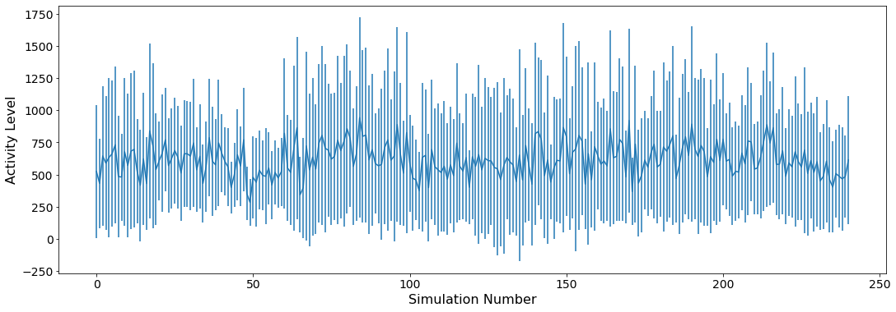
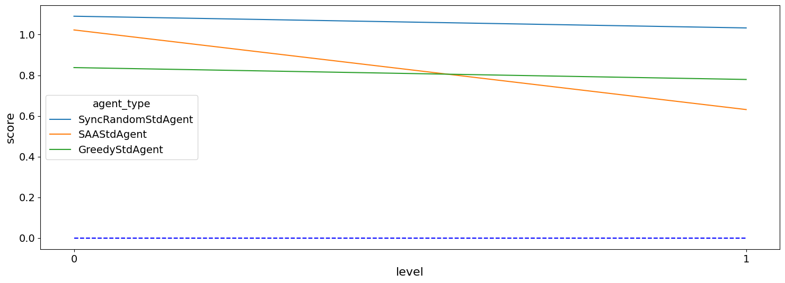

Run a session of the SCML world (2020)
--------------------------------------

The SCML world (Supply Chain Management League) runs on top of
``NegMAS``.

In this tutorial, you will test a run of this world.

Firstly, let’s import everything from the SCML app

.. code:: ipython3

    from scml.scml2020 import *

There are several ways to create an SCML world. One of the simplest is
to use the ``generate`` method of the ``SCML2020World`` class. This will
create a dict that can be passed to the ``SCML2020World`` constructor as
keyword arguments.

Here we explicitly set ``construct_graphs`` to True which slows the
simulation yet allows us to see graph representations of what is
happening in the world.

.. code:: ipython3

    agent_types = [DecentralizingAgent, BuyCheapSellExpensiveAgent, 
                   IndDecentralizingAgent, MovingRangeAgent]

.. code:: ipython3

    world = SCML2020World(
        **SCML2020World.generate(
            agent_types=agent_types,
            n_steps=50
        ), 
        construct_graphs=True,
    )

Let’s draw a graph to see what is in this world

.. code:: ipython3

    _, _ = world.draw()

.. image:: 01.run_scml2020_files/01.run_scml2020_6_0.png

*If you want to just test your installation (and do not care whether you
get an accurate indicator of agent performance), you can set the number
of steps to a small value (e.g. n_steps=10).*

Now you can run this world simulation by just calling ``run``.

.. code:: ipython3

    world.run_with_progress() # may take few minutes

.. parsed-literal::

    100%|██████████| 50/50 [01:32<00:00,  1.84s/it]

Let’s see what happened in this run. Firstly, how many negotiations were
conducted over time

.. code:: ipython3

    plt.plot(world.stats['n_negotiations'])
    plt.xlabel('Simulation Step')
    plt.ylabel('N. Negotiations')
    plt.show()

.. image:: 01.run_scml2020_files/01.run_scml2020_10_0.png

It is clear that many negotiations happened at the beginning of the
simulation with smaller number later. That is expected as the agents at
the first and last production layer receive more exogenous contracts in
the beginning.

Several other market statistics are available:

.. code:: ipython3

    pprint(list(_ for _ in world.stats.keys() if "@" not in _  ))

.. parsed-literal::

    ['n_registered_negotiations_before',
     'n_contracts_dropped',
     'n_contracts_nullified_now',
     'n_bankrupt',
     'trading_price_0',
     'sold_quantity_0',
     'unit_price_0',
     'trading_price_1',
     'sold_quantity_1',
     'unit_price_1',
     'trading_price_2',
     'sold_quantity_2',
     'unit_price_2',
     'trading_price_3',
     'sold_quantity_3',
     'unit_price_3',
     'trading_price_4',
     'sold_quantity_4',
     'unit_price_4',
     'productivity',
     'market_size',
     'production_failures',
     'bankruptcy',
     'n_contracts_executed',
     'n_contracts_erred',
     'n_contracts_nullified',
     'n_contracts_cancelled',
     'n_breaches',
     'breach_level',
     'n_contracts_signed',
     'n_contracts_concluded',
     'n_negotiations',
     'n_negotiation_rounds_successful',
     'n_negotiation_rounds_failed',
     'n_negotiation_successful',
     'n_negotiation_failed',
     'n_registered_negotiations_after',
     'activity_level',
     'step_time',
     'total_time']

Let’s start by seeing how long did each step take (note that ``stats``
access the stats as a Dict[str, List] but ``stats_df`` access the same
data as a pandas dataframe.

.. code:: ipython3

    plt.bar(range(world.n_steps), world.stats_df['step_time'])
    plt.xlabel('Simulation Step')
    plt.ylabel('Time (s)')
    plt.show()

.. image:: 01.run_scml2020_files/01.run_scml2020_14_0.png

There are statistics specific for each agent that all have
"_{agent_name}". Lets check what is available for the winner agent:

.. code:: ipython3

    winner = world.winners[0]
    pprint(list(_ for _ in world.stats.keys() if winner.name in _ ))

.. parsed-literal::

    ['spot_market_quantity_04Dec@1',
     'spot_market_loss_04Dec@1',
     'balance_04Dec@1',
     'inventory_04Dec@1_input',
     'inventory_04Dec@1_output',
     'productivity_04Dec@1',
     'assets_04Dec@1',
     'bankrupt_04Dec@1',
     'score_04Dec@1']

The convension is that agent names has the form {ind}{Type}{process}
where **ind** is a unique index, **Type** is a shortened version of the
agent’s type name, and **process** is the process the agnet can run.
Note that the agent’s input product has the same number as its process
and its output product has the next number (i.e. an agent that runs
process 1, has input product 1 and output product 2).

We can see that 8 pieces of information are available (for each
time-step of the simulation):

-  **bankrupt** If true, the agent is bankrupt.
-  **balance** The money the agent has in its wallet (account).
-  **inventory (input)** The number of units of the agent’s input
   product available in its inventory (by the end of the simulation
   step).
-  **inventory (output)** The number of units of the agent’s output
   product available in its inventory (by the end of the simulation
   step).
-  **assets** The value of the agent’s assets (input and output products
   in inventory) evaluated at the trading price
-  **spot market quantity** The quantity bought by this agent from the
   spot market (of its output product on this step). This can only
   happen as a result of a product-breach.
-  **spot market loss** The spot market price for the agent. This value
   will go up the more the agent buys from the spot market and will be
   used to calculate the price for this agent at future steps. This way
   agents that depend on the spot market instead of negotiation get
   punished.
-  **productivity** The fraction of the agent’s production lines that
   were active at a given time-step.
-  **score** The score of the agent according to the evaluation rule of
   ANAC SCML 2020

Let’s see how did our agent do

.. code:: ipython3

    #show the first and last value of each of the agent statistics
    pprint({k:(v[0], v[-1]) for k, v in world.stats.items() if winner.name in k })

.. parsed-literal::

    {'assets_04Dec@1': (0.0, 3581.7277916926996),
     'balance_04Dec@1': (23598, 24446),
     'bankrupt_04Dec@1': (False, False),
     'inventory_04Dec@1_input': (0, 28),
     'inventory_04Dec@1_output': (0, 90),
     'productivity_04Dec@1': (0.0, 1.0),
     'score_04Dec@1': (0.0, 0.11182574353107674),
     'spot_market_loss_04Dec@1': (0.3, 4.2285),
     'spot_market_quantity_04Dec@1': (0, 0)}

.. code:: ipython3

    stats = pd.DataFrame(data=world.stats)
    fig, axs = plt.subplots(2, 3)
    for ax, key in zip(axs.flatten().tolist(), ["score", "balance", "assets", "productivity", 
                             "spot_market_quantity", "spot_market_loss"]):
        ax.plot(stats[f"{key}_{winner}"])
        ax.set(ylabel=key)
    fig.show()

.. image:: 01.run_scml2020_files/01.run_scml2020_19_0.png

We can for example check the activity level of this world (defined as
the total amount of money transferred due to trade)

.. code:: ipython3

    plt.plot(world.stats['activity_level'])
    plt.xlabel('Simulation Step')
    plt.ylabel('Activitiy Level ($)\nTotal Money Transferred')
    plt.show()

.. image:: 01.run_scml2020_files/01.run_scml2020_21_0.png

We can see a picture of contracting in this world as follows:

.. code:: ipython3

    plt.plot(world.stats['n_contracts_concluded'], label='Concluded Contracts')
    plt.plot(world.stats['n_contracts_cancelled'], label='Cancelled Contracts') 
    plt.plot(world.stats['n_contracts_signed'], label='Signed Contracts') 
    plt.plot(world.stats['n_contracts_executed'], label='Executed Contracts')
    plt.legend()
    plt.xlabel('Simulation Step')
    plt.ylabel('N. Contracts')
    plt.show()

.. image:: 01.run_scml2020_files/01.run_scml2020_23_0.png

We can also check the breaches that happened

.. code:: ipython3

    plt.plot(world.stats['breach_level'])
    plt.xlabel('Simulation Step')
    plt.ylabel('Total Breach Level')
    plt.show()

.. image:: 01.run_scml2020_files/01.run_scml2020_25_0.png

Notice that there can be multiple winners

.. code:: ipython3

    winner_profits = [100 * world.scores()[_.id] for _ in world.winners]
    winner_types = [_.short_type_name for _ in world.winners]
    print(f"{world.winners} of type {winner_types} won at {winner_profits}%")

.. parsed-literal::

    [04Dec@1] of type ['decentralizing'] won at [11.182574353107674]%

Let’s check how did the first winner’s inventory changes over time:

.. code:: ipython3

    # find the keys in stats for the input and output inventory
    in_key = [_ for _ in world.stats.keys() if _.startswith(f'inventory_{winner}_input')][0]
    out_key = [_ for _ in world.stats.keys() if _.startswith(f'inventory_{winner}_output')][0]
    
    # find input and output product indices
    input_product, output_product = winner.awi.my_input_product, winner.awi.my_output_product
    # draw
    fig, (quantity, value) = plt.subplots(1, 2)
    quantity.plot(world.stats[in_key], label=f"Input Product")
    quantity.plot(world.stats[out_key], label=f"Output Product")
    quantity.set(xlabel='Simulation Step', ylabel='Winner\'s Total Storage (item)')
    quantity.legend()
    value.plot(np.array(world.stats[in_key]) * np.array(world.stats[f"trading_price_{input_product}"])
                  , label=f"Input Product")
    value.plot(np.array(world.stats[out_key]) * np.array(world.stats[f"trading_price_{output_product}"])
                  , label=f"Output Product")
    value.set(xlabel='Simulation Step', ylabel='Winner\'s Inventory Value ($)')
    value.legend()
    fig.show()

.. image:: 01.run_scml2020_files/01.run_scml2020_29_0.png

We can actually check what happens to ALL competitors:

.. code:: ipython3

    from scml.scml2020.world import is_system_agent
    fig, (profit, score) = plt.subplots(1, 2)
    snames = sorted(world.non_system_agent_names)
    for name in snames:    
        profit.plot(100.0 * (np.asarray(world.stats[f'balance_{name}'])/world.stats[f'balance_{name}'][0] - 1.0), label=name)
        score.plot(100 * np.asarray(world.stats[f'score_{name}']), label=name)
    profit.set(xlabel='Simulation Step', ylabel='Player Profit Ignoring Inventory (%)')
    profit.legend(loc='lower left')
    score.set(xlabel='Simulation Step', ylabel='Player Score (%)')
    fig.show()

.. image:: 01.run_scml2020_files/01.run_scml2020_31_0.png

.. code:: ipython3

    from scml.scml2020.world import is_system_agent
    fig, (profit, score) = plt.subplots(1, 2)
    snames = sorted(world.non_system_agent_names)
    for name in snames:    
        profit.plot((np.asarray(world.stats[f'balance_{name}'])), label=name)
        score.plot(np.asarray(world.stats[f'score_{name}'])*(world.stats[f'balance_{name}'][0]), label=name)
    profit.set(xlabel='Simulation Step', ylabel='Player Balance ($)')
    profit.legend(loc='lower left')
    score.set(xlabel='Simulation Step', ylabel='Player Score Unnormalized ($)')
    fig.show()

.. image:: 01.run_scml2020_files/01.run_scml2020_32_0.png

or just look at the end of the game

.. code:: ipython3

    fig, (score, profit) = plt.subplots(1, 2)
    final_scores = [100 * world.stats[f"score_{_}"][-1] 
                    for _ in world.non_system_agent_names]
    final_profits = [100 * world.stats[f"balance_{_}"][-1] / world.stats[f"balance_{_}"][0] - 100 
                     for _ in world.non_system_agent_names]
    plt.setp(score.xaxis.get_majorticklabels(), rotation=45)
    plt.setp(profit.xaxis.get_majorticklabels(), rotation=45)
    score.bar(world.non_system_agent_names, final_scores)
    profit.bar(world.non_system_agent_names, final_profits)
    score.set(ylabel="Final Score (%)")
    profit.set(ylabel="Final Profit (%)")
    
    fig.show()

.. image:: 01.run_scml2020_files/01.run_scml2020_34_0.png

.. code:: ipython3

    fig, (score, profit) = plt.subplots(1, 2)
    final_scores = [world.stats[f"score_{_}"][-1] * (world.stats[f"balance_{_}"][0]) 
                    for _ in world.non_system_agent_names]
    final_profits = [world.stats[f"balance_{_}"][-1] 
                     for _ in world.non_system_agent_names]
    plt.setp(score.xaxis.get_majorticklabels(), rotation=45)
    plt.setp(profit.xaxis.get_majorticklabels(), rotation=45)
    score.bar(world.non_system_agent_names, final_scores)
    profit.bar(world.non_system_agent_names, final_profits)
    score.set(ylabel="Final Unnormalized Score ($)")
    profit.set(ylabel="Final Balance  ($)")
    
    fig.show()

.. image:: 01.run_scml2020_files/01.run_scml2020_35_0.png

You can inspect what happened in the simulation by plotting different
output statistics. For example, we can see how did the trading price of
different products change over the simulation time.

.. code:: ipython3

    fig, axs = plt.subplots(2, 2)
    for ax, key in zip(axs.flatten().tolist(), ["trading_price", "sold_quantity", "unit_price"]):
        for p in range(world.n_products):
            ax.plot(world.stats[f"{key}_{p}"], marker="x", label=f"Product {p}")
            ax.set_ylabel(key.replace("_", " ").title())
            ax.legend().set_visible(False)
    axs[-1, 0].legend(bbox_to_anchor=(1, -.5), ncol=3)
    fig.show()

.. image:: 01.run_scml2020_files/01.run_scml2020_37_0.png

.. code:: ipython3

    fig, axs = plt.subplots(1, 2)
    for ax, key in zip(axs.flatten().tolist(), ["spot_market_quantity", "spot_market_loss"]):
        for a in world.non_system_agent_names:
            ax.plot(world.stats[f"{key}_{a}"], marker="x", label=f"{a}")
            ax.set_ylabel(key.replace("_", " ").title())
            ax.legend().set_visible(False)
    axs[0].legend(bbox_to_anchor=(1, -.2), ncol=4)
    fig.show()

.. image:: 01.run_scml2020_files/01.run_scml2020_38_0.png

You can dig futher to understand what happened during this siumulation.
For example, let’s see some of the contracts that were signed:

.. code:: ipython3

    # create a view with only signed contracts
    contracts = world.contracts_df
    signed = contracts.loc[contracts.signed_at>=0, :]

.. code:: ipython3

    fields = ["seller_name", "buyer_name", "delivery_time", "quantity", "unit_price",
              "signed_at", "executed", "breached", "nullified", "erred"]
    signed[fields].sort_values(["quantity", "unit_price"], ascending=False).head(10)

.. raw:: html

    

    
    <table border="1" class="dataframe">
      <thead>
        <tr style="text-align: right;">
          <th></th>
          <th>seller_name</th>
          <th>buyer_name</th>
          <th>delivery_time</th>
          <th>quantity</th>
          <th>unit_price</th>
          <th>signed_at</th>
          <th>executed</th>
          <th>breached</th>
          <th>nullified</th>
          <th>erred</th>
        </tr>
      </thead>
      <tbody>
        <tr>
          <th>873</th>
          <td>07Dec@2</td>
          <td>10Buy@3</td>
          <td>18</td>
          <td>58</td>
          <td>54</td>
          <td>8</td>
          <td>True</td>
          <td>False</td>
          <td>False</td>
          <td>False</td>
        </tr>
        <tr>
          <th>1644</th>
          <td>06Dec@2</td>
          <td>09Ind@3</td>
          <td>32</td>
          <td>49</td>
          <td>54</td>
          <td>24</td>
          <td>True</td>
          <td>False</td>
          <td>False</td>
          <td>False</td>
        </tr>
        <tr>
          <th>1502</th>
          <td>07Dec@2</td>
          <td>10Buy@3</td>
          <td>31</td>
          <td>43</td>
          <td>57</td>
          <td>21</td>
          <td>True</td>
          <td>False</td>
          <td>False</td>
          <td>False</td>
        </tr>
        <tr>
          <th>1552</th>
          <td>07Dec@2</td>
          <td>10Buy@3</td>
          <td>31</td>
          <td>43</td>
          <td>57</td>
          <td>22</td>
          <td>True</td>
          <td>False</td>
          <td>False</td>
          <td>False</td>
        </tr>
        <tr>
          <th>1550</th>
          <td>07Dec@2</td>
          <td>09Ind@3</td>
          <td>26</td>
          <td>43</td>
          <td>54</td>
          <td>22</td>
          <td>True</td>
          <td>False</td>
          <td>False</td>
          <td>False</td>
        </tr>
        <tr>
          <th>1769</th>
          <td>02Dec@0</td>
          <td>03Buy@1</td>
          <td>31</td>
          <td>43</td>
          <td>8</td>
          <td>27</td>
          <td>True</td>
          <td>False</td>
          <td>False</td>
          <td>False</td>
        </tr>
        <tr>
          <th>1256</th>
          <td>04Dec@1</td>
          <td>07Dec@2</td>
          <td>25</td>
          <td>39</td>
          <td>39</td>
          <td>15</td>
          <td>True</td>
          <td>False</td>
          <td>False</td>
          <td>False</td>
        </tr>
        <tr>
          <th>1945</th>
          <td>07Dec@2</td>
          <td>09Ind@3</td>
          <td>38</td>
          <td>36</td>
          <td>58</td>
          <td>33</td>
          <td>True</td>
          <td>False</td>
          <td>False</td>
          <td>False</td>
        </tr>
        <tr>
          <th>1046</th>
          <td>06Dec@2</td>
          <td>09Ind@3</td>
          <td>21</td>
          <td>35</td>
          <td>53</td>
          <td>11</td>
          <td>True</td>
          <td>False</td>
          <td>False</td>
          <td>False</td>
        </tr>
        <tr>
          <th>1737</th>
          <td>04Dec@1</td>
          <td>07Dec@2</td>
          <td>37</td>
          <td>35</td>
          <td>39</td>
          <td>27</td>
          <td>True</td>
          <td>False</td>
          <td>False</td>
          <td>False</td>
        </tr>
      </tbody>
    </table>
    

Let’s check some of the contracts that were fully executed

.. code:: ipython3

    signed.loc[signed.executed, fields].sort_values(["quantity", "unit_price"], ascending=False).head(10)

.. raw:: html

    

    
    <table border="1" class="dataframe">
      <thead>
        <tr style="text-align: right;">
          <th></th>
          <th>seller_name</th>
          <th>buyer_name</th>
          <th>delivery_time</th>
          <th>quantity</th>
          <th>unit_price</th>
          <th>signed_at</th>
          <th>executed</th>
          <th>breached</th>
          <th>nullified</th>
          <th>erred</th>
        </tr>
      </thead>
      <tbody>
        <tr>
          <th>873</th>
          <td>07Dec@2</td>
          <td>10Buy@3</td>
          <td>18</td>
          <td>58</td>
          <td>54</td>
          <td>8</td>
          <td>True</td>
          <td>False</td>
          <td>False</td>
          <td>False</td>
        </tr>
        <tr>
          <th>1644</th>
          <td>06Dec@2</td>
          <td>09Ind@3</td>
          <td>32</td>
          <td>49</td>
          <td>54</td>
          <td>24</td>
          <td>True</td>
          <td>False</td>
          <td>False</td>
          <td>False</td>
        </tr>
        <tr>
          <th>1502</th>
          <td>07Dec@2</td>
          <td>10Buy@3</td>
          <td>31</td>
          <td>43</td>
          <td>57</td>
          <td>21</td>
          <td>True</td>
          <td>False</td>
          <td>False</td>
          <td>False</td>
        </tr>
        <tr>
          <th>1552</th>
          <td>07Dec@2</td>
          <td>10Buy@3</td>
          <td>31</td>
          <td>43</td>
          <td>57</td>
          <td>22</td>
          <td>True</td>
          <td>False</td>
          <td>False</td>
          <td>False</td>
        </tr>
        <tr>
          <th>1550</th>
          <td>07Dec@2</td>
          <td>09Ind@3</td>
          <td>26</td>
          <td>43</td>
          <td>54</td>
          <td>22</td>
          <td>True</td>
          <td>False</td>
          <td>False</td>
          <td>False</td>
        </tr>
        <tr>
          <th>1769</th>
          <td>02Dec@0</td>
          <td>03Buy@1</td>
          <td>31</td>
          <td>43</td>
          <td>8</td>
          <td>27</td>
          <td>True</td>
          <td>False</td>
          <td>False</td>
          <td>False</td>
        </tr>
        <tr>
          <th>1256</th>
          <td>04Dec@1</td>
          <td>07Dec@2</td>
          <td>25</td>
          <td>39</td>
          <td>39</td>
          <td>15</td>
          <td>True</td>
          <td>False</td>
          <td>False</td>
          <td>False</td>
        </tr>
        <tr>
          <th>1945</th>
          <td>07Dec@2</td>
          <td>09Ind@3</td>
          <td>38</td>
          <td>36</td>
          <td>58</td>
          <td>33</td>
          <td>True</td>
          <td>False</td>
          <td>False</td>
          <td>False</td>
        </tr>
        <tr>
          <th>1046</th>
          <td>06Dec@2</td>
          <td>09Ind@3</td>
          <td>21</td>
          <td>35</td>
          <td>53</td>
          <td>11</td>
          <td>True</td>
          <td>False</td>
          <td>False</td>
          <td>False</td>
        </tr>
        <tr>
          <th>1737</th>
          <td>04Dec@1</td>
          <td>07Dec@2</td>
          <td>37</td>
          <td>35</td>
          <td>39</td>
          <td>27</td>
          <td>True</td>
          <td>False</td>
          <td>False</td>
          <td>False</td>
        </tr>
      </tbody>
    </table>
    

.. code:: ipython3

    signed.loc[signed.breached, fields[:-4] + ["breaches"]].sort_values(["quantity", "unit_price"], ascending=False).head(10)

.. raw:: html

    

    
    <table border="1" class="dataframe">
      <thead>
        <tr style="text-align: right;">
          <th></th>
          <th>seller_name</th>
          <th>buyer_name</th>
          <th>delivery_time</th>
          <th>quantity</th>
          <th>unit_price</th>
          <th>signed_at</th>
          <th>breaches</th>
        </tr>
      </thead>
      <tbody>
        <tr>
          <th>1768</th>
          <td>03Buy@1</td>
          <td>06Dec@2</td>
          <td>37</td>
          <td>35</td>
          <td>27</td>
          <td>27</td>
          <td>03Buy@1:product(1.0)</td>
        </tr>
        <tr>
          <th>1742</th>
          <td>06Dec@2</td>
          <td>10Buy@3</td>
          <td>31</td>
          <td>11</td>
          <td>20</td>
          <td>27</td>
          <td>10Buy@3:money(0.6454545454545455)</td>
        </tr>
        <tr>
          <th>1750</th>
          <td>10Buy@3</td>
          <td>BUYER</td>
          <td>42</td>
          <td>5</td>
          <td>50</td>
          <td>27</td>
          <td>10Buy@3:product(1.0)</td>
        </tr>
        <tr>
          <th>1029</th>
          <td>08Buy@2</td>
          <td>09Ind@3</td>
          <td>12</td>
          <td>5</td>
          <td>18</td>
          <td>11</td>
          <td>08Buy@2:product(1.0)</td>
        </tr>
        <tr>
          <th>1255</th>
          <td>05Buy@1</td>
          <td>07Dec@2</td>
          <td>17</td>
          <td>5</td>
          <td>15</td>
          <td>15</td>
          <td>05Buy@1:product(1.0)</td>
        </tr>
        <tr>
          <th>1274</th>
          <td>10Buy@3</td>
          <td>BUYER</td>
          <td>31</td>
          <td>4</td>
          <td>50</td>
          <td>16</td>
          <td>10Buy@3:product(1.0)</td>
        </tr>
        <tr>
          <th>1393</th>
          <td>10Buy@3</td>
          <td>BUYER</td>
          <td>33</td>
          <td>4</td>
          <td>50</td>
          <td>18</td>
          <td>10Buy@3:product(1.0)</td>
        </tr>
        <tr>
          <th>1481</th>
          <td>10Buy@3</td>
          <td>BUYER</td>
          <td>35</td>
          <td>4</td>
          <td>50</td>
          <td>20</td>
          <td>10Buy@3:product(1.0)</td>
        </tr>
        <tr>
          <th>1528</th>
          <td>10Buy@3</td>
          <td>BUYER</td>
          <td>36</td>
          <td>4</td>
          <td>50</td>
          <td>21</td>
          <td>10Buy@3:product(1.0)</td>
        </tr>
        <tr>
          <th>1540</th>
          <td>10Buy@3</td>
          <td>BUYER</td>
          <td>37</td>
          <td>4</td>
          <td>50</td>
          <td>22</td>
          <td>10Buy@3:product(1.0)</td>
        </tr>
      </tbody>
    </table>
    

We can now see how does the singning day affect delivery day, product
and quantity

.. code:: ipython3

    fig, ax = plt.subplots(1, 3)
    for i, x in enumerate(["delivery_time", "quantity", "product_index"]):
        ax[i].scatter(signed.signed_at, signed[x])
        ax[i].set(ylabel=x.replace("_", " ").title(), xlabel="Signing Day")
    fig.show()

.. image:: 01.run_scml2020_files/01.run_scml2020_46_0.png

.. code:: ipython3

    fig, ax = plt.subplots(1, 3)
    for i, x in enumerate(["delivery_time", "unit_price", "product_index"]):
        ax[i].scatter(signed.quantity, signed[x])
        ax[i].set(ylabel=x.replace("_", " ").title(), xlabel="Quantity")
    fig.show()

.. image:: 01.run_scml2020_files/01.run_scml2020_47_0.png

Did any agents go bankrupt and when?

.. code:: ipython3

    bankruptcy = {a: np.nonzero(stats[f"bankrupt_{a}"].values)[0]
            for a in world.non_system_agent_names}
    pprint({k: "No" if len(v)<1 else f"at: {v[0]}" for k, v in bankruptcy.items()})

.. parsed-literal::

    {'00Mov@0': 'No',
     '01Mov@0': 'No',
     '02Dec@0': 'No',
     '03Buy@1': 'at: 37',
     '04Dec@1': 'No',
     '05Buy@1': 'at: 17',
     '06Dec@2': 'No',
     '07Dec@2': 'No',
     '08Buy@2': 'at: 12',
     '09Ind@3': 'No',
     '10Buy@3': 'at: 31',
     '11Mov@3': 'No'}

You can see what happened during this simulation by drawing graphs at
different steps. The meaning of different edge colors can be drawn as
follows:

.. code:: ipython3

    from negmas import show_edge_colors
    show_edge_colors()

.. image:: 01.run_scml2020_files/01.run_scml2020_51_0.png

You can see what happened in this world in a series of graphs using the
``draw`` method

.. code:: ipython3

    world.draw(steps=(0, world.n_steps), together=False, ncols=2, figsize=(20, 20))
    plt.show()

.. image:: 01.run_scml2020_files/01.run_scml2020_53_0.png

You can also run a simple animation to see what happens at every step
(you need to download the jupyter notebook and execute it to see the
animation) :

.. code:: ipython3

    world.save_gif("run.gif")

.. parsed-literal::

    []

then show the animation

.. code:: ipython3

    from IPython.display import HTML
    HTML('')

.. raw:: html

    

Running a tournament
--------------------

Now that you can run simple world simulations, let’s try to run a
complete tournament and see its results. Let’s start by running a
standard tournament (in which each agent is represented by a single
factory). Running a collusion tournament will be exactly the same with
the only difference that ``anac2020_std`` will be replaced with
``anac2020_collusion``.

Note that in the real competition we use thousands of configurations and
longer simulation steps (e.g. 50 :math:`\le` n_steps :math:`\le` 500).

.. code:: ipython3

    from scml.scml2020.utils import anac2020_std

.. code:: ipython3

    tournament_types = agent_types + [RandomAgent]
    # may take a long time
    results = anac2020_std(
        competitors=tournament_types,  
        n_configs=12, # number of different configurations to generate 
        n_runs_per_world=1, # number of times to repeat every simulation (with agent assignment)
        n_steps = 10, # number of days (simulation steps) per simulation
        print_exceptions=True,
    ) 

Who was the winner?

.. code:: ipython3

    results.winners

.. parsed-literal::

    ['scml.scml2020.agents.decentralizing.IndDecentralizingAgent']

How many simulations were actually run?

.. code:: ipython3

    len(results.scores.run_id.unique())

.. parsed-literal::

    240

The total number of simulations :math:`n_{s}` will be
:math:`n_t \times n_c \times n_r` where :math:`n_t` is the number of
competitor agent types, :math:`n_c` is the number of configurations, and
:math:`n_r` is the number of runs per configuration

We can also see the scores that every agent type got

.. code:: ipython3

    results.score_stats

.. raw:: html

    

    
    <table border="1" class="dataframe">
      <thead>
        <tr style="text-align: right;">
          <th></th>
          <th>agent_type</th>
          <th>count</th>
          <th>mean</th>
          <th>std</th>
          <th>min</th>
          <th>25%</th>
          <th>50%</th>
          <th>75%</th>
          <th>max</th>
        </tr>
      </thead>
      <tbody>
        <tr>
          <th>0</th>
          <td>scml.scml2020.agents.bcse.BuyCheapSellExpensiv...</td>
          <td>192.0</td>
          <td>-0.491562</td>
          <td>0.549044</td>
          <td>-2.376789</td>
          <td>-0.476716</td>
          <td>-0.298797</td>
          <td>-0.181984</td>
          <td>0.000000</td>
        </tr>
        <tr>
          <th>1</th>
          <td>scml.scml2020.agents.decentralizing.Decentrali...</td>
          <td>192.0</td>
          <td>0.264585</td>
          <td>0.343465</td>
          <td>-1.316147</td>
          <td>0.078159</td>
          <td>0.243520</td>
          <td>0.424249</td>
          <td>1.316472</td>
        </tr>
        <tr>
          <th>2</th>
          <td>scml.scml2020.agents.decentralizing.IndDecentr...</td>
          <td>192.0</td>
          <td>0.285633</td>
          <td>0.224596</td>
          <td>-0.246400</td>
          <td>0.131413</td>
          <td>0.264517</td>
          <td>0.440573</td>
          <td>1.011765</td>
        </tr>
        <tr>
          <th>3</th>
          <td>scml.scml2020.agents.moving.MovingRangeAgent</td>
          <td>192.0</td>
          <td>-0.069871</td>
          <td>0.086003</td>
          <td>-0.353001</td>
          <td>-0.114314</td>
          <td>-0.079704</td>
          <td>0.000000</td>
          <td>0.124086</td>
        </tr>
        <tr>
          <th>4</th>
          <td>scml.scml2020.agents.random.RandomAgent</td>
          <td>192.0</td>
          <td>-0.637382</td>
          <td>0.555812</td>
          <td>-3.092969</td>
          <td>-0.650298</td>
          <td>-0.463156</td>
          <td>-0.287384</td>
          <td>0.000000</td>
        </tr>
      </tbody>
    </table>
    

You can also do statistical significance testing using ttest or kstest
(with multi-comparison correction)

.. code:: ipython3

    results.kstest

.. raw:: html

    

    
    <table border="1" class="dataframe">
      <thead>
        <tr style="text-align: right;">
          <th></th>
          <th>a</th>
          <th>b</th>
          <th>t</th>
          <th>p</th>
          <th>n_a</th>
          <th>n_b</th>
          <th>n_effective</th>
        </tr>
      </thead>
      <tbody>
        <tr>
          <th>0</th>
          <td>scml.scml2020.agents.bcse.BuyCheapSellExpensiv...</td>
          <td>scml.scml2020.agents.decentralizing.IndDecentr...</td>
          <td>0.927083</td>
          <td>1.706484e-89</td>
          <td>192</td>
          <td>192</td>
          <td>192</td>
        </tr>
        <tr>
          <th>1</th>
          <td>scml.scml2020.agents.bcse.BuyCheapSellExpensiv...</td>
          <td>scml.scml2020.agents.moving.MovingRangeAgent</td>
          <td>0.713542</td>
          <td>2.319714e-47</td>
          <td>192</td>
          <td>192</td>
          <td>192</td>
        </tr>
        <tr>
          <th>2</th>
          <td>scml.scml2020.agents.bcse.BuyCheapSellExpensiv...</td>
          <td>scml.scml2020.agents.decentralizing.Decentrali...</td>
          <td>0.869792</td>
          <td>1.468612e-75</td>
          <td>192</td>
          <td>192</td>
          <td>192</td>
        </tr>
        <tr>
          <th>3</th>
          <td>scml.scml2020.agents.bcse.BuyCheapSellExpensiv...</td>
          <td>scml.scml2020.agents.random.RandomAgent</td>
          <td>0.307292</td>
          <td>2.088472e-08</td>
          <td>192</td>
          <td>192</td>
          <td>192</td>
        </tr>
        <tr>
          <th>4</th>
          <td>scml.scml2020.agents.decentralizing.IndDecentr...</td>
          <td>scml.scml2020.agents.moving.MovingRangeAgent</td>
          <td>0.796875</td>
          <td>5.102674e-61</td>
          <td>192</td>
          <td>192</td>
          <td>192</td>
        </tr>
        <tr>
          <th>5</th>
          <td>scml.scml2020.agents.decentralizing.IndDecentr...</td>
          <td>scml.scml2020.agents.decentralizing.Decentrali...</td>
          <td>0.104167</td>
          <td>2.489808e-01</td>
          <td>192</td>
          <td>192</td>
          <td>192</td>
        </tr>
        <tr>
          <th>6</th>
          <td>scml.scml2020.agents.decentralizing.IndDecentr...</td>
          <td>scml.scml2020.agents.random.RandomAgent</td>
          <td>0.947917</td>
          <td>2.129366e-95</td>
          <td>192</td>
          <td>192</td>
          <td>192</td>
        </tr>
        <tr>
          <th>7</th>
          <td>scml.scml2020.agents.moving.MovingRangeAgent</td>
          <td>scml.scml2020.agents.decentralizing.Decentrali...</td>
          <td>0.718750</td>
          <td>3.866189e-48</td>
          <td>192</td>
          <td>192</td>
          <td>192</td>
        </tr>
        <tr>
          <th>8</th>
          <td>scml.scml2020.agents.moving.MovingRangeAgent</td>
          <td>scml.scml2020.agents.random.RandomAgent</td>
          <td>0.796875</td>
          <td>5.102674e-61</td>
          <td>192</td>
          <td>192</td>
          <td>192</td>
        </tr>
        <tr>
          <th>9</th>
          <td>scml.scml2020.agents.decentralizing.Decentrali...</td>
          <td>scml.scml2020.agents.random.RandomAgent</td>
          <td>0.927083</td>
          <td>1.706484e-89</td>
          <td>192</td>
          <td>192</td>
          <td>192</td>
        </tr>
      </tbody>
    </table>
    

see the total score

.. code:: ipython3

    results.total_scores

.. raw:: html

    

    
    <table border="1" class="dataframe">
      <thead>
        <tr style="text-align: right;">
          <th></th>
          <th>agent_type</th>
          <th>score</th>
        </tr>
      </thead>
      <tbody>
        <tr>
          <th>0</th>
          <td>scml.scml2020.agents.decentralizing.IndDecentr...</td>
          <td>0.264517</td>
        </tr>
        <tr>
          <th>1</th>
          <td>scml.scml2020.agents.decentralizing.Decentrali...</td>
          <td>0.243520</td>
        </tr>
        <tr>
          <th>2</th>
          <td>scml.scml2020.agents.moving.MovingRangeAgent</td>
          <td>-0.079704</td>
        </tr>
        <tr>
          <th>3</th>
          <td>scml.scml2020.agents.bcse.BuyCheapSellExpensiv...</td>
          <td>-0.298797</td>
        </tr>
        <tr>
          <th>4</th>
          <td>scml.scml2020.agents.random.RandomAgent</td>
          <td>-0.463156</td>
        </tr>
      </tbody>
    </table>
    

or the aggregated statistics of the world. For example, let’s draw the
activity level for different simulations.

.. code:: ipython3

    plt.errorbar(range(len(results.agg_stats)),
                 results.agg_stats.activity_level_mean, 
                 np.sqrt(results.agg_stats.activity_level_var)
                 )
    plt.xlabel("Simulation Number")
    plt.ylabel("Activity Level")
    plt.show()

We can even get the scores of every agent belonging to every agent type
at every simulation

.. code:: ipython3

    results.scores.loc[:, ["agent_name", "agent_type", "score"]].head()

.. raw:: html

    

    
    <table border="1" class="dataframe">
      <thead>
        <tr style="text-align: right;">
          <th></th>
          <th>agent_name</th>
          <th>agent_type</th>
          <th>score</th>
        </tr>
      </thead>
      <tbody>
        <tr>
          <th>0</th>
          <td>00Buy@0</td>
          <td>scml.scml2020.agents.bcse.BuyCheapSellExpensiv...</td>
          <td>-0.429885</td>
        </tr>
        <tr>
          <th>1</th>
          <td>02Ind@1</td>
          <td>scml.scml2020.agents.decentralizing.IndDecentr...</td>
          <td>0.781018</td>
        </tr>
        <tr>
          <th>2</th>
          <td>03Mov@1</td>
          <td>scml.scml2020.agents.moving.MovingRangeAgent</td>
          <td>0.000000</td>
        </tr>
        <tr>
          <th>3</th>
          <td>08Dec@4</td>
          <td>scml.scml2020.agents.decentralizing.Decentrali...</td>
          <td>0.000000</td>
        </tr>
        <tr>
          <th>4</th>
          <td>00Mov@0</td>
          <td>scml.scml2020.agents.moving.MovingRangeAgent</td>
          <td>-0.077055</td>
        </tr>
      </tbody>
    </table>
    

or inspect any statistic we like

.. code:: ipython3

    ax = sns.violinplot(data=results.stats, x="step", y="activity_level")
    ax.set(ylabel="Activity Level / Business Size ($)", xlabel="Step Number", yscale="log")
    
    plt.gcf().show()

.. image:: 01.run_scml2020_files/01.run_scml2020_77_0.png

Let’s see how did the location at the production graph affect the score
of each type.

.. code:: ipython3

    results.scores["level"] = results.scores.agent_name.str.split("@", expand=True).loc[:, 1]
    sns.lineplot(data=results.scores[["agent_type", "level", "score"]], 
                 x="level", y="score", hue="agent_type")
    plt.plot([0.0] * len(results.scores["level"].unique()), "b--")
    plt.show()

Now that you can run simulations and complete tournament, let’s see how
are we going to develop a new agent for the SCML2020 league
:math:`\rightarrow`

Download :download:`Notebook<notebooks/01.run_scml2020.ipynb>`.

