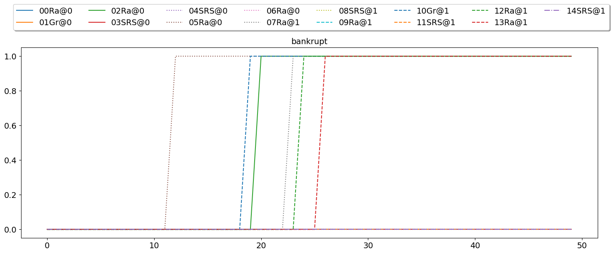
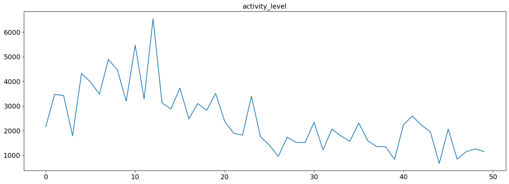
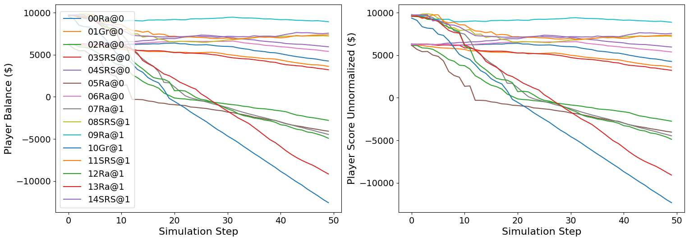
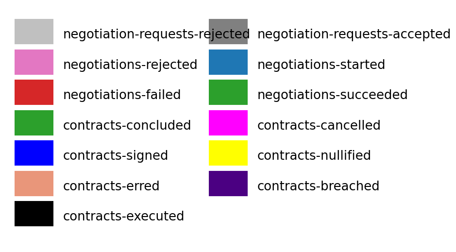
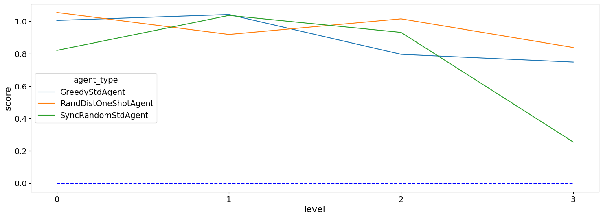
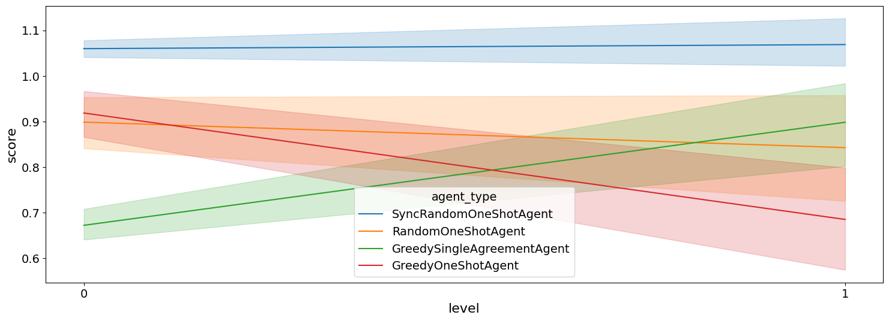

What is SCM and SCML?
---------------------

The Supply Chain Management (SCM) world simulates a supply chain
consisting of multiple factories that buy and sell products from one
another. The factories are represented by autonomous agents that act as
factory managers. Agents are given some target quantity to either buy or
sell and they negotiate with other agents to secure the needed supplies
or sales. Their goal is to turn a profit, and the agent with the highest
profit (averaged over multiple simulations) wins.

The Supply Chain Management League
(`SCML <https://scml.cs.brown.edu>`__) is a part of the International
Automated Negotiating Agents Competition
(`ANAC <http://web.tuat.ac.jp/~katfuji/ANAC2021/>`__) since 2019. SCML
runs in the SCM world.

The league is built using `NegMAS <http://www.yasserm.com/negmas>`__
which provides tools for building multiagent systems in which
negotiations are embedded within world simulations.

There are two different yet related games in SCML each represented by a
`NegMAS <http://www.yasserm.com/negmas>`__
`World <http://www.yasserm.com/negmas/api/negmas.situated.World.html>`__
class:

-  `SCML2021World <http://www.yasserm.com/scml/scml2020docs/api/scml.scml2020.SCML2021World.html>`__
   A world representing the *complete* SCML game described
   `here <http://www.yasserm.com/scml/scml2021.pdf>`__ in which the
   agent is responsible of defining its own utility function, with who
   to negotiate, negotiation agendas to propose, production schedule,
   etc. This form of the SCM world is more representative of real-world
   trading with a combination of long-term planning, negotiation, and
   production scheduling.

-  `SCML2020OneShotWorld <http://www.yasserm.com/scml/scml2020docs/api/scml.oneshot.SCML2020OneShotWorld.html>`__
   A simpler form of the SCM world in which agents do not need to
   consider long-term planning or production scheduling described
   `here <http://www.yasserm.com/scml/scml2021oneshot.pdf>`__. This form
   was introduced in *2021*.

You can use the SCM world simulation in your own development and
research as you see fit but it is primarily intended for the SCM league
(SCML) of the ANAC competition. SCML has three tracks:

1. **Standard track** based on the **SCML2021World** full game
   simulation. In the standard track, a single instance of each agent
   type exists in the world. This precludes any possibility of
   *collusion* between agent instances of the same type and focuses on
   business operation of a single factory.
2. **Collusion track** based on the **SCML2021World** full game
   simulation. In the collusion track, *multiple* instances of each
   agent type exist in the world. This opens the possibility for these
   agents instances to **collude** in order to corner the market and get
   higher profits that what each of them can get on its own. In this
   track, collusion is not considered a form of *cheating* but is
   encouraged.
3. **OneShot track** based on the simpler **SCML2020OneShotWorld** game
   simulation. In the OneShot track, a single instance of each agent
   type exists in the world precluding any possibility of collusion. The
   focus here is on negotiation with less focus on long-term planning as
   discussed earlier. This track was introduced for the first time in
   *2021*.

The SCML competition has two versions:

-  **Online Competition** Participants to this competition can submit
   their agents as long as the competition is running (March 15th 2021
   to July 1st 2021). The system runs tournaments between the latest
   version of all submitted agents for each track periodically and
   maintains a leader-board showing the top agents updated at least
   weekly. Participants in this competition will get the chance to
   observe how their agents behave against agents submitted by other
   competitors and receive feedback about any exceptions or error caused
   by their agents.

-  **Official Competition** The final version of each agent submitted to
   the online competition (and registered before July 1st, 2021) is
   entered into the official SCM league which will run as part of the
   ANAC 2021 competition in conjunction with `IJCAI
   2021 <https://ijcai-21.org/>`__. The winners will be announced during
   the as part of the official program of IJCAI 2021.

A (not very) brief introduction to NegMAS
-----------------------------------------

The SCM world is built using
`NegMAS <http://www.yasserm.com/negmas/>`__. This section provides a
very short introduction of it to help you understand the terms used in
this document. Please refer to `NegMAS
documetnation <http://www.yasserm.com/negmas/>`__ for full description
and details as well as tutorials and other goodies.

This image shows the main components of a simulation in a NegMAS world:
|NegMAS world|

The simulation is run using a **World** object which defines what
happens in every simulation **step**, provides a **BulletinBoard**
object containing all public information about the game, calls various
callbacks defined in the **Agent** object representing each agent in the
environment, takes care of running negotiations and keeps track of
agreement signing and the resulting **Contract**\ s. The **World**
object also controls logging, event management, serialization,
visualization, etc. Refer to the
`World <http://www.yasserm.com/negmas/api/negmas.situated.World.html>`__
documentation for more details (you need to do that only if you are
implementing new world simulations).

The designer of the game implements a **World** class by overriding few
abstract methods in the base **World** class. This is how the
**SCML2019World**, **SCML2020World**, **SCML2021World** and
**SCML2020OneShotWorld** were created. As a participant in SCML, you
*never* need to interact directly with the **World** object.

The logic of an agent is NegMAS is implemented in an **Agent** object.
The designer of the simulation, should provide a base class for its
specific world inherited from NegMAS’s **Agent** class. For SCML, this
base class is called **OneShotAgent** for the OneShot game (to go with
the SCML2020OneShotWorld), and **SCML2020Agent** for the full game (to
go with the SCML2020World and SCML20201World). Refer to the
`Agent <http://www.yasserm.com/negmas/api/negmas.situated.Agent.html>`__
documentation for more details about general NegMAS agents. Full
information about the **OneShotAgent** and **SCML2020Agent** classes can
be found
`here <http://www.yasserm.com/scml/scml2020docs/api/scml.scml2020.SCML2020Agent.html>`__
and
`here <http://www.yasserm.com/scml/scml2020docs/api/scml.oneshot.OneShotAgent.html>`__
respectively.

As a participant in SCML, you only need to develop an Agent class
inherited from the appropriate base class depending on the track.

So now we have the **World** and the **Agent** objects, and we already
said that the agent does not directly interact with the world. How does
these two agents interact then?

-  When the **World** wants to interact with the **Agent**, it calls
   some method in it. For example, to instruct the agent to *initialize*
   itself, the world calls the **init()** method defined by the
   **Agent**. To inform the agent that a negotiation it is involved in
   is concluded with success, the **World** calls the method
   **on_negotiation_success()** defined by the agent.
-  When the **Agent** wants to interact with the **World**, it accesses
   an interface object called an **AgentWorldInterface** or **AWI** for
   short which provides all the services available to the **Agent**. For
   example, to request a negotiation with another agent, the **Agent**
   object needs to call **request_negotiation()** defined in the
   **AWI**.

The world designer usually defines an AWI for its world that inherits
NegMAS’s **AgentWorldInterface** class and provides any special services
for agents interacting in this world. You can find all the services
available to your agent through the AgentWorldInterface
`here <http://www.yasserm.com/negmas/api/negmas.situated.AgentWorldInterface.html>`__.
These methods and properties are still available for your agent in SCML.
Nevertheless, in many cases, more convenient ways to access some of the
information (e.g. the bulletin board) is provided in the specific AWIs
implemented in the SCML package to be described now.

For SCML, there are – as you may already expect – two AWIs. The first is
called **OneShotAWI** and is defined in *scml.scml2020* to go with
*SCML2021World* and *SCML2020Agent* and the second is defined in
*scml.oneshot* to go with *SCML2020OneShotWorld* and *OneShotAgent*. An
earlier version is also defined in *scml.scml2019* which is a
*discontinued* form of the game used in ANAC 2019 competition. You can
find all the services provided by these AWIs
`here <http://www.yasserm.com/scml/scml2020docs/api/scml.oneshot.OneShotAWI.html>`__
for the OneShot game (OneShot track) and
`here <http://www.yasserm.com/scml/scml2020docs/api/scml.scml2020.AWI.html>`__
for the full game (Standard and Collusion tracks).

Now that we know how worlds and agents work and interact, we can look at
how negotiation is managed in NegMAS.

A negotiation is controlled by a **Mechanism** object which implements
the negotiation protocol (e.g. the alternating offers protocol). NegMAS
provides several mediated and unmediated negotiation protocols (as well
as auction mechanisms). The specific **Mechanism** that is used in SCML
is the **SAOMechanism** which implements the bargaining protocol.

Negotiation strategies are implemented in a **Negotiator** object which
usually inherits some base negotiator-class corresponding to the
mechanism(s) it supports. The specific base class of all negotiators in
SCML is **SAONegotiator**.

The interaction between **Mechanism** and **Negotiator** objects mirrors
the interaction between **World** and **Agent** objects. **Mechanism**
objects call methods in **Negotiator** objects directly but
**Negotiator** objects can only access services provided by the
**Mechanism** object through a **NegotiatorMechanismInterface** (AMI).
Note that it is an AMI not a NMI (for historical reasons). You can find
more details about the general NegMAS AMI
`here <http://www.yasserm.com/negmas/api/negmas.common.NegotiatorMechanismInterface.html>`__.

Each specific **Mechanism** defines a corresponding specific
**NegotiatorMechanismInterface** class (in the same way that **World**
classes define their own AWI). The **SAOMechanism** used in SCML defines
**SAONMI** for this purpose (Details are
`here <http://www.yasserm.com/negmas/api/negmas.sao.SAONMI.html?highlight=saoami#negmas.sao.SAONMI>`__).

To negotiate effectively, negotiators employ a **UtilityFunction** to
represent their preferences over different possible **Outcome**\ s of
the negotiation (where an outcome is a full assignment of values to all
negotiated **Issue**\ s). NegMAS provides an extensive set of utility
function, and issue types. Please refer to NegMAS
`overview <http://www.yasserm.com/negmas/overview.html>`__ and
`tutorials <http://www.yasserm.com/negmas/tutorials.html>`__ for more
details. NegMAS also provides some basic **SAONegotiator**\ s for the
**SAOMechanism** (Check the class diagram
`here <http://www.yasserm.com/negmas/modules/sao.html>`__). Moreover,
you can access almost all `Genius <http://ii.tudelft.nl/genius/>`__
using NegMAS’s
`GeniusNegotiator <http://www.yasserm.com/negmas/api/negmas.genius.GeniusNegotiator.html>`__
including all finalists and winners of all past ANAC competitions.

Now we understand how agents interact with worlds through AWIs and
negotiators interact with mechanisms through AMIs. We know that the
general simulation is controlled by the world while each negotiation is
controlled by a mechanism within that world. **We need now to connect
these two triplets of objects**

As the figure above shows: **Negotiator** objects can be created and
controlled by **Agent** objects for the purpose of negotiating with
other **Agent** objects. The standard flow of operations is something
like this:

1. **Agent** A uses its AWI to *request_negotiation()* with Agent B
   passing a **Negotiator** to be used in this negotiation. Usually
   Agent A will also create a **UtilityFunction** and attach it to the
   **Negotiator** it just created (by setting its *ufun* attribute).
2. The **World** calls Agent B’s *respond_to_negotiation_request()*
   asking it to provide its own **Negotiator** to negotiate with Agent
   A’s Negotiator. It can also just reject the negotiation request by
   returning no negotiators.
3. The **World** will then create a **Mechanism** and ask both
   **Negotiator**\ s to *join* it. If all goes well, the negotiation
   starts (at a time defined by the simulation rules) and runs until
   either an agreement or disagreement is reached.
4. The **World** class will then inform **Agent**\ s A and B about the
   results of the negotiation using their *on_negotiation_success* and
   *on_negotiation_failure* callbacks.
5. Successful negotiations lead to **Agreement**\ s but are still not
   binding in general until signed by all agents involved (A and B in
   this case). **Agent**\ ’s ’\ *sign_all_contracts* is used for this.
6. Signed agreements become *Contract*\ s and are executed (as specified
   in the simulation rules) by the **World**.

The full SCML game uses this complete flow. The OneShot game simplifies
things by automatically requesting all negotiations, accepting all
requests and signing all contracts.

When negotiations are independent, these are all the objects needed.
Nevertheless, in many cases, including the SCM case, negotiations are
inter-dependent. This means that what is *good* in one negotiation
depends on other concurrently running negotiations (or on expectations
of future negotiations). NegMAS provides two ways to support this case
shown in the following figure:

.. figure:: controllers.jpg
   :alt: controllers

   controllers

1. Let **Negotiator**\ s use **UtilityFunction**\ s that depend on some
   common state. That is what is happening in the left two negotiations.
   Because you define your own utility functions in the full SCML game
   (standard and collusion tracks), this is one possible way to
   orchestrate the behavior of your negotiators.
2. Have multiple **Negotiator**\ s be controlled by a single
   **Controller** object with its own utility function that depends on
   what is happening on all the negotiations controlled. This is what is
   happening in the two negotiations on the right. This is also possible
   in the full SCML game (standard and collusion tracks) and is the only
   method available in the OneShot game (OneShot track).

The **Negotiator**\ s connected to a controller lost their autonomy and
just pass control to their *owning* **Controller**.

This concludes our introduction to NegMAS and different objects you need
to know about to develop your agent.

In summary, you will need to develop an **SCML2020Agent** or
**OneShotAgent** depending on the track. This agent uses an **AWI** or
**OneShotAWI** to access sense and act in the world. All negotiations
are controlled by **SAONegotiator**\ s that may optionally be grouped
and controlled centrally by **Controller** objects. The preferences of
these negotiators and controllers are defined using **UtilityFunction**
objects.

.. |NegMAS world| image:: world.png

A brief introduction to SCM
---------------------------

Here we only provide a 10,000-feet birds-eye view of the two games used
in SCML 2021’s three tracks. Each section provides pointers to more
information.

The Oneshot game (OneShot)
~~~~~~~~~~~~~~~~~~~~~~~~~~

An overview of the SCML-OneShot game is available
`here <http://www.yasserm.com/scml/overview_oneshot.pdf>`__ and a full
description for the details-savy person is available
`here <http://www.yasserm.com/scml/scml2021oneshot.pdf>`__.

.. figure:: situation_oneshot_wide.jpg
   :alt: oneshot

   oneshot

The game runs in a world in which factories can run manufacturing
processes to convert products into other products. There are exactly 3
products and 2 processes as shown in the figure. Each agent controls
exactly one factory.

The agents that receive the raw material and generate the intermediate
product are called 𝐿0 agents (level zero) and the agents. receiving the
intermediate product and generate the final product are called 𝐿1
factories (level 1). The product type consumed by the factory controlled
by an agent is called its input product and the product it produces is
called its output product.

Every day (simulation step), each 𝐿0 factory receives one exogenous
contract specifying a quantity and a unit price (supplies) for this day
and each 𝐿1 factory receives one exogenous contract specifying a
quantity and a unit price of the final product (sales) for the same day.
Production and transporation are assumed to take no time.

𝐿0 and 𝐿1 agents need to negotiate together to secure intermediate
product contracts in order to use their supplies (for 𝐿0 agents) or
satisfy their sale obligations (for 𝐿1 agents). All products that remain
unsold at the end of the day perish (i.e. has no value). Moreover,
agents pay a disposal cost for any input products they buy and never
sell and pay a shortfall penalty for any sales they cannot satisfy.

Your goal as an agent designer is to maximize your overall profit over
the simulation time.

The Full game (Standard/Collusion Tracks)
~~~~~~~~~~~~~~~~~~~~~~~~~~~~~~~~~~~~~~~~~

An overview of the SCML-Standard/Collusion game is available
`here <http://www.yasserm.com/scml/overview.pdf>`__ and a full
description for the details-savy person is available
`here <http://www.yasserm.com/scml/scml2021.pdf>`__.

.. figure:: situation.jpg
   :alt: oneshot

   oneshot

The game runs in a world similar to the one-shot game world but with few
differences (that make a lot of difference):

-  The production graph is **depth is not limited to 2** processes. This
   means that some agents (in the middle) will have NO exogenous
   contracts and their goal will still be to match inputs and outputs
   but without being forced to either a specific supply or sales
   contract.
-  Each agent (in the first and last production layers) can have
   **multiple exogenous agreements**.
-  **Agreements are not binding until signed into contracts**. Each
   agent will have a chance to either sign or not sign (cancel) any
   agreement at the end of the simulated day (including exogenous
   agreements). This has two major implications:

   1. The good news is that the **agent can choose** some input
      contracts and some output contracts to maximize its profit after
      all agreements are conducting ensuring that there are no other
      agreements (on that day) that may affect expected utility.
   2. The bad news is that other agents have the same capability which
      means that an **agent cannot trust that an agreeement** it got and
      even signed will end up becoming binding as a contract.

-  **Production takes one step** which means that you can sell today
   products that you bought yesterday or earlier but not today.
-  **Products do not perish** and are **valued at some fraction** of
   their trading prices at the end of the simulation. This means that it
   makes sense in some cases for agents to pile stock (storage size is
   infinite and there is no storage or disposal cost). For example, if
   for some reason an agent believes that its input product will become
   more expesive over time, it makes sense for it to buy and accomulate
   input products early and then sell them when the price of the output
   product is at its max.
-  **Delivery time becomes an important negotiation issue**. In the
   OneShot case seen earlier, buying, producing, selling and perishing
   happen in the same day (simulation step) which means that delivery
   time is obviously the same day. In this full game case, delivery time
   will usually be sometime in the future and it can theoretically be
   any day in the future up to the last simulated day.
-  Agents **decide their negotiation agendas and partners**. This means
   that the system does not limit the price ranges for negotiation
   neither does it limit the quantity range or the delivery time range.
   This means that agents have to decide good ranges for themselves and
   have to be careful that the negotiation agenda offered by other
   agents may be so biased against them. In the OneShot game, none of
   this is possible because the system decides the negotiation agenda
   and they are always around the trding prices and with maximum
   quantities not exceeded the production capacity of agents.
-  There is **no disposal cost** (products are never disposed of) or
   storage cost. Moreover, there is **no pre-defined shortfall
   penalty**. Instead the system simulates a **spot market** and forces
   agents with shortfalls to buy the remaining items they could not
   produce from that spot market. This mechanism is similar to
   predefined shortfall penalties with one major difference. **The more
   an agent buys from the spot market, the more it needs to pay (per
   unit)** in the future to buy from it again. This introduces a timing
   effect on failure to honor sell contracts through production. In the
   OneShot game, failing to honor a sell contract in the first step of
   the simulation and in the last step do not have much difference
   (assuming trading prices stayed the same). In this full game, failure
   to honor sell contracts early in the simulation will lead to higher
   spot market prices for that agent which will hurt it later in the
   game if it ever needed to buy from the spot market again.
-  Finally, the fact that agents can have contracts with delivery dates
   in the future, **complicates bankruptcy processing**. When an agent
   goes bankrupt (i.e. its balance becomes negative), it is liquidated
   by selling everything in its inventory in the spot market and using
   the proceeds to pay **compensation** for agents with future contracts
   with it. None of this is needed in the OneShot game because agents do
   not have future contracts and going bankrupt does not prevent
   partners with contracts at the same step from getting the products
   they agreed upon at the agreed upon price.
-  The only **difference between the standard and collusion tracks** in
   SCML 2021 is that in the former, there is a single instantiation of
   each competitor’s agent class (type) in the world while there are
   multiple instances of it in the later. This means that agents of the
   same class (that can find themselves easily by sharing class level
   attributes for example) can try to **collude together to corner the
   market** and increase their aggregated profits above what each of
   them could have achieved on its own in the *collusion* track.

Run a session of the SCML world (2021)
--------------------------------------

The SCML world (Supply Chain Management League) runs on top of
``NegMAS``.

In this tutorial, you will test a run of this world.

Firstly, let’s import everything from the SCML app

**Note that the 2021 standard and collusion leagues are almost the same
as 2020 versions with minor changes in the configuration and available
data to the agent which will be explained later**. All agents developed
for SCML2020 run with no modification in SCML2021’s standard and
collusion leagues. Moreover, agents devleoped for SCML-OneShot run
normally in SCML2021 worlds.

.. code:: ipython3

    from scml.scml2020 import *
    from scml.oneshot import *

There are several ways to create an SCML world. One of the simplest is
to use the ``generate`` method of the ``SCML2021World`` class. This will
create a dict that can be passed to the ``SCML2021World`` constructor as
keyword arguments.

Here we explicitly set ``construct_graphs`` to True which slows the
simulation yet allows us to see graph representations of what is
happening in the world.

.. code:: ipython3

    agent_types = [DecentralizingAgent,
                   MarketAwareDecentralizingAgent,
                  SyncRandomOneShotAgent]

Notice that we have a one-shot agent in the mix. Even though one-shot
agents are designed for ``SCML2020OneShot`` worlds, they can run with no
modification in ``SCML2020`` and ``SCML2021`` worlds.

.. code:: ipython3

    world = SCML2021World(
        **SCML2021World.generate(
            agent_types=agent_types,
            n_steps=50
        ),
        construct_graphs=True,
    )

Let’s draw a graph to see what is in this world

.. code:: ipython3

    _, _ = world.draw()

.. image:: 01.run_scml2020_files/01.run_scml2020_9_0.png

*If you want to just test your installation (and do not care whether you
get an accurate indicator of agent performance), you can set the number
of steps to a small value (e.g. n_steps=10).*

Now you can run this world simulation by just calling ``run``.

.. code:: ipython3

    world.run_with_progress() # may take few minutes

.. parsed-literal::

      0%|          | 0/50 [00:00<?, ?it/s]
      2%|▏         | 1/50 [00:00<00:06,  7.42it/s]
      4%|▍         | 2/50 [00:00<00:06,  7.62it/s]
      6%|▌         | 3/50 [00:00<00:07,  5.91it/s]
      8%|▊         | 4/50 [00:00<00:07,  6.06it/s]
     10%|█         | 5/50 [00:00<00:07,  5.65it/s]
     12%|█▏        | 6/50 [00:01<00:08,  5.47it/s]
     14%|█▍        | 7/50 [00:01<00:08,  5.08it/s]
     16%|█▌        | 8/50 [00:01<00:07,  5.62it/s]
     18%|█▊        | 9/50 [00:01<00:07,  5.71it/s]
     20%|██        | 10/50 [00:01<00:07,  5.40it/s]
     22%|██▏       | 11/50 [00:01<00:07,  5.11it/s]
     24%|██▍       | 12/50 [00:02<00:07,  5.09it/s]
     26%|██▌       | 13/50 [00:02<00:07,  5.13it/s]
     28%|██▊       | 14/50 [00:02<00:06,  5.42it/s]
     30%|███       | 15/50 [00:02<00:06,  5.33it/s]
     32%|███▏      | 16/50 [00:02<00:06,  5.30it/s]
     34%|███▍      | 17/50 [00:03<00:05,  5.60it/s]
     36%|███▌      | 18/50 [00:03<00:05,  5.70it/s]
     38%|███▊      | 19/50 [00:03<00:05,  5.58it/s]
     40%|████      | 20/50 [00:03<00:05,  5.47it/s]
     42%|████▏     | 21/50 [00:03<00:05,  5.03it/s]
     44%|████▍     | 22/50 [00:04<00:05,  5.11it/s]
     46%|████▌     | 23/50 [00:04<00:05,  4.65it/s]
     48%|████▊     | 24/50 [00:04<00:05,  4.55it/s]
     50%|█████     | 25/50 [00:04<00:05,  4.34it/s]
     52%|█████▏    | 26/50 [00:05<00:06,  3.77it/s]
     54%|█████▍    | 27/50 [00:05<00:05,  4.07it/s]
     56%|█████▌    | 28/50 [00:05<00:05,  4.26it/s]
     58%|█████▊    | 29/50 [00:05<00:05,  4.15it/s]
     60%|██████    | 30/50 [00:06<00:04,  4.17it/s]
     62%|██████▏   | 31/50 [00:06<00:04,  4.22it/s]
     64%|██████▍   | 32/50 [00:06<00:04,  4.14it/s]
     66%|██████▌   | 33/50 [00:06<00:04,  4.02it/s]
     68%|██████▊   | 34/50 [00:07<00:03,  4.09it/s]
     70%|███████   | 35/50 [00:07<00:03,  4.08it/s]
     72%|███████▏  | 36/50 [00:07<00:03,  4.00it/s]
     74%|███████▍  | 37/50 [00:07<00:03,  3.92it/s]
     76%|███████▌  | 38/50 [00:08<00:03,  3.90it/s]
     78%|███████▊  | 39/50 [00:08<00:02,  3.82it/s]
     80%|████████  | 40/50 [00:08<00:02,  3.80it/s]
     82%|████████▏ | 41/50 [00:08<00:02,  3.63it/s]
     84%|████████▍ | 42/50 [00:09<00:02,  3.49it/s]
     86%|████████▌ | 43/50 [00:09<00:02,  3.28it/s]
     88%|████████▊ | 44/50 [00:09<00:02,  2.92it/s]
     90%|█████████ | 45/50 [00:10<00:01,  2.87it/s]
     92%|█████████▏| 46/50 [00:10<00:01,  2.98it/s]
     94%|█████████▍| 47/50 [00:11<00:01,  2.96it/s]
     96%|█████████▌| 48/50 [00:11<00:00,  3.01it/s]
     98%|█████████▊| 49/50 [00:11<00:00,  3.08it/s]
    100%|██████████| 50/50 [00:11<00:00,  4.19it/s]

Let’s see what happened in this run. Firstly, how many negotiations were
conducted over time

.. code:: ipython3

    plt.plot(world.stats['n_negotiations'])
    plt.xlabel('Simulation Step')
    plt.ylabel('N. Negotiations')
    plt.show()

It is clear that many negotiations happened at the beginning of the
simulation with smaller number later. That is expected as the agents at
the first and last production layer receive more exogenous contracts in
the beginning.

Several other market statistics are available:

.. code:: ipython3

    pprint(list(_ for _ in world.stats.keys() if "@" not in _  ))

.. parsed-literal::

    ['n_contracts_nullified_now',
     'n_bankrupt',
     'trading_price_0',
     'sold_quantity_0',
     'unit_price_0',
     'trading_price_1',
     'sold_quantity_1',
     'unit_price_1',
     'trading_price_2',
     'sold_quantity_2',
     'unit_price_2',
     'productivity',
     'market_size',
     'production_failures',
     'bankruptcy',
     'n_registered_negotiations_before',
     'n_contracts_executed',
     'n_contracts_erred',
     'n_contracts_nullified',
     'n_contracts_cancelled',
     'n_contracts_dropped',
     'n_breaches',
     'breach_level',
     'n_contracts_signed',
     'n_contracts_concluded',
     'n_negotiations',
     'n_negotiation_rounds_successful',
     'n_negotiation_rounds_failed',
     'n_negotiation_successful',
     'n_negotiation_failed',
     'n_registered_negotiations_after',
     'activity_level',
     'step_time',
     'total_time']

Let’s start by seeing how long did each step take (note that ``stats``
access the stats as a Dict[str, List] but ``stats_df`` access the same
data as a pandas dataframe.

.. code:: ipython3

    plt.bar(range(world.n_steps), world.stats_df['step_time'])
    plt.xlabel('Simulation Step')
    plt.ylabel('Time (s)')
    plt.show()

.. image:: 01.run_scml2020_files/01.run_scml2020_17_0.png

There are statistics specific for each agent that all have
"_{agent_name}". Lets check what is available for the winner agent:

.. code:: ipython3

    winner = world.winners[0]
    pprint(list(_ for _ in world.stats.keys() if winner.name in _ ))

.. parsed-literal::

    ['spot_market_quantity_00MAD@0',
     'spot_market_loss_00MAD@0',
     'balance_00MAD@0',
     'inventory_00MAD@0_input',
     'inventory_00MAD@0_output',
     'productivity_00MAD@0',
     'assets_00MAD@0',
     'bankrupt_00MAD@0',
     'score_00MAD@0']

The convension is that agent names has the form {ind}{Type}{process}
where **ind** is a unique index, **Type** is a shortened version of the
agent’s type name, and **process** is the process the agnet can run.
Note that the agent’s input product has the same number as its process
and its output product has the next number (i.e. an agent that runs
process 1, has input product 1 and output product 2).

We can see that 8 pieces of information are available (for each
time-step of the simulation):

-  **bankrupt** If true, the agent is bankrupt.
-  **balance** The money the agent has in its wallet (account).
-  **inventory (input)** The number of units of the agent’s input
   product available in its inventory (by the end of the simulation
   step).
-  **inventory (output)** The number of units of the agent’s output
   product available in its inventory (by the end of the simulation
   step).
-  **assets** The value of the agent’s assets (input and output products
   in inventory) evaluated at the trading price
-  **spot market quantity** The quantity bought by this agent from the
   spot market (of its output product on this step). This can only
   happen as a result of a product-breach.
-  **spot market loss** The spot market price for the agent. This value
   will go up the more the agent buys from the spot market and will be
   used to calculate the price for this agent at future steps. This way
   agents that depend on the spot market instead of negotiation get
   punished.
-  **productivity** The fraction of the agent’s production lines that
   were active at a given time-step.
-  **score** The score of the agent according to the evaluation rule of
   ANAC SCML 2020

Let’s see how did our agent do

.. code:: ipython3

    #show the first and last value of each of the agent statistics
    pprint({k:(v[0], v[-1]) for k, v in world.stats.items() if winner.name in k })

.. parsed-literal::

    {'assets_00MAD@0': (102.0, 7038.0),
     'balance_00MAD@0': (15066, 10170),
     'bankrupt_00MAD@0': (False, False),
     'inventory_00MAD@0_input': (0, 0),
     'inventory_00MAD@0_output': (6, 414),
     'productivity_00MAD@0': (0.6, 0.0),
     'score_00MAD@0': (0.9978401123075383, 0.8509677492201495),
     'spot_market_loss_00MAD@0': (0.3, 0.3),
     'spot_market_quantity_00MAD@0': (0, 0)}

.. code:: ipython3

    stats = pd.DataFrame(data=world.stats)
    fig, axs = plt.subplots(2, 3)
    for ax, key in zip(axs.flatten().tolist(), ["score", "balance", "assets", "productivity",
                             "spot_market_quantity", "spot_market_loss"]):
        ax.plot(stats[f"{key}_{winner}"])
        ax.set(ylabel=key)
    fig.show()

.. image:: 01.run_scml2020_files/01.run_scml2020_22_0.png

We can for example check the activity level of this world (defined as
the total amount of money transferred due to trade)

.. code:: ipython3

    plt.plot(world.stats['activity_level'])
    plt.xlabel('Simulation Step')
    plt.ylabel('Activitiy Level ($)\nTotal Money Transferred')
    plt.show()

.. image:: 01.run_scml2020_files/01.run_scml2020_24_0.png

We can see a picture of contracting in this world as follows:

.. code:: ipython3

    plt.plot(world.stats['n_contracts_concluded'], label='Concluded Contracts')
    plt.plot(world.stats['n_contracts_cancelled'], label='Cancelled Contracts')
    plt.plot(world.stats['n_contracts_signed'], label='Signed Contracts')
    plt.plot(world.stats['n_contracts_executed'], label='Executed Contracts')
    plt.legend()
    plt.xlabel('Simulation Step')
    plt.ylabel('N. Contracts')
    plt.show()

.. image:: 01.run_scml2020_files/01.run_scml2020_26_0.png

We can also check the breaches that happened

.. code:: ipython3

    plt.plot(world.stats['breach_level'])
    plt.xlabel('Simulation Step')
    plt.ylabel('Total Breach Level')
    plt.show()

Notice that there can be multiple winners

.. code:: ipython3

    winner_profits = [100 * world.scores()[_.id] for _ in world.winners]
    winner_types = [_.short_type_name for _ in world.winners]
    print(f"{world.winners} of type {winner_types} won at {winner_profits}%")

.. parsed-literal::

    [00MAD@0] of type ['marketawaredecentralizing'] won at [85.09677492201494]%

Let’s check how did the first winner’s inventory changes over time:

.. code:: ipython3

    # find the keys in stats for the input and output inventory
    in_key = [_ for _ in world.stats.keys() if _.startswith(f'inventory_{winner}_input')][0]
    out_key = [_ for _ in world.stats.keys() if _.startswith(f'inventory_{winner}_output')][0]

    # find input and output product indices
    input_product, output_product = winner.awi.my_input_product, winner.awi.my_output_product
    # draw
    fig, (quantity, value) = plt.subplots(1, 2)
    quantity.plot(world.stats[in_key], label=f"Input Product")
    quantity.plot(world.stats[out_key], label=f"Output Product")
    quantity.set(xlabel='Simulation Step', ylabel='Winner\'s Total Storage (item)')
    quantity.legend()
    value.plot(np.array(world.stats[in_key]) * np.array(world.stats[f"trading_price_{input_product}"])
                  , label=f"Input Product")
    value.plot(np.array(world.stats[out_key]) * np.array(world.stats[f"trading_price_{output_product}"])
                  , label=f"Output Product")
    value.set(xlabel='Simulation Step', ylabel='Winner\'s Inventory Value ($)')
    value.legend()
    fig.show()

.. image:: 01.run_scml2020_files/01.run_scml2020_32_0.png

We can actually check what happens to ALL competitors:

.. code:: ipython3

    from scml.scml2020.world import is_system_agent
    fig, (profit, score) = plt.subplots(1, 2)
    snames = sorted(world.non_system_agent_names)
    for name in snames:
        profit.plot(100.0 * (np.asarray(world.stats[f'balance_{name}'])/world.stats[f'balance_{name}'][0] - 1.0), label=name)
        score.plot(100 * np.asarray(world.stats[f'score_{name}']), label=name)
    profit.set(xlabel='Simulation Step', ylabel='Player Profit Ignoring Inventory (%)')
    profit.legend(loc='lower left')
    score.set(xlabel='Simulation Step', ylabel='Player Score (%)')
    fig.show()

.. image:: 01.run_scml2020_files/01.run_scml2020_34_0.png

.. code:: ipython3

    from scml.scml2020.world import is_system_agent
    fig, (profit, score) = plt.subplots(1, 2)
    snames = sorted(world.non_system_agent_names)
    for name in snames:
        profit.plot((np.asarray(world.stats[f'balance_{name}'])), label=name)
        score.plot(np.asarray(world.stats[f'score_{name}'])*(world.stats[f'balance_{name}'][0]), label=name)
    profit.set(xlabel='Simulation Step', ylabel='Player Balance ($)')
    profit.legend(loc='lower left')
    score.set(xlabel='Simulation Step', ylabel='Player Score Unnormalized ($)')
    fig.show()

.. image:: 01.run_scml2020_files/01.run_scml2020_35_0.png

or just look at the end of the game

.. code:: ipython3

    fig, (score, profit) = plt.subplots(1, 2)
    final_scores = [100 * world.stats[f"score_{_}"][-1]
                    for _ in world.non_system_agent_names]
    final_profits = [100 * world.stats[f"balance_{_}"][-1] / world.stats[f"balance_{_}"][0] - 100
                     for _ in world.non_system_agent_names]
    plt.setp(score.xaxis.get_majorticklabels(), rotation=45)
    plt.setp(profit.xaxis.get_majorticklabels(), rotation=45)
    score.bar(world.non_system_agent_names, final_scores)
    profit.bar(world.non_system_agent_names, final_profits)
    score.set(ylabel="Final Score (%)")
    profit.set(ylabel="Final Profit (%)")

    fig.show()

.. code:: ipython3

    fig, (score, profit) = plt.subplots(1, 2)
    final_scores = [world.stats[f"score_{_}"][-1] * (world.stats[f"balance_{_}"][0])
                    for _ in world.non_system_agent_names]
    final_profits = [world.stats[f"balance_{_}"][-1]
                     for _ in world.non_system_agent_names]
    plt.setp(score.xaxis.get_majorticklabels(), rotation=45)
    plt.setp(profit.xaxis.get_majorticklabels(), rotation=45)
    score.bar(world.non_system_agent_names, final_scores)
    profit.bar(world.non_system_agent_names, final_profits)
    score.set(ylabel="Final Unnormalized Score ($)")
    profit.set(ylabel="Final Balance  ($)")

    fig.show()

.. image:: 01.run_scml2020_files/01.run_scml2020_38_0.png

You can inspect what happened in the simulation by plotting different
output statistics. For example, we can see how did the trading price of
different products change over the simulation time.

.. code:: ipython3

    fig, axs = plt.subplots(2, 2)
    for ax, key in zip(axs.flatten().tolist(), ["trading_price", "sold_quantity", "unit_price"]):
        for p in range(world.n_products):
            ax.plot(world.stats[f"{key}_{p}"], marker="x", label=f"Product {p}")
            ax.set_ylabel(key.replace("_", " ").title())
            ax.legend().set_visible(False)
    axs[-1, 0].legend(bbox_to_anchor=(1, -.5), ncol=3)
    fig.show()

.. image:: 01.run_scml2020_files/01.run_scml2020_40_0.png

.. code:: ipython3

    fig, axs = plt.subplots(1, 2)
    for ax, key in zip(axs.flatten().tolist(), ["spot_market_quantity", "spot_market_loss"]):
        for a in world.non_system_agent_names:
            ax.plot(world.stats[f"{key}_{a}"], marker="x", label=f"{a}")
            ax.set_ylabel(key.replace("_", " ").title())
            ax.legend().set_visible(False)
    axs[0].legend(bbox_to_anchor=(1, -.2), ncol=4)
    fig.show()

.. image:: 01.run_scml2020_files/01.run_scml2020_41_0.png

You can dig futher to understand what happened during this siumulation.
For example, let’s see some of the contracts that were signed:

.. code:: ipython3

    # create a view with only signed contracts
    contracts = world.contracts_df
    signed = contracts.loc[contracts.signed_at>=0, :]

.. code:: ipython3

    fields = ["seller_name", "buyer_name", "delivery_time", "quantity", "unit_price",
              "signed_at", "executed", "breached", "nullified", "erred"]
    signed[fields].sort_values(["quantity", "unit_price"], ascending=False).head(10)

.. raw:: html

    

    
    <table border="1" class="dataframe">
      <thead>
        <tr style="text-align: right;">
          <th></th>
          <th>seller_name</th>
          <th>buyer_name</th>
          <th>delivery_time</th>
          <th>quantity</th>
          <th>unit_price</th>
          <th>signed_at</th>
          <th>executed</th>
          <th>breached</th>
          <th>nullified</th>
          <th>erred</th>
        </tr>
      </thead>
      <tbody>
        <tr>
          <th>213</th>
          <td>02MAD@1</td>
          <td>BUYER</td>
          <td>16</td>
          <td>8</td>
          <td>27</td>
          <td>0</td>
          <td>True</td>
          <td>False</td>
          <td>False</td>
          <td>False</td>
        </tr>
        <tr>
          <th>306</th>
          <td>SELLER</td>
          <td>01SRO@0</td>
          <td>25</td>
          <td>8</td>
          <td>10</td>
          <td>5</td>
          <td>True</td>
          <td>False</td>
          <td>False</td>
          <td>False</td>
        </tr>
        <tr>
          <th>187</th>
          <td>03SRO@1</td>
          <td>BUYER</td>
          <td>13</td>
          <td>7</td>
          <td>27</td>
          <td>0</td>
          <td>True</td>
          <td>False</td>
          <td>False</td>
          <td>False</td>
        </tr>
        <tr>
          <th>140</th>
          <td>SELLER</td>
          <td>01SRO@0</td>
          <td>3</td>
          <td>7</td>
          <td>10</td>
          <td>0</td>
          <td>True</td>
          <td>False</td>
          <td>False</td>
          <td>False</td>
        </tr>
        <tr>
          <th>197</th>
          <td>SELLER</td>
          <td>01SRO@0</td>
          <td>0</td>
          <td>7</td>
          <td>10</td>
          <td>0</td>
          <td>True</td>
          <td>False</td>
          <td>False</td>
          <td>False</td>
        </tr>
        <tr>
          <th>389</th>
          <td>SELLER</td>
          <td>01SRO@0</td>
          <td>31</td>
          <td>7</td>
          <td>10</td>
          <td>11</td>
          <td>True</td>
          <td>False</td>
          <td>False</td>
          <td>False</td>
        </tr>
        <tr>
          <th>11</th>
          <td>03SRO@1</td>
          <td>BUYER</td>
          <td>2</td>
          <td>6</td>
          <td>27</td>
          <td>0</td>
          <td>True</td>
          <td>False</td>
          <td>False</td>
          <td>False</td>
        </tr>
        <tr>
          <th>100</th>
          <td>03SRO@1</td>
          <td>BUYER</td>
          <td>17</td>
          <td>6</td>
          <td>27</td>
          <td>0</td>
          <td>True</td>
          <td>False</td>
          <td>False</td>
          <td>False</td>
        </tr>
        <tr>
          <th>164</th>
          <td>02MAD@1</td>
          <td>BUYER</td>
          <td>14</td>
          <td>6</td>
          <td>27</td>
          <td>0</td>
          <td>True</td>
          <td>False</td>
          <td>False</td>
          <td>False</td>
        </tr>
        <tr>
          <th>168</th>
          <td>03SRO@1</td>
          <td>BUYER</td>
          <td>14</td>
          <td>6</td>
          <td>27</td>
          <td>0</td>
          <td>True</td>
          <td>False</td>
          <td>False</td>
          <td>False</td>
        </tr>
      </tbody>
    </table>
    

Let’s check some of the contracts that were fully executed

.. code:: ipython3

    signed.loc[signed.executed, fields].sort_values(["quantity", "unit_price"], ascending=False).head(10)

.. raw:: html

    

    
    <table border="1" class="dataframe">
      <thead>
        <tr style="text-align: right;">
          <th></th>
          <th>seller_name</th>
          <th>buyer_name</th>
          <th>delivery_time</th>
          <th>quantity</th>
          <th>unit_price</th>
          <th>signed_at</th>
          <th>executed</th>
          <th>breached</th>
          <th>nullified</th>
          <th>erred</th>
        </tr>
      </thead>
      <tbody>
        <tr>
          <th>213</th>
          <td>02MAD@1</td>
          <td>BUYER</td>
          <td>16</td>
          <td>8</td>
          <td>27</td>
          <td>0</td>
          <td>True</td>
          <td>False</td>
          <td>False</td>
          <td>False</td>
        </tr>
        <tr>
          <th>306</th>
          <td>SELLER</td>
          <td>01SRO@0</td>
          <td>25</td>
          <td>8</td>
          <td>10</td>
          <td>5</td>
          <td>True</td>
          <td>False</td>
          <td>False</td>
          <td>False</td>
        </tr>
        <tr>
          <th>187</th>
          <td>03SRO@1</td>
          <td>BUYER</td>
          <td>13</td>
          <td>7</td>
          <td>27</td>
          <td>0</td>
          <td>True</td>
          <td>False</td>
          <td>False</td>
          <td>False</td>
        </tr>
        <tr>
          <th>140</th>
          <td>SELLER</td>
          <td>01SRO@0</td>
          <td>3</td>
          <td>7</td>
          <td>10</td>
          <td>0</td>
          <td>True</td>
          <td>False</td>
          <td>False</td>
          <td>False</td>
        </tr>
        <tr>
          <th>197</th>
          <td>SELLER</td>
          <td>01SRO@0</td>
          <td>0</td>
          <td>7</td>
          <td>10</td>
          <td>0</td>
          <td>True</td>
          <td>False</td>
          <td>False</td>
          <td>False</td>
        </tr>
        <tr>
          <th>389</th>
          <td>SELLER</td>
          <td>01SRO@0</td>
          <td>31</td>
          <td>7</td>
          <td>10</td>
          <td>11</td>
          <td>True</td>
          <td>False</td>
          <td>False</td>
          <td>False</td>
        </tr>
        <tr>
          <th>11</th>
          <td>03SRO@1</td>
          <td>BUYER</td>
          <td>2</td>
          <td>6</td>
          <td>27</td>
          <td>0</td>
          <td>True</td>
          <td>False</td>
          <td>False</td>
          <td>False</td>
        </tr>
        <tr>
          <th>100</th>
          <td>03SRO@1</td>
          <td>BUYER</td>
          <td>17</td>
          <td>6</td>
          <td>27</td>
          <td>0</td>
          <td>True</td>
          <td>False</td>
          <td>False</td>
          <td>False</td>
        </tr>
        <tr>
          <th>164</th>
          <td>02MAD@1</td>
          <td>BUYER</td>
          <td>14</td>
          <td>6</td>
          <td>27</td>
          <td>0</td>
          <td>True</td>
          <td>False</td>
          <td>False</td>
          <td>False</td>
        </tr>
        <tr>
          <th>168</th>
          <td>03SRO@1</td>
          <td>BUYER</td>
          <td>14</td>
          <td>6</td>
          <td>27</td>
          <td>0</td>
          <td>True</td>
          <td>False</td>
          <td>False</td>
          <td>False</td>
        </tr>
      </tbody>
    </table>
    

.. code:: ipython3

    signed.loc[signed.breached, fields[:-4] + ["breaches"]].sort_values(["quantity", "unit_price"], ascending=False).head(10)

.. raw:: html

    

    
    <table border="1" class="dataframe">
      <thead>
        <tr style="text-align: right;">
          <th></th>
          <th>seller_name</th>
          <th>buyer_name</th>
          <th>delivery_time</th>
          <th>quantity</th>
          <th>unit_price</th>
          <th>signed_at</th>
          <th>breaches</th>
        </tr>
      </thead>
      <tbody>
      </tbody>
    </table>
    

We can now see how does the singning day affect delivery day, product
and quantity

.. code:: ipython3

    fig, ax = plt.subplots(1, 3)
    for i, x in enumerate(["delivery_time", "quantity", "product_index"]):
        ax[i].scatter(signed.signed_at, signed[x])
        ax[i].set(ylabel=x.replace("_", " ").title(), xlabel="Signing Day")
    fig.show()

.. image:: 01.run_scml2020_files/01.run_scml2020_49_0.png

.. code:: ipython3

    fig, ax = plt.subplots(1, 3)
    for i, x in enumerate(["delivery_time", "unit_price", "product_index"]):
        ax[i].scatter(signed.quantity, signed[x])
        ax[i].set(ylabel=x.replace("_", " ").title(), xlabel="Quantity")
    fig.show()

.. image:: 01.run_scml2020_files/01.run_scml2020_50_0.png

Did any agents go bankrupt and when?

.. code:: ipython3

    bankruptcy = {a: np.nonzero(stats[f"bankrupt_{a}"].values)[0]
            for a in world.non_system_agent_names}
    pprint({k: "No" if len(v)<1 else f"at: {v[0]}" for k, v in bankruptcy.items()})

.. parsed-literal::

    {'00MAD@0': 'No', '01SRO@0': 'No', '02MAD@1': 'No', '03SRO@1': 'No'}

You can see what happened during this simulation by drawing graphs at
different steps. The meaning of different edge colors can be drawn as
follows:

.. code:: ipython3

    from negmas import show_edge_colors
    show_edge_colors()

You can see what happened in this world in a series of graphs using the
``draw`` method

.. code:: ipython3

    world.draw(steps=(0, world.n_steps), together=False, ncols=2, figsize=(20, 20))
    plt.show()

.. image:: 01.run_scml2020_files/01.run_scml2020_56_0.png

You can also run a simple animation to see what happens at every step
(you need to download the jupyter notebook and execute it to see the
animation) :

.. code:: ipython3

    world.save_gif("run.gif")

.. parsed-literal::

    []

then show the animation

.. code:: ipython3

    from IPython.display import HTML
    HTML('')

.. raw:: html

    

Running a tournament
--------------------

Now that you can run simple world simulations, let’s try to run a
complete tournament and see its results. Let’s start by running a
standard tournament (in which each agent is represented by a single
factory). Running a collusion tournament will be exactly the same with
the only difference that ``anac2021_std`` will be replaced with
``anac2021_collusion``.Running a one-shot tournament (new in 2021)
similarily just requires a change from ``anac2021_std`` to
``anac2021_oneshot``

Note that in the real competition we use thousands of configurations and
longer simulation steps (e.g. 50 :math:`\le` n_steps :math:`\le` 500).

.. code:: ipython3

    from scml.scml2020.utils import anac2021_std
    pd.options.display.float_format = '{:,.2f}'.format
    def shorten_names(results):
        # just make agent types more readable
        results.score_stats.agent_type = results.score_stats.agent_type.str.split(".").str[-1]
        results.kstest.a = results.kstest.a.str.split(".").str[-1]
        results.kstest.b = results.kstest.b.str.split(".").str[-1]
        results.total_scores.agent_type = results.total_scores.agent_type.str.split(".").str[-1]
        results.scores.agent_type = results.scores.agent_type.str.split(".").str[-1]
        results.winners = [_.split(".")[-1] for _ in results.winners]
        return results

.. code:: ipython3

    tournament_types = [
        DecentralizingAgent, MarketAwareDecentralizingAgent, SyncRandomOneShotAgent
    ]
    # may take a long time
    results = anac2021_std(
        competitors=tournament_types,
        n_configs=5, # number of different configurations to generate
        n_runs_per_world=1, # number of times to repeat every simulation (with agent assignment)
        n_steps = 10, # number of days (simulation steps) per simulation
        print_exceptions=True,
    )

.. code:: ipython3

    results = shorten_names(results)

Who was the winner?

.. code:: ipython3

    results.winners

.. parsed-literal::

    ['MarketAwareDecentralizingAgent']

How many simulations were actually run?

.. code:: ipython3

    len(results.scores.run_id.unique())

.. parsed-literal::

    30

The total number of simulations :math:`n_{s}` will be
:math:`n_t \times n_c \times n_r` where :math:`n_t` is the number of
competitor agent types, :math:`n_c` is the number of configurations, and
:math:`n_r` is the number of runs per configuration

We can also see the scores that every agent type got

.. code:: ipython3

    results.score_stats

.. raw:: html

    

    
    <table border="1" class="dataframe">
      <thead>
        <tr style="text-align: right;">
          <th></th>
          <th>agent_type</th>
          <th>count</th>
          <th>mean</th>
          <th>std</th>
          <th>min</th>
          <th>25%</th>
          <th>50%</th>
          <th>75%</th>
          <th>max</th>
        </tr>
      </thead>
      <tbody>
        <tr>
          <th>0</th>
          <td>OneShotAdapter:SyncRandomOneShotAgent</td>
          <td>20.00</td>
          <td>-0.48</td>
          <td>0.34</td>
          <td>-1.71</td>
          <td>-0.54</td>
          <td>-0.37</td>
          <td>-0.30</td>
          <td>-0.18</td>
        </tr>
        <tr>
          <th>1</th>
          <td>DecentralizingAgent</td>
          <td>20.00</td>
          <td>-0.20</td>
          <td>0.17</td>
          <td>-0.45</td>
          <td>-0.35</td>
          <td>-0.18</td>
          <td>0.00</td>
          <td>0.00</td>
        </tr>
        <tr>
          <th>2</th>
          <td>MarketAwareDecentralizingAgent</td>
          <td>20.00</td>
          <td>-0.20</td>
          <td>0.16</td>
          <td>-0.45</td>
          <td>-0.35</td>
          <td>-0.16</td>
          <td>-0.07</td>
          <td>-0.01</td>
        </tr>
      </tbody>
    </table>
    

You can also do statistical significance testing using ttest or kstest
(with multi-comparison correction)

.. code:: ipython3

    results.kstest

.. raw:: html

    

    
    <table border="1" class="dataframe">
      <thead>
        <tr style="text-align: right;">
          <th></th>
          <th>a</th>
          <th>b</th>
          <th>t</th>
          <th>p</th>
          <th>n_a</th>
          <th>n_b</th>
          <th>n_effective</th>
        </tr>
      </thead>
      <tbody>
        <tr>
          <th>0</th>
          <td>OneShotAdapter:SyncRandomOneShotAgent</td>
          <td>DecentralizingAgent</td>
          <td>0.55</td>
          <td>0.00</td>
          <td>20</td>
          <td>20</td>
          <td>20</td>
        </tr>
        <tr>
          <th>1</th>
          <td>OneShotAdapter:SyncRandomOneShotAgent</td>
          <td>MarketAwareDecentralizingAgent</td>
          <td>0.55</td>
          <td>0.00</td>
          <td>20</td>
          <td>20</td>
          <td>20</td>
        </tr>
        <tr>
          <th>2</th>
          <td>DecentralizingAgent</td>
          <td>MarketAwareDecentralizingAgent</td>
          <td>0.30</td>
          <td>0.34</td>
          <td>20</td>
          <td>20</td>
          <td>20</td>
        </tr>
      </tbody>
    </table>
    

see the total score

.. code:: ipython3

    results.total_scores

.. raw:: html

    

    
    <table border="1" class="dataframe">
      <thead>
        <tr style="text-align: right;">
          <th></th>
          <th>agent_type</th>
          <th>score</th>
        </tr>
      </thead>
      <tbody>
        <tr>
          <th>0</th>
          <td>MarketAwareDecentralizingAgent</td>
          <td>-0.20</td>
        </tr>
        <tr>
          <th>1</th>
          <td>DecentralizingAgent</td>
          <td>-0.20</td>
        </tr>
        <tr>
          <th>2</th>
          <td>OneShotAdapter:SyncRandomOneShotAgent</td>
          <td>-0.48</td>
        </tr>
      </tbody>
    </table>
    

or the aggregated statistics of the world. For example, let’s draw the
activity level for different simulations.

.. code:: ipython3

    plt.errorbar(range(len(results.agg_stats)),
                 results.agg_stats.activity_level_mean,
                 np.sqrt(results.agg_stats.activity_level_var)
                 )
    plt.xlabel("Simulation Number")
    plt.ylabel("Activity Level")
    plt.show()

.. image:: 01.run_scml2020_files/01.run_scml2020_76_0.png

We can even get the scores of every agent belonging to every agent type
at every simulation

.. code:: ipython3

    results.scores.loc[:, ["agent_name", "agent_type", "score"]].head()

.. raw:: html

    

    
    <table border="1" class="dataframe">
      <thead>
        <tr style="text-align: right;">
          <th></th>
          <th>agent_name</th>
          <th>agent_type</th>
          <th>score</th>
        </tr>
      </thead>
      <tbody>
        <tr>
          <th>0</th>
          <td>00SRO@0</td>
          <td>OneShotAdapter:SyncRandomOneShotAgent</td>
          <td>-0.77</td>
        </tr>
        <tr>
          <th>1</th>
          <td>01Dec@0</td>
          <td>DecentralizingAgent</td>
          <td>-0.34</td>
        </tr>
        <tr>
          <th>2</th>
          <td>00MAD@0</td>
          <td>MarketAwareDecentralizingAgent</td>
          <td>-0.37</td>
        </tr>
        <tr>
          <th>3</th>
          <td>01Dec@0</td>
          <td>DecentralizingAgent</td>
          <td>-0.32</td>
        </tr>
        <tr>
          <th>4</th>
          <td>08SRO@2</td>
          <td>OneShotAdapter:SyncRandomOneShotAgent</td>
          <td>-0.36</td>
        </tr>
      </tbody>
    </table>
    

Let’s see how did the location at the production graph affect the score
of each type.

.. code:: ipython3

    results.scores["level"] = results.scores.agent_name.str.split("@", expand=True).loc[:, 1]
    results.scores = results.scores.sort_values("level")
    sns.lineplot(data=results.scores[["agent_type", "level", "score"]],
                 x="level", y="score", hue="agent_type", ci=None)
    plt.plot([0.0] * len(results.scores["level"].unique()), "b--")
    plt.show()

Running a One-Shot tournament
-----------------------------

In 2021, a new track was introduced to the SCM league called the
SCML-OneShot track which simplified the problem in order to focus
research efforts on the core many-to-many concurrent negotiation
challeng. You can run a tournament for this league in almost the same
way as we did with standard/collusion tournaments using
``anac2021_oneshot``

Note that in the real competition we use thousands of configurations and
longer simulation steps (e.g. 50 :math:`\le` n_steps :math:`\le` 500).

.. code:: ipython3

    from scml.scml2020.utils import anac2021_oneshot

.. code:: ipython3

    tournament_types = [RandomOneShotAgent, SyncRandomOneShotAgent, GreedyOneShotAgent, GreedySingleAgreementAgent]
    # may take a long time
    results = anac2021_oneshot(
        competitors=tournament_types,
        n_configs=5, # number of different configurations to generate
        n_runs_per_world=1, # number of times to repeat every simulation (with agent assignment)
        n_steps = 10, # number of days (simulation steps) per simulation
        print_exceptions=True,
    )
    results = shorten_names(results)

Who was the winner?

.. code:: ipython3

    results.winners

.. parsed-literal::

    ['DefaultOneShotAdapter:GreedyOneShotAgent']

How many simulations were actually run?

.. code:: ipython3

    len(results.scores.run_id.unique())

.. parsed-literal::

    20

The total number of simulations :math:`n_{s}` will be
:math:`n_t \times n_c \times n_r` where :math:`n_t` is the number of
competitor agent types, :math:`n_c` is the number of configurations, and
:math:`n_r` is the number of runs per configuration

We can also see the scores that every agent type got

.. code:: ipython3

    results.score_stats

.. raw:: html

    

    
    <table border="1" class="dataframe">
      <thead>
        <tr style="text-align: right;">
          <th></th>
          <th>agent_type</th>
          <th>count</th>
          <th>mean</th>
          <th>std</th>
          <th>min</th>
          <th>25%</th>
          <th>50%</th>
          <th>75%</th>
          <th>max</th>
        </tr>
      </thead>
      <tbody>
        <tr>
          <th>0</th>
          <td>DefaultOneShotAdapter:GreedyOneShotAgent</td>
          <td>5.00</td>
          <td>0.98</td>
          <td>0.12</td>
          <td>0.80</td>
          <td>0.97</td>
          <td>0.99</td>
          <td>1.03</td>
          <td>1.13</td>
        </tr>
        <tr>
          <th>1</th>
          <td>DefaultOneShotAdapter:GreedySingleAgreementAgent</td>
          <td>5.00</td>
          <td>0.72</td>
          <td>0.09</td>
          <td>0.62</td>
          <td>0.67</td>
          <td>0.68</td>
          <td>0.79</td>
          <td>0.84</td>
        </tr>
        <tr>
          <th>2</th>
          <td>DefaultOneShotAdapter:RandomOneShotAgent</td>
          <td>5.00</td>
          <td>0.06</td>
          <td>0.39</td>
          <td>-0.37</td>
          <td>-0.21</td>
          <td>-0.04</td>
          <td>0.34</td>
          <td>0.59</td>
        </tr>
        <tr>
          <th>3</th>
          <td>DefaultOneShotAdapter:SyncRandomOneShotAgent</td>
          <td>5.00</td>
          <td>-0.01</td>
          <td>0.37</td>
          <td>-0.34</td>
          <td>-0.25</td>
          <td>-0.12</td>
          <td>0.07</td>
          <td>0.59</td>
        </tr>
      </tbody>
    </table>
    

You can also do statistical significance testing using ttest or kstest
(with multi-comparison correction)

.. code:: ipython3

    results.kstest

.. raw:: html

    

    
    <table border="1" class="dataframe">
      <thead>
        <tr style="text-align: right;">
          <th></th>
          <th>a</th>
          <th>b</th>
          <th>t</th>
          <th>p</th>
          <th>n_a</th>
          <th>n_b</th>
          <th>n_effective</th>
        </tr>
      </thead>
      <tbody>
        <tr>
          <th>0</th>
          <td>DefaultOneShotAdapter:RandomOneShotAgent</td>
          <td>DefaultOneShotAdapter:GreedySingleAgreementAgent</td>
          <td>1.00</td>
          <td>0.01</td>
          <td>5</td>
          <td>5</td>
          <td>5</td>
        </tr>
        <tr>
          <th>1</th>
          <td>DefaultOneShotAdapter:RandomOneShotAgent</td>
          <td>DefaultOneShotAdapter:SyncRandomOneShotAgent</td>
          <td>0.20</td>
          <td>1.00</td>
          <td>5</td>
          <td>5</td>
          <td>5</td>
        </tr>
        <tr>
          <th>2</th>
          <td>DefaultOneShotAdapter:RandomOneShotAgent</td>
          <td>DefaultOneShotAdapter:GreedyOneShotAgent</td>
          <td>1.00</td>
          <td>0.01</td>
          <td>5</td>
          <td>5</td>
          <td>5</td>
        </tr>
        <tr>
          <th>3</th>
          <td>DefaultOneShotAdapter:GreedySingleAgreementAgent</td>
          <td>DefaultOneShotAdapter:SyncRandomOneShotAgent</td>
          <td>1.00</td>
          <td>0.01</td>
          <td>5</td>
          <td>5</td>
          <td>5</td>
        </tr>
        <tr>
          <th>4</th>
          <td>DefaultOneShotAdapter:GreedySingleAgreementAgent</td>
          <td>DefaultOneShotAdapter:GreedyOneShotAgent</td>
          <td>0.80</td>
          <td>0.08</td>
          <td>5</td>
          <td>5</td>
          <td>5</td>
        </tr>
        <tr>
          <th>5</th>
          <td>DefaultOneShotAdapter:SyncRandomOneShotAgent</td>
          <td>DefaultOneShotAdapter:GreedyOneShotAgent</td>
          <td>1.00</td>
          <td>0.01</td>
          <td>5</td>
          <td>5</td>
          <td>5</td>
        </tr>
      </tbody>
    </table>
    

see the total score

.. code:: ipython3

    results.total_scores

.. raw:: html

    

    
    <table border="1" class="dataframe">
      <thead>
        <tr style="text-align: right;">
          <th></th>
          <th>agent_type</th>
          <th>score</th>
        </tr>
      </thead>
      <tbody>
        <tr>
          <th>0</th>
          <td>DefaultOneShotAdapter:GreedyOneShotAgent</td>
          <td>0.98</td>
        </tr>
        <tr>
          <th>1</th>
          <td>DefaultOneShotAdapter:GreedySingleAgreementAgent</td>
          <td>0.72</td>
        </tr>
        <tr>
          <th>2</th>
          <td>DefaultOneShotAdapter:RandomOneShotAgent</td>
          <td>0.06</td>
        </tr>
        <tr>
          <th>3</th>
          <td>DefaultOneShotAdapter:SyncRandomOneShotAgent</td>
          <td>-0.01</td>
        </tr>
      </tbody>
    </table>
    

We can even get the scores of every agent belonging to every agent type
at every simulation

.. code:: ipython3

    results.scores.loc[:, ["agent_name", "agent_type", "score"]].head()

.. raw:: html

    

    
    <table border="1" class="dataframe">
      <thead>
        <tr style="text-align: right;">
          <th></th>
          <th>agent_name</th>
          <th>agent_type</th>
          <th>score</th>
        </tr>
      </thead>
      <tbody>
        <tr>
          <th>0</th>
          <td>06Ran@1</td>
          <td>DefaultOneShotAdapter:RandomOneShotAgent</td>
          <td>-0.04</td>
        </tr>
        <tr>
          <th>1</th>
          <td>04GSA@1</td>
          <td>DefaultOneShotAdapter:GreedySingleAgreementAgent</td>
          <td>0.62</td>
        </tr>
        <tr>
          <th>2</th>
          <td>00SyR@0</td>
          <td>DefaultOneShotAdapter:SyncRandomOneShotAgent</td>
          <td>0.59</td>
        </tr>
        <tr>
          <th>3</th>
          <td>00GSA@0</td>
          <td>DefaultOneShotAdapter:GreedySingleAgreementAgent</td>
          <td>0.67</td>
        </tr>
        <tr>
          <th>4</th>
          <td>06SyR@1</td>
          <td>DefaultOneShotAdapter:SyncRandomOneShotAgent</td>
          <td>-0.12</td>
        </tr>
      </tbody>
    </table>
    

Let’s see how did the location at the production graph affect the score
of each type.

.. code:: ipython3

    results.scores["level"] = results.scores.agent_name.str.split("@", expand=True).loc[:, 1]
    results.scores = results.scores.sort_values("level")
    sns.lineplot(data=results.scores[["agent_type", "level", "score"]],
                 x="level", y="score", hue="agent_type")
    plt.plot([0.0] * len(results.scores["level"].unique()), "b--")
    plt.show()

Now that you can run simulations and complete tournaments, let’s see how
are we going to develop a new agent for the SCML2021 league
:math:`\rightarrow`

Download :download:`Notebook<notebooks/01.run_scml2020.ipynb>`.
