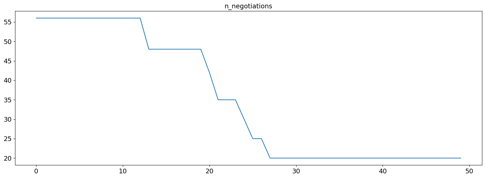
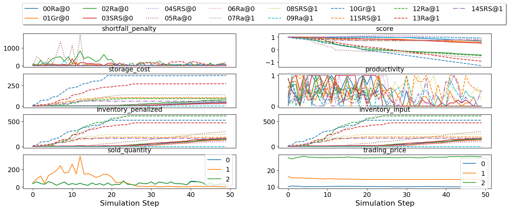

Run a session of the SCML world (2020)
--------------------------------------

The SCML world (Supply Chain Management League) runs on top of
``NegMAS``.

In this tutorial, you will test a run of this world.

Firstly, let’s import everything from the SCML app

.. code:: ipython3

    from scml.scml2020 import *

There are several ways to create an SCML world. One of the simplest is
to use one of the class methods of the ``SCML2020World`` class.

.. code:: ipython3

    world = SCML2020World(**SCML2020World.generate(agent_types=[DecentralizingAgent], n_steps=50))

*If you want to just test your installation (and do not care whether you
get an accurate indicator of agent performance), you can set the number
of steps to a small value (e.g. n_steps=10).*

Now you can run this world simulation by just calling ``run``.

.. code:: ipython3

    world.run()

Let’s see what happened in this run. Firstly, how many negotiations were
conducted over time

.. code:: ipython3

    plt.plot(world.stats['n_negotiations'])
    plt.xlabel('Simulation Step')
    plt.ylabel('N. Negotiations')
    plt.show()

.. image:: 01.run_scml2020_files/01.run_scml2020_7_0.png

It is clear that many negotiations happened at the beginning of the
simulation with smaller number later. That is expected as the consumers
publish their calls for proposals early on.

Several other market statistics are available:

.. code:: ipython3

    pprint(list(_ for _ in world.stats.keys() if "@" not in _ and not _.startswith("_") ))

.. parsed-literal::

    ['n_registered_negotiations_before',
     'n_contracts_dropped',
     'n_contracts_executed',
     'n_contracts_erred',
     'n_contracts_nullified',
     'n_contracts_cancelled',
     'n_breaches',
     'breach_level',
     'n_contracts_signed',
     'n_contracts_concluded',
     'n_negotiations',
     'n_negotiation_rounds_successful',
     'n_negotiation_rounds_failed',
     'n_registered_negotiations_after',
     'activity_level',
     'n_contracts_nullified_now',
     'n_bankrupt',
     'productivity',
     'market_size',
     'production_failures',
     'bankruptcy']

We can for example check the activity level of this world (defined as
the total amount of money transferred due to trade)

.. code:: ipython3

    plt.plot(world.stats['activity_level'])
    plt.xlabel('Simulation Step')
    plt.ylabel('Activitiy Level ($)\nTotal Money Transferred')
    plt.show()

We can see a picture of contracting in this world as follows:

.. code:: ipython3

    plt.plot(world.stats['n_contracts_concluded'], label='Concluded Contracts')
    plt.plot(world.stats['n_contracts_cancelled'], label='Cancelled Contracts') 
    plt.plot(world.stats['n_contracts_signed'], label='Signed Contracts') 
    plt.plot(world.stats['n_contracts_executed'], label='Executed Contracts')
    plt.legend()
    plt.xlabel('Simulation Step')
    plt.ylabel('N. Contracts')
    plt.show()

.. image:: 01.run_scml2020_files/01.run_scml2020_13_0.png

We can also check the breaches that happened

.. code:: ipython3

    plt.plot(world.stats['breach_level'])
    plt.xlabel('Simulation Step')
    plt.ylabel('Total Breach Level')
    plt.show()

It is also possible to focus on the behavior of some specific agent.
Let’s first find who was the winner (the factory manager that got
maximum wealth). Notice that there can be multiple winners

.. code:: ipython3

    winner_profits = [round(100.0 * world.stats[f'balance_{_}'][-1] / world.stats[f'balance_{_}'][0] - 100.0, 2) for _ in world.winners]
    print(f"{world.winners} won at {winner_profits}%")

.. parsed-literal::

    [04Dec@1] won at [3.88]%

What was the balance of this winner over time:

.. code:: ipython3

    for winner in world.winners:
        plt.plot(world.stats[f'balance_{winner}'], label=f'{winner}\n({winner.__class__.__name__})')
    plt.legend()
    plt.xlabel('Simulation Step')
    plt.ylabel('Winner\'s Balance ($)')
    plt.show()

.. image:: 01.run_scml2020_files/01.run_scml2020_19_0.png

Let’s check how did its total storage change over time:

.. code:: ipython3

    in_key = [_ for _ in world.stats.keys() if _.startswith(f'inventory_{winner}_input')][0]
    out_key = [_ for _ in world.stats.keys() if _.startswith(f'inventory_{winner}_output')][0]
    for winner in world.winners:
        plt.plot(world.stats[in_key], label=f"Input Product")
        plt.plot(world.stats[out_key], label=f"Output Product")
    plt.xlabel('Simulation Step')
    plt.ylabel('Player\'s Total Storage (item)')
    plt.title(f"Inventory of {winner}")
    plt.legend()
    plt.show()

.. image:: 01.run_scml2020_files/01.run_scml2020_21_0.png

We can actually check what happens to ALL competitors:

.. code:: ipython3

    for name, _ in sorted(((_.name, _) for _ in world.agents.values() if _.name != "SYSTEM"), key=lambda x: x[0]):    
        plt.plot(100.0 * (np.asarray(world.stats[f'balance_{name}'])/world.stats[f'balance_{name}'][0] - 1.0), label=name)
    plt.xlabel('Simulation Step')
    plt.ylabel('Player Profit (%)')
    plt.legend()
    plt.show()

.. image:: 01.run_scml2020_files/01.run_scml2020_23_0.png

Download :download:`Notebook<notebooks/01.run_scml2020.ipynb>`.

