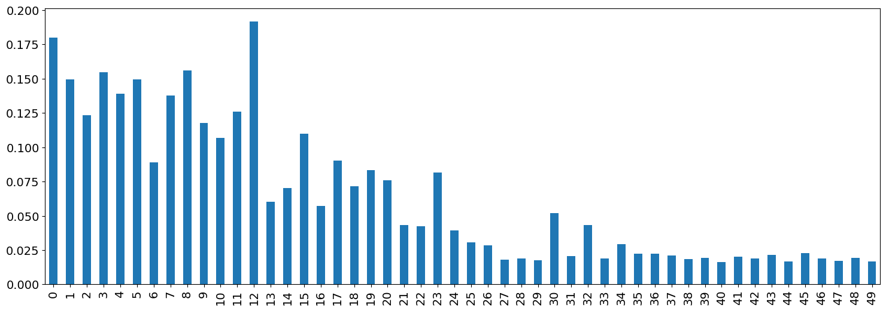
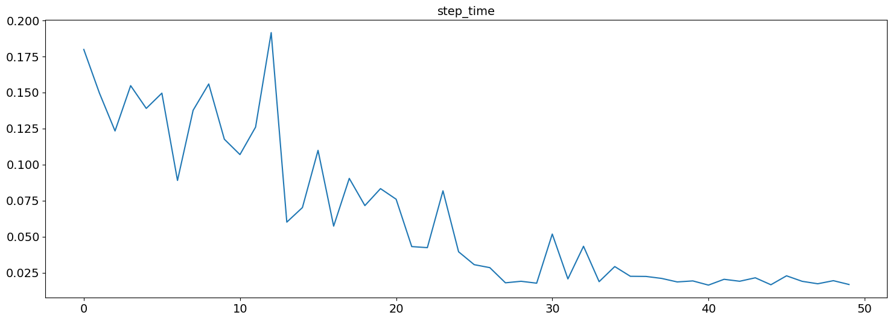
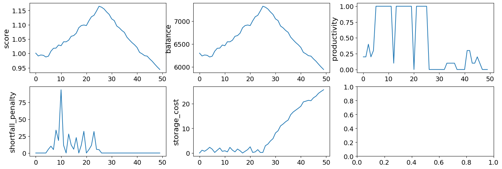
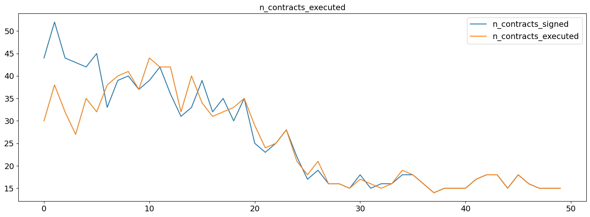
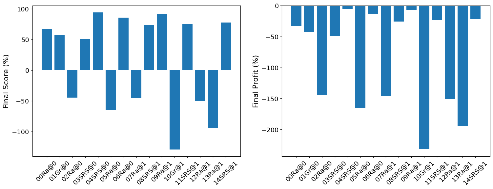
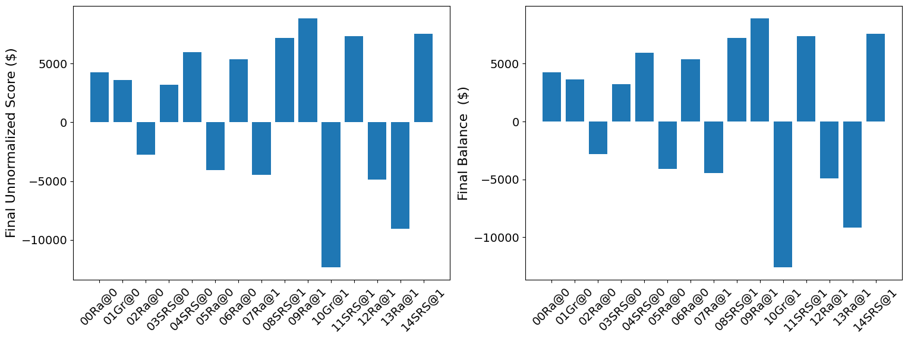
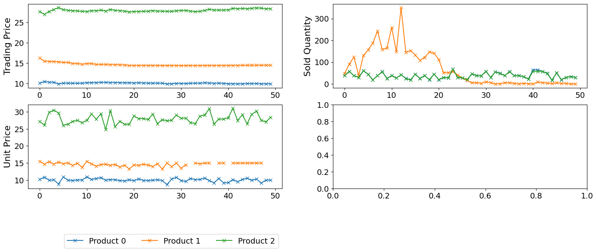
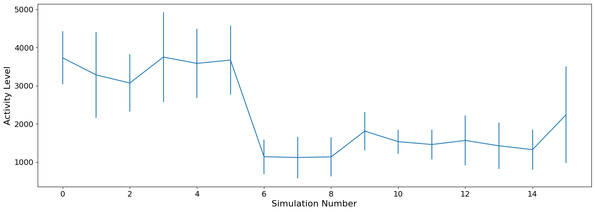
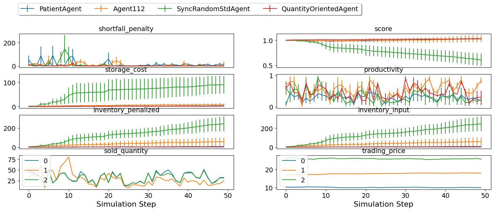

What is SCM and SCML?
---------------------

The Supply Chain Management (SCM) world simulates a supply chain
consisting of multiple factories that buy and sell products from one
another. The factories are represented by autonomous agents that act as
factory managers. Agents are given some target quantity to either buy or
sell and they negotiate with other agents to secure the needed supplies
or sales. Their goal is to turn a profit, and the agent with the highest
profit (averaged over multiple simulations) wins.

The Supply Chain Management League
(`SCML <https://scml.cs.brown.edu>`__) is a part of the International
Automated Negotiating Agents Competition
(`ANAC <http://web.tuat.ac.jp/~katfuji/ANAC2023/>`__) since 2019. SCML
runs in the SCM world.

The league is built using
`NegMAS <https://negmas.readthedocs.io/en/latest>`__ which provides
tools for building multiagent systems in which negotiations are embedded
within world simulations.

There are two different yet related games in SCML each represented by a
`NegMAS <https://negmas.readthedocs.io/en/latest>`__
`World <https://negmas.readthedocs.io/en/latest/api/negmas.situated.World.html>`__
class:

-  `SCML2024StdWorld <https://scml.readthedocs.io/en/latest/api/scml.std.SCML2024StdWorld.html>`__
   A world representing the *complete* SCML game described
   `here <http://www.yasserm.com/scml/y2024/scml2024.pdf>`__ in which
   the agent is responsible of defining its own utility function, with
   who to negotiate, negotiation agendas to propose, production
   schedule, etc. This form of the SCM world is more representative of
   real-world trading with a combination of long-term planning,
   negotiation, and production scheduling.

-  `SCML2024OneShotWorld <https://scml.readthedocs.io/en/latest/api/scml.oneshot.SCML2024OneShotWorld.html>`__
   A simpler form of the SCM world in which agents do not need to
   consider long-term planning or production scheduling described
   `here <http://www.yasserm.com/scml/y2024/scml2024oneshot.pdf>`__.
   This form was introduced in *2021*.

You can use the SCM world simulation in your own development and
research as you see fit but it is primarily intended for the SCM league
(SCML) of the ANAC competition. SCML has three tracks:

1. **Standard track** based on the **SCML2024StdWorld** full game
   simulation. In the standard track, a single instance of each agent
   type exists in the world. This precludes any possibility of
   *collusion* between agent instances of the same type and focuses on
   business operation of a single factory.
2. **OneShot track** based on the simpler **SCML2024OneShotWorld** game
   simulation. In the OneShot track, a single instance of each agent
   type exists in the world precluding any possibility of collusion. The
   focus here is on negotiation with less focus on long-term planning as
   discussed earlier. This track was introduced for the first time in
   *2021*.
3. **Collusion track** based on the **SCML2023World** full game
   simulation. In the collusion track, *multiple* instances of each
   agent type exist in the world. This opens the possibility for these
   agents instances to **collude** in order to corner the market and get
   higher profits that what each of them can get on its own. In this
   track, collusion is not considered a form of *cheating* but is
   encouraged. **This track is discontinued in 2024.**

The SCML competition has two versions:

-  **Online Competition** Participants to this competition can submit
   their agents as long as the competition is running (March 15th 2021
   to July 1st 2021). The system runs tournaments between the latest
   version of all submitted agents for each track periodically and
   maintains a leader-board showing the top agents updated at least
   weekly. Participants in this competition will get the chance to
   observe how their agents behave against agents submitted by other
   competitors and receive feedback about any exceptions or error caused
   by their agents.

-  **Official Competition** The final version of each agent submitted to
   the online competition (and registered before July 1st, 2021) is
   entered into the official SCM league which will run as part of the
   ANAC 2024 competition in conjunction with `AAMAS
   2024 <https://www.aamas2024-conference.auckland.ac.nz/>`__. The
   winners will be announced during the as part of the official program
   of IJCAI 2021.

A (not very) brief introduction to NegMAS
-----------------------------------------

The SCM world is built using
`NegMAS <https://negmas.readthedocs.io/en/latest/>`__. This section
provides a very short introduction of it to help you understand the
terms used in this document. Please refer to `NegMAS
documetnation <https://negmas.readthedocs.io/en/latest/>`__ for full
description and details as well as tutorials and other goodies.

This image shows the main components of a simulation in a NegMAS world:
|NegMAS world|

The simulation is run using a **World** object which defines what
happens in every simulation **step**, provides a **BulletinBoard**
object containing all public information about the game, calls various
callbacks defined in the **Agent** object representing each agent in the
environment, takes care of running negotiations and keeps track of
agreement signing and the resulting **Contract**\ s. The **World**
object also controls logging, event management, serialization,
visualization, etc. Refer to the
`World <https://negmas.readthedocs.io/en/latest/api/negmas.situated.World.html>`__
documentation for more details (you need to do that only if you are
implementing new world simulations).

The designer of the game implements a **World** class by overriding few
abstract methods in the base **World** class. This is how the
simulations for scml were created(e.g.  **SCML2019World**,
**SCML2024World**, **SCML2024OneShotWorld**). As a participant in SCML,
you *never* need to interact directly with the **World** object.

The logic of an agent is NegMAS is implemented in an **Agent** object.
The designer of the simulation, should provide a base class for its
specific world inherited from NegMAS’s **Agent** class. For SCML, this
base class is called **OneShotAgent** for the OneShot game (to go with
the SCML2024OneShotWorld), and **StdAgent** for the full game (to go
with the SCML2024StdWorld). Refer to the
`Agent <https://negmas.readthedocs.io/en/latest/api/negmas.situated.Agent.html>`__
documentation for more details about general NegMAS agents. Full
information about the **OneShotAgent** and **SCMLStdAgent** classes can
be found
`here <https://scml.readthedocs.io/en/latest/api/scml.std.StdAgent.html>`__
and
`here <https://scml.readthedocs.io/en/latest/api/scml.oneshot.OneShotAgent.html>`__
respectively.

.. container:: alert alert-info

   ::

      <b>info:</b> As a participant in SCML, you

   only need to develop an Agent class inherited from the appropriate
   base class depending on the track.

So now we have the **World** and the **Agent** objects, and we already
said that the agent does not directly interact with the world. How does
these two agents interact then?

-  When the **World** wants to interact with the **Agent**, it calls
   some method in it. For example, to instruct the agent to *initialize*
   itself, the world calls the **init()** method defined by the
   **Agent**. To inform the agent that a negotiation it is involved in
   is concluded with success, the **World** calls the method
   **on_negotiation_success()** defined by the agent.
-  When the **Agent** wants to interact with the **World**, it accesses
   an interface object called an **AgentWorldInterface** or **AWI** for
   short which provides all the services available to the **Agent**. For
   example, to request a negotiation with another agent, the **Agent**
   object needs to call **request_negotiation()** defined in the
   **AWI**.

The world designer defines an Agent-World-Interface (AWI) for its world
that inherits NegMAS’s **AgentWorldInterface** class and provides any
special services for agents interacting in this world. You can find all
the services available to your agent through the AgentWorldInterface
`here <https://negmas.readthedocs.io/en/latest/api/negmas.situated.AgentWorldInterface.html>`__.
These methods and properties are still available for your agent in SCML.
Nevertheless, in many cases, more convenient ways to access some of the
information (e.g. the bulletin board) is provided in the specific AWIs
implemented in the SCML package to be described now.

| For SCML, there are – as you may already expect – two AWIs. The first
  is called **OneStdAWI** and is defined in *scml.std* to go with
  *SCML2024StdWorld* and *StdAgent* and the second is defined in
  *scml.oneshot* to go with *SCML2024OneShotWorld* and *OneShotAgent*.
| You can find all the services provided by these AWIs
  `here <https://scml.readthedocs.io/en/latest/api/scml.oneshot.OneShotAWI.html>`__
  for the OneShot game (OneShot track) and
  `here <https://scml.readthedocs.io/en/latest/api/scml.std.StdAWI.html>`__
  for the full game (Standard and Collusion tracks).

.. container:: alert alert-warning

   ::

      <strong>Note:</strong>
      Earlier versions of the standard AWI are also defined in <i>scml.scml2019</i> and <i>scml2020</i>.
      These are <b>discontinued</b> forms of the game used in ANAC 2019 to ANAC 2023 competitions.

.. container:: alert alert-info

   Because the standard and oneshot versions of the game are compatible
   (starting 2024), the two AWIs (OneShotAWI and StdAWI) are actually
   exactly the same.

Negotiation Management
~~~~~~~~~~~~~~~~~~~~~~

Now that we know how worlds and agents work and interact, we can look at
how negotiation is managed in NegMAS.

A negotiation is controlled by a **Mechanism** object which implements
the negotiation protocol (e.g. the alternating offers protocol). NegMAS
provides several mediated and unmediated negotiation protocols (as well
as auction mechanisms). The specific **Mechanism** that is used in SCML
is the **SAOMechanism** which implements the bargaining protocol.

Negotiation strategies are implemented in a **Negotiator** object which
usually inherits some base negotiator-class corresponding to the
mechanism(s) it supports. The specific base class of all negotiators in
SCML is **SAONegotiator**.

The interaction between **Mechanism** and **Negotiator** objects mirrors
the interaction between **World** and **Agent** objects. **Mechanism**
objects call methods in **Negotiator** objects directly but
**Negotiator** objects can only access services provided by the
**Mechanism** object through a **NegotiatorMechanismInterface** (AMI).
Note that it is an AMI not a NMI (for historical reasons). You can find
more details about the general NegMAS AMI
`here <https://negmas.readthedocs.io/en/latest/api/negmas.common.NegotiatorMechanismInterface.html>`__.

Each specific **Mechanism** defines a corresponding specific
**NegotiatorMechanismInterface** class (in the same way that **World**
classes define their own AWI). The **SAOMechanism** used in SCML defines
**SAONMI** for this purpose (Details are
`here <https://negmas.readthedocs.io/en/latest/api/negmas.sao.SAONMI.html?highlight=saoami#negmas.sao.SAONMI>`__).

To negotiate effectively, negotiators can employ a **UtilityFunction**
to represent their preferences over different possible **Outcome**\ s of
the negotiation (where an outcome is a full assignment of values to all
negotiated **Issue**\ s). NegMAS provides an extensive set of utility
function, and issue types. Please refer to NegMAS
`overview <https://negmas.readthedocs.io/en/latest/overview.html>`__ and
`tutorials <https://negmas.readthedocs.io/en/latest/tutorials.html>`__
for more details. NegMAS also provides some basic **SAONegotiator**\ s
for the **SAOMechanism** (Check the class diagram
`here <https://negmas.readthedocs.io/en/latest/modules/sao.html>`__).
Moreover, you can access almost all
`Genius <http://ii.tudelft.nl/genius/>`__ using NegMAS’s
`GeniusNegotiator <https://negmas.readthedocs.io/en/latest/api/negmas.genius.GeniusNegotiator.html>`__
including all finalists and winners of all past ANAC competitions.

Now we understand how agents interact with worlds through AWIs and
negotiators interact with mechanisms through AMIs. We know that the
general simulation is controlled by the world while each negotiation is
controlled by a mechanism within that world. **We need now to connect
these two triplets of objects**

As the figure above shows: **Negotiator** objects can be created and
controlled by **Agent** objects for the purpose of negotiating with
other **Agent** objects. The standard flow of operations is something
like this:

1. **Agent** A uses its AWI to *request_negotiation()* with Agent B
   passing a **Negotiator** to be used in this negotiation. Usually
   Agent A will also create a **UtilityFunction** and attach it to the
   **Negotiator** it just created (by setting its *ufun* attribute).
2. The **World** calls Agent B’s *respond_to_negotiation_request()*
   asking it to provide its own **Negotiator** to negotiate with Agent
   A’s Negotiator. It can also just reject the negotiation request by
   returning no negotiators.
3. The **World** will then create a **Mechanism** and ask both
   **Negotiator**\ s to *join* it. If all goes well, the negotiation
   starts (at a time defined by the simulation rules) and runs until
   either an agreement or disagreement is reached.
4. The **World** class will then inform **Agent**\ s A and B about the
   results of the negotiation using their *on_negotiation_success* and
   *on_negotiation_failure* callbacks.
5. Successful negotiations lead to **Agreement**\ s but are still not
   binding in general until signed by all agents involved (A and B in
   this case). **Agent**\ ’s ’\ *sign_all_contracts* is used for this.
6. Signed agreements become *Contract*\ s and are executed (as specified
   in the simulation rules) by the **World**.

.. container:: alert alert-info

   The SCML game (both Standard and OneShot) simplifies things by
   automatically requesting all negotiations, accepting all requests and
   signing all contracts.

When negotiations are independent, these are all the objects needed.
Nevertheless, in many cases, including the SCML case, negotiations are
inter-dependent. This means that what is *good* in one negotiation
depends on other concurrently running negotiations (or on expectations
of future negotiations). NegMAS provides two ways to support this case
shown in the following figure:

.. figure:: controllers.jpg
   :alt: controllers

   controllers

1. Let **Negotiator**\ s use **UtilityFunction**\ s that depend on some
   common state. That is what is happening in the left two negotiations.
   Because you define your own utility functions in the full SCML game
   (standard and collusion tracks), this is one possible way to
   orchestrate the behavior of your negotiators.
2. Have multiple **Negotiator**\ s be controlled by a single
   **Controller** object with its own utility function that depends on
   what is happening on all the negotiations controlled. This is what is
   happening in the two negotiations on the right. This is also possible
   in the full SCML game (standard and collusion tracks) and is the only
   method available in the OneShot game (OneShot track).

The **Negotiator**\ s connected to a controller lost their autonomy and
just pass control to their *owning* **Controller**.

.. container:: alert alert-info

   ::

      SCML agents are actually NegMAS controllers as well.

This concludes our introduction to NegMAS and different objects you need
to know about to develop your agent.

In summary, you will need to develop an **StdAgent** or **OneShotAgent**
depending on the track. This agent uses an **StdAWI** or **OneShotAWI**
to access sense and act in the world. All negotiations are controlled by
**SAONegotiator**\ s that may optionally be grouped and controlled
centrally by **Controller** objects. The preferences of these
negotiators and controllers are defined using **UtilityFunction**
objects.

.. |NegMAS world| image:: world.png

A brief introduction to SCM
---------------------------

Here we only provide a 10,000-feet birds-eye view of the two games used
in SCML 2024’s two tracks. Each section provides pointers to more
information.

The Oneshot game (OneShot)
~~~~~~~~~~~~~~~~~~~~~~~~~~

An overview of the SCML-OneShot game is available
`here <https://yasserfarouk.github.io/files/scml/y2024/overview_oneshot2024.pdf>`__
and a full description for the details-savy person is available
`here <https://yasserfarouk.github.io/files/scml/y2024/scml2024oneshot.pdf>`__.

.. figure:: situation_oneshot_wide.jpg
   :alt: oneshot

   oneshot

The game runs in a world in which factories can run manufacturing
processes to convert products into other products. There are exactly 3
products and 2 processes as shown in the figure. Each agent controls
exactly one factory.

The agents that receive the raw material and generate the intermediate
product are called :math:`𝐿_0` agents (level zero) and the agents.
receiving the intermediate product and generate the final product are
called :math:`𝐿_1` factories (level 1). The product type consumed by the
factory controlled by an agent is called its input product and the
product it produces is called its output product.

Every day (simulation step), each :math:`𝐿_0` factory receives one
exogenous contract specifying a quantity and a unit price (supplies) for
this day and each :math:`𝐿_1` factory receives one exogenous contract
specifying a quantity and a unit price of the final product (sales) for
the same day. Production and transporation are assumed to take no time.

:math:`𝐿_0` and :math:`𝐿_1` agents need to negotiate together to secure
intermediate product contracts in order to use their supplies (for
:math:`𝐿_0` agents) or satisfy their sale obligations (for :math:`𝐿_1`
agents). All products that remain unsold at the end of the day **perish
(i.e. has no value)**. Moreover, agents pay a disposal cost for any
input products they buy and never sell and pay a shortfall penalty for
any sales they cannot satisfy.

Your goal as an agent designer is to maximize your overall profit over
the simulation time.

The Full game (Standard Track)
~~~~~~~~~~~~~~~~~~~~~~~~~~~~~~

An overview of the SCML-Standard game is available
`here <https://yasserfarouk.github.io/files/scml/overview2024.pdf>`__
and a full description for the details-savy person is available
`here <https://yasserfarouk.github.io/files/scml/scml2024.pdf>`__.

.. figure:: situation.jpg
   :alt: oneshot

   oneshot

The game runs in a world similar to the one-shot game world but with few
differences (that make a lot of difference):

1. Products are **not perishable** in the Standard game allowing
   factories to accumulate stock of their input product. This means that
   *profits calculated every day are lower limits* as they do not take
   into account the value of accumulated stock which can be manufactured
   and sold in the future. This implies that there is *no disposal of
   products at the end of each day*, instead there is a small cost
   associated with carrying stock (**storage cost**).
2. Agents can negotiate **future contracts** instead of only being
   allowed to negotiate about deliveries on the same day.
3. Negotiated **quantities have a larger range** to allow for proactive
   stockpiling of the input product.
4. Negotiated **prices have a larger range** which necessitates
   reasoning about prices as well as quantity matching.
5. Production graphs can be **deeper** which means that some agents will
   negotiate with **both** their suppliers and consumers at the same
   time.
6. Finally, the fact that agents can have contracts with delivery dates
   in the future, **complicates bankruptcy processing**. When an agent
   goes bankrupt, its future contracts are all **nullified/cancelled**.

.. container:: alert alert-success

   ::

      Because the oneshot and standard game have <i>exactly</i> the same API, agents developed for either can run in both in principle. Nevertheless, the differences between the two games is large enough that agents developed for one of them is not <i>expected</i> to run well in the other. For example, agents developed for the oneshot game will not know how to use the opportunity of future contracts, while agents developed for the standard game will assume that stock is carried forward.

Run a session of the SCML world (2024)
--------------------------------------

The SCML world (Supply Chain Management League) runs on top of
``NegMAS``.

In this tutorial, you will test a run of this world.

Firstly, let’s import everything from the SCML app

**Note that the 2024 standard league is based on the oneshot game with
appropriate generalizatuions as described in the detailed game
description document**.

.. code:: ipython3

    from scml.std import *
    from scml.oneshot import *

There are several ways to create an SCML world. One of the simplest is
to use the ``generate`` method of the ``SCML2024StdWorld`` class. This
will create a dict that can be passed to the ``SCML2024StdWorld``
constructor as keyword arguments.

Here we explicitly set ``construct_graphs`` to True which slows the
simulation yet allows us to see graph representations of what is
happening in the world.

.. code:: ipython3

    agent_types = [
        SyncRandomStdAgent,
        RandDistOneShotAgent,
        GreedyOneShotAgent,
        RandomStdAgent,
    ]

    world = SCML2024StdWorld(
        **SCML2024StdWorld.generate(agent_types=agent_types, n_steps=50),
        construct_graphs=True,
    )

Let’s draw a graph to see what is in this world

.. code:: ipython3

    _, _ = world.draw()

.. image:: 01.run_scml2020_files/01.run_scml2020_7_0.png

*If you want to just test your installation (and do not care whether you
get an accurate indicator of agent performance), you can set the number
of steps to a small value (e.g. n_steps=10).*

Now you can run this world simulation by just calling ``run``.

.. code:: ipython3

    world.run_with_progress()  # may take few minutes

.. raw:: html

    <pre style="white-space:pre;overflow-x:auto;line-height:normal;font-family:Menlo,'DejaVu Sans Mono',consolas,'Courier New',monospace"></pre>

.. parsed-literal::

    Output()

.. raw:: html

    <pre style="white-space:pre;overflow-x:auto;line-height:normal;font-family:Menlo,'DejaVu Sans Mono',consolas,'Courier New',monospace">
    </pre>

Let’s see what happened in this run. Firstly, how many negotiations were
conducted over time

.. code:: ipython3

    world.plot_stats("n_negotiations")
    plt.show()

.. image:: 01.run_scml2020_files/01.run_scml2020_11_0.png

There are exacty 7 \* 8 = 56 negotiations the first step as expected.
Smaller number of negotiations indicate that some agents went bankrupt

We can check which ones:

.. code:: ipython3

    world.plot_stats("bankrupt", ylegend=1.25)

.. image:: 01.run_scml2020_files/01.run_scml2020_13_0.png

Several other market statistics are available:

.. code:: ipython3

    world.plot_stats()

.. image:: 01.run_scml2020_files/01.run_scml2020_15_0.png

You can check all available stats:

.. code:: ipython3

    print(world.stat_names)

.. raw:: html

    <pre style="white-space:pre;overflow-x:auto;line-height:normal;font-family:Menlo,'DejaVu Sans Mono',consolas,'Courier New',monospace">[
        'activity_level',
        'balance',
        'bankrupt',
        'breach_level',
        'disposal_cost',
        'inventory_input',
        'inventory_output',
        'inventory_penalized',
        'n_breaches',
        'n_contracts_cancelled',
        'n_contracts_concluded',
        'n_contracts_dropped',
        'n_contracts_erred',
        'n_contracts_executed',
        'n_contracts_nullified',
        'n_contracts_nullified_now',
        'n_contracts_nullified_price',
        'n_contracts_nullified_quantity',
        'n_contracts_signed',
        'n_negotiations',
        'productivity',
        'score',
        'shortfall_penalty',
        'shortfall_quantity',
        'sold_quantity_0',
        'sold_quantity_1',
        'sold_quantity_2',
        'step_time',
        'storage_cost',
        'total_time',
        'trading_price_0',
        'trading_price_1',
        'trading_price_2',
        'unit_price_0',
        'unit_price_1',
        'unit_price_2'
    ]
    </pre>

Note that stas that end with a number are about specific products. Some
stats (e.g. storage_cost) is actually defined per agent (and per agent
type). We will see that later.

Let’s start by seeing how long did each step take (note that ``stats``
access the stats as a ``dict[str, List]`` but ``stats_df`` access the
same data as a pandas dataframe.

.. code:: ipython3

    world.stats_df["step_time"].plot(kind="bar")
    plt.show()

You can ge the same information using ``plot_stats()``. You may prefer
using ``stats_df`` if you are going to do pandas manipulations over the
data.

.. code:: ipython3

    world.plot_stats("step_time")

As we indicated earlier, there are statistics specific for each agent
that all have “\_{agent_name}“. Lets check what is available for the
winner agent:

.. code:: ipython3

    winner = world.winners[0]
    print(list(_ for _ in world.stats.keys() if winner.name in _))

.. raw:: html

    <pre style="white-space:pre;overflow-x:auto;line-height:normal;font-family:Menlo,'DejaVu Sans Mono',consolas,'Courier New',monospace">[
        'score_07Ra@1',
        'balance_07Ra@1',
        'bankrupt_07Ra@1',
        'productivity_07Ra@1',
        'shortfall_quantity_07Ra@1',
        'shortfall_penalty_07Ra@1',
        'storage_cost_07Ra@1',
        'disposal_cost_07Ra@1',
        'inventory_penalized_07Ra@1',
        'inventory_input_07Ra@1',
        'inventory_output_07Ra@1'
    ]
    </pre>

The convention is that agent names has the form {ind}{Type}{process}
where **ind** is a unique index, **Type** is a shortened version of the
agent’s type name, and **process** is the process the agnet can run.
Note that the agent’s input product has the same number as its process
and its output product has the next number (i.e. an agent that runs
process 1, has input product 1 and output product 2).

We can see that 8 pieces of information are available (for each
time-step of the simulation):

-  **bankrupt** If true, the agent is bankrupt.
-  **balance** The money the agent has in its wallet (account).
-  **inventory_input** The number of units of the agent’s input product
   available in its inventory (by the end of the simulation step).
-  **inventory_output** The number of units of the agent’s output
   product available in its inventory (by the end of the simulation
   step). This will always be zero in SCML.
-  **inventory_penalized** The amount of inventory penalized by paying
   storage cost or disposal cost.
-  **storage_cost** The storage cost paid on the given step. For
   SCML-OneShot, this will always be zero.
-  **disposal_cost** The amout paid to dispose of products at the end of
   the step (if products are perisahble). This is always zero for
   SCML-Std
-  **shortfall_quantity** The quantity we promised to sell but failt to
   produce.
-  **shortfall_penalty** The penalty we pay for failing to produce the
   quantity we promised to sell.
-  **productivity** The fraction of the agent’s production lines that
   were active at a given time-step.
-  **score** The score of the agent according to the evaluation rule of
   ANAC SCML 2020

Let’s see how did our agent do

.. code:: ipython3

    # show the first and last value of each of the agent statistics
    print({k: (v[0], v[-1]) for k, v in world.stats.items() if winner.name in k})

.. raw:: html

    <pre style="white-space:pre;overflow-x:auto;line-height:normal;font-family:Menlo,'DejaVu Sans Mono',consolas,'Courier New',monospace">{
        'score_07Ra@1': (0.9834377643860506, 1.1567247447127778),
        'balance_07Ra@1': (9980.909870754027, 11739.599434089982),
        'bankrupt_07Ra@1': (False, False),
        'productivity_07Ra@1': (0.2, 0.3),
        'shortfall_quantity_07Ra@1': (7, 1),
        'shortfall_penalty_07Ra@1': (184.09012924597346, 25.226622802500106),
        'storage_cost_07Ra@1': (0.0, 0.0),
        'disposal_cost_07Ra@1': (0.0, 0.0),
        'inventory_penalized_07Ra@1': (0, 0),
        'inventory_input_07Ra@1': (0, 3),
        'inventory_output_07Ra@1': (0, 0)
    }
    </pre>

.. code:: ipython3

    stats = pd.DataFrame(data=world.stats)
    fig, axs = plt.subplots(2, 3)
    for ax, key in zip(
        axs.flatten().tolist(),
        ["score", "balance", "productivity", "shortfall_penalty", "storage_cost"],
    ):
        ax.plot(stats[f"{key}_{winner}"])
        ax.set(ylabel=key)
    fig.show()

We can for example check the activity level of this world (defined as
the total amount of money transferred due to trade)

.. code:: ipython3

    world.plot_stats("activity_level")
    plt.show()

.. image:: 01.run_scml2020_files/01.run_scml2020_28_0.png

It is clear that activity goes down over time. This may just be due to
the smaller number of negotiations resulting from having bankrupt agents
but it can also be due to some end-game effect because agents know the
number of simulated days and can change their behavior near the end
(e.g. accomulating inventory in the beginning and getting rid of it near
the end).

We can see a picture of contracting activity in this world as follows:

.. code:: ipython3

    world.plot_stats(("n_contracts_signed", "n_contracts_executed"))
    plt.show()

Notice that there can be multiple winners

.. code:: ipython3

    winner_profits = [100 * world.scores()[_.id] - 100 for _ in world.winners]
    winner_types = [_.short_type_name for _ in world.winners]
    print(f"{world.winners} of type {winner_types} won at {winner_profits}% profit")

.. raw:: html

    <pre style="white-space:pre;overflow-x:auto;line-height:normal;font-family:Menlo,'DejaVu Sans Mono',consolas,'Courier New',monospace">[07Ra@1] of type ['RandDistOneShotAgent'] won at [15.67247447127778]% profit
    </pre>

Let’s check how did the first winner’s inventory changes over time:

.. code:: ipython3

    # find the keys in stats for the input and output inventory
    in_key = [_ for _ in world.stats.keys() if _.startswith(f"inventory_input_{winner}")][0]
    out_key = [_ for _ in world.stats.keys() if _.startswith(f"inventory_output_{winner}")][
        0
    ]

    # find input and output product indices
    input_product, output_product = (
        winner.awi.my_input_product,
        winner.awi.my_output_product,
    )
    # draw
    fig, (quantity, value) = plt.subplots(1, 2)
    quantity.plot(world.stats[in_key], label="Input Product")
    quantity.plot(world.stats[out_key], label="Output Product")
    quantity.set(xlabel="Simulation Step", ylabel="Winner's Total Storage (item)")
    quantity.legend()
    value.plot(
        np.array(world.stats[in_key])
        * np.array(world.stats[f"trading_price_{input_product}"]),
        label="Input Product",
    )
    value.plot(
        np.array(world.stats[out_key])
        * np.array(world.stats[f"trading_price_{output_product}"]),
        label="Output Product",
    )
    value.set(xlabel="Simulation Step", ylabel="Winner's Inventory Value ($)")
    value.legend()
    fig.show()

.. image:: 01.run_scml2020_files/01.run_scml2020_34_0.png

We can actually check what happens to ALL competitors:

.. code:: ipython3

    _, axs = plt.subplots(1, 2)
    plt.sca(axs[0])
    world.plot_stats("balance", ylegend=-0.05)
    plt.sca(axs[1])
    world.plot_stats("score", legend=False)
    plt.show()

.. code:: ipython3

    fig, (profit, score) = plt.subplots(1, 2)
    snames = sorted(world.non_system_agent_names)
    for name in snames:
        profit.plot((np.asarray(world.stats[f"balance_{name}"])), label=name)
        score.plot(
            np.asarray(world.stats[f"score_{name}"]) * (world.stats[f"balance_{name}"][0]),
            label=name,
        )
    profit.set(xlabel="Simulation Step", ylabel="Player Balance ($)")
    profit.legend(loc="lower left")
    score.set(xlabel="Simulation Step", ylabel="Player Score Unnormalized ($)")
    fig.show()

.. image:: 01.run_scml2020_files/01.run_scml2020_37_0.png

or just look at the end of the game

.. code:: ipython3

    fig, (score, profit) = plt.subplots(1, 2)
    final_scores = [
        100 * world.stats[f"score_{_}"][-1] for _ in world.non_system_agent_names
    ]
    final_profits = [
        100 * world.stats[f"balance_{_}"][-1] / world.stats[f"balance_{_}"][0] - 100
        for _ in world.non_system_agent_names
    ]
    plt.setp(score.xaxis.get_majorticklabels(), rotation=45)
    plt.setp(profit.xaxis.get_majorticklabels(), rotation=45)
    score.bar(world.non_system_agent_names, final_scores)
    profit.bar(world.non_system_agent_names, final_profits)
    score.set(ylabel="Final Score (%)")
    profit.set(ylabel="Final Profit (%)")

    fig.show()

.. code:: ipython3

    fig, (score, profit) = plt.subplots(1, 2)
    final_scores = [
        world.stats[f"score_{_}"][-1] * (world.stats[f"balance_{_}"][0])
        for _ in world.non_system_agent_names
    ]
    final_profits = [world.stats[f"balance_{_}"][-1] for _ in world.non_system_agent_names]
    plt.setp(score.xaxis.get_majorticklabels(), rotation=45)
    plt.setp(profit.xaxis.get_majorticklabels(), rotation=45)
    score.bar(world.non_system_agent_names, final_scores)
    profit.bar(world.non_system_agent_names, final_profits)
    score.set(ylabel="Final Unnormalized Score ($)")
    profit.set(ylabel="Final Balance  ($)")

    fig.show()

You can inspect what happened in the simulation by plotting different
output statistics. For example, we can see how did the trading price of
different products change over the simulation time.

.. code:: ipython3

    fig, axs = plt.subplots(2, 2)
    for ax, key in zip(
        axs.flatten().tolist(), ["trading_price", "sold_quantity", "unit_price"]
    ):
        for p in range(world.n_products):
            ax.plot(world.stats[f"{key}_{p}"], marker="x", label=f"Product {p}")
            ax.set_ylabel(key.replace("_", " ").title())
            ax.legend().set_visible(False)
    axs[-1, 0].legend(bbox_to_anchor=(1, -0.5), ncol=3)
    fig.show()

You can dig futher to understand what happened during this siumulation.
For example, let’s see some of the contracts that were signed:

.. code:: ipython3

    # create a view with only signed contracts
    contracts = world.contracts_df
    signed = contracts.loc[contracts.signed_at >= 0, :]

.. code:: ipython3

    fields = [
        "seller_name",
        "buyer_name",
        "delivery_time",
        "quantity",
        "unit_price",
        "signed_at",
        "executed",
        "breached",
        "nullified",
        "erred",
    ]
    signed[fields].sort_values(["quantity", "unit_price"], ascending=False).head(10)

.. raw:: html

    

    
    <table border="1" class="dataframe">
      <thead>
        <tr style="text-align: right;">
          <th></th>
          <th>seller_name</th>
          <th>buyer_name</th>
          <th>delivery_time</th>
          <th>quantity</th>
          <th>unit_price</th>
          <th>signed_at</th>
          <th>executed</th>
          <th>breached</th>
          <th>nullified</th>
          <th>erred</th>
        </tr>
      </thead>
      <tbody>
        <tr>
          <th>0</th>
          <td>03Ra@0</td>
          <td>09SRS@1</td>
          <td>2</td>
          <td>30</td>
          <td>18</td>
          <td>0</td>
          <td>True</td>
          <td>False</td>
          <td>False</td>
          <td>False</td>
        </tr>
        <tr>
          <th>65</th>
          <td>06Ra@0</td>
          <td>09SRS@1</td>
          <td>11</td>
          <td>30</td>
          <td>16</td>
          <td>1</td>
          <td>True</td>
          <td>False</td>
          <td>False</td>
          <td>False</td>
        </tr>
        <tr>
          <th>185</th>
          <td>06Ra@0</td>
          <td>08Ra@1</td>
          <td>14</td>
          <td>30</td>
          <td>16</td>
          <td>4</td>
          <td>False</td>
          <td>False</td>
          <td>False</td>
          <td>False</td>
        </tr>
        <tr>
          <th>316</th>
          <td>03Ra@0</td>
          <td>09SRS@1</td>
          <td>9</td>
          <td>30</td>
          <td>16</td>
          <td>7</td>
          <td>True</td>
          <td>False</td>
          <td>False</td>
          <td>False</td>
        </tr>
        <tr>
          <th>604</th>
          <td>04SRS@0</td>
          <td>13Ra@1</td>
          <td>15</td>
          <td>30</td>
          <td>16</td>
          <td>15</td>
          <td>True</td>
          <td>False</td>
          <td>False</td>
          <td>False</td>
        </tr>
        <tr>
          <th>656</th>
          <td>04SRS@0</td>
          <td>08Ra@1</td>
          <td>17</td>
          <td>30</td>
          <td>16</td>
          <td>17</td>
          <td>True</td>
          <td>False</td>
          <td>False</td>
          <td>False</td>
        </tr>
        <tr>
          <th>657</th>
          <td>05SRS@0</td>
          <td>08Ra@1</td>
          <td>17</td>
          <td>30</td>
          <td>16</td>
          <td>17</td>
          <td>True</td>
          <td>False</td>
          <td>False</td>
          <td>False</td>
        </tr>
        <tr>
          <th>678</th>
          <td>04SRS@0</td>
          <td>14Ra@1</td>
          <td>18</td>
          <td>30</td>
          <td>16</td>
          <td>18</td>
          <td>True</td>
          <td>False</td>
          <td>False</td>
          <td>False</td>
        </tr>
        <tr>
          <th>679</th>
          <td>05SRS@0</td>
          <td>14Ra@1</td>
          <td>18</td>
          <td>30</td>
          <td>16</td>
          <td>18</td>
          <td>True</td>
          <td>False</td>
          <td>False</td>
          <td>False</td>
        </tr>
        <tr>
          <th>53</th>
          <td>06Ra@0</td>
          <td>11Gr@1</td>
          <td>5</td>
          <td>30</td>
          <td>15</td>
          <td>1</td>
          <td>True</td>
          <td>False</td>
          <td>False</td>
          <td>False</td>
        </tr>
      </tbody>
    </table>
    

Let’s check some of the contracts that were fully executed

.. code:: ipython3

    signed.loc[signed.executed, fields].sort_values(
        ["quantity", "unit_price"], ascending=False
    ).head(10)

.. raw:: html

    

    
    <table border="1" class="dataframe">
      <thead>
        <tr style="text-align: right;">
          <th></th>
          <th>seller_name</th>
          <th>buyer_name</th>
          <th>delivery_time</th>
          <th>quantity</th>
          <th>unit_price</th>
          <th>signed_at</th>
          <th>executed</th>
          <th>breached</th>
          <th>nullified</th>
          <th>erred</th>
        </tr>
      </thead>
      <tbody>
        <tr>
          <th>0</th>
          <td>03Ra@0</td>
          <td>09SRS@1</td>
          <td>2</td>
          <td>30</td>
          <td>18</td>
          <td>0</td>
          <td>True</td>
          <td>False</td>
          <td>False</td>
          <td>False</td>
        </tr>
        <tr>
          <th>65</th>
          <td>06Ra@0</td>
          <td>09SRS@1</td>
          <td>11</td>
          <td>30</td>
          <td>16</td>
          <td>1</td>
          <td>True</td>
          <td>False</td>
          <td>False</td>
          <td>False</td>
        </tr>
        <tr>
          <th>316</th>
          <td>03Ra@0</td>
          <td>09SRS@1</td>
          <td>9</td>
          <td>30</td>
          <td>16</td>
          <td>7</td>
          <td>True</td>
          <td>False</td>
          <td>False</td>
          <td>False</td>
        </tr>
        <tr>
          <th>604</th>
          <td>04SRS@0</td>
          <td>13Ra@1</td>
          <td>15</td>
          <td>30</td>
          <td>16</td>
          <td>15</td>
          <td>True</td>
          <td>False</td>
          <td>False</td>
          <td>False</td>
        </tr>
        <tr>
          <th>656</th>
          <td>04SRS@0</td>
          <td>08Ra@1</td>
          <td>17</td>
          <td>30</td>
          <td>16</td>
          <td>17</td>
          <td>True</td>
          <td>False</td>
          <td>False</td>
          <td>False</td>
        </tr>
        <tr>
          <th>657</th>
          <td>05SRS@0</td>
          <td>08Ra@1</td>
          <td>17</td>
          <td>30</td>
          <td>16</td>
          <td>17</td>
          <td>True</td>
          <td>False</td>
          <td>False</td>
          <td>False</td>
        </tr>
        <tr>
          <th>678</th>
          <td>04SRS@0</td>
          <td>14Ra@1</td>
          <td>18</td>
          <td>30</td>
          <td>16</td>
          <td>18</td>
          <td>True</td>
          <td>False</td>
          <td>False</td>
          <td>False</td>
        </tr>
        <tr>
          <th>679</th>
          <td>05SRS@0</td>
          <td>14Ra@1</td>
          <td>18</td>
          <td>30</td>
          <td>16</td>
          <td>18</td>
          <td>True</td>
          <td>False</td>
          <td>False</td>
          <td>False</td>
        </tr>
        <tr>
          <th>53</th>
          <td>06Ra@0</td>
          <td>11Gr@1</td>
          <td>5</td>
          <td>30</td>
          <td>15</td>
          <td>1</td>
          <td>True</td>
          <td>False</td>
          <td>False</td>
          <td>False</td>
        </tr>
        <tr>
          <th>364</th>
          <td>03Ra@0</td>
          <td>12SRS@1</td>
          <td>10</td>
          <td>30</td>
          <td>15</td>
          <td>8</td>
          <td>True</td>
          <td>False</td>
          <td>False</td>
          <td>False</td>
        </tr>
      </tbody>
    </table>
    

We can now see how does the singning day affect delivery day, product
and quantity

.. code:: ipython3

    fig, ax = plt.subplots(1, 3)
    for i, x in enumerate(["delivery_time", "quantity", "product_index"]):
        ax[i].scatter(signed.signed_at, signed[x])
        ax[i].set(ylabel=x.replace("_", " ").title(), xlabel="Signing Day")
    fig.show()

.. image:: 01.run_scml2020_files/01.run_scml2020_49_0.png

.. code:: ipython3

    fig, ax = plt.subplots(1, 3)
    for i, x in enumerate(["delivery_time", "unit_price", "product_index"]):
        ax[i].scatter(signed.quantity, signed[x])
        ax[i].set(ylabel=x.replace("_", " ").title(), xlabel="Quantity")
    fig.show()

.. image:: 01.run_scml2020_files/01.run_scml2020_50_0.png

Did any agents go bankrupt and when?

.. code:: ipython3

    bankruptcy = {
        a: np.nonzero(stats[f"bankrupt_{a}"].values)[0]
        for a in world.non_system_agent_names
    }
    print({k: "No" if len(v) < 1 else f"at: {v[0]}" for k, v in bankruptcy.items()})

.. raw:: html

    <pre style="white-space:pre;overflow-x:auto;line-height:normal;font-family:Menlo,'DejaVu Sans Mono',consolas,'Courier New',monospace">{
        '00Ra@0': 'No',
        '01Ra@0': 'No',
        '02Gr@0': 'No',
        '03Ra@0': 'at: 32',
        '04SRS@0': 'No',
        '05SRS@0': 'No',
        '06Ra@0': 'at: 12',
        '07Ra@1': 'No',
        '08Ra@1': 'at: 17',
        '09SRS@1': 'No',
        '10Ra@1': 'No',
        '11Gr@1': 'at: 16',
        '12SRS@1': 'No',
        '13Ra@1': 'at: 15',
        '14Ra@1': 'at: 18'
    }
    </pre>

You can see what happened during this simulation by drawing graphs at
different steps. The meaning of different edge colors can be drawn as
follows:

.. code:: ipython3

    from negmas import show_edge_colors

    show_edge_colors()

.. image:: 01.run_scml2020_files/01.run_scml2020_54_0.png

You can see what happened in this world in a series of graphs using the
``draw`` method

.. code:: ipython3

    world.draw(steps=(0, world.n_steps), together=False, ncols=2, figsize=(20, 20))
    plt.show()

You can also run a simple animation to see what happens at every step
(you need to download the jupyter notebook and execute it to see the
animation) :

.. code:: ipython3

    world.save_gif("run.gif")

.. parsed-literal::

    []

then show the animation

.. code:: ipython3

    from IPython.display import HTML

    HTML('')

.. raw:: html

    

Running a tournament
--------------------

Now that you can run simple world simulations, let’s try to run a
complete tournament and see its results. Let’s start by running a
standard tournament (in which each agent is represented by a single
factory). Running a one-shot tournament (new in 2021) similarily just
requires a change from ``anac2024_std`` to ``anac2024_oneshot``

Note that in the real competition we use thousands of configurations and
longer simulation steps (e.g. 50 :math:`\le` n_steps :math:`\le` 500).

.. code:: ipython3

    from scml.utils import anac2024_std

    pd.options.display.float_format = "{:,.2f}".format

    def shorten_names(results):
        # just make agent types more readable
        results.score_stats.agent_type = results.score_stats.agent_type.str.split(".").str[
            -1
        ]
        results.kstest.a = results.kstest.a.str.split(".").str[-1]
        results.kstest.b = results.kstest.b.str.split(".").str[-1]
        results.total_scores.agent_type = results.total_scores.agent_type.str.split(
            "."
        ).str[-1]
        results.scores.agent_type = results.scores.agent_type.str.split(".").str[-1]
        results.winners = [_.split(".")[-1] for _ in results.winners]
        return results

.. code:: ipython3

    tournament_types = [GreedyStdAgent, SyncRandomStdAgent, RandDistOneShotAgent]
    # may take a long time
    results = anac2024_std(
        competitors=tournament_types,
        n_configs=5,  # number of different configurations to generate
        n_runs_per_world=1,  # number of times to repeat every simulation (with agent assignment)
        n_steps=10,  # number of days (simulation steps) per simulation
        print_exceptions=True,
    )

.. code:: ipython3

    results = shorten_names(results)

Who was the winner?

.. code:: ipython3

    results.winners

.. parsed-literal::

    ['GreedyStdAgent']

How many simulations were actually run?

.. code:: ipython3

    len(results.scores.run_id.unique())

.. parsed-literal::

    30

The total number of simulations :math:`n_{s}` will be
:math:`n_t \times n_c \times n_r` where :math:`n_t` is the number of
competitor agent types, :math:`n_c` is the number of configurations, and
:math:`n_r` is the number of runs per configuration

We can also see the scores that every agent type got

.. code:: ipython3

    results.score_stats

.. raw:: html

    

    
    <table border="1" class="dataframe">
      <thead>
        <tr style="text-align: right;">
          <th></th>
          <th>agent_type</th>
          <th>count</th>
          <th>mean</th>
          <th>std</th>
          <th>min</th>
          <th>25%</th>
          <th>median</th>
          <th>75%</th>
          <th>max</th>
        </tr>
      </thead>
      <tbody>
        <tr>
          <th>0</th>
          <td>RandDistOneShotAgent</td>
          <td>20.00</td>
          <td>1.01</td>
          <td>0.08</td>
          <td>0.88</td>
          <td>0.97</td>
          <td>1.00</td>
          <td>1.06</td>
          <td>1.16</td>
        </tr>
        <tr>
          <th>1</th>
          <td>GreedyStdAgent</td>
          <td>20.00</td>
          <td>1.03</td>
          <td>0.21</td>
          <td>0.43</td>
          <td>1.00</td>
          <td>1.07</td>
          <td>1.18</td>
          <td>1.25</td>
        </tr>
        <tr>
          <th>2</th>
          <td>SyncRandomStdAgent</td>
          <td>20.00</td>
          <td>0.86</td>
          <td>0.14</td>
          <td>0.57</td>
          <td>0.81</td>
          <td>0.84</td>
          <td>0.94</td>
          <td>1.13</td>
        </tr>
      </tbody>
    </table>
    

You can also do statistical significance testing using ttest or kstest
(with multi-comparison correction)

.. code:: ipython3

    results.kstest

.. raw:: html

    

    
    <table border="1" class="dataframe">
      <thead>
        <tr style="text-align: right;">
          <th></th>
          <th>a</th>
          <th>b</th>
          <th>t</th>
          <th>p</th>
          <th>n_a</th>
          <th>n_b</th>
          <th>n_effective</th>
        </tr>
      </thead>
      <tbody>
        <tr>
          <th>0</th>
          <td>GreedyStdAgent</td>
          <td>RandDistOneShotAgent</td>
          <td>0.35</td>
          <td>0.17</td>
          <td>20</td>
          <td>20</td>
          <td>20</td>
        </tr>
        <tr>
          <th>1</th>
          <td>GreedyStdAgent</td>
          <td>SyncRandomStdAgent</td>
          <td>0.55</td>
          <td>0.00</td>
          <td>20</td>
          <td>20</td>
          <td>20</td>
        </tr>
        <tr>
          <th>2</th>
          <td>RandDistOneShotAgent</td>
          <td>SyncRandomStdAgent</td>
          <td>0.70</td>
          <td>0.00</td>
          <td>20</td>
          <td>20</td>
          <td>20</td>
        </tr>
      </tbody>
    </table>
    

see the total score

.. code:: ipython3

    results.total_scores

.. raw:: html

    

    
    <table border="1" class="dataframe">
      <thead>
        <tr style="text-align: right;">
          <th></th>
          <th>agent_type</th>
          <th>score</th>
        </tr>
      </thead>
      <tbody>
        <tr>
          <th>0</th>
          <td>GreedyStdAgent</td>
          <td>1.03</td>
        </tr>
        <tr>
          <th>1</th>
          <td>RandDistOneShotAgent</td>
          <td>1.01</td>
        </tr>
        <tr>
          <th>2</th>
          <td>SyncRandomStdAgent</td>
          <td>0.86</td>
        </tr>
      </tbody>
    </table>
    

or the aggregated statistics of the world. For example, let’s draw the
activity level for different simulations.

.. code:: ipython3

    plt.errorbar(
        range(len(results.agg_stats)),
        results.agg_stats.activity_level_mean,
        np.sqrt(results.agg_stats.activity_level_var),
    )
    plt.xlabel("Simulation Number")
    plt.ylabel("Activity Level")
    plt.show()

We can even get the scores of every agent belonging to every agent type
at every simulation

.. code:: ipython3

    results.scores.loc[:, ["agent_name", "agent_type", "score"]].head()

.. raw:: html

    

    
    <table border="1" class="dataframe">
      <thead>
        <tr style="text-align: right;">
          <th></th>
          <th>agent_name</th>
          <th>agent_type</th>
          <th>score</th>
        </tr>
      </thead>
      <tbody>
        <tr>
          <th>0</th>
          <td>00Gr@0</td>
          <td>GreedyStdAgent</td>
          <td>1.02</td>
        </tr>
        <tr>
          <th>1</th>
          <td>01Ra@0</td>
          <td>RandDistOneShotAgent</td>
          <td>1.13</td>
        </tr>
        <tr>
          <th>2</th>
          <td>00Gr@0</td>
          <td>GreedyStdAgent</td>
          <td>1.03</td>
        </tr>
        <tr>
          <th>3</th>
          <td>04Ra@1</td>
          <td>RandDistOneShotAgent</td>
          <td>1.00</td>
        </tr>
        <tr>
          <th>4</th>
          <td>00Gr@0</td>
          <td>GreedyStdAgent</td>
          <td>1.01</td>
        </tr>
      </tbody>
    </table>
    

Let’s see how did the location at the production graph affect the score
of each type.

.. code:: ipython3

    results.scores["level"] = results.scores.agent_name.str.split("@", expand=True).loc[
        :, 1
    ]
    results.scores = results.scores.sort_values("level")
    sns.lineplot(
        data=results.scores[["agent_type", "level", "score"]],
        x="level",
        y="score",
        hue="agent_type",
        ci=None,
    )
    plt.plot([0.0] * len(results.scores["level"].unique()), "b--")
    plt.show()

.. image:: 01.run_scml2020_files/01.run_scml2020_80_0.png

Running a One-Shot tournament
-----------------------------

In 2021, a new track was introduced to the SCM league called the
SCML-OneShot track which simplified the problem in order to focus
research efforts on the core many-to-many concurrent negotiation
challeng. You can run a tournament for this track with the latest
settings in almost the same way as we did with standard/collusion
tournaments using ``anac2024_oneshot``

Note that in the real competition we use thousands of configurations and
longer simulation steps (e.g. 50 :math:`\le` n_steps :math:`\le` 500).

.. code:: ipython3

    from scml.utils import anac2024_oneshot

.. code:: ipython3

    tournament_types = [
        RandomOneShotAgent,
        SyncRandomOneShotAgent,
        GreedyOneShotAgent,
        GreedySingleAgreementAgent,
    ]
    # may take a long time
    results = anac2024_oneshot(
        competitors=tournament_types,
        n_configs=5,  # number of different configurations to generate
        n_runs_per_world=1,  # number of times to repeat every simulation (with agent assignment)
        n_steps=10,  # number of days (simulation steps) per simulation
        print_exceptions=True,
    )
    results = shorten_names(results)

Who was the winner?

.. code:: ipython3

    results.winners

.. parsed-literal::

    ['SyncRandomOneShotAgent']

How many simulations were actually run?

.. code:: ipython3

    len(results.scores.run_id.unique())

.. parsed-literal::

    60

The total number of simulations :math:`n_{s}` will be
:math:`n_t \times n_c \times n_r` where :math:`n_t` is the number of
competitor agent types, :math:`n_c` is the number of configurations, and
:math:`n_r` is the number of runs per configuration

We can also see the scores that every agent type got

.. code:: ipython3

    results.score_stats

.. raw:: html

    

    
    <table border="1" class="dataframe">
      <thead>
        <tr style="text-align: right;">
          <th></th>
          <th>agent_type</th>
          <th>count</th>
          <th>mean</th>
          <th>std</th>
          <th>min</th>
          <th>25%</th>
          <th>median</th>
          <th>75%</th>
          <th>max</th>
        </tr>
      </thead>
      <tbody>
        <tr>
          <th>0</th>
          <td>GreedyOneShotAgent</td>
          <td>45.00</td>
          <td>0.72</td>
          <td>0.22</td>
          <td>0.16</td>
          <td>0.58</td>
          <td>0.75</td>
          <td>0.91</td>
          <td>1.04</td>
        </tr>
        <tr>
          <th>1</th>
          <td>GreedySingleAgreementAgent</td>
          <td>45.00</td>
          <td>0.72</td>
          <td>0.16</td>
          <td>0.45</td>
          <td>0.58</td>
          <td>0.73</td>
          <td>0.85</td>
          <td>0.99</td>
        </tr>
        <tr>
          <th>2</th>
          <td>RandomOneShotAgent</td>
          <td>45.00</td>
          <td>0.73</td>
          <td>0.21</td>
          <td>0.29</td>
          <td>0.60</td>
          <td>0.77</td>
          <td>0.90</td>
          <td>1.02</td>
        </tr>
        <tr>
          <th>3</th>
          <td>SyncRandomOneShotAgent</td>
          <td>45.00</td>
          <td>1.05</td>
          <td>0.08</td>
          <td>0.77</td>
          <td>1.00</td>
          <td>1.05</td>
          <td>1.11</td>
          <td>1.21</td>
        </tr>
      </tbody>
    </table>
    

You can also do statistical significance testing using ttest or kstest
(with multi-comparison correction)

.. code:: ipython3

    results.kstest

.. raw:: html

    

    
    <table border="1" class="dataframe">
      <thead>
        <tr style="text-align: right;">
          <th></th>
          <th>a</th>
          <th>b</th>
          <th>t</th>
          <th>p</th>
          <th>n_a</th>
          <th>n_b</th>
          <th>n_effective</th>
        </tr>
      </thead>
      <tbody>
        <tr>
          <th>0</th>
          <td>RandomOneShotAgent</td>
          <td>SyncRandomOneShotAgent</td>
          <td>0.82</td>
          <td>0.00</td>
          <td>45</td>
          <td>45</td>
          <td>45</td>
        </tr>
        <tr>
          <th>1</th>
          <td>RandomOneShotAgent</td>
          <td>GreedyOneShotAgent</td>
          <td>0.13</td>
          <td>0.82</td>
          <td>45</td>
          <td>45</td>
          <td>45</td>
        </tr>
        <tr>
          <th>2</th>
          <td>RandomOneShotAgent</td>
          <td>GreedySingleAgreementAgent</td>
          <td>0.18</td>
          <td>0.48</td>
          <td>45</td>
          <td>45</td>
          <td>45</td>
        </tr>
        <tr>
          <th>3</th>
          <td>SyncRandomOneShotAgent</td>
          <td>GreedyOneShotAgent</td>
          <td>0.78</td>
          <td>0.00</td>
          <td>45</td>
          <td>45</td>
          <td>45</td>
        </tr>
        <tr>
          <th>4</th>
          <td>SyncRandomOneShotAgent</td>
          <td>GreedySingleAgreementAgent</td>
          <td>0.89</td>
          <td>0.00</td>
          <td>45</td>
          <td>45</td>
          <td>45</td>
        </tr>
        <tr>
          <th>5</th>
          <td>GreedyOneShotAgent</td>
          <td>GreedySingleAgreementAgent</td>
          <td>0.16</td>
          <td>0.65</td>
          <td>45</td>
          <td>45</td>
          <td>45</td>
        </tr>
      </tbody>
    </table>
    

see the total score

.. code:: ipython3

    results.total_scores

.. raw:: html

    

    
    <table border="1" class="dataframe">
      <thead>
        <tr style="text-align: right;">
          <th></th>
          <th>agent_type</th>
          <th>score</th>
        </tr>
      </thead>
      <tbody>
        <tr>
          <th>0</th>
          <td>SyncRandomOneShotAgent</td>
          <td>1.05</td>
        </tr>
        <tr>
          <th>1</th>
          <td>RandomOneShotAgent</td>
          <td>0.73</td>
        </tr>
        <tr>
          <th>2</th>
          <td>GreedyOneShotAgent</td>
          <td>0.72</td>
        </tr>
        <tr>
          <th>3</th>
          <td>GreedySingleAgreementAgent</td>
          <td>0.72</td>
        </tr>
      </tbody>
    </table>
    

We can even get the scores of every agent belonging to every agent type
at every simulation

.. code:: ipython3

    results.scores.loc[:, ["agent_name", "agent_type", "score"]].head()

.. raw:: html

    

    
    <table border="1" class="dataframe">
      <thead>
        <tr style="text-align: right;">
          <th></th>
          <th>agent_name</th>
          <th>agent_type</th>
          <th>score</th>
        </tr>
      </thead>
      <tbody>
        <tr>
          <th>0</th>
          <td>05Ra@1</td>
          <td>RandomOneShotAgent</td>
          <td>0.76</td>
        </tr>
        <tr>
          <th>1</th>
          <td>06Sy@1</td>
          <td>SyncRandomOneShotAgent</td>
          <td>0.94</td>
        </tr>
        <tr>
          <th>2</th>
          <td>07Gr@1</td>
          <td>GreedyOneShotAgent</td>
          <td>0.75</td>
        </tr>
        <tr>
          <th>3</th>
          <td>00Gr@0</td>
          <td>GreedyOneShotAgent</td>
          <td>0.60</td>
        </tr>
        <tr>
          <th>4</th>
          <td>01GSA@0</td>
          <td>GreedySingleAgreementAgent</td>
          <td>0.57</td>
        </tr>
      </tbody>
    </table>
    

Let’s see how did the location at the production graph affect the score
of each type.

.. code:: ipython3

    results.scores["level"] = results.scores.agent_name.str.split("@", expand=True).loc[
        :, 1
    ]
    results.scores = results.scores.sort_values("level")
    sns.lineplot(
        data=results.scores[["agent_type", "level", "score"]],
        x="level",
        y="score",
        hue="agent_type",
    )
    # plt.plot([0.0] * len(results.scores["level"].unique()), "b--")
    plt.show()

.. image:: 01.run_scml2020_files/01.run_scml2020_97_0.png

Now that you can run simulations and complete tournaments, let’s see how
are we going to develop a new agent for the SCML2023 league
:math:`\rightarrow`

Running against winners from previous years
-------------------------------------------

| You can compare your agent against any agents previously submitted to
  SCML (same track). To do that, you need to install the ``scml-agents``
  package from pip:

   pip install scml-agents

You can then get agents using the ``get_agents()`` function from this
package:

.. code:: ipython3

    from scml_agents import get_agents

    winners = [
        get_agents(y, track="oneshot", winners_only=True, as_class=False)[0]
        for y in (2021, 2022, 2023)
    ]
    print(winners)

.. raw:: html

    <pre style="white-space:pre;overflow-x:auto;line-height:normal;font-family:Menlo,'DejaVu Sans Mono',consolas,'Courier New',monospace">[
        'scml_agents.scml2021.oneshot.team_86.agent112.Agent112',
        'scml_agents.scml2022.oneshot.team_134.agent119.PatientAgent',
        'scml_agents.scml2023.oneshot.team_poli_usp.quantity_oriented_agent.QuantityOrientedAgent'
    ]
    </pre>

We can now try tem against each other:

.. code:: ipython3

    world = SCML2024OneShotWorld(
        **SCML2024OneShotWorld.generate(
            agent_types=winners + [SyncRandomOneShotAgent], n_steps=50
        ),
        construct_graphs=True,
    )
    world.run()

.. code:: ipython3

    world.plot_stats(pertype=True)
    plt.show()

You can also try them in the new scml-std simulation which has the same
API as scml-oneshot:

.. code:: ipython3

    world = SCML2024StdWorld(
        **SCML2024StdWorld.generate(agent_types=winners + [SyncRandomStdAgent], n_steps=50),
        construct_graphs=True,
    )
    world.run()

.. code:: ipython3

    world.plot_stats(pertype=True)

Download :download:`Notebook<notebooks/01.run_scml2020.ipynb>`.
