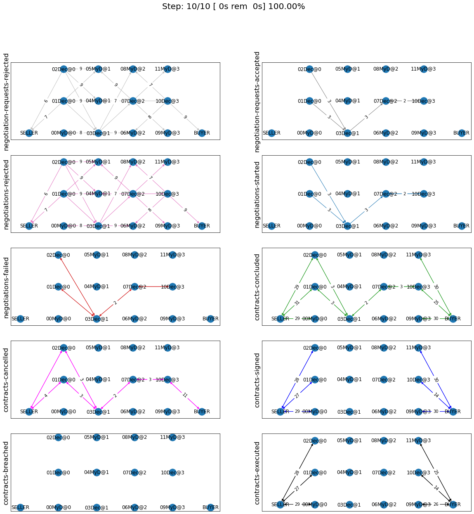
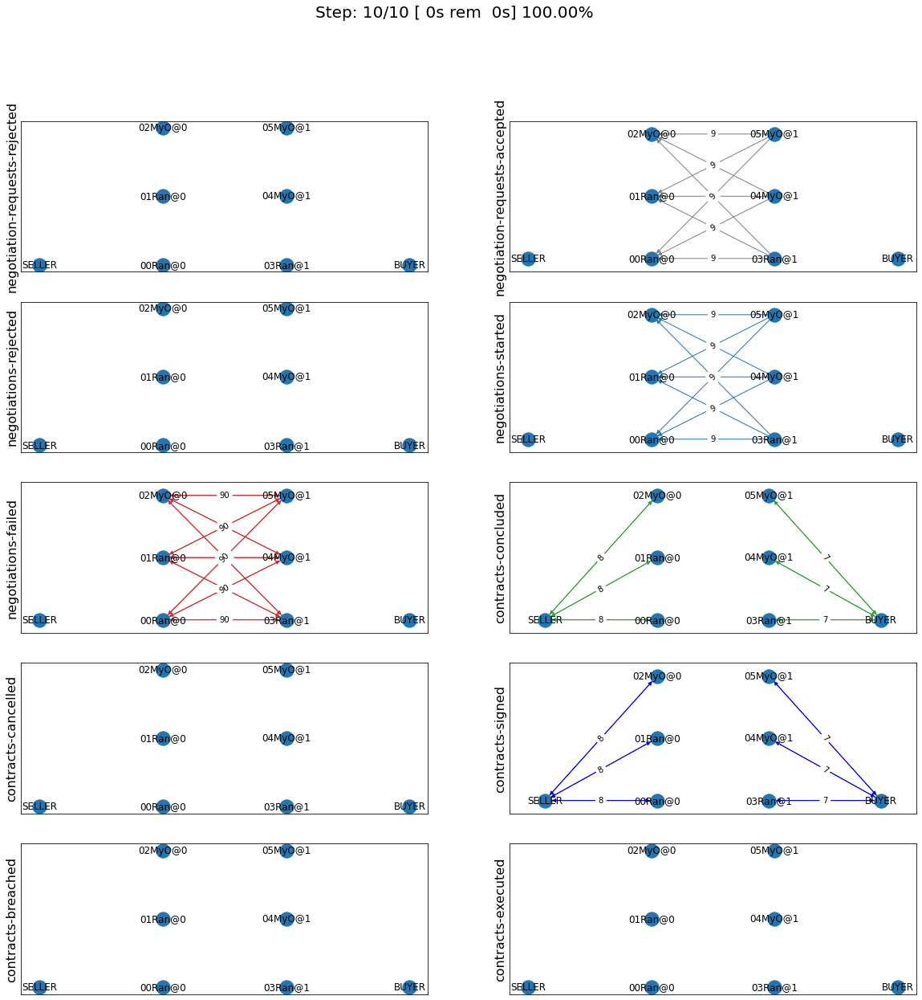
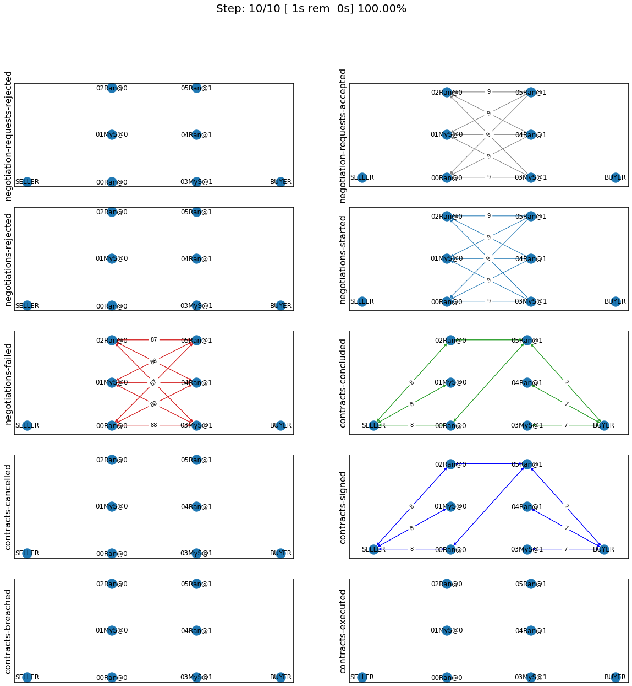
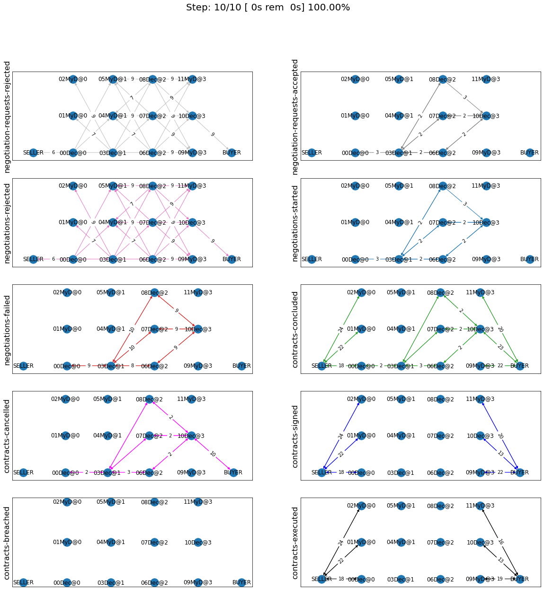
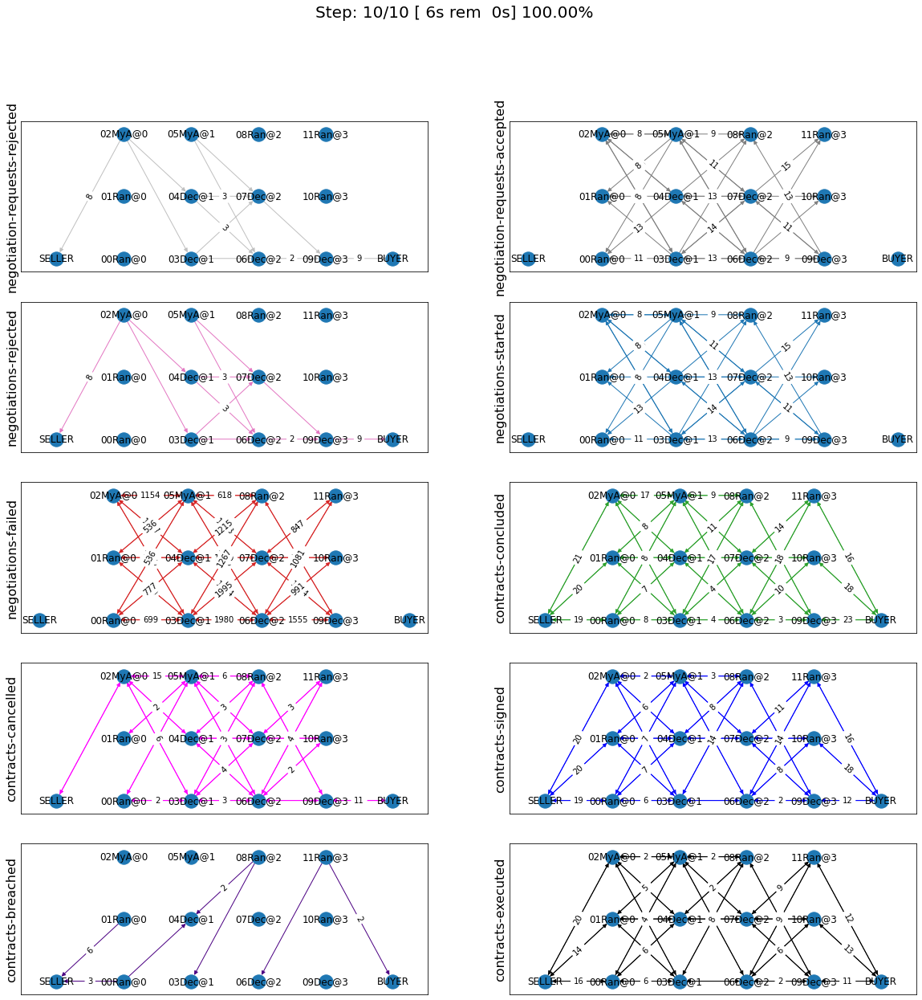
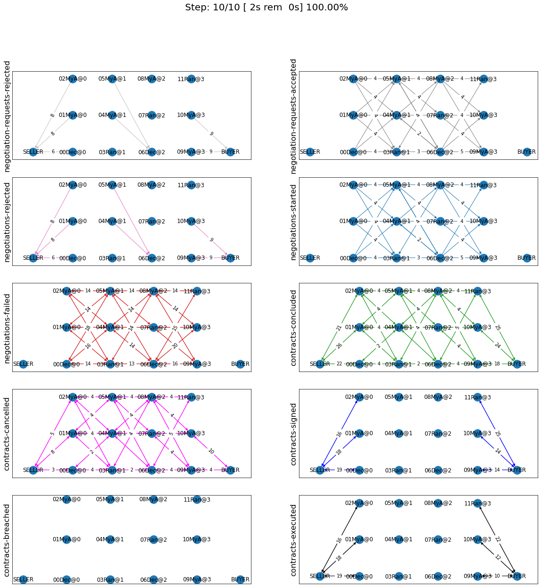
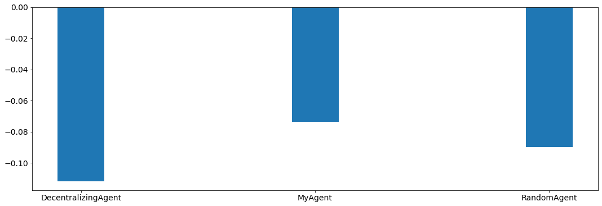
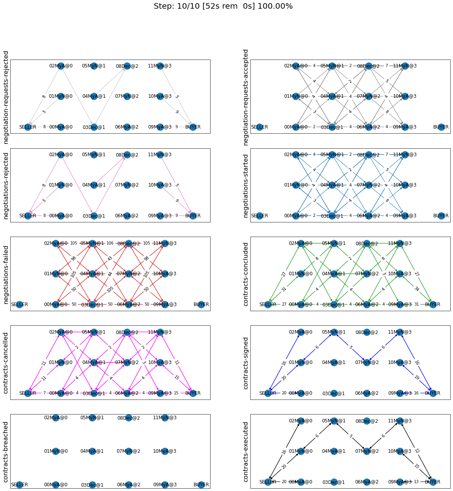

Developing an agent for SCML2021
--------------------------------

Let’s see the simplest possible agent (a do-nothing agent)

In 2021, we introduced a new track called SCML-OneShot which implements
a simplified problem in which the agent can focus on the many to many
concurrent negotiation problem without needing to worry about long term
planning or production planning as is the case with the standard and
collusion tracks.

.. code:: ipython3

    from scml.scml2020 import SCML2020Agent, SCML2021World, RandomAgent, DecentralizingAgent
    from scml.oneshot import SCML2020OneShotWorld, OneShotAgent, OneShotSyncAgent
    from scml.oneshot.builtin import RandomOneShotAgent, SyncRandomOneShotAgent
    ComparisonAgent = DecentralizingAgent
    OneShotComparisonAgent = RandomOneShotAgent

Let’s start by looking at the standard/collusion tracks. These two
tracks have only a minor change in the way agent score is evaluated
compared with SCML2020 which means that all agents developed for
SCML2020 will run with no change in SCML2021.

.. code:: ipython3

    class MyDoNothing(SCML2020Agent):
        """My Agent that does nothing"""

Now, let’s try to run a simulation with it

.. code:: ipython3

    world = SCML2021World(
        **SCML2021World.generate([ComparisonAgent, MyDoNothing], n_steps=10), 
        construct_graphs=True,
    )

Do Nothing Agent
~~~~~~~~~~~~~~~~

Let’s test this agent to confirm that it is really doing nothing

.. code:: ipython3

    world.run()

.. code:: ipython3

    world.draw(steps=(0, world.n_steps), together=False, ncols=2, figsize=(20, 20))
    plt.show()

You can see that our agent did not do anything in the world. It did
receive some negotiation requests which it rejected and it did not
engage in any negotiations.

what about a similar agent for the ``SCMLOneShotWorld``

.. code:: ipython3

    from negmas import ResponseType
    class MyOneShotDoNothing(OneShotAgent):
        """My Agent that does nothing"""
        def propose(self, negotiator_id, state):
            return None
        def respond(self, negotiator_id, state, offer):
            return ResponseType.END_NEGOTIATION
        
    world = SCML2020OneShotWorld(
        **SCML2020OneShotWorld.generate([OneShotComparisonAgent, MyOneShotDoNothing], n_steps=10), 
        construct_graphs=True,
    )
    world.run()
    
    world.draw(steps=(0, world.n_steps), together=False, ncols=2, figsize=(20, 20))
    plt.show()

One Shot Agent (Negotiation Focused)
------------------------------------

The two examples of the simplest possible agent in one-shot and standard
SCML reveal a couple of things. Firstly, there is no way to just
``do-nothing`` in the one-shot variant. Our agent here simply behaved
randomly (which is the same kind of behavior of ``RandomOneShotAgent``
and ``RandomSyncOneShotAgent``).

An overview of the one-shot game is available
`here <http://www.yasserm.com/scml/overview_oneshot.pdf>`__ and a full
description for the details-savy person is available
`here <http://www.yasserm.com/scml/scml2021oneshot.pdf>`__. We suggest
that you read (or skim) these documents before continuing.

A one-shot agent needs only to do negotiation. The simplest possible
version (``MyOneShotRandom`` above) just responds to offers from its
partners and proposes new offers to them.

Comparing the graphs of the two world simulations, we can see
immediately some differences

-  All negotiation requests are accepted. In fact in the one-shot game,
   the agent need not consider requesting negotiations or deciding the
   negotiation agenda as the system takes care of this ensuring that on
   every simulated day every agent is negotiating with its suppliers and
   or consumers about trade on that day (and only that day).
-  Contracts in the one-shot game are always executed (despite not
   showing that in the graph). There is no concept of a breach. Failure
   to honor contracts is instead penalized monetarily. Contracts are
   also never cancelled or nullified. This greatly simplifies the
   problem as the agent does not need to keep track of contract
   execution.
-  Production is too fast that it does not affect the agent reasoning.
   In the terminology to be presented in the following section, there is
   no need for an explicit production strategy.
-  There is no need to consider future negotiations while reasoning
   about a the current set of negotiations. This greatly simplifies
   agent design as there is no long-term planning. In the terminology to
   be presented in the following section, there is no need for a trading
   strategy

There are two base classes for one-shot agents (``OneShotAgent`` and
``OneShotSyncAgent``). We have already seen the ``OneShotAgent`` class
for which you need to override ``propose`` and may also override
``respond`` to handle negotiations independently. The ``propose`` method
receives the negotiation state (an object of the type ``SAOState``
including among other things the current negotiation step, relative
time, last offer, etc) and is required to return an ``Outcome`` (See
``negmas`` documentation) as an offer. The ``respond`` method receives a
negotiation state and an offer (``Outcome``) from the opponent and needs
to respond to it by a decision from the ``ResponseType`` enumeration
(``REJECT_OFFER``, ``ACCEPT_OFFER``, and ``END_NEGOTIATION``). Other
than these two negotiation related callbacks, the agent receives an
``init`` call just after it joins the simulatin and a ``step`` call
after each step. The agent is also informed about failure/success of
negotiations through the
``on_negotiation_success``/``on_negotiation_failure`` callbacks. That is
all. A one-shot agent needs to only think about what should it do to
respond to each of these six callbacks. All of these callbacks except
``propose`` are optional.

Given that the utility function of the agent is defined in terms of a
*complete set of contracts*, it is not trivial to define a utility
function for each negotiation independent from the others (which is why
this is an inherently concurrent negotiation world). It may be easier
then to think of all negotiations in a synchronized manner. This means
that the agent keeps collecting offers from its partners and when it has
a *complete set*, it responds to all of them. Moreover, to start
negotiations in which the agent finds itself the first propsoer, it
needs to define a first proposal for each negotiation. This is whay
``OneShotSyncAgent`` allows you to do.

Here is an example of writing the do-nothing agent in this form:

.. code:: ipython3

    from negmas import SAOResponse
    class MySyncOneShotDoNothing(OneShotSyncAgent):
        """My Agent that does nothing"""
        def counter_all(self, offers, states):
            return dict(zip(self.negotiators.keys(), [SAOResponse(ResponseType.END_NEGOTIATION, None)] * len(self.negotiators)))
        def first_proposals(self):
            return dict(zip(self.negotiators.keys(), [None] * len(self.negotiators)))
        
    world = SCML2020OneShotWorld(
        **SCML2020OneShotWorld.generate([OneShotComparisonAgent, MySyncOneShotDoNothing], n_steps=10), 
        construct_graphs=True,
    )
    world.run()
    
    world.draw(steps=(0, world.n_steps), together=False, ncols=2, figsize=(20, 20))
    plt.show()

As you can see, in this case, we need to override ``counter_all`` to
counter offers received from *all* the partners and ``first_proposals``
to decide a first offer for *each* partner. Notice that this is a
many-to-many negotiation scenario. This means that if multiple agents at
every level are using sync variants, loops may happen with the
possiblity of a deadlock. For that reason the system will randomly break
such loops when they happen which implies that **``counter_all`` may
receive a subset of the offers from partners not all of them**. In the
worst case, ``counter_all`` may receive just one offer each time from
one of the partners losing all synchronity between responses.

Other than these two negotiation related callbacks, the agent receives
an ``init`` call just after it joins the simulatin and a ``step`` call
after each step. The agent is also informed about failure/success of
negotiations through the
``on_negotiation_success``/``on_negotiation_failure`` callbacks. That is
all. A one-shot agent needs to only think about what should it do to
respond to each of these six callbacks. All of these callbacks except
``counter_all`` and ``first_proposals`` are optional.

Standard/Collusion Agent (Negotiation + Planning)
-------------------------------------------------

The full SCML game (standard and collusion leagues) combines negotiation
with planning. Here the agent needs to consider long-term trading
strategy, production strategy in addition to its negotiation strategy.
Because negotiations can be about arbitrary times in the future and
there is overlap between negotiation and contract execution with the
possibility of contract cancellation, nulification, and agent
bankruptcy, this is a more reaslistic, albeit much more complex, game
compared with the one-shot version we just saw. Please refer to the game
overview `here <http://www.yasserm.com/scml/overview.pdf>`__ and the
full game description
`here <http://www.yasserm.com/scml/scml2021.pdf>`__.

Agent Anatomy
~~~~~~~~~~~~~

For an agent to be successul in the SCML world, it needs to buy input
materials through negotiation, manufacture them, then sell output
products through negotiation. In this tutorial we structure our agent as
a combination of three main strategies/components:

1. **Trading Strategy**: Deciding the quantity (and price) to buy and
   sell at every time-step. This component can employ two subcomponents:

-  a pre-negotiation component that decides the quantities/prices to
   negotaite about based on prediction of future market behavior
   (**trade prediction strategy**) and partner behavior (**partner
   beahvior prediction strategy**)
-  a post-negotiation component that decides what agreements to sign as
   contracts (**signing strategy**).

2. **Negotiation Control Strategy**: This component is responsible for
   proactively request negotiations, responding to negotiation requests
   and actually conducting concurrent negotaitions. This component can
   further be divided into two subcomponents:

-  a pre negotiation component that decides which negotiations to accept
   and which to engage in (**negotiation manager**)
-  The **negotiation algorithm** used to carry out the negotiations
   decided by the negotiation manger.

3. **Production Strategy**: Decides what to produce at every time-step.

You are free to organize your agent in a different way but - for the
purposes of this tutorial - we will stick with this organization.

The SCML platform provides several components that can be used to
implement each of these strategies.

Strategies
^^^^^^^^^^

SCML uses collaborative inheritance for composing agents by combining
components implement the strategies mentioned above.

Each one of those components can implement any of the methods/callbacks
provided in the SCMLAgent class and use the AWI to do so as a
representative of the agent. All of them call the ``super`` version of
any method they override to make sure that all othe components get
executed.

Components also reveal some useful members to other components and the
main agent either as data-members, methods, or properties. Let’s see an
example

.. code:: ipython3

    from IPython.display import HTML
    HTML('')

.. raw:: html

    

.. code:: ipython3

    import scml
    print(scml.scml2020.components.TradingStrategy.__doc__)

.. parsed-literal::

    Base class for all trading strategies.
    
        Provides:
            - `inputs_needed` (np.ndarray):  How many items of the input product do
              I need to buy at every time step (n_steps vector)
            - `outputs_needed` (np.ndarray):  How many items of the output product
              do I need to sell at every time step (n_steps vector)
            - `inputs_secured` (np.ndarray):  How many items of the input product I
              already contracted to buy (n_steps vector)
            - `outputs_secured` (np.ndarray):  How many units of the output product
              I already contracted to sell (n_steps vector)
    
        Hooks Into:
            - `init`
            - `internal_state`
    
        Remarks:
            - `Attributes` section describes the attributes that can be used to construct the component (passed to its
              `__init__` method).
            - `Provides` section describes the attributes (methods, properties, data-members) made available by this
              component directly. Note that everything provided by the bases of this components are also available to the
              agent (Check the `Bases` section above for all the bases of this component).
            - `Requires` section describes any requirements from the agent using this component. It defines a set of methods
              or properties/data-members that must exist in the agent that uses this component. These requirement are
              usually implemented as abstract methods in the component
            - `Abstract` section describes abstract methods that MUST be implemented by any descendant of this component.
            - `Hooks Into` section describes the methods this component overrides calling `super` () which allows other
              components to hook into the same method (by overriding it). Usually callbacks starting with `on_` are
              hooked into this way.
            - `Overrides` section describes the methods this component overrides without calling `super` effectively
              disallowing any other components after it in the MRO to call this method. Usually methods that do some
              action (i.e. not starting with `on_`) are overridden this way.
        

The docstring above describes the six possible sections in each
component’s docstring which define how is it to be constructed
(attributes), what it provides to other components (provides), what it
assumes about the agent (requires), what abstract methods must be
overriden by any subclass of it (abstract), which callbacks of the agent
does it hook-into while allowing other components to run and which does
it completely override (preventing components after it in the MRO from
running).

**To successfully use components to construct your agent, you need to
remember to always call the ``super`` version of every method you
overrided in your agent class to allow all components to run except if
you want to completey override the behavior of all components that use
this callback.**. As a rule of thump, callbacks that start with “on\_”,
“init”, and “step” should call super, the rest should not. For a clear
explanation of the use of ``super`` refer to `Hettinger’s
post <https://rhettinger.wordpress.com/2011/05/26/super-considered-super/>`__.

Production Strategy
^^^^^^^^^^^^^^^^^^^

Let’s start with what may be the simplest of the aforementioned
components: the production strategy. What should an agent produce? There
are three main limitations on the answer to this question:

1. Production capacity which is controlled by the number of lines the
   agent has

      self.awi.n_lines

2. The available quantity of the input material

      self.awi.current_inventory(self.awi.my_input_product)

3. The *needed* quantity of outputs. That depends on how many sell
   contracts the agent already have (you may also consider future sell
   contracts that it expects to have).

The platform provides three basic strategies for production:
SupplyDriven producing based on buy-contracts, DemandDriven producing
based on sell-contracts and ContracDriven producing based on both.

Let’s add a demand-driven strategy to our agent. This means that our
agent will only produce based on the contracts it actually signs.

.. code:: ipython3

    from scml.scml2020.components.production import DemandDrivenProductionStrategy, ProductionStrategy
    class MyAgent(DemandDrivenProductionStrategy):
        """My agent"""

As you can see, using this strategy and all other components provided by
the SCML platform amounts to just inheriting from it. You have to
remember when using any of these strategies to call ``super().f``
whenever you implement any of the methods in ``SCML2020Agent`` in your
agent to allow the components you are using to do their thing.

It is instructive to see how does this strategy work. This is its
complete code (with type-hints and the docstring removed):

.. code:: ipython3

    class DemandDrivenProductionStrategy(ProductionStrategy):
        def on_contracts_finalized(self, signed, cancelled, rejectors):
            super().on_contracts_finalized(signed, cancelled, rejectors)
            for contract in signed:
                is_seller = contract.annotation["seller"] == self.id
                # do nothing if this is not a sell contract
                if not is_seller:
                    continue
                step = contract.agreement["time"]
                # find the earliest time I can do anything about this contract
                earliest_production = self.awi.current_step
                if step > self.awi.n_steps - 1 or step < earliest_production:
                    continue
                # Schedule production before the delivery time
                output_product = contract.annotation["product"]
                input_product = output_product - 1
                steps, _ = self.awi.schedule_production(
                    process=input_product,
                    repeats=contract.agreement["quantity"],
                    step=(earliest_production, step - 1),
                    line=-1,
                    partial_ok=True,
                )
                # set the schedule_range which is provided for other components 
                self.schedule_range[contract.id] = (
                    min(steps) if len(steps) > 0 else -1,
                    max(steps) if len(steps) > 0 else -1,
                    is_seller,
                )
                # that is all folks

This component works by implementing both ``confirm_production`` and
``on_contracts_finalized``.

-  The main work happens in ``on_contracts_finalized``. For each signed
   contract, the agent schedules as much production as possible to
   produce the required quantity before the time it is needed at.
-  ``confirm_production`` simply confirms everything because it assumes
   that the agent already scheduled correctly. Notice that despite not
   needing to get the output of the call of ``super``, it is already
   called to allow other components overriding this method to work
   properly.

Now let’s test our agent with its new production strategy.

.. code:: ipython3

    world = SCML2021World(
        **SCML2021World.generate([ComparisonAgent, MyDoNothing], n_steps=10), 
        construct_graphs=True,
    )
    world.run()
    world.draw(steps=(0, world.n_steps), together=False, ncols=2, figsize=(20, 20))
    plt.show()

As expected nothing happens. Our agent is still outside the market
because it does not negotiate. We need to add the other two strategies
(trading and negotiation control strategies) to get it going.

Trading Strategy
^^^^^^^^^^^^^^^^

The second component of our agent, we will implement is the trading
strategy.

Trading strategies provide the following four data-members to the agent
which can be used by other components:

-  inputs_needed (np.ndarray): How many items of the input product do I
   need at every time step (n_steps vector)
-  outputs_needed (np.ndarray): How many items of the output product do
   I need at every time step (n_steps vector)
-  inputs_secured (np.ndarray): How many items of the output product do
   I need at every time step (n_steps vector)
-  inputs_needed (np.ndarray): How many units of the output product I
   have already secured per step (n_steps vector)

There are two built-in trading strategies provided:

1. ``NoTradingStrategy`` Simply sign any contracts that can in principle
   be satisifed given the production capacity (i.e. n. lines) of the
   factory. Other than that there is no strategy. This strategy is not
   expected to work well but is useful as a baseline.
2. ``PredictionBasedTradingStrategy`` This strategy use a trade
   prediction strategy internally to predict how many inputs are
   expected to be available and how many outputs are expected to be sold
   by the agent at every time-step. Given these two quantities, it
   maintains the amounts of inputs/outputs that it needs. It then
   employs a controller to manage negotiations and update the amounts
   secured.

Let’s use the ``PredictionBasedTradingStrategy`` for our agent.

.. code:: ipython3

    from scml.scml2020.components.production import DemandDrivenProductionStrategy
    from scml.scml2020.components.trading import PredictionBasedTradingStrategy
    class MyAgent(PredictionBasedTradingStrategy, DemandDrivenProductionStrategy, SCML2020Agent):
        """My agent"""

.. code:: ipython3

    world = SCML2021World(
        **SCML2021World.generate([ComparisonAgent, MyAgent], n_steps=10), 
        construct_graphs=True
    )
    world.run_with_progress()
    world.draw(steps=(0, world.n_steps), together=False, ncols=2, figsize=(20, 20))
    plt.show()

.. parsed-literal::

    100%|██████████| 10/10 [00:00<00:00, 21.91it/s]

The last piece of the buzzle to complete our agent is to add a
negotiation control strategy. We will start by reusing one of the
existing strategies then develop our own.

Negotiation Control Strategy
^^^^^^^^^^^^^^^^^^^^^^^^^^^^

Let’s first try to just reuse one of the existing negotiation strategies
to see how it works.

.. code:: ipython3

    from scml.scml2020.components.negotiation import IndependentNegotiationsManager
    class MyAgent(IndependentNegotiationsManager, PredictionBasedTradingStrategy, DemandDrivenProductionStrategy, SCML2020Agent):
        pass

.. code:: ipython3

    world = SCML2021World(
        **SCML2021World.generate([ComparisonAgent, MyAgent], n_steps=10), 
        construct_graphs=True
    )
    try:
        world.run()
    except ValueError as e:
        print(e)

.. parsed-literal::

    You must implement target_quantity

What the system is telling us is that we forgot to implement the method
``targe_quantity`` . Consulting the documentation we find that we must
implement two methods to use any negotiation control strategy:

1. ``target_quantity`` which gives the quantity that the negotiators
   should targe to achieve for any given time step (selling and buying)
2. ``acceptable_unit_price`` The maximum acceptable unit price for
   buying and the minimum acceptable unit price for selling

Moreover, the independent negotiation strategy requires us to implement
a utility function that should work for any negotiation.

Let’s add a simple implementation of both

.. code:: ipython3

    from negmas import LinearUtilityFunction
    class MyAgent(IndependentNegotiationsManager, PredictionBasedTradingStrategy
                  , DemandDrivenProductionStrategy, SCML2020Agent):
        def target_quantity(self, step: int, sell: bool) -> int:
            """A fixed target quantity of half my production capacity"""
            return self.awi.n_lines // 2
            
        def acceptable_unit_price(self, step: int, sell: bool) -> int:
            """The catalog price seems OK"""
            return self.awi.catalog_prices[self.awi.my_output_product] if sell else self.awi.catalog_prices[self.awi.my_input_product]
        
        def create_ufun(self, is_seller: bool, issues=None, outcomes=None):
            """A utility function that penalizes high cost and late delivery for buying and and awards them for selling"""
            if is_seller:
                return LinearUtilityFunction((0, 0.25, 1))
            return LinearUtilityFunction((0, -0.5, -0.8))

.. code:: ipython3

    world = SCML2021World(
        **SCML2021World.generate([ComparisonAgent, MyAgent, RandomAgent], n_steps=10), 
        construct_graphs=True
    )
    world.run_with_progress()
    
    world.draw(steps=(0, world.n_steps), together=False, ncols=2, figsize=(20, 20))
    plt.show()
    

.. parsed-literal::

    100%|██████████| 10/10 [00:01<00:00,  6.55it/s]

Our agent is now doing things in the market. It buys and sells and
commits breaches. How well is it doing? Let’s see how did our agents do

.. code:: ipython3

    from collections import defaultdict
    def show_agent_scores(world):
        scores = defaultdict(list)
        for aid, score in world.scores().items():
            scores[world.agents[aid].__class__.__name__.split(".")[-1]].append(score)
        scores = {k: sum(v)/len(v) for k, v in scores.items()}
        plt.bar(list(scores.keys()), list(scores.values()), width=0.2)
        plt.show()
    show_agent_scores(world)

Not as good as the comparison agent :-( yet better than random :-)

But what did we expect with almost zero code.

Creating our own negotiation control strategy
~~~~~~~~~~~~~~~~~~~~~~~~~~~~~~~~~~~~~~~~~~~~~

Let’s create a new negotiation control strategy and use it to replace
the ``IndependentNegotiationsManager`` we used in our last attempt.

To start, we need to know what is expected from our component.

We know that the trading strategy provides us with the following four
data-members and we leave for it the responsibility of updating them
correctly:

-  inputs_needed (np.ndarray): How many items of the input product do I
   need at every time step (n_steps vector)
-  outputs_needed (np.ndarray): How many items of the output product do
   I need at every time step (n_steps vector)
-  inputs_secured (np.ndarray): How many items of the output product do
   I need at every time step (n_steps vector)
-  inputs_needed (np.ndarray): How many units of the output product I
   have already secured per step (n_steps vector)

What we need from our negotiation control strategy is to find *the best*
or at least *a good* way to satisfy these needs.

One way to do that is to have a ``Controller`` agent for selling and
buying responsible of satisfying the *exact* needs at every time-step.
NegMAS provides an easy to use controller that fits the bill called
``SAOSyncController``

.. code:: ipython3

    from negmas import SAOSyncController
    print(SAOSyncController.__doc__)

.. parsed-literal::

    
        A controller that can manage multiple negotiators synchronously.
    
        Remarks:
            - The controller waits for an offer from each one of its negotiators before deciding what to do.
            - Loops may happen if multiple controllers of this type negotiate with each other. For example controller A
              is negotiating with B, C, while B is also negotiating with C. These loops are broken by the `SAOMechanism`
              by **forcing** some controllers to respond before they have all of the offers. In this case, `counter_all`
              will receive offers from one or more negotiators but not all of them.
    
        

Let’s create our controller and see what do we need. The main idea here
is that the controller will define a utility function for any possible
outcome. It will then collect offers from all partners and responds in
this way:

-  If the best offer is invalid, reject everything and offer the best
   offer you can in every negotiation
-  If the best offer is good enough (i.e. within some threshold of the
   best possible utility on that given negotiation) accept it
-  Otherwise, send the best offer to everyone else and try to further
   improve this offer until near the end of the negotiation

This is a straight forward implementation of this idea

.. code:: ipython3

    from scml.scml2020 import TIME, QUANTITY, UNIT_PRICE
    from negmas import ResponseType, outcome_is_valid, UtilityFunction
    from negmas.sao import SAOResponse
    from typing import List, Dict, Optional, Tuple, Any
    
    class ControllerUFun(UtilityFunction):
        """A utility function for the controller"""
        def __init__(self, controller=None):
            super().__init__(outcome_type=tuple)
            self.controller = controller
    
        def eval(self, offer: "Outcome"):
            return self.controller.utility(offer)
    
        def xml(self, issues):
            pass
    
    
    class SyncController(SAOSyncController):
        """
        Will try to get the best deal which is defined as being nearest to the agent
        needs and with lowest price.
    
        Args:
            is_seller: Are we trying to sell (or to buy)?
            parent: The agent from which we will access `needed` and `secured` arrays
            price_weight: The importance of price in utility calculation
            utility_threshold: Accept anything with a relative utility above that
            time_threshold: Accept anything with a positive utility when we are that close
                            to the end of the negotiation
        """
    
        def __init__(
            self,
            *args,
            is_seller: bool,
            parent: "PredictionBasedTradingStrategy",
            price_weight=0.7,
            utility_threshold=0.9,
            time_threshold=0.9,
            **kwargs,
        ):
            super().__init__(*args, **kwargs)
            self._is_seller = is_seller
            self.__parent = parent
            self._time_threshold = time_threshold
            self._price_weight = price_weight
            self._utility_threshold = utility_threshold
            self.utility_function = ControllerUFun(controller=self)
    
        def utility(self, offer: "Outcome") -> float:
            """A simple utility function
    
            Remarks:
                 - If the time is invalid or there is no need to get any more agreements
                   at the given time, return -1000
                 - Otherwise use the price-weight to calculate a linear combination of
                   the price and the how much of the needs is satisfied by this contract
    
            """
    
            # get my needs and secured amounts arrays
            if self._is_seller:
                _needed, _secured = (
                    self.__parent.outputs_needed,
                    self.__parent.outputs_secured,
                )
            else:
                _needed, _secured = (
                    self.__parent.inputs_needed,
                    self.__parent.inputs_secured,
                )
    
            # invalide offers have no utility
            if offer is None:
                return -1000
    
            # offers for contracts that can never be executed have no utility
            t = offer[TIME]
            if t < self.__parent.awi.current_step or t > self.__parent.awi.n_steps - 1:
                return -1000.0
    
            # offers that exceed my needs have no utility (that can be improved)
            q = _needed[offer[TIME]] - (offer[QUANTITY] + _secured[t])
            if q < 0:
                return -1000.0
    
            # The utility of any offer is a linear combination of its price and how
            # much it satisfy my needs
            price = offer[UNIT_PRICE] if self._is_seller else -offer[UNIT_PRICE]
            return self._price_weight * price + (1 - self._price_weight) * q
    
        def is_valid(self, negotiator_id: str, offer: "Outcome") -> bool:
            """Is this a valid offer for that negotiation"""
            issues = self.negotiators[negotiator_id][0].ami.issues
            return outcome_is_valid(offer, issues)
    
        def counter_all(
            self, offers: Dict[str, "Outcome"], states: Dict[str, "SAOState"]
        ) -> Dict[str, "SAOResponse"]:
            """Calculate a response to all offers from all negotiators (negotiator ID is the key).
    
            Args:
                offers: Maps negotiator IDs to offers
                states: Maps negotiator IDs to offers AT the time the offers were made.
    
            Remarks:
                - The response type CANNOT be WAIT.
    
            """
    
            # find the best offer
            negotiator_ids = list(offers.keys())
            utils = np.array([self.utility(o) for o in offers.values()])
    
            best_index = int(np.argmax(utils))
            best_utility = utils[best_index]
            best_partner = negotiator_ids[best_index]
            best_offer = offers[best_partner]
    
            # find my best proposal for each negotiation
            best_proposals = self.first_proposals()
    
            # if the best offer is still so bad just reject everything
            if best_utility < 0:
                return {
                    k: SAOResponse(ResponseType.REJECT_OFFER, best_proposals[k])
                    for k in offers.keys()
                }
    
            relative_time = min(_.relative_time for _ in states.values())
    
            # if this is good enough or the negotiation is about to end accept the best offer
            if (
                best_utility
                >= self._utility_threshold * self.utility(best_proposals[best_partner])
                or relative_time > self._time_threshold
            ):
                responses = {
                    k: SAOResponse(
                        ResponseType.REJECT_OFFER,
                        best_offer if self.is_valid(k, best_offer) else best_proposals[k],
                    )
                    for k in offers.keys()
                }
                responses[best_partner] = SAOResponse(ResponseType.ACCEPT_OFFER, None)
                return responses
    
            # send the best offer to everyone else and try to improve it
            responses = {
                k: SAOResponse(
                    ResponseType.REJECT_OFFER,
                    best_offer if self.is_valid(k, best_offer) else best_proposals[k],
                )
                for k in offers.keys()
            }
            responses[best_partner] = SAOResponse(
                ResponseType.REJECT_OFFER, best_proposals[best_partner]
            )
            return responses
    
        def on_negotiation_end(self, negotiator_id: str, state: "MechanismState") -> None:
            """Update the secured quantities whenever a negotiation ends"""
            if state.agreement is None:
                return
    
            q, t = state.agreement[QUANTITY], state.agreement[TIME]
            if self._is_seller:
                self.__parent.outputs_secured[t] += q
            else:
                self.__parent.inputs_secured[t] += q
    

Let’s understand exactly what is this controller doing. In NegMAS, a
``Controller`` is a class that manages multiple negotiations. Usually
these negotiations run independently and there is no central point to
collect offers from them. A special type of controller is the
``SAOSyncController`` which synchronizes the process of offering and
responding to offers. Any ``SAOSyncController`` needs two things:

1. *ufun* It needs to have a utility function (inherited from
   ``negmas.UtilityFunction`` that will be used by the
   ``SAOSyncController`` to find the first proposal to offer in each
   negotiation.
2. *counter_all* which receives offers from all the negotiations under
   the control of this controller and have to respond to each one of
   them by either accepting it, rejecting it and countering or ending
   the negotiation. When loops form among controllers, the system breaks
   them by having *counter_all* being called with a subset of the
   negotiations.

Our controller defines a utility function which is a linear combination
of the price and difference between the quantity and the agent’s needs
at the delivery time.

The most interesting part of the controller is the ``counter_all``
method. The gist of this method is finding the best offer among the set
currently received. If the negotiation is about to end or this offer has
a utility above some threshold it is accepted, otherwise, it is sent to
all other negotiators as our new offer while sending to the partner who
gave that best offer the offer with maximum utility.

The next step is to use this controller in our negotiation strategy.

Our negotiation control strategy will work as follows:

1. It will instantiate two ``SyncController`` objects one for selling
   and one for buying.
2. It will start negotiations to satisfy the needs that it gets from the
   trading strategy using these controllers every simulation step.

.. code:: ipython3

    class MyNegotiationManager:
        """My negotiation strategy
    
        Args:
            price_weight: The relative importance of price in the utility calculation.
            utility_threshold: The fraction of maximum utility above which all offers will be accepted.
            time_threshold: The fraction of the negotiation time after which any valid offers will be accepted.
            time_range: The time-range for each controller as a fraction of the number of simulation steps
        """
    
        def __init__(
            self,
            *args,
            price_weight=0.7,
            utility_threshold=0.9,
            time_threshold=0.9,
            time_horizon=0.1,
            **kwargs,
        ):
            super().__init__(*args, **kwargs)
            self.index: List[int] = None
            self.time_horizon = time_horizon
            self._time_threshold = time_threshold
            self._price_weight = price_weight
            self._utility_threshold = utility_threshold
            self.controllers: Dict[bool, SyncController] = {
                False: SyncController(
                    is_seller=False,
                    parent=self,
                    price_weight=self._price_weight,
                    time_threshold=self._time_threshold,
                    utility_threshold=self._utility_threshold,
                ),
                True: SyncController(
                    is_seller=True,
                    parent=self,
                    price_weight=self._price_weight,
                    time_threshold=self._time_threshold,
                    utility_threshold=self._utility_threshold,
                ),
            }
            self._current_end = -1
            self._current_start = -1
    
        def step(self):
            super().step()
            
            # find the range of steps about which we plan to negotiate
            step = self.awi.current_step
            self._current_start = step + 1
            self._current_end = min(
                self.awi.n_steps - 1,
                self._current_start + max(1, int(self.time_horizon * self.awi.n_steps)),
            )
            if self._current_start >= self._current_end:
                return
            
            for seller, needed, secured, product in [
                (False, self.inputs_needed, self.inputs_secured, self.awi.my_input_product),
                (
                    True,
                    self.outputs_needed,
                    self.outputs_secured,
                    self.awi.my_output_product,
                ),
            ]:
                # find the maximum amount needed at any time-step in the given range
                needs = np.max(
                    needed[self._current_start : self._current_end]
                    - secured[self._current_start : self._current_end]
                )
                if needs < 1:
                    continue
                
                # set a range of prices
                if seller:
                    # for selling set a price that is at least the catalog price
                    min_price = self.awi.catalog_prices[product]
                    price_range = (min_price, 2 * min_price)
                else:
                    # for buying sell a price that is at most the catalog price
                    price_range = (0, self.awi.catalog_prices[product])
                self.awi.request_negotiations(
                    not seller,
                    product,
                    (1, needs),
                    price_range,
                    time=(self._current_start, self._current_end),
                    controller=self.controllers[seller],
                )
    
        def respond_to_negotiation_request(
            self,
            initiator: str,
            issues: List["Issue"],
            annotation: Dict[str, Any],
            mechanism: "AgentMechanismInterface",
        ) -> Optional["Negotiator"]:
            # refuse to negotiate if the time-range does not intersect
            # the current range
            if not (
                issues[TIME].min_value < self._current_end
                or issues[TIME].max_value > self._current_start
            ):
                return None
            controller = self.controllers[self.id == annotation["seller"]]
            if controller is None:
                return None
            return controller.create_negotiator()

We can now replace the built-in negotiation manager in our agent with
our new negotiation manager.

.. code:: ipython3

    class MyNewAgent(MyNegotiationManager, PredictionBasedTradingStrategy, 
                  DemandDrivenProductionStrategy, SCML2020Agent):
        pass

Let’s see how did our simple new agent do:

.. code:: ipython3

    world = SCML2021World(
        **SCML2021World.generate([ComparisonAgent, MyAgent, MyNewAgent], n_steps=10), 
        construct_graphs=True
    )
    world.run_with_progress()
    
    world.draw(steps=(0, world.n_steps), together=False, ncols=2, figsize=(20, 20))
    plt.show()
    

.. parsed-literal::

    100%|██████████| 10/10 [00:51<00:00,  5.20s/it]

.. code:: ipython3

    show_agent_scores(world)

.. image:: 02.develop_agent_scml2020_files/02.develop_agent_scml2020_48_0.png

Let’s dig a little deeper and try to understand one of the reasons that
``MyNewAgent`` is outperforming ``MyAgent``. We will focus on the
average prices they get from their negotiations.

.. code:: ipython3

    from scml.scml2020 import is_system_agent
    
    def analyze_unit_price(world, agent_type):
        """Returns the average price relative to the negotiation issues"""
        contracts = pd.DataFrame(world.saved_contracts)
        fields = ["seller_type", "buyer_type", "unit_price", "issues", "selling", "buying"]
        # Add fields indicating whether the agent_type is a seller or a buyer
        contracts["selling"] = contracts.seller_type == agent_type
        contracts["buying"] = contracts.buyer_type == agent_type
        # keep only contracts in which agent_type is participating
        contracts = contracts.loc[contracts.selling | contracts.buying, fields]
        # remove all exogenous contracts
        contracts = contracts.loc[contracts.issues.apply(len) > 0, fields]
        # find the minimum and maximum unit price in the negotiation issues
        min_vals = contracts.issues.apply(lambda x: x[UNIT_PRICE].min_value)
        max_vals = contracts.issues.apply(lambda x: x[UNIT_PRICE].max_value)
        # replace the unit price with its fraction of the unit-price issue range
        contracts.unit_price = (contracts.unit_price- min_vals) / (max_vals-min_vals)
        contracts = contracts.drop("issues", 1)    
        contracts = contracts.rename(columns=dict(unit_price="price"))
        # group results by whether the agent is selling/buying/both
        if len(contracts)<1:
            return ""
        return contracts.groupby(["selling", "buying"]).describe().round(1)
    
    print("MyNewAgent:\n===========")
    print(analyze_unit_price(world, "MyNewAgent"))
    print("\nMyAgent:\n========")
    print(analyze_unit_price(world, "MyAgent"))
    print("\nDecentralizingAgent:\n====================")
    print(analyze_unit_price(world, "DecentralizingAgent"))

.. parsed-literal::

    MyNewAgent:
    ===========
                   price                                   
                   count mean  std  min  25%  50%  75%  max
    selling buying                                         
    False   True     6.0  0.8  0.2  0.4  0.7  0.9  1.0  1.0
    True    True    24.0  0.0  0.0  0.0  0.0  0.0  0.0  0.0
    
    MyAgent:
    ========
                   price                                   
                   count mean  std  min  25%  50%  75%  max
    selling buying                                         
    False   True    12.0  0.5  0.0  0.5  0.5  0.5  0.5  0.5
    True    False   11.0  0.7  0.3  0.4  0.5  0.8  1.0  1.0
            True    20.0  0.5  0.0  0.5  0.5  0.5  0.5  0.6
    
    DecentralizingAgent:
    ====================
                   price                                   
                   count mean  std  min  25%  50%  75%  max
    selling buying                                         
    False   True     7.0  0.7  0.3  0.5  0.5  0.5  1.0  1.0
    True    False   14.0  0.5  0.1  0.5  0.5  0.5  0.5  1.0
            True     1.0  1.0  NaN  1.0  1.0  1.0  1.0  1.0

We can see that the new strategy gets lower average prices when buying
and higher average prices when selling. That may partially explain its
relative superiority compared with ``MyAgent``. It is doing a better job
in this compared with the built-in ``DecentralizingAgent`` as well.
Nevertheless, ``DecentralizingAgent`` is getting better results. That
may have something to do with quantities relative to needs. Try
analyzing this aspect to get a deeper understanding of how should your
negotiation strategy manage multiple negotiations.

Changing the negotiation strategy
~~~~~~~~~~~~~~~~~~~~~~~~~~~~~~~~~

The negotiation strategy used by our agent has several flows but one of
them is almost fatal. When negotiating with other agents of its own
type, It will most likely lead to agreements at the boundaries of the
issue space that have low utility for one of the negotiators and which
one is almost random. Can you see why?

Let’s try to run our new agent against itself.

.. code:: ipython3

    world = SCML2021World(
        **SCML2021World.generate([MyNewAgent], n_steps=10), 
        construct_graphs=True
    )
    world.run_with_progress()
    print("MyNewAgent:\n===========")
    print(analyze_unit_price(world, "MyNewAgent"))

.. parsed-literal::

    100%|██████████| 10/10 [06:16<00:00, 37.67s/it]

.. parsed-literal::

    MyNewAgent:
    ===========
                   price                                   
                   count mean  std  min  25%  50%  75%  max
    selling buying                                         
    True    True    82.0  0.0  0.0  0.0  0.0  0.0  0.0  0.0

.. parsed-literal::

    

Notice how *all* agreements are on limits of the unit_price issue. If
you investigate the other two issues, you will notice the same pattern.
why?

Consider two of our agent negotiating together. Let’s say that the buyer
requested the negotiation (in its ``step()`` method). The relevant
request code is repeated here:

.. code:: python

       if seller:
           min_price = self.awi.catalog_prices[product]
           price_range = (min_price, 2 * min_price)
       else:
           price_range = (0, self.awi.catalog_prices[product])
       self.awi.request_negotiations(
           not seller,
           product,
           (1, needs),
           price_range,
           time=(self._current_start, self._current_end),
           controller=self.controllers[seller],
       )

which will lead to a price range of (0, :math:`x`) where :math:`x` is
the catalog price of the product. The quantity will be in the range (1,
:math:`q`) where :math:`q` is the needs of the buyer.

What will happen is that our buyer will keep offering zero price (as
this is its best price) and our seller will keep offering :math:`x`.
None of them will find this satisfactory (i.e. leading to a utility less
than the ``utility_threshold``) but in the last negotiation step, the
agent that happens to be last will just have to accept the offer (if it
has any positive utility). This means that we will get either :math:`0`
or :math:`x` as the agreed upon price.

Let’s try to improve that a little bit. We will use another type of
controller provided by NegMAS (for a tutorial on different controllers
types available in negmas check `this <https://youtu.be/10Rjl3ikaDU>`__
video). The ``SAOMetaNegotiatorController`` provides a way to use a
signle negotiation strategy in multiple concurrent negotiations which
seems like what we need here. We will use it with the default time-based
negotiation strategy.

Another issue with our negotiation strategy is that it is slow. Because
it tries to synchronize all of its negotiators and counter all offers at
once, it must delay all negotiations. Moreover, our utility function has
no structure known to the system (i.e. it is not linear, not a set of
hyper-volumes, etc) which means that finding the best offer or finding
an outcome with a given utility will depend on random sampling which is
also slow. We will try to avoid these shortcomings in our improved
negotiation strategy. To summarize we need the following:

1. A faster utility function with a known structure: We will use a
   linear ufun.
2. A faster controller that does not try to synchronize all of its
   negotiators: We will use an ``SAOMetaNegotiatorController`` for that.
3. A controller that allows us to get agreements that are not
   necessarily at the edges of the issue space. That is already taken
   care of by the ``SAOMetaNegotiatorController``

Our new manager will be similar to ``MyNegotiationManager`` we just
developed but will not need the ``SyncController``. Instead of keeping
two controllers only and reusing them for all negotiations, we will
create a new controller for each set of negotiations we want to request.
This can be done in one line by creating the controller passing it an
appropriate ufun:

.. code:: python

       controller = SAOMetaNegotiatorController(ufun=LinearUtilityFunction({
           TIME: 0.0, QUANTITY: (1-x), UNIT_PRICE: x if seller else -x
       })) 

where :math:`x` is some weight between zero and one to weight price
against quantity. We use a negative price weight if we are buying to
reduce the price. One issue we will face though is what to do when
receiving negotiation requests? For this first trial, we will just
reject all of them. This means that our agent will only engage in
negotiations it starts. This is a dangerous strategy in the actual game
because it will lead to many lost opportunities but it will do for
exploring the design space.

.. code:: ipython3

    from negmas import SAOMetaNegotiatorController
    
    class YetAnotherNegotiationManager:
        """My new negotiation strategy
    
        Args:
            price_weight: The relative importance of price in the utility calculation.
            time_range: The time-range for each controller as a fraction of the number of simulation steps
        """
    
        def __init__( self, *args, price_weight=0.7, time_horizon=0.1, **kwargs,):
            super().__init__(*args, **kwargs)
            self.index: List[int] = None
            self.time_horizon = time_horizon
            self._price_weight = price_weight
            self._current_end = -1
            self._current_start = -1
    
        def step(self):
            super().step()
            
            # find the range of steps about which we plan to negotiate
            step = self.awi.current_step
            self._current_start = step + 1
            self._current_end = min(
                self.awi.n_steps - 1,
                self._current_start + max(1, int(self.time_horizon * self.awi.n_steps)),
            )
            if self._current_start >= self._current_end:
                return
            
            for seller, needed, secured, product in [
                (False, self.inputs_needed, self.inputs_secured, self.awi.my_input_product),
                ( True, self.outputs_needed, self.outputs_secured, self.awi.my_output_product),
            ]:
                # find the maximum amount needed at any time-step in the given range
                needs = np.max(
                    needed[self._current_start : self._current_end]
                    - secured[self._current_start : self._current_end]
                )
                if needs < 1:
                    continue
                # set a range of prices
                if seller:
                    # for selling set a price that is at least the catalog price
                    min_price = self.awi.catalog_prices[product]
                    price_range = (min_price, 2 * min_price)
                    controller = SAOMetaNegotiatorController(ufun=LinearUtilityFunction({
                        TIME: 0.0, QUANTITY: (1-self._price_weight), UNIT_PRICE: self._price_weight
                    }))
                else:
                    # for buying sell a price that is at most the catalog price
                    price_range = (0, self.awi.catalog_prices[product])
                    controller = SAOMetaNegotiatorController(ufun=LinearUtilityFunction({
                        TIME: 0.0, QUANTITY: (1-self._price_weight), UNIT_PRICE: -self._price_weight
                    }))
    
                self.awi.request_negotiations(
                    not seller,
                    product,
                    (1, needs),
                    price_range,
                    time=(self._current_start, self._current_end),
                    controller=controller,
                )
    
        def respond_to_negotiation_request(
            self,
            initiator: str,
            issues: List["Issue"],
            annotation: Dict[str, Any],
            mechanism: "AgentMechanismInterface",
        ) -> Optional["Negotiator"]:
            return None
        
    class AspirationAgent(YetAnotherNegotiationManager, PredictionBasedTradingStrategy, 
                  DemandDrivenProductionStrategy, SCML2020Agent):
        pass

.. code:: ipython3

    world = SCML2020World(
        **SCML2020World.generate([MyAgent, MyNewAgent, AspirationAgent], n_steps=10), 
        construct_graphs=True
    )
    world.run_with_progress()

::

    ---------------------------------------------------------------------------

    NameError                                 Traceback (most recent call last)

    <ipython-input-31-c8d9e288849f> in <module>
    ----> 1 world = SCML2020World(
          2     **SCML2020World.generate([MyAgent, MyNewAgent, AspirationAgent], n_steps=10),
          3     construct_graphs=True
          4 )
          5 world.run_with_progress()

    NameError: name 'SCML2020World' is not defined

.. code:: ipython3

    show_agent_scores(world)
    for agent_type in ("MyNewAgent", "AspirationAgent"):
        print(f"{agent_type}:\n===========")
        print(analyze_unit_price(world, agent_type))

The ``AspirationAgent`` seems to be better than our earlier attempts in
terms of score. It buys at higher prices than ``MyNewAgent`` and sells
at lower prices, yet it manages to get agreements all over the issue
space rather than being concentrated on the boundaries. It is easy to
improve the ``AspirationAgent`` if we can find a way to respond to
negotiation requests assigning new requests to the appropriate
controller. We will not attempt that in this tutorial.

Overriding an agent directly
~~~~~~~~~~~~~~~~~~~~~~~~~~~~

You do not need to know what are the components used by an agent to base
your design on it. Let’s say that we want to base our design on
``DecentralizingAgent`` and we will just change the prediction strategy
it uses to predict the expected supply and demand.

This is done using a ``FixedTradePredictionStrategy``. We can just
create a new *trade prediction strategy* and use it in our agent. This
is an example:

.. code:: ipython3

    from scml.scml2020.components import TradePredictionStrategy
    class MyPredictor(TradePredictionStrategy):
        def trade_prediction_init(self):
            inp = self.awi.my_input_product
            self.expected_outputs = self.awi.n_lines * np.ones(self.awi.n_steps, dtype=int)
            self.expected_inputs = self.awi.n_lines * np.ones(self.awi.n_steps, dtype=int)
    
    class MyDecentralizingAgent(MyPredictor, DecentralizingAgent):
        pass

That was much less typing. Notice that the order of ``MyPredictor`` and
``DecentralizingAgent`` is very important becuase it is used to
calculate the method calling order (MRO) in python. If you reverse them,
you will not get any errors but your code will never be called.

Let’s test it

.. code:: ipython3

    world = SCML2021World(
        **SCML2021World.generate([AspirationAgent, ComparisonAgent, MyDecentralizingAgent]
                                 , n_steps=10), 
        construct_graphs=True
    )
    world.run_with_progress()

.. code:: ipython3

    show_agent_scores(world)

.. container:: alert alert-block alert-warning

   Note that all the comparisons done in this tutorial are based on a
   single world simulation of 10 steps. In the actual competition we
   will have thousands of simulations with steps ranging from 50 to 200
   so the results in this tutorial are not indicative.

An agent from scratch
~~~~~~~~~~~~~~~~~~~~~

For completeness, let’s build a nontrivial (yet not very good) agent
from scratch without using any built-in components. The main goal of
this part of the tutorial is to get you thinking about the core
negotiation related problems inherent in the SCML world.

Our agent will be mostly reactive. It will depend on other agents to
start negotiations with it.

The main idea behind this agent is very simple:

1. It will keep track of the average price of its input and output
   products.

   -  This is done by initializing the prices in the ``init`` function
      to catalog prices

   .. code:: python

          self.prices = [
              self.awi.catalog_prices[self.awi.my_input_product],
              self.awi.catalog_prices[self.awi.my_output_product],
          ]
          self.quantities = [0, 0]

   then updating it whenever a contract is finalized using the running
   mean formula:

   .. code:: python

          is_seller = contract.annotation["seller"] == self.id
          oldq = self.quantities[is_seller]
          self.quantities[is_seller] += q
          self.prices[is_seller] = (
              oldq * self.prices[is_seller] + p * q
          ) / self.quantities[is_seller]

2. The agent will respond to negotiations by creating a time-strategy
   ``AspirationNegotiator`` with the appropriate ufun. It will use a
   very simple ufun which is linear in the price setting all prices
   under the currently tracked prices (for selling) and over it (for
   buying) to a negative utility value. This is done by a
   ``create_ufun`` method:

.. code:: python

   def create_ufun(self, is_seller, prange):
       if is_seller:
           return MappingUtilityFunction(
               lambda x: -1000 if x[UNIT_PRICE] < self.prices[1] else x[UNIT_PRICE],
               reserved_value=0.0,
           )
       return MappingUtilityFunction(
           lambda x: -1000
           if x[UNIT_PRICE] > self.prices[0]
           else prange[1] - x[UNIT_PRICE],
           reserved_value=0.0,
       )

3. The agent knows that it never negotiates on bad contracts so it signs
   everything in ``sign_all_contracts`` and it uses a supply driven
   strategy by producing any input products available in its ``step()``
   method:

.. code:: python

       commands = NO_COMMAND * np.ones(self.awi.n_lines, dtype=int)
       inputs = min(self.awi.state.inventory[self.awi.my_input_product], len(commands))
       commands[:inputs] = self.awi.my_input_product
       self.awi.set_commands(commands)

.. code:: ipython3

    from negmas import MappingUtilityFunction, AspirationNegotiator
    from scml.scml2020 import NO_COMMAND
    
    class FromScratchAgent(SCML2020Agent):
        def init(self):
            self.prices = [
                self.awi.catalog_prices[self.awi.my_input_product],
                self.awi.catalog_prices[self.awi.my_output_product],
            ]
            self.quantities = [1, 1]
    
        def step(self):
            super().step()
            commands = NO_COMMAND * np.ones(self.awi.n_lines, dtype=int)
            inputs = min(self.awi.state.inventory[self.awi.my_input_product], len(commands))
            commands[:inputs] = self.awi.my_input_product
            self.awi.set_commands(commands)
    
        def respond_to_negotiation_request(
            self,
            initiator: str,
            issues: List["Issue"],
            annotation: Dict[str, Any],
            mechanism: "AgentMechanismInterface",
        ) -> Optional["Negotiator"]:
            is_seller = annotation["seller"] == self.id
            if is_seller and issues[UNIT_PRICE].max_value < self.prices[is_seller]:
                return None
            if not is_seller and issues[UNIT_PRICE].min_value > self.prices[is_seller]:
                return None
            ufun = self.create_ufun(
                is_seller, (issues[UNIT_PRICE].min_value, issues[UNIT_PRICE].max_value),
            )
            return AspirationNegotiator(ufun=ufun)
    
        def sign_all_contracts(self, contracts: List["Contract"]) -> List[Optional[str]]:
            """Called to ask you to sign all contracts that were concluded in
            one step (day)"""
            return [self.id] * len(contracts)
    
        def on_contracts_finalized(
            self,
            signed: List["Contract"],
            cancelled: List["Contract"],
            rejectors: List[List[str]],
        ) -> None:
            awi: AWI = self.awi
            for contract in signed:
                t, p, q = (
                    contract.agreement["time"],
                    contract.agreement["unit_price"],
                    contract.agreement["quantity"],
                )
                is_seller = contract.annotation["seller"] == self.id
                oldq = self.quantities[is_seller]
                self.quantities[is_seller] += q
                self.prices[is_seller] = (
                    oldq * self.prices[is_seller] + p * q
                ) / self.quantities[is_seller]
                
        def create_ufun(self, is_seller, prange):
            if is_seller:
                return MappingUtilityFunction(
                    lambda x: -1000 if x[UNIT_PRICE] < self.prices[1] else x[UNIT_PRICE],
                    reserved_value=0.0,
                )
            return MappingUtilityFunction(
                lambda x: -1000
                if x[UNIT_PRICE] > self.prices[0]
                else prange[1] - x[UNIT_PRICE],
                reserved_value=0.0,
            )
    

.. code:: ipython3

    world = SCML2021World(
        **SCML2021World.generate([AspirationAgent, ComparisonAgent, FromScratchAgent]
                                 , n_steps=10), 
        construct_graphs=True
    )
    world.run_with_progress()
    show_agent_scores(world)

This agent will only make profit if by-chance it could get sell
contracts following buy contracts allowing it to produce.

We can improve the performance of the agent by being slightly more
proactive. Given its reactive strategy, the agent can assume that it can
get buy and sell contracts at good prices. The remaining step is to
negotiate to sell/buy whenever it gets a signed buy/sell contract. This
is done in the ``on_contracts_finalized`` callback as follows:

-  Find the agreement conditions:

.. code:: python

       t, p, q = (
           contract.agreement["time"],
           contract.agreement["unit_price"],
           contract.agreement["quantity"],
       )

-  When the agent gets a contract to sell, it needs to buy the same
   amount of the input material before the deliver time and when it gets
   a contract to buy, it needs to sell the same amount after that. A
   special cases need to be taken into account though:

   -  If the contract was the result of a negotiation started by the
      agent, it already has the corresponding sell/buy contract so it
      should ignore it. This can be tested easily

.. code:: python

       if contract.annotation["caller"] == self.id

Here is the improved version:

.. code:: ipython3

    class ProactiveFromScratch(FromScratchAgent):
         def on_contracts_finalized(
            self,
            signed: List["Contract"],
            cancelled: List["Contract"],
            rejectors: List[List[str]],
        ) -> None:
            super().on_contracts_finalized(signed, cancelled, rejectors)
            awi: AWI = self.awi
            for contract in signed:
                t, p, q = (
                    contract.agreement["time"],
                    contract.agreement["unit_price"],
                    contract.agreement["quantity"],
                )
                is_seller = contract.annotation["seller"] == self.id            
                if contract.annotation["caller"] == self.id:
                    continue
                product = awi.my_output_product if is_seller else awi.my_input_product
                partners = awi.my_consumers if is_seller else awi.my_suppliers
                qrange = (1, q)
                prange = self.prices[not is_seller]
                trange = (awi.current_step, t) if is_seller else (t, awi.n_steps - 1)
                negotiators = [
                    AspirationNegotiator(ufun=self.create_ufun(is_seller, prange))
                    for _ in partners
                ]
                awi.request_negotiations(
                    is_buy=is_seller,
                    product=product,
                    quantity=qrange,
                    unit_price=prange,
                    time=trange,
                    controller=None,
                    negotiators=negotiators,
                )

.. code:: ipython3

    world = SCML2021World(
        **SCML2021World.generate([ProactiveFromScratch, ComparisonAgent, FromScratchAgent]
                                 , n_steps=10), 
        construct_graphs=True
    )
    world.run_with_progress()
    show_agent_scores(world)

A competition
~~~~~~~~~~~~~

Even though all of the agents developed in this tutorial are simplistic
and are only intended to show different approaches to develop your own
agent, it is instructive to see how do they fair against each other.

Unfortunately, we do not support running tournaments between agents
inside a notebook (because of the way Jupyter handles the ``__main__``
module which results in the agents not being associated with any
module). To run a tournament you will need this code snippet:

.. code:: python

   from scml.scml2020.utils import anac2021_std
   import seaborn as sns
   tournament_types = [ProactiveFromScratch, FromScratchAgent, 
                       MyAgent, MyNewAgent, AspirationAgent]
   results = anac2021_std(
       competitors=tournament_types,  
       n_configs=20, # number of different configurations to generate 
       n_runs_per_world=1, # number of times to repeat every simulation
       n_steps = (30, 60), # number of days (simulation steps) per simulation
   ) 
   print(results.total_scores)

We ran this tournament and got the following results (you can run the
same tournament by running `this
script <http://www.yasserm.com/scml/scratch.py>`__):

==================== ===== ===== ==== ===== ===== ====== === ====
agent_type           count mean  std  min   25%   50%    75% max
==================== ===== ===== ==== ===== ===== ====== === ====
ProactiveFromScratch 320   -0.07 0.1  -0.33 -0.18 0      0   0.07
FromScratchAgent     320   -0.07 0.1  -0.33 -0.18 0      0   0.07
AspirationAgent      320   -0.06 0.07 -0.24 -0.11 -0.066 0   0
MyAgent              320   -0.06 0.07 -0.23 -0.11 -0.068 0   0
MyNewAgent           320   -0.06 0.07 -0.26 -0.11 -0.069 0   0
==================== ===== ===== ==== ===== ===== ====== === ====

With that we end our tutorial. Have fun developing your agent.

Download :download:`Notebook<notebooks/02.develop_agent_scml2020.ipynb>`.

