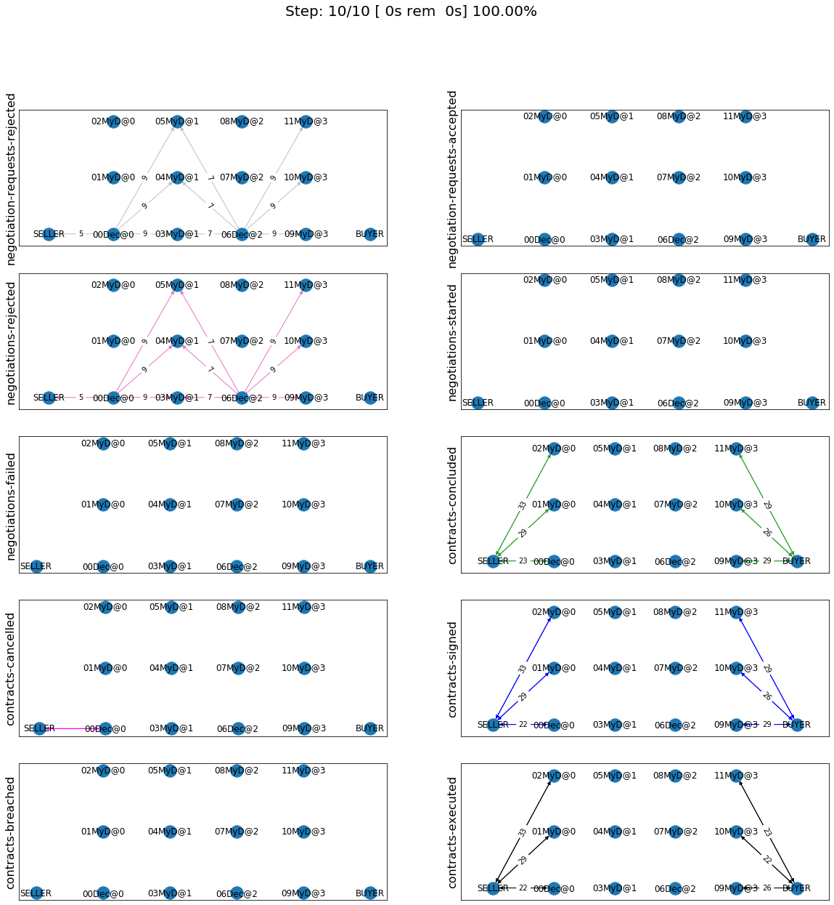
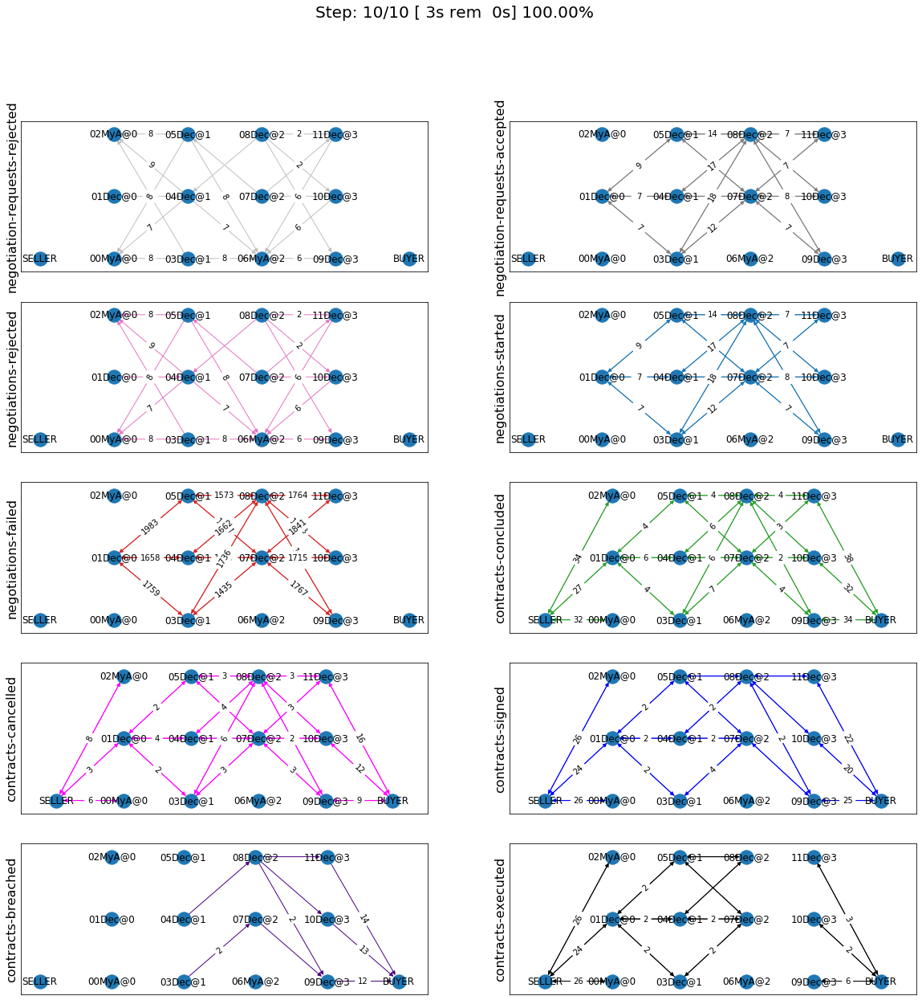
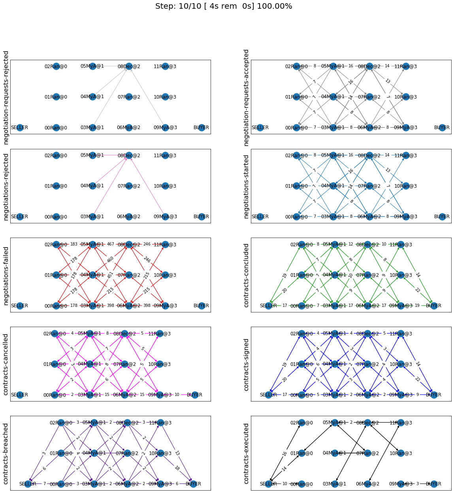
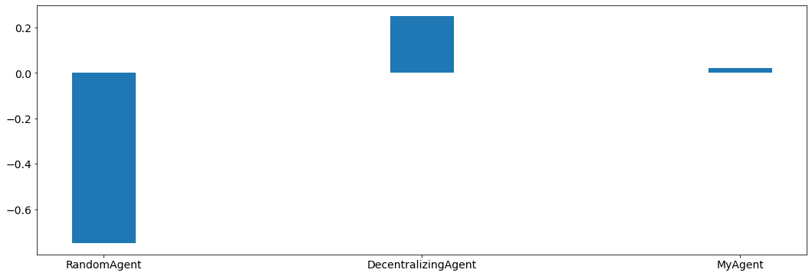
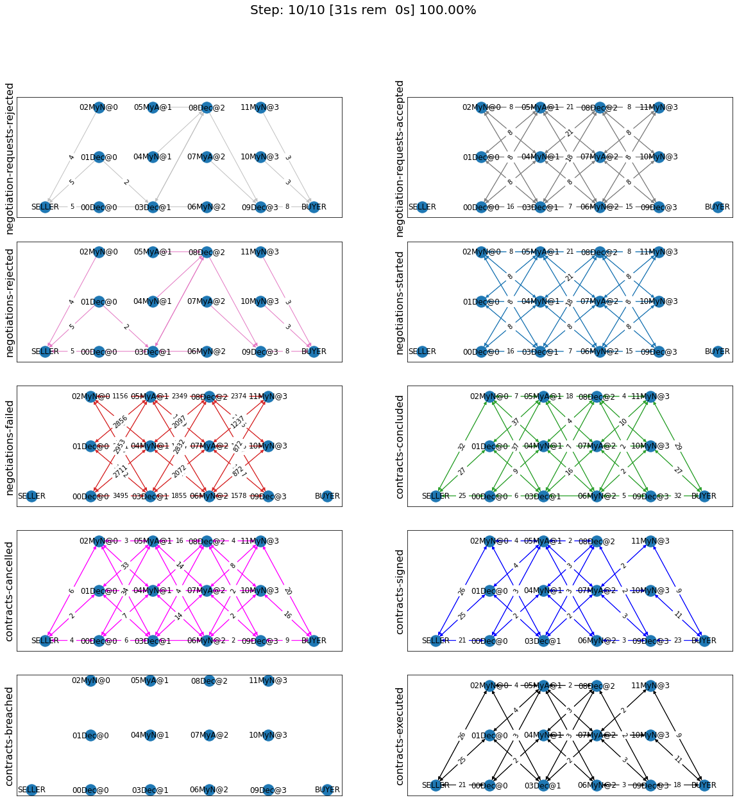
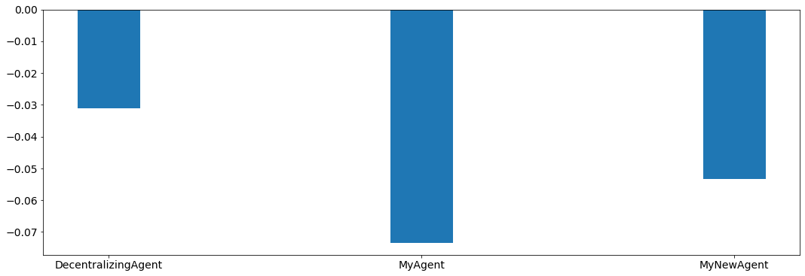

Developing an agent for SCML2020
--------------------------------

Let’s see the simplest possible agent (a do-nothing agent)

.. code:: ipython3

    from scml.scml2020 import SCML2020Agent, SCML2020World, RandomAgent, DecentralizingAgent
    ComparisonAgent = DecentralizingAgent

.. code:: ipython3

    class MyDoNothing(SCML2020Agent):
        """My Agent that does nothing"""

Now, let’s try to run a simulation with it

.. code:: ipython3

    world = SCML2020World(
        **SCML2020World.generate([ComparisonAgent, MyDoNothing], n_steps=10), 
        construct_graphs=True,
    )

Do Nothing Agent
~~~~~~~~~~~~~~~~

Let’s test this agent to confirm that it is really doing nothing

.. code:: ipython3

    world.run()

.. code:: ipython3

    world.draw(steps=(0, world.n_steps), together=False, ncols=2, figsize=(20, 20))
    plt.show()

.. image:: 02.develop_agent_scml2020_files/02.develop_agent_scml2020_8_0.png

You can see that our agent did not do anything in the world. It did
receive some negotiation requests which it rejected and it did not
engage in any negotiations

Agent Anatomy
~~~~~~~~~~~~~

For an agent to be successul in the SCML world, it needs to buy input
materials through negotiation, manufacture them, then sell output
products through negotiation. In this tutorial we structure our agent as
a combination of three main strategies/components:

1. **Trading Strategy**: Deciding the quantity (and price) to buy and
   sell at every time-step. This component can employ two subcomponents:

-  a pre-negotiation component that decides the quantities/prices to
   negotaite about based on prediction of future market behavior
   (**trade prediction strategy**) and partner behavior (**partner
   beahvior prediction strategy**)
-  a post-negotiation component that decides what agreements to sign as
   contracts (**signing strategy**).

2. **Negotiation Control Strategy**: This component is responsible for
   proactively request negotiations, responding to negotiation requests
   and actually conducting concurrent negotaitions. This component can
   further be divided into two subcomponents:

-  a pre negotiation component that decides which negotiations to accept
   and which to engage in (**negotiation manager**)
-  The **negotiation algorithm** used to carry out the negotiations
   decided by the negotiation manger.

3. **Production Strategy**: Decides what to produce at every time-step.

You are free to organize your agent in a different way but - for the
purposes of this tutorial - we will stick with this organization.

The SCML platform provides several components that can be used to
implement each of these strategies.

Strategies
^^^^^^^^^^

SCML uses collaborative inheritance for composing agents by combining
components implement the strategies mentioned above.

Each one of those components can implement any of the methods/callbacks
provided in the SCMLAgent class and use the AWI to do so as a
representative of the agent. All of them call the ``super`` version of
any method they override to make sure that all othe components get
executed.

Components also reveal some useful members to other components and the
main agent either as data-members, methods, or properties. Let’s see an
example

.. code:: ipython3

    from IPython.display import HTML
    HTML('')

.. raw:: html

    

.. code:: ipython3

    import scml
    print(scml.scml2020.components.TradingStrategy.__doc__)

.. parsed-literal::

    Base class for all trading strategies.
    
        Provides:
            - `inputs_needed` (np.ndarray):  How many items of the input product do I need at every time step
              (n_steps vector)
            - `outputs_needed` (np.ndarray):  How many items of the output product do I need at every time step
              (n_steps vector)
            - `inputs_secured` (np.ndarray):  How many items of the output product do I need at every time step
              (n_steps vector)
            - `outputs_secured` (np.ndarray):  How many units of the output product I have already secured per step
                  (n_steps vector)
    
        Hooks Into:
            - `init`
            - `internal_state`
    
        Remarks:
            - `Attributes` section describes the attributes that can be used to construct the component (passed to its
              `__init__` method).
            - `Provides` section describes the attributes (methods, properties, data-members) made available by this
              component directly. Note that everything provided by the bases of this components are also available to the
              agent (Check the `Bases` section above for all the bases of this component).
            - `Requires` section describes any requirements from the agent using this component. It defines a set of methods
              or properties/data-members that must exist in the agent that uses this component. These requirement are
              usually implemented as abstract methods in the component
            - `Abstract` section describes abstract methods that MUST be implemented by any descendant of this component.
            - `Hooks Into` section describes the methods this component overrides calling `super` () which allows other
              components to hook into the same method (by overriding it). Usually callbacks starting with `on_` are
              hooked into this way.
            - `Overrides` section describes the methods this component overrides without calling `super` effectively
              disallowing any other components after it in the MRO to call this method. Usually methods that do some
              action (i.e. not starting with `on_`) are overridden this way.
        

The docstring above describes the six possible sections in each
component’s docstring which define how is it to be constructed
(attributes), what it provides to other components (provides), what it
assumes about the agent (requires), what abstract methods must be
overriden by any subclass of it (abstract), which callbacks of the agent
does it hook-into while allowing other components to run and which does
it completely override (preventing components after it in the MRO from
running).

**To successfully use components to construct your agent, you need to
remember to always call the ``super`` version of every method you
overrided in your agent class to allow all components to run except if
you want to completey override the behavior of all components that use
this callback.**. As a rule of thump, callbacks that start with “on\_”,
“init”, and “step” should call super, the rest should not. For a clear
explanation of the use of ``super`` refer to `Hettinger’s
post <https://rhettinger.wordpress.com/2011/05/26/super-considered-super/>`__.

Production Strategy
^^^^^^^^^^^^^^^^^^^

Let’s start with what may be the simplest of the aforementioned
components: the production strategy. What should an agent produce? There
are three main limitations on the answer to this question:

1. Production capacity which is controlled by the number of lines the
   agent has

      self.awi.n_lines

2. The available quantity of the input material

      self.awi.current_inventory(self.awi.my_input_product)

3. The *needed* quantity of outputs. That depends on how many sell
   contracts the agent already have (you may also consider future sell
   contracts that it expects to have).

The platform provides three basic strategies for production:
SupplyDriven producing based on buy-contracts, DemandDriven producing
based on sell-contracts and ContracDriven producing based on both.

Let’s add a demand-driven strategy to our agent. This means that our
agent will only produce based on the contracts it actually signs.

.. code:: ipython3

    from scml.scml2020.components.production import DemandDrivenProductionStrategy, ProductionStrategy
    class MyAgent(DemandDrivenProductionStrategy):
        """My agent"""

As you can see, using this strategy and all other components provided by
the SCML platform amounts to just inheriting from it. You have to
remember when using any of these strategies to call ``super().f``
whenever you implement any of the methods in ``SCML2020Agent`` in your
agent to allow the components you are using to do their thing.

It is instructive to see how does this strategy work. This is its
complete code (with type-hints and the docstring removed):

.. code:: ipython3

    class DemandDrivenProductionStrategy(ProductionStrategy):
        def on_contracts_finalized(self, signed, cancelled, rejectors):
            super().on_contracts_finalized(signed, cancelled, rejectors)
            for contract in signed:
                is_seller = contract.annotation["seller"] == self.id
                # do nothing if this is not a sell contract
                if not is_seller:
                    continue
                step = contract.agreement["time"]
                # find the earliest time I can do anything about this contract
                earliest_production = self.awi.current_step
                if step > self.awi.n_steps - 1 or step < earliest_production:
                    continue
                # Schedule production before the delivery time
                output_product = contract.annotation["product"]
                input_product = output_product - 1
                steps, _ = self.awi.schedule_production(
                    process=input_product,
                    repeats=contract.agreement["quantity"],
                    step=(earliest_production, step - 1),
                    line=-1,
                    partial_ok=True,
                )
                # set the schedule_range which is provided for other components 
                self.schedule_range[contract.id] = (
                    min(steps) if len(steps) > 0 else -1,
                    max(steps) if len(steps) > 0 else -1,
                    is_seller,
                )
                # that is all folks

This component works by implementing both ``confirm_production`` and
``on_contracts_finalized``.

-  The main work happens in ``on_contracts_finalized``. For each signed
   contract, the agent schedules as much production as possible to
   produce the required quantity before the time it is needed at.
-  ``confirm_production`` simply confirms everything because it assumes
   that the agent already scheduled correctly. Notice that despite not
   needing to get the output of the call of ``super``, it is already
   called to allow other components overriding this method to work
   properly.

Now let’s test our agent with its new production strategy.

.. code:: ipython3

    world = SCML2020World(
        **SCML2020World.generate([ComparisonAgent, MyDoNothing], n_steps=10), 
        construct_graphs=True,
    )
    world.run()
    world.draw(steps=(0, world.n_steps), together=False, ncols=2, figsize=(20, 20))
    plt.show()

As expected nothing happens. Our agent is still outside the market
because it does not negotiate. We need to add the other two strategies
(trading and negotiation control strategies) to get it going.

Trading Strategy
^^^^^^^^^^^^^^^^

The second component of our agent, we will implement is the trading
strategy.

Trading strategies provide the following four data-members to the agent
which can be used by other components:

-  inputs_needed (np.ndarray): How many items of the input product do I
   need at every time step (n_steps vector)
-  outputs_needed (np.ndarray): How many items of the output product do
   I need at every time step (n_steps vector)
-  inputs_secured (np.ndarray): How many items of the output product do
   I need at every time step (n_steps vector)
-  inputs_needed (np.ndarray): How many units of the output product I
   have already secured per step (n_steps vector)

There are two built-in trading strategies provided:

1. ``NoTradingStrategy`` Simply sign any contracts that can in principle
   be satisifed given the production capacity (i.e. n. lines) of the
   factory. Other than that there is no strategy. This strategy is not
   expected to work well but is useful as a baseline.
2. ``PredictionBasedTradingStrategy`` This strategy use a trade
   prediction strategy internally to predict how many inputs are
   expected to be available and how many outputs are expected to be sold
   by the agent at every time-step. Given these two quantities, it
   maintains the amounts of inputs/outputs that it needs. It then
   employs a controller to manage negotiations and update the amounts
   secured.

Let’s use the ``PredictionBasedTradingStrategy`` for our agent.

.. code:: ipython3

    from scml.scml2020.components.production import DemandDrivenProductionStrategy
    from scml.scml2020.components.trading import PredictionBasedTradingStrategy
    class MyAgent(PredictionBasedTradingStrategy, DemandDrivenProductionStrategy, SCML2020Agent):
        """My agent"""

.. code:: ipython3

    world = SCML2020World(
        **SCML2020World.generate([ComparisonAgent, MyAgent], n_steps=10), 
        construct_graphs=True
    )
    world.run()
    world.draw(steps=(0, world.n_steps), together=False, ncols=2, figsize=(20, 20))
    plt.show()

The last piece of the buzzle to complete our agent is to add a
negotiation control strategy. We will start by reusing one of the
existing strategies then develop our own.

Negotiation Control Strategy
^^^^^^^^^^^^^^^^^^^^^^^^^^^^

Let’s first try to just reuse one of the existing negotiation strategies
to see how it works.

.. code:: ipython3

    from scml.scml2020.components.negotiation import IndependentNegotiationsManager
    class MyAgent(IndependentNegotiationsManager, PredictionBasedTradingStrategy, DemandDrivenProductionStrategy, SCML2020Agent):
        pass

.. code:: ipython3

    world = SCML2020World(
        **SCML2020World.generate([ComparisonAgent, MyAgent], n_steps=10), 
        construct_graphs=True
    )
    try:
        world.run()
    except ValueError as e:
        print(e)

.. parsed-literal::

    You must implement target_quantity

What the system is telling us is that we forgot to implement the method
``targe_quantity`` . Consulting the documentation we find that we must
implement two methods to use any negotiation control strategy:

1. ``target_quantity`` which gives the quantity that the negotiators
   should targe to achieve for any given time step (selling and buying)
2. ``acceptable_unit_price`` The maximum acceptable unit price for
   buying and the minimum acceptable unit price for selling

Moreover, the independent negotiation strategy requires us to implement
a utility function that should work for any negotiation.

Let’s add a simple implementation of both

.. code:: ipython3

    from negmas import LinearUtilityFunction
    class MyAgent(IndependentNegotiationsManager, PredictionBasedTradingStrategy
                  , DemandDrivenProductionStrategy, SCML2020Agent):
        def target_quantity(self, step: int, sell: bool) -> int:
            """A fixed target quantity of half my production capacity"""
            return self.awi.n_lines // 2
            
        def acceptable_unit_price(self, step: int, sell: bool) -> int:
            """The catalog price seems OK"""
            return self.awi.catalog_prices[self.awi.my_output_product] if sell else self.awi.catalog_prices[self.awi.my_input_product]
        
        def create_ufun(self, is_seller: bool, issues=None, outcomes=None):
            """A utility function that penalizes high cost and late delivery for buying and and awards them for selling"""
            if is_seller:
                return LinearUtilityFunction((0, 0.25, 1))
            return LinearUtilityFunction((0, -0.5, -0.8))

.. code:: ipython3

    world = SCML2020World(
        **SCML2020World.generate([ComparisonAgent, MyAgent, RandomAgent], n_steps=10), 
        construct_graphs=True
    )
    world.run()
    
    world.draw(steps=(0, world.n_steps), together=False, ncols=2, figsize=(20, 20))
    plt.show()
    

Our agent is now doing things in the market. It buys and sells and
commits breaches. How well is it doing? Let’s see how did our agents do

.. code:: ipython3

    from collections import defaultdict
    def show_agent_scores(world):
        scores = defaultdict(list)
        for aid, score in world.scores().items():
            scores[world.agents[aid].__class__.__name__.split(".")[-1]].append(score)
        scores = {k: sum(v)/len(v) for k, v in scores.items()}
        plt.bar(list(scores.keys()), list(scores.values()), width=0.2)
        plt.show()
    show_agent_scores(world)

Not as good as the comparison agent :-( yet better than random :-)

But what did we expect with almost zero code.

Creating our own negotiation control strategy
~~~~~~~~~~~~~~~~~~~~~~~~~~~~~~~~~~~~~~~~~~~~~

Let’s create a new negotiation control strategy and use it to replace
the ``IndependentNegotiationsManager`` we used in our last attempt.

To start, we need to know what is expected from our component.

We know that the trading strategy provides us with the following four
data-members and we leave for it the responsibility of updating them
correctly:

-  inputs_needed (np.ndarray): How many items of the input product do I
   need at every time step (n_steps vector)
-  outputs_needed (np.ndarray): How many items of the output product do
   I need at every time step (n_steps vector)
-  inputs_secured (np.ndarray): How many items of the output product do
   I need at every time step (n_steps vector)
-  inputs_needed (np.ndarray): How many units of the output product I
   have already secured per step (n_steps vector)

What we need from our negotiation control strategy is to find *the best*
or at least *a good* way to satisfy these needs.

One way to do that is to have a ``Controller`` agent for selling and
buying responsible of satisfying the *exact* needs at every time-step.
NegMAS provides an easy to use controller that fits the bill called
``SAOSyncController``

.. code:: ipython3

    from negmas import SAOSyncController
    print(SAOSyncController.__doc__)

.. parsed-literal::

    A controller that can manage multiple negotiators synchronously

Let’s create our controller and see what do we need. The main idea here
is that the controller will define a utility function for any possible
outcome. It will then collect offers from all partners and responds in
this way:

-  If the best offer is invalid, reject everything and offer the best
   offer you can in every negotiation
-  If the best offer is good enough (i.e. within some threshold of the
   best possible utility on that given negotiation) accept it
-  Otherwise, send the best offer to everyone else and try to further
   improve this offer until near the end of the negotiation

This is a straight forward implementation of this idea

.. code:: ipython3

    from scml.scml2020 import TIME, QUANTITY, UNIT_PRICE
    from negmas import ResponseType, outcome_is_valid
    from negmas.sao import SAOResponse
    from typing import List, Dict, Optional, Tuple, Any
    class SyncController(SAOSyncController):
        """
        Will try to get the best deal which is defined as being nearest to the agent 
        needs and with lowest price.
        
        Args:
            is_seller: Are we trying to sell (or to buy)?
            parent: The agent from which we will access `needed` and `secured` arrays
            price_weight: The importance of price in utility calculation
            utility_threshold: Accept anything with a relative utility above that
            time_threshold: Accept anything with a positive utility when we are that close
                            to the end of the negotiation
        """
    
        def __init__(
            self,
            *args,
            is_seller: bool,
            parent: "PredictionBasedTradingStrategy",
            price_weight=0.7,
            utility_threshold=0.9,
            time_threshold=0.9,
            **kwargs,
        ):
            super().__init__(*args, **kwargs)
            self._is_seller = is_seller
            self.__parent = parent
            self._time_threshold = time_threshold
            self._price_weight = price_weight
            self._utility_threshold = utility_threshold
            self._best_utils: Dict[str, float] = {}
            # find out my needs and the amount secured lists
    
        def utility(self, offer) -> float:
            """A simple utility function
    
            Remarks:
                 - If the time is invalid or there is no need to get any more agreements
                   at the given time, return -1000
                 - Otherwise use the price-weight to calculate a linear combination of
                   the price and the how much of the needs is satisfied by this contract
    
            """
            
            # get my needs and secured amounts arrays
            if self._is_seller:
                _needed, _secured = (
                    self.__parent.outputs_needed,
                    self.__parent.outputs_secured,
                )
            else:
                _needed, _secured = (
                    self.__parent.inputs_needed,
                    self.__parent.inputs_secured,
                )
            
            # invalide offers have no utility
            if offer is None:
                return -1000
            
            # offers for contracts that can never be executed have no utility
            t = offer[TIME]
            if t < self.__parent.awi.current_step or t > self.__parent.awi.n_steps - 1:
                return -1000.0
            
            # offers that exceed my needs have no utility (that can be improved)
            q = _needed[offer[TIME]] - (offer[QUANTITY] + _secured[t])
            if q < 0:
                return -1000.0
            
            # The utility of any offer is a linear combination of its price and how 
            # much it satisfy my needs
            price = (
                offer[UNIT_PRICE] 
                if self._is_seller 
                else -offer[UNIT_PRICE]
            )
            return self._price_weight * price + (1 - self._price_weight) * q
    
        def is_valid(self, negotiator_id: str, offer: "Outcome") -> bool:
            """Is this a valid offer for that negotiation"""
            issues = self.negotiators[negotiator_id][0].ami.issues
            return outcome_is_valid(offer, issues)
    
        def counter_all(
            self, offers: Dict[str, "Outcome"], states: Dict[str, "SAOState"]
        ) -> Dict[str, "SAOResponse"]:
            """Calculate a response to all offers from all negotiators (negotiator ID is the key).
    
            Args:
                offers: Maps negotiator IDs to offers
                states: Maps negotiator IDs to offers AT the time the offers were made.
    
            Remarks:
                - The response type CANNOT be WAIT.
    
            """
    
            # find the best offer
            negotiator_ids = list(offers.keys())
            utils = np.array([self.utility(o) for o in offers.values()])
    
            best_index = int(np.argmax(utils))
            best_utility = utils[best_index]
            best_partner = negotiator_ids[best_index]
            best_offer = offers[best_partner]
    
            # find my best proposal for each negotiation
            best_proposals = self.first_proposals()
    
            # if the best offer is still so bad just reject everything
            if best_utility < 0:
                return {
                    k: SAOResponse(ResponseType.REJECT_OFFER, best_proposals[k])
                    for k in offers.keys()
                }
    
            relative_time = min(_.relative_time for _ in states.values())
    
            # if this is good enough or the negotiation is about to end accept the best offer
            if (
                best_utility >= self._utility_threshold * self._best_utils[best_partner]
                or relative_time > self._time_threshold
            ):
                responses = {
                    k: SAOResponse(
                        ResponseType.REJECT_OFFER,
                        best_offer if self.is_valid(k, best_offer) else best_proposals[k],
                    )
                    for k in offers.keys()
                }
                responses[best_partner] = SAOResponse(ResponseType.ACCEPT_OFFER, None)
                return responses
    
            # send the best offer to everyone else and try to improve it
            responses = {
                k: SAOResponse(
                    ResponseType.REJECT_OFFER,
                    best_offer if self.is_valid(k, best_offer) else best_proposals[k],
                )
                for k in offers.keys()
            }
            responses[best_partner] = SAOResponse(
                ResponseType.REJECT_OFFER, best_proposals[best_partner]
            )
            return responses
    
        def first_proposals(self) -> Dict[str, "Outcome"]:
            """Gets a set of proposals to use for initializing the negotiation."""
            return {nid: self.best_proposal(nid)[0] for nid in self.negotiators.keys()}
        
        def on_negotiation_end(self, negotiator_id: str, state: "MechanismState") -> None:
            """Update the secured quantities whenever a negotiation ends"""
            if state.agreement is None:
                return
    
            q, t = state.agreement[QUANTITY], state.agreement[TIME]
            if self._is_seller:
                self.__parent.outputs_secured[t] += q
            else:
                self.__parent.inputs_secured[t] += q
    
        
        def best_proposal(self, nid: str) -> Tuple[Optional["Outcome"], float]:
            """
            Finds the best proposal for the given negotiation
    
            Args:
                nid: Negotiator ID
    
            Returns:
                The outcome with highest utility and the corresponding utility
            """
            negotiator = self.negotiators[nid][0]
            if negotiator.ami is None:
                return None, -1000
            utils = np.array([self.utility(_) for _ in negotiator.ami.outcomes])
            best_indx = np.argmax(utils)
            self._best_utils[nid] = utils[best_indx]
            if utils[best_indx] < 0:
                return None, utils[best_indx]
            return negotiator.ami.outcomes[best_indx], utils[best_indx]    

Let’s understand exactly what is this controller doing. In NegMAS, a
``Controller`` is a class that manages multiple negotiations. Usually
these negotiations run independently and there is no central point to
collect offers from them. A special type of controller is the
``SAOSyncController`` which synchronizes the process of offering and
responding to offers. Any ``SAOSyncController`` needs to implement two
methods:

1. *first_proposals* which is used to generate one proposal for each
   negotiation to start the negotiation process.
2. *counter_all* which receives offers from all the negotiations under
   the control of this controller and have to respond to each one of
   them by either accepting it, rejecting it and countering or ending
   the negotiation. When loops form among controllers, the system breaks
   them by having *counter_all* being called with a subset of the
   negotiations.

Our controller defines a utility function which is a linear combination
of the price and difference between the quantity and the agent’s needs
at the delivery time.

It also defines a ``best_proposal`` helper which finds for any
negotiation the outcome with maximum utiltiy (as well as the value of
this maximum utility).

Implementing ``first_proposals`` is now straightforward. Just find the
*best proposal* for each negotiation.

The most interseting part of the controller is the ``counter_all``
method. The gist of this method is finding the best offer among the set
currently received. If the negotiation is about to end or this offer has
a utility above some threshold it is accepted, otherwise, it is sent to
all other negotiators as our new offer while sending to the partner who
gave that best offer the offer with maximum utility.

The next step is to use this controller in our negotiation strategy

Our negotiation control strategy will work as follows:

1. It will instantiate two ``SyncController`` objects one for selling
   and one for buying.
2. It will start negotiations to satisfy the needs that it gets from the
   trading strategy using these controllers every simulation step.

.. code:: ipython3

    class MyNegotiationManager:
        """My negotiation strategy
    
        Args:
            price_weight: The relative importance of price in the utility calculation.
            utility_threshold: The fraction of maximum utility above which all offers will be accepted.
            time_threshold: The fraction of the negotiation time after which any valid offers will be accepted.
            time_range: The time-range for each controller as a fraction of the number of simulation steps
    
        Hooks Into:
            - `init`
            - `step`
    
        Remarks:
            - `Attributes` section describes the attributes that can be used to construct the component (passed to its
              `__init__` method).
            - `Provides` section describes the attributes (methods, properties, data-members) made available by this
              component directly. Note that everything provided by the bases of this components are also available to the
              agent (Check the `Bases` section above for all the bases of this component).
            - `Requires` section describes any requirements from the agent using this component. It defines a set of methods
              or properties/data-members that must exist in the agent that uses this component. These requirement are
              usually implemented as abstract methods in the component
            - `Abstract` section describes abstract methods that MUST be implemented by any descendant of this component.
            - `Hooks Into` section describes the methods this component overrides calling `super` () which allows other
              components to hook into the same method (by overriding it). Usually callbacks starting with `on_` are
              hooked into this way.
            - `Overrides` section describes the methods this component overrides without calling `super` effectively
              disallowing any other components after it in the MRO to call this method. Usually methods that do some
              action (i.e. not starting with `on_`) are overridden this way.
    
    
        """
    
        def __init__(
            self,
            *args,
            price_weight=0.7,
            utility_threshold=0.9,
            time_threshold=0.9,
            time_horizon=0.1,
            **kwargs,
        ):
            super().__init__(*args, **kwargs)
            self.index: List[int] = None
            self.time_horizon = time_horizon
            self._time_threshold = time_threshold
            self._price_weight = price_weight
            self._utility_threshold = utility_threshold
            self.controllers: Dict[bool, SyncController] = {
                False: SyncController(
                    is_seller=False,
                    parent=self,
                    price_weight=self._price_weight,
                    time_threshold=self._time_threshold,
                    utility_threshold=self._utility_threshold,
                ),
                True: SyncController(
                    is_seller=True,
                    parent=self,
                    price_weight=self._price_weight,
                    time_threshold=self._time_threshold,
                    utility_threshold=self._utility_threshold,
                ),
            }
            self._current_end = -1
            self._current_start = -1
    
        def step(self):
            super().step()
            
            # find the range of steps about which we plan to negotiate
            step = self.awi.current_step
            self._current_start = step + 1
            self._current_end = min(
                self.awi.n_steps - 1,
                self._current_start + max(1, int(self.time_horizon * self.awi.n_steps)),
            )
            if self._current_start >= self._current_end:
                return
            
            for seller, needed, secured, product in [
                (False, self.inputs_needed, self.inputs_secured, self.awi.my_input_product),
                (
                    True,
                    self.outputs_needed,
                    self.outputs_secured,
                    self.awi.my_output_product,
                ),
            ]:
                # find the maximum amount needed at any time-step in the given range
                needs = np.max(
                    needed[self._current_start : self._current_end]
                    - secured[self._current_start : self._current_end]
                )
                if needs < 1:
                    continue
                
                # set a range of prices
                if seller:
                    # for selling set a price that is at least the catalog price
                    min_price = self.awi.catalog_prices[product]
                    price_range = (min_price, 2 * min_price)
                else:
                    # for buying sell a price that is at most the catalog price
                    price_range = (0, self.awi.catalog_prices[product])
                self.awi.request_negotiations(
                    not seller,
                    product,
                    (1, needs),
                    price_range,
                    time=(self._current_start, self._current_end),
                    controller=self.controllers[seller],
                )
    
        def respond_to_negotiation_request(
            self,
            initiator: str,
            issues: List["Issue"],
            annotation: Dict[str, Any],
            mechanism: "AgentMechanismInterface",
        ) -> Optional["Negotiator"]:
            # refuse to negotiate if the time-range does not intersect
            # the current range
            if not (
                issues[TIME].min_value < self._current_end
                or issues[TIME].max_value > self._current_start
            ):
                return None
            controller = self.controllers[not annotation["is_buy"]]
            if controller is None:
                return None
            return controller.create_negotiator()

We can now replace the built-in negotiation manager in our agent with
our new negotiation manager.

.. code:: ipython3

    class MyNewAgent(MyNegotiationManager, PredictionBasedTradingStrategy, 
                  DemandDrivenProductionStrategy, SCML2020Agent):
        pass

Let’s see how did our simple new agent do:

.. code:: ipython3

    world = SCML2020World(
        **SCML2020World.generate([ComparisonAgent, MyAgent, MyNewAgent], n_steps=10), 
        construct_graphs=True
    )
    world.run()
    
    world.draw(steps=(0, world.n_steps), together=False, ncols=2, figsize=(20, 20))
    plt.show()
    

.. code:: ipython3

    show_agent_scores(world)

OK not bad. It is better than the original agent we developed using only
built-in compoenents. If we re-run this notebook, we may get a different
result though.

Download :download:`Notebook<notebooks/02.develop_agent_scml2020.ipynb>`.

