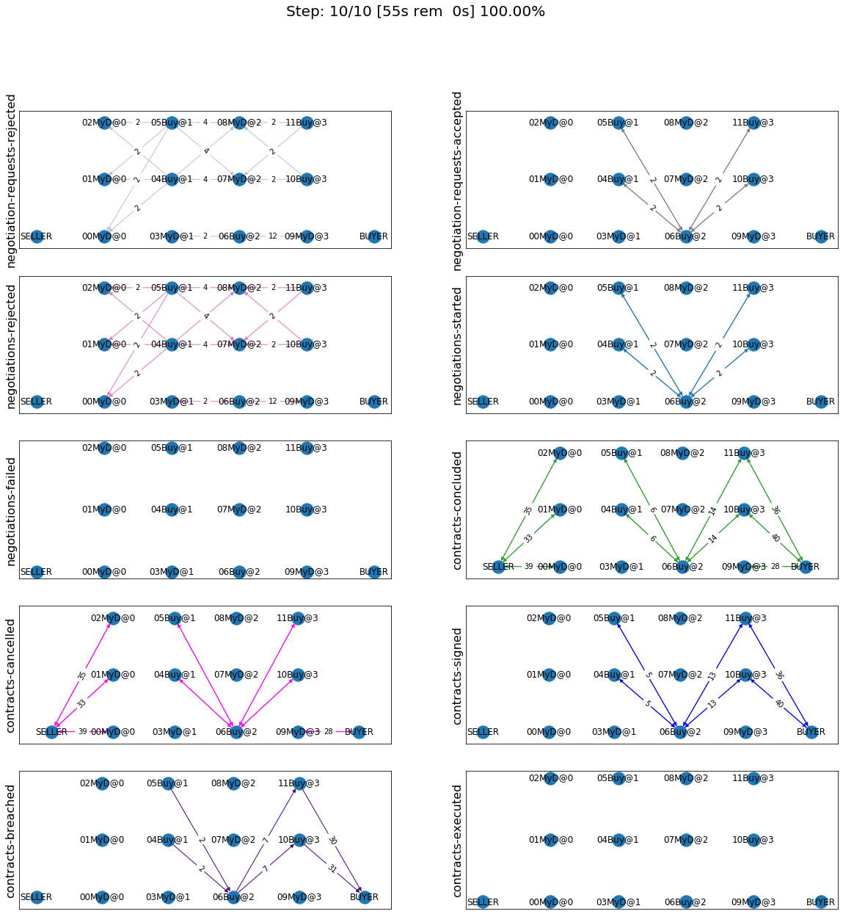

.. code:: ipython3

    import pandas as pd
    import numpy as np
    from time import sleep
    from pprint import pprint

Developing an agent for SCML2020
--------------------------------

Let’s see the simplest possible agent (a do-nothing agent)

.. code:: ipython3

    from scml.scml2020 import SCML2020Agent, SCML2020World, BuyCheapSellExpensiveAgent

.. code:: ipython3

    class MyDoNothing(SCML2020Agent):
        pass

Now, let’s try to run a simulation with it

.. code:: ipython3

    try:
        world = SCML2020World(
            **SCML2020World.generate(agent_types=[MyDoNothing], n_steps=20), 
            agent_name_reveals_type=False, 
            construct_graphs=True,
        )
    except TypeError as e:
        print(e)

.. parsed-literal::

    Can't instantiate abstract class MyDoNothing with abstract methods init, on_agent_bankrupt, on_contract_breached, on_contract_executed, on_failures, on_negotiation_failure, on_negotiation_success, respond_to_negotiation_request, step

We failed - as expected - because we did not implement the abstract
methods that must be implemented. For a detailed explanation of the role
of each one of these methods, please refer to `SCML2020
description <http://www.yasserm.com/scml/scml2020.pdf>`__. Here we will
only give a brief expanation of the most important ones while working
through our agent.

Let’s start by building a working do-nothing agent

Do Nothing Agent
~~~~~~~~~~~~~~~~

.. code:: ipython3

    class MyDoNothing(SCML2020Agent):
        """An agent that does nothing for the whole length of the simulation"""
    
        def respond_to_negotiation_request(self, initiator, issues, annotation, mechanism):
            """Refuse to negotiation with anyone"""
    
        def sign_all_contracts(self, contracts):
            """Refuse to sign any contracts"""
            return [None] * len(contracts)
    
        def step(self):
            """Do nothing every time-step"""
    
        def init(self):
            """Who needs initialization"""
    
        def on_agent_bankrupt(self, agent, contracts, quantities, compensation_money):
            """Who cares if others are bankrupt"""
    
        def on_failures(self, failures):
            """We never schedule production anyway"""
    
        def on_negotiation_failure(self, partners, annotation, mechanism, state):
            """We did not even negotiate!!"""
    
        def on_negotiation_success(self, contract, mechanism):
            """We did not even negotiate!!"""
    
        def on_contract_cancelled(self, contract, rejectors):
            """We did not even negotiate"""
    
        def on_contracts_finalized(self, signed, cancelled, rejectors):
            """Do not do anything when contracts are finalized (you will not have any anyway)"""
    
        def on_contract_executed(self, contract):
            """We did not sign any"""
    
        def on_contract_breached(self, contract, breaches, resolution):
            """Who cares, we do not have any contracts anyway"""

Let’s test this agent to confirm that it is really doing nothing

.. code:: ipython3

    world = SCML2020World(
        **SCML2020World.generate([BuyCheapSellExpensiveAgent, MyDoNothing], n_steps=10), 
        construct_graphs=True,
    )
    world.run()

.. code:: ipython3

    world.draw(steps=(0, world.n_steps), together=False, ncols=2, figsize=(20, 20))
    plt.show()

Download :download:`Notebook<notebooks/02.develop_agent_scml2020.ipynb>`.

