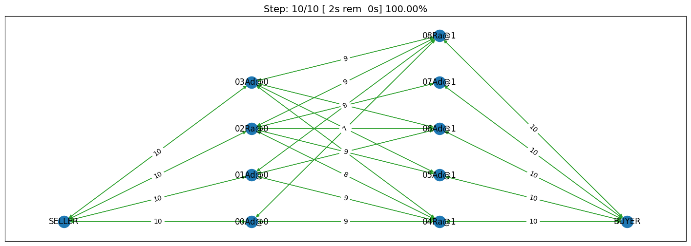
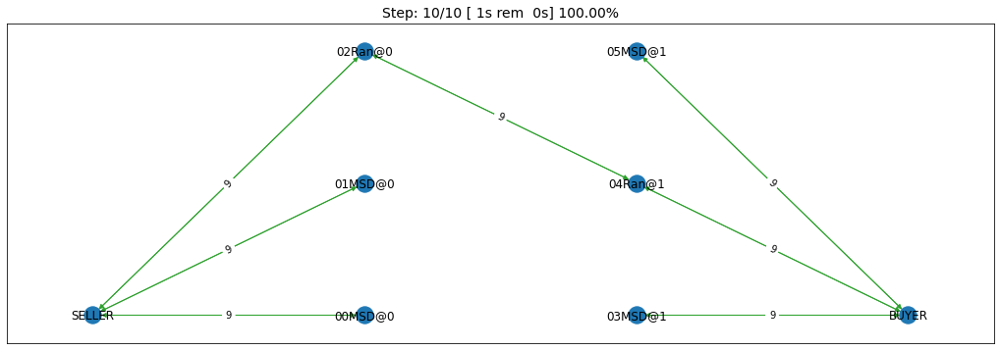

Developing an agent for SCML2021 (OneShot)
------------------------------------------

In 2021, we introduced a new track called SCML-OneShot which implements
a simplified problem in which the agent can focus on the many to many
concurrent negotiation problem without needing to worry about long term
planning or production planning as is the case with the standard and
collusion tracks.

SCML-OneShot brief introduction
~~~~~~~~~~~~~~~~~~~~~~~~~~~~~~~

An overview of the one-shot game is available
`here <http://www.yasserm.com/scml/overview_oneshot.pdf>`__ and a full
description for the details-savy person is available
`here <http://www.yasserm.com/scml/scml2021oneshot.pdf>`__. We suggest
that you read (or skim) the first document before continuing. Here we
only provide a birds-eye view of the system.

.. figure:: situation_oneshot_wide.jpg
   :alt: oneshot

   oneshot

The game runs in a world in which *factories* can run *manufacturing
processes* to convert *products* into other *products*. There are
exactly 3 products and 2 processes as shown in the figure. Each agent
controls exactly one factory.

The agents that receive the *raw material* and generate the
*intermediate product* are called :math:`L_0` agents (level zero) and
the agents. receiving the *intermediate product* and generate the *final
product* are called :math:`L_1` factories (level 1). The product type
consumed by the factory controlled by an agent is called its *input
product* and the product it produces is called its *output product*.

Every day (simulation step), each :math:`L_0` factory receives one
*exogenous* contract specifying a quantity and a unit price (supplies)
for this day and each :math:`L_1` factory receives one *exogenous*
contract specifying a quantity and a unit price of the final product
(sales) for the same day. Production and transporation are assumed to
take no time.

:math:`L_0` and :math:`L_1` agents need to negotiate together to secure
*intermediate product* contracts in order to use their supplies (for
:math:`L_0` agents) or satisfy their sale obligations (for :math:`L_1`
agents). All products that remain unsold at the end of the day perish
(i.e. has no value). Moreover, agents pay a *disposal cost* for any
input products they buy and never sell and pay a *shortfall penalty* for
any sales they cannot satisfy.

Your goal as an agent designer is to maximize your overall profit over
the simulation time.

Simplest Possible Agent
~~~~~~~~~~~~~~~~~~~~~~~

Let’s see the simplest possible agent (a do-nothing agent) but first, we
will define few helper functions to use thoughout this tutorial for
testing different agents.

.. code:: ipython3

    from collections import defaultdict
    import random
    from negmas import ResponseType
    from scml.oneshot import *
    from scml.scml2020 import is_system_agent
    
    def try_agent(agent_type, n_processes=2):
        """Runs an agent in a world simulation against a randomly behaving agent"""
        return try_agents([RandomOneShotAgent, agent_type], n_processes)
    
    def try_agents(agent_types, n_processes=2, n_trials=1, draw=True):
        """
        Runs a simulation with the given agent_types, and n_processes n_trial times.
        Optionally also draws a graph showing what happened
        """
        type_scores = defaultdict(float)
        counts = defaultdict(int)
        agent_scores = dict()
        for _ in range(n_trials):
            p = n_processes if isinstance(n_processes, int) else random.randint(*n_processes)
            world = SCML2020OneShotWorld(
            **SCML2020OneShotWorld.generate(agent_types, n_steps=10, n_processes=p), 
            construct_graphs=True,
            )
            world.run()
    
            all_scores = world.scores()
            for aid, agent in world.agents.items():
                if is_system_agent(aid):
                    continue
                key = aid if n_trials == 1 else f"{aid}@{world.id[:4]}"
                agent_scores[key] = (
                     agent.type_name.split(':')[-1].split('.')[-1],           
                     all_scores[aid], 
                     '(bankrupt)' if world.is_bankrupt[aid] else ''
                    )
            for aid, agent in world.agents.items():
                if is_system_agent(aid):
                    continue
                type_ = agent.type_name.split(':')[-1].split('.')[-1]
                type_scores[type_] += all_scores[aid]
                counts[type_] += 1
        type_scores = {k: v/counts[k] if counts[k] else v for k, v in type_scores.items()}
        if draw:
            world.draw(what=["contracts-concluded"], 
                           steps=(0, world.n_steps), together=True, ncols=1, figsize=(20, 20))
            plt.show()
        
        return world, agent_scores, type_scores
    
    def analyze_contracts(world):
        """
        Analyzes the contracts signed in the given world
        """
        import pandas as pd
        data = pd.DataFrame.from_records(world.saved_contracts)
        return data.groupby(["seller_name", "buyer_name"])[["quantity", "unit_price"]].mean().transpose()
    
    
    def print_agent_scores(agent_scores):
        """
        Prints scores of individiual agent instances
        """
        for aid, (type_, score, bankrupt) in agent_scores.items():
            print(f"Agent {aid} of type {type_} has a final score of {score} {bankrupt}")
            
    def print_type_scores(type_scores):
        """Prints scores of agent types"""
        print(sorted(tuple(type_scores.items()), key=lambda x: -x[1]))

Now we are ready to develop a do-nothing agent:

.. code:: ipython3

    class MyOneShotDoNothing(OneShotAgent):
        """My Agent that does nothing"""
        def propose(self, negotiator_id, state):
            return None
        def respond(self, negotiator_id, state, offer):
            return ResponseType.END_NEGOTIATION
        
    world, ascores, tscores = try_agent(MyOneShotDoNothing)

.. image:: 02.develop_agent_scml2020_oneshot_files/02.develop_agent_scml2020_oneshot_5_0.png

In all of the graph representing world simulations, we use short names
that represent the type of the agent. For example an agent named
``03Ran@1`` is an agent of type ``RandomOneShotAgent`` at production
level 1 that was the third agent to create. ``MDN`` here is a shorthand
for ``MyOneShotDoNothingAgent`` (we will usually remove ``OneShot`` and
``Agent`` from the name before shortening it).

Looking at the ``contracts-concluded``, we can see that none of the
concluded contracts involved our do-nothing agent. Nevertheless, these
agents still had *exogenous contracts* which means that they will lose
money. A do-nothing agent will usually lose money in this game.

Let’s check the scores of different agents to confirm:

.. code:: ipython3

    print_agent_scores(ascores)

.. parsed-literal::

    Agent 00Ran@0 of type RandomOneShotAgent has a final score of 0.8416805366280785 
    Agent 01Ran@0 of type RandomOneShotAgent has a final score of 0.7620332621083792 
    Agent 02MDN@0 of type MyOneShotDoNothing has a final score of 0.4006053724079518 
    Agent 03MDN@1 of type MyOneShotDoNothing has a final score of 0.7543966224720364 
    Agent 04Ran@1 of type RandomOneShotAgent has a final score of 0.7434688416630213 
    Agent 05MDN@1 of type MyOneShotDoNothing has a final score of 0.7194748217817234 

Notice that our do-nothing agent always loses money. That is because it
cannot get any contracts from negotiation to satisfy its needs from the
exogenous contracts but it still has to pay for disposal cost and
shortfall penalty.

.. code:: ipython3

    print_type_scores(tscores)

.. parsed-literal::

    [('RandomOneShotAgent', 0.7823942134664931), ('MyOneShotDoNothing', 0.6248256055539039)]

Notice how the do-nothing agent is even worse than acting randomly. This
is usually the case in the OneShot game.

We can also have a look at the *exogenous* contracts that drive the
market.

.. code:: ipython3

    analyze_contracts(world)

.. raw:: html

    

    
    <table border="1" class="dataframe">
      <thead>
        <tr>
          <th>seller_name</th>
          <th>00Ran@0</th>
          <th>01Ran@0</th>
          <th>03MDN@1</th>
          <th>04Ran@1</th>
          <th>05MDN@1</th>
          <th colspan="3" halign="left">SELLER</th>
        </tr>
        <tr>
          <th>buyer_name</th>
          <th>04Ran@1</th>
          <th>04Ran@1</th>
          <th>BUYER</th>
          <th>BUYER</th>
          <th>BUYER</th>
          <th>00Ran@0</th>
          <th>01Ran@0</th>
          <th>02MDN@0</th>
        </tr>
      </thead>
      <tbody>
        <tr>
          <th>quantity</th>
          <td>6.9</td>
          <td>3.5</td>
          <td>5.7</td>
          <td>13.1</td>
          <td>7.4</td>
          <td>9.8</td>
          <td>9.0</td>
          <td>8.5</td>
        </tr>
        <tr>
          <th>unit_price</th>
          <td>17.7</td>
          <td>24.0</td>
          <td>27.4</td>
          <td>29.4</td>
          <td>27.4</td>
          <td>10.1</td>
          <td>9.9</td>
          <td>11.1</td>
        </tr>
      </tbody>
    </table>
    

There are few things to note about the distribution of the *exogenous*
contracts:

-  The unit price of the raw material is always lower than that of the
   final product. This is the source of profitability in this market.
-  Each agent has a different mean and standar deviation for the
   quantities in its exogenous contracts. This means that different
   agents will have different utility functions but these utility
   functions for different steps are related because the exogenous
   contract is sampled from some common distribution for each agent for
   all the steps which makes learning more useful in the game.

Building your own agent
~~~~~~~~~~~~~~~~~~~~~~~

A one-shot agent needs only to do negotiation. The simplest possible
version (``MyOneShotRandom`` above) just responded to offers from its
partners and proposed new offers to them.

Looking at the graph for the world simulation, we can see immediately
some features of the one-shot simulation that are not replicated in the
full SCML game:

-  All negotiation requests are accepted. In fact in the one-shot game,
   the agent need not consider requesting negotiations or deciding the
   negotiation agenda as the system takes care of this ensuring that on
   every simulated day every agent is negotiating with its suppliers and
   or consumers about trade on that day (and only that day).
-  Contracts in the one-shot game are always executed (despite not
   showing that in the graph). There is no concept of a breach. Failure
   to honor contracts is instead penalized monetarily. Contracts are
   also never cancelled or nullified. This greatly simplifies the
   problem as the agent does not need to keep track of contract
   execution.
-  Production is too fast that it does not affect the agent reasoning.
   In the terminology to be presented in the following tutorial, there
   is no need for an explicit production strategy.
-  There is no need to consider future negotiations while reasoning
   about a the current set of negotiations. This greatly simplifies
   agent design as there is no long-term planning. In the terminology to
   be presented in the following section, there is no need for a trading
   strategy

Your AWI
^^^^^^^^

As described in the `previous
tutorial <http://www.yasserm.com/scml/scml2020docs/tutorials/01.run_scml2020.html>`__,
your agent can sense and act in the simulation by accessing methods and
properties of its AWI which is accessible at any time as:

.. code:: python

   self.awi

You can see all of these methods and properties specific for the
**OneShotAWI** and its descendents
`here <http://www.yasserm.com/scml/scml2020docs/api/scml.oneshot.OneShotAWI.html>`__.

Your ufun
^^^^^^^^^

The Oneshot game has the advantage that it is possible at the end of
each simulation step (day) to calculate **exactly** the profit you will
be getting for the set of contracts you have (either through negotiation
or as exogenous contracts). We provide a utility function class
(`OneShotUtilityFunction <http://www.yasserm.com/scml/scml2020docs/api/scml.oneshot.OneShotUFun.html>`__
which can be used normally as any NegMAS
`UtilityFunction <http://www.yasserm.com/negmas/api/negmas.utilities.UtilityFunction.html>`__.
This ufun is available to your all the time (a new one is created for
each simulation step) and is accessible as:

.. code:: python

   self.ufun

The most important services this ufun class provides for you are the
following:

-  ``from_offers``: This method receives a list of outcomes and a list
   of booleans indicating whether each of them is for buying or for
   selling. It returns to you the profit you will get if all of these
   outcomes *and nothing else* became contracts. An outcome is just a
   tuple (quantity, delivery time, unit price). You can use this
   callback during negotiation to judge hypothetical agreements with
   your partners.
-  ``from_contracts``: This method is the same as ``from_offers`` but it
   receives a list of ``Contract`` objects. It is useful after all
   negotiations are finished to calculate the profit you will be getting
   for this step.
-  ``is_breach``: will tell you whether or not getting the given total
   input and output quantities will make you cause a breach. Notice that
   breaches are expected in the OneShot track as any mismatch in the
   quantities of inputs and outputs will constitute a breach.
-  ``breach_level``: returns a value between zero and one specifying the
   level of breach that will be recorded for a given total input and
   output quantities.
-  ``find_limit``: finds either the maximum or the minimum possible
   profit (minimum profit is maximm loss) attainable in the current
   simulation step (day). This is useful when you want to normalize
   utility values between zero and one. Two of the agents we will
   develop during this tutorial will use this feature.
-  ``max_utility``, ``min_utility``: give the maximum and minimum
   utilities/profits attainable. Note that you must prepare them by
   calling ``find_limit``. We will go into how to do that later.
-  ``best``, ``worst``: give more information about the cases of maximum
   and minimum profit (i.e. the total input and output quantity needed,
   the prodcible quantity, best possible prices for buying and selling,
   etc). Again, these are not available except after calling
   ``find_limit``.

Now we can start working on our agent.

There are three base classes for one-shot agents (``OneShotAgent``,
``SyncOneShotAgent``, and ``SingleAgreementOneShotAgent``). We will
discuss them in more details in what follows.

OneShotAgent
~~~~~~~~~~~~

This is the base class of all agents for SCML-OneShot. Both
``SyncOneShotAgent`` and ``SingleAgreementOneShotAgent`` inherit from
this class and provide support for a simplified way of developing your
agent (or so we think). It is perfectly OK to use ``OneShotAgent``
directly as the base of your agent.

We have already seen the ``OneShotAgent`` class for which you need to
override ``propose`` and may also override ``respond`` to handle
negotiations independently. The ``propose`` method receives the
negotiation state (an object of the type ``SAOState`` including among
other things the current negotiation step, relative time, last offer,
etc) and is required to return an ``Outcome`` (See ``negmas``
documentation) as an offer. The ``respond`` method receives a
negotiation state and an offer (``Outcome``) from the opponent and needs
to respond to it by a decision from the ``ResponseType`` enumeration
(``REJECT_OFFER``, ``ACCEPT_OFFER``, and ``END_NEGOTIATION``). Other
than these two negotiation related callbacks, the agent receives an
``init`` call just after it joins the simulatin and a ``step`` call
after each step. The agent is also informed about failure/success of
negotiations through the
``on_negotiation_success``/``on_negotiation_failure`` callbacks. That is
all. A one-shot agent needs to only think about what should it do to
respond to each of these six callbacks. All of these callbacks except
``propose`` are optional.

Greedy OneShotAgent
^^^^^^^^^^^^^^^^^^^

We have already seen how to develop a do-nothing agent using the
``OneShotAgent`` class. Let’s try to develop some more meaningful agent
using the same base class.

.. code:: ipython3

    class GreedyOneShotAgent(OneShotAgent):
        """A greedy agent based on OneShotAgent"""
        
        def init(self):
            self.secured = 0
                    
        def step(self):
            self.secured = 0
            
        def on_negotiation_success(self, contract, mechanism):
            self.secured += contract.agreement["quantity"]    
    
        def propose(self, negotiator_id: str, state) -> "Outcome":
            return self.best_offer(negotiator_id)
    
        def respond(self, negotiator_id, state, offer):
            my_needs = self._needed(negotiator_id)
            if my_needs <= 0:
                return ResponseType.END_NEGOTIATION
            return (
                ResponseType.ACCEPT_OFFER
                if offer[QUANTITY] <= my_needs
                else ResponseType.REJECT_OFFER
            )
        
        def best_offer(self, negotiator_id):
            my_needs = self._needed(negotiator_id)
            if my_needs <= 0:
                return None
            ami = self.get_ami(negotiator_id)
            if not ami:
                return None
            quantity_issue = ami.issues[QUANTITY]
            unit_price_issue = ami.issues[UNIT_PRICE]
            offer = [-1] * 3
            offer[QUANTITY] = max(
                min(my_needs, quantity_issue.max_value),
                quantity_issue.min_value
            )
            offer[TIME] = self.awi.current_step
            if self._is_selling(ami):
                offer[UNIT_PRICE] = unit_price_issue.max_value
            else:
                offer[UNIT_PRICE] = unit_price_issue.min_value        
            return tuple(offer)
    
        def _needed(self, negotiator_id=None):
            return self.awi.current_exogenous_input_quantity + \
                   self.awi.current_exogenous_output_quantity - \
                   self.secured
        
        def _is_selling(self, ami):
            return ami.annotation["product"] == self.awi.my_output_product
        
    world, ascores, tscores = try_agent(GreedyOneShotAgent)

.. image:: 02.develop_agent_scml2020_oneshot_files/02.develop_agent_scml2020_oneshot_14_0.png

Let’s see how well did this agent behave:

.. code:: ipython3

    print_type_scores(tscores)

.. parsed-literal::

    [('GreedyOneShotAgent', 0.8897492308240772), ('RandomOneShotAgent', 0.819596831902848)]

This simple agent is definitely better than the random agent. Let’s
understand how it works:

The main idea of this agent is pretty simple. It tries to *secure* as
much of its needs (sales/supplies) as possible in every negotiation at
the best possible price for itself.

To achieve this goal, the agent keeps track of the quantity it secured
in its ``init``, ``step`` and ``on_negotiation_success`` callbacks.

.. code:: python

   def init(self):
       self.secured = 0

   def step(self):
       self.secured = 0

   def on_negotiation_success(self, contract, mechanism):
       self.secured += contract.agreement["quantity"]

Moreover, it defines a helper that calculates the amount it needs by
subtracting the exogenous quantity it has from the amount it secured:

.. code:: python

   def _needed(self):
       return self.awi.current_exogenous_input_quantity + \
              self.awi.current_exogenous_output_quantity - \
              self.secured

Notice that either the exogenous input quantity or the exogenous output
quantity (or both) will always be zero. Now that the agent can calculate
how much it needs to buy/sell, it implements the negotiation related
call-backs (``propose`` and ``respond``).

Here is the full implementation of ``propose``:

.. code:: python

   def propose(self, negotiator_id: str, state) -> "Outcome":
           return self.best_offer(negotiator_id)

The agent is always offering its best offer which is calculated in the
``best_offer`` method to be discussed later. It does not conceed at all.

Responding to opponent offers is also simple:

-  it starts by calculating its needs using the helper ``needed``, and
   ends the negotiation if it needs no more sales/supplies

.. code:: python

       my_needs = self._needed()
       if my_needs <= 0:
           return ResponseType.END_NEGOTIATION

-  If the offered quantity is less than its needs, accept the offer.
   Otherwise reject the offer.

.. code:: python

       return ResponseType.ACCEPT_OFFER if offer[QUANTITY] <= my_needs else ResponseType.REJECT_OFFER

Most of the code is in the ``best_offer`` method which calculates the
best offer for a negotiation *given the agreements reached so far*.
Let’s check it line by line:

-  The agent checks its needs and returns ``None`` ending the
   negotiation if it needs no more sales/supplies. We also get access to
   the AMI.

.. code:: python

       my_needs = self._needed()
       if my_needs <= 0:
           return None
       ami = self.get_ami(negotiator_id)
       if not ami:
           return None

-  It then finds out the ``Issue`` objects corresponding to the quantity
   and unit-price for this negotiation and initializes an offer (we have
   3 issues)

.. code:: python

       quantity_issue = ami.issues[QUANTITY]
       unit_price_issue = ami.issues[UNIT_PRICE]
       offer = [-1] * 3

-  The time is always the current step.

.. code:: python

       offer[TIME] = self.awi.current_step

-  The quantity to offer is simply the needs of the agent without mapped
   within the range of the quantities in the negotiation agenda (note
   that this may lead the agent to buy more than its needs).

.. code:: python

       offer[QUANTITY] = max(
           min(my_needs, quantity_issue.max_value), quantity_issue.min_value
       )

-  Finally, the unit price is the maximum possible unit price if the
   agent is selling otherwise it is the minimum possible price. Note
   that ``is_selling()`` assumes that the agent will never find itself
   in a middle layer in a deep negotiation. We will alleviate this issue
   later.

.. code:: python

       if self._is_selling(ami):
           offer[UNIT_PRICE] = unit_price_issue.max_value
       else:
           offer[UNIT_PRICE] = unit_price_issue.min_value
       return tuple(offer)

More General Greedy Agent (advanced)
^^^^^^^^^^^^^^^^^^^^^^^^^^^^^^^^^^^^

.. container::

   This section is not necessary for SCML-OneShot 2021 competition
   because all worlds in the competition will have exactly 2 processes
   (3 products). It is here for readers interested in making their
   agents future-proof.

One issue that the ``GreedyOneShotAget`` had was that it assumed that it
is either in the first level of the production chain or in the last
level. To make an agent that works anywhere, we need just minor
modifications:

.. code:: ipython3

    class DeepGreedyAgent(GreedyOneShotAgent):
        """A greedy agent based on OneShotSyncAgent that does something 
        when in the middle of the production chain"""
        
        def init(self):
            self._sales = self._supplies = 0
                    
        def step(self):
            self._sales = self._supplies = 0
            
        def on_negotiation_success(self, contract, mechanism):
            if contract.annotation["product"] == self.awi.my_input_product:
                self._sales += contract.agreement["quantity"]
            else:
                self._supplies += contract.agreement["quantity"]
            
        def _needed(self, negotiator_id):
            summary = self.awi.exogenous_contract_summary
            secured = ( 
                self._sales 
                if self._is_selling(self.get_ami(negotiator_id)) 
                else self._supplies
            )
            demand = min(summary[0][0], summary[-1][0]) / (self.awi.n_competitors + 1)     
            return  demand - secured

Firstly, we now keep track of our sales and supplies separately:

.. code:: python

   def init(self):
           self._sales = self._supplies = 0
                   
   def step(self):
       self._sales = self._supplies = 0

   def on_negotiation_success(self, contract, mechanism):
       if contract.annotation["seller"] == self.id:
           self._sales += contract.agreement["quantity"]
       else:
           self._supplies += contract.agreement["quantity"]

To find out whether a contract is for sales or supplies, we simply check
that the ``seller`` in the contract annotation is us.

We need now one more chanage which is to separate the calculation of our
needs for supplies and sales:

.. code:: python

   def _needed(self, negotiator_id):
       summary = self.awi.exogenous_contract_summary
       secured = ( 
           self._sales 
           if self._is_selling(self.get_ami(negotiator_id)) 
           else self._supplies
       )
       demand = min(summary[0][0], summary[-1][0]) / (self.awi.n_competitors + 1)     
       return  demand - secured

here we start by reading the summary information of exogenous contracts
into ``summary``. This is a list of two valued tuples giving the
**total** quantity and **total** price (in that order) of all current
exogenous contracts for all products. We also find the amount we secured
(depending on whether this is a buy or a sell negotiation) and the
number of competitors (i.e. agents in the same production level as us).
We assume that we need to buy (and sell) the same quantity as the
minimum of the raw material and final product exogenous contracts
divided equally between us and our competitors (we add one to
``n_competitors`` to count ourselves).

Now, let’s see how does this agent behave compared with the previous
agent in a deep world simulation

.. code:: ipython3

    world, ascores, tscores = try_agents([GreedyOneShotAgent, DeepGreedyAgent], n_processes=3)

.. image:: 02.develop_agent_scml2020_oneshot_files/02.develop_agent_scml2020_oneshot_20_0.png

Examining the graph above, you can see that ``DeepGreedy`` agents could
get contracts when they were in the middle of the production chain. The
``GreedyOneShot`` agent on the other hand failed to do so.

Agents in the package ``scml.oneshot.agents`` were designed to work in
deep production graphs not only in the first and last layer whenever
that is possible.

We can check the results now:

.. code:: ipython3

    print_type_scores(tscores)

.. parsed-literal::

    [('GreedyOneShotAgent', 0.7637690637770452), ('DeepGreedyAgent', 0.7229505469204262)]

Even though our new ``DeepGreedyAgent`` was able to get contracts which
in the middle, it seems that it did worse than ``GreedyOneShotAgent`` in
terms of final profits. This may be just a quirk of this specific
configuration. We will leave it to the reader to investigate this issue
(if they choose to).

Given that the utility function of the agent is defined in terms of a
*complete set of contracts*, it is not trivial to define a utility
function for each negotiation independent from the others (which is why
this is an inherently concurrent negotiation world). It may be easier
then to think of all negotiations in a synchronized manner. This means
that the agent keeps collecting offers from its partners and when it has
a *complete set*, it responds to all of them. Moreover, to start
negotiations in which the agent finds itself the first propsoer, it
needs to define a first proposal for each negotiation. This is why
``SyncOneShotAgent`` allows you to do.

You can now start developing your own agent for SCML-OneShot (A startup
skeleton project is available here). The rest of this tutorial will
introduce two other optional alternatives

OneShotSyncAgent
~~~~~~~~~~~~~~~~

The main goal of this base agent is to allow the developer to think
about *all negotiations together* but it has some important caveats
which we will discuss later. Here is an example of writing the
do-nothing agent in this form:

.. code:: ipython3

    from negmas import SAOResponse
    class MySyncOneShotDoNothing(OneShotSyncAgent):
        """My Agent that does nothing"""
        def counter_all(self, offers, states):
            """Respond to a set of offers given the negotiation state of each."""
            return dict(zip(self.negotiators.keys(), 
                            [SAOResponse(ResponseType.END_NEGOTIATION, None)] 
                            * len(self.negotiators)
                           ))
        
        def first_proposals(self):
            """Decide a first proposal on every negotiation. 
            Returning None for a negotiation means ending it."""
            return dict(zip(self.negotiators.keys(), 
                            [None] * len(self.negotiators)
                           ))
        
    world, ascores, tscores = try_agent(MySyncOneShotDoNothing)

.. image:: 02.develop_agent_scml2020_oneshot_files/02.develop_agent_scml2020_oneshot_26_0.png

As you can see, in this case, we need to override ``counter_all`` to
counter offers received from *all* the partners and ``first_proposals``
to decide a first offer for *each* partner. Notice that this is a
many-to-many negotiation scenario. This means that if multiple agents at
every level are using sync variants, loops may happen with the
possiblity of a deadlock.

For that reason the system will randomly break such loops when they
happen which implies that **``counter_all`` may receive a subset of the
offers from partners not all of them**. In the worst case,
``counter_all`` may receive just one offer each time from one of the
partners losing all synchronity between responses.

Other than these two negotiation related callbacks, the agent receives
an ``init`` call just after it joins the simulatin and a ``step`` call
after each step. The agent is also informed about failure/success of
negotiations through the
``on_negotiation_success``/``on_negotiation_failure`` callbacks. That is
all. A one-shot agent needs to only think about what should it do to
respond to each of these six callbacks. All of these callbacks except
``counter_all`` and ``first_proposals`` are optional.

GreedySyncAgent
^^^^^^^^^^^^^^^

The main advantage of using the ``OneShotSyncAgent`` is that you do not
need to keep track of state variables (like ``secured``, ``_supplies``
and ``_sales`` used earlier) and you have a common place to make your
decisions about **all** negotiations at the same time. Here is a simple
greedy agent using this approach.

.. code:: ipython3

    class GreedySyncAgent(OneShotSyncAgent, GreedyOneShotAgent):
        """A greedy agent based on OneShotSyncAgent"""
        
        def __init__(self, *args, threshold=0.3, **kwargs):
            super().__init__(*args, **kwargs)
            self._threshold = threshold
        
        def init(self):
            super().init()
            self.ufun.find_limit(True)
            self.ufun.find_limit(False)
            
        def first_proposals(self):
            """Decide a first proposal on every negotiation. 
            Returning None for a negotiation means ending it."""
            return dict(zip(
                    self.negotiators.keys(), 
                    (self.best_offer(_) for _ in self.negotiators.keys())
            ))
        
        def counter_all(self, offers, states):
            """Respond to a set of offers given the negotiation state of each."""
            responses = {
                k: SAOResponse(ResponseType.REJECT_OFFER, _) 
                for k, v in self.first_proposals().items()
            }
            my_needs = self._needed()
            is_selling = ( self._is_selling(self.get_ami(_)) for _ in offers.keys() )
            sorted_offers = sorted(
                zip(offers.values(), is_selling), 
                key=lambda x: (- x[0][UNIT_PRICE]) if x[1] else x[0][UNIT_PRICE]
            )
            secured, outputs, chosen = 0, [], dict()
            for i, k in enumerate(offers.keys()):
                offer, is_output = sorted_offers[i]
                secured += offer[QUANTITY]
                if secured >= my_needs:
                    break
                chosen[k] = offer
                outputs.append(is_output)
                
            u = self.ufun.from_offers(list(chosen.values()), outputs)
            rng = self.ufun.max_utility - self.ufun.min_utility
            threshold = self._threshold * rng + self.ufun.min_utility
            if u >= threshold:
                for k, v in chosen.items():
                    responses[k] = SAOResponse(ResponseType.ACCEPT_OFFER, None)
            return responses
        
    world, ascores, tscores = try_agent(GreedySyncAgent)

This agent shows a case of parameterizing your agent so that it can be
tested with different hyper-parameters. You do that by passing whatever
parameters you like as keyword arguments to the constctor:

.. code:: python

   def __init__(self, *args, threshold=0.3, **kwargs):
       super().__init__(*args, **kwargs)
       self._threshold = threshold

The one paramter we have is a threshold of utility relative to the
maximum possile utility that we are willing to accept.

This agent also shows a case in which we use the built-in utility
function implemented by the system (see `Section 2.3 of the game
description <http://www.yasserm.com/scml/scml2021oneshot.pdf>`__). This
ufun is accessible as ``ufun``. By default the ufun will return the
profit in dollars for a given set of negotiation outcomes, offers,
agreements, or contracts. Note that the ufun assumes that what it is
given *is the complete set of agreements and no others will be added to
them later*. This value may be positive or negative (loss). In some
cases you need to get the utility value normalized to a range between
zero and one. This agent will do that. To do this normalization, we need
to know the value of maximum and minimum utilities. You can of course
solve the corresponding optimziation problem but we did that for you.
All you need is call ``find_limit`` and pass it a boolean (``True`` for
calculating the highest possible utility and ``False`` for calculating
the lowest possible utility). To avoid doing this calculation
repeatedly, you should store the results in ``ufun.best`` or
``ufun.worst`` for highest and lowest utility. After that, you can
access the maximum possible utility as ``max_utility`` and minimum
possible utility as ``min_utility``. We do that in the ``init()``
method:

.. code:: python

    def init(self):
       super().init()
       self.ufun.find_limit(True)
       self.ufun.find_limit(False)

After this call, we can access ``maximum_utility``, ``minimum_utility``,
``best``, ``worst`` members of the ufun. As explained earlier, ``best``
and ``worst`` give extra information about the conditions for achieving
maximum and minimum utility.

We need to implement two methods: ``first_proposals`` (to generate a
good first proposal for each negotiation) and ``counter_all`` (for
countering a set of offers). We inherit from ``GreedyOneShotAgent`` in
order to get access to ``best_offer`` and ``_is_selling`` methods (we
could have repeated them here again of course. Note that, because of the
way inheritence works in python, we must inherit from
``OneShotSyncAgent`` before ``GreedyOneShotAgent``.

The first set of proposals in ``first_proposals`` is simply the
``best_offer`` for each negotiation which is calculated using this
generator expression:

.. code:: python

   (self.best_offer(_) for _ in self.negotiators.keys())

Almost all the code now resides in the ``counter_all`` method. We will
go over it here:

-  We start by initializing our response by the best offer for each
   negotiation using ``first_proposals`` and calculating our needs using
   ``_needed``

.. code:: python

   responses = {
       k: SAOResponse(ResponseType.REJECT_OFFER, _) 
       for k, v in self.first_proposals().items()
   }
   my_needs = self._needed(None)

-  We then sort the offers so that earlier offers have *better* prices
   for us. For sell offers, this means descendingly and for buy offers
   ascendingly.

.. code:: python

   is_selling = ( self._is_selling(self.get_ami(_)) for _ in offers.keys() )
   sorted_offers = sorted(
       zip(offers.values(), is_selling), 
       key=lambda x: (- x[0][UNIT_PRICE]) if x[1] else x[0][UNIT_PRICE]
   )

-  We *greedily* find a set of offers that satisfy all our needs (or as
   much as possible from them).

.. code:: python

   secured, outputs, chosen = 0, [], dict()
   for i, k in enumerate(offers.keys()):
       offer, is_output = sorted_offers[i]
       secured += offer[QUANTITY]
       if secured >= my_needs:
           break
       chosen[k] = offer
       outputs.append(is_output)

-  Finally, we calculate the utility of accepting these *and only these*
   offers and accept the chosen offers if they provide 70% of the
   maximum possible utility. Otherwise, we reject all offers sending the
   default ``best_offer`` value back.

.. code:: python

   u = self.ufun.from_offers(list(chosen.values()), outputs)
   rng = self.ufun.max_utility - self.ufun.min_utility
   threshold = self._threshold * rng + self.ufun.min_utility
   if u >= threshold:
       for k, v in chosen.items():
           responses[k] = SAOResponse(ResponseType.ACCEPT_OFFER, None)
   return responses

Let’s see how did it do:

.. code:: ipython3

    print_type_scores(tscores)

.. parsed-literal::

    [('GreedySyncAgent', 0.9852701464598985), ('RandomOneShotAgent', 0.6102910363641216)]

This base-class simplifies the job of the agent developer by providing a
single function (``counter_all``) in which to handle all offers it
receive (most of the time, remember that sometimes you will receive a
subset of the offers in the call). In principle the agent can then
decide to accept a few of these offers and keep negotiating.

In many cases, it may be possible to secure all of the agent’s needs
(i.e. supplies or sales) using a **single** contract with one of its
partners. In such cases, the agent can think about the negotiations it
is engaged in as a **competetive negotiation** not very dissimilar from
an auction that also allows it to offer. This can lead to a further
simplification, the agent can be designed to get **at most one
agreement** from the set of negotiation and end all the rest once this
is achieved. This is what the ``SingleAgreementOneShotAgent`` does.

SingleAgreementOneShotAgent
~~~~~~~~~~~~~~~~~~~~~~~~~~~

This base classs allows you to develop agents that can get **at most**
one agreement from the set of negotiation at every simulation step.

This controller manages a set of negotiations from which only a single
one – at most – is likely to result in an agreement. To guarentee a
single agreement, pass ``strict=True``.

The general algorithm for this controller is something like this:

-  Receive offers from all partners.

-  Find the best offer among them by calling the abstract ``best_offer``
   method.

-  Check if this best offer is acceptable using the abstract
   ``is_acceptable`` method.

   -  If the best offer is acceptable, accept it and end all other
      negotiations.
   -  If the best offer is still not acceptable, then all offers are
      rejected and with the partner who sent it receiving the result of
      ``best_outcome`` while the rest of the partners receive the result
      of ``make_outcome``.

-  The default behavior of ``best_outcome`` is to return the outcome
   with maximum utility.

-  The default behavior of ``make_outcome`` is to return the best offer
   received in this round if it is valid for the respective negotiation
   and the result of ``best_outcome`` otherwise.

To use this agent, you need to implement three methods:

-  ``is_acceptable`` decides whether an offer is now acceptable. For
   this simple agent, we accept an offer if it provides us with a
   decreasing fraction of the maximum utility attainable. Notice that,
   because we set ``mn`` to ``min_utility``, the agent may actually
   accept offers with negative utility!! This can easily be fixed by
   setting ``mn`` to zero but will lead to much less trade.

.. code:: python

   mx, mn = self.ufun.max_utility , self.ufun.min_utility
   u = (self.ufun(offer) - mn) / (mx - mn) 
   return  u >= (1-state.relative_time)

-  ``best_offer`` finds the best offer among a set of offers. Here we
   simply compare their utility

.. code:: python

   ufuns = [(self.ufun(_), i) for i, _ in enumerate(offers.values())]
   keys = list(offers.keys())
   return keys[max(ufuns)[1]]

-  ``is_better`` which compares two offers from the same negotiator. We
   simply compare their utility value:

.. code:: python

   return self.ufun(a) > self.ufun(b)

Here is the full agent

.. code:: ipython3

    class GreedySingleAgreementAgent(OneShotSingleAgreementAgent):
        """A greedy agent based on OneShotSingleAgreementAgent"""
        
        def init(self):
            super().init()
            self.ufun.find_limit(True) # finds highest utility
            self.ufun.find_limit(False) # finds lowest utility
        
        def is_acceptable(self, offer, source, state) -> bool:        
            mx, mn = self.ufun.max_utility , self.ufun.min_utility
            u = (self.ufun(offer) - mn) / (mx - mn) 
            return  u >= (1-state.relative_time)
    
        def best_offer(self, offers):
            ufuns = [(self.ufun(_), i) 
                     for i, _ in enumerate(offers.values())]
            keys = list(offers.keys())
            return keys[max(ufuns)[1]]
    
        def is_better(self, a, b, negotiator, state):
            return self.ufun(a) > self.ufun(b)
    
    world, ascors, tscores = try_agent(GreedySingleAgreementAgent)

.. image:: 02.develop_agent_scml2020_oneshot_files/02.develop_agent_scml2020_oneshot_34_0.png

.. code:: ipython3

    print_type_scores(tscores)

.. parsed-literal::

    [('RandomOneShotAgent', 0.7017026300645176), ('GreedySingleAgreementAgent', 0.6528520083452068)]

Comparing all agents
~~~~~~~~~~~~~~~~~~~~

Let’s run a tournament comparing all agents we developed in this
tutorial (we will ignore the do-nothing agents)

.. code:: ipython3

    # may take a long time
    _, _, tscores = try_agents(
        [GreedyOneShotAgent, GreedySingleAgreementAgent, GreedySyncAgent], 
        n_trials=20, 
        n_processes=2,
        draw=False
    )
    print_type_scores(tscores)

.. parsed-literal::

    [('GreedyOneShotAgent', 0.801002396978831), ('GreedySyncAgent', 0.7538398054634171), ('GreedySingleAgreementAgent', 0.5200378476376494)]

The way we just compared these agents is not unbiased because not all
agents are allowed to control the same factories in the same simulation
envoironment. The best way to compare these agents is to run a
tournament between them. You already learned how to do that in the
previous tutorial and we will not repeate it here.

*If you are running this notebook, please note that the tournament
running methods ``anac2021_*`` may not work within a notebook
environment. You can just move your code to a normal python script and
it will run correctly*

You can find all the agents available in the ``scml`` package for the
one-shot game under ``scml.oneshot.agents`` including the ones developed
in this tutorial:

.. code:: ipython3

    import scml.oneshot.agents as agents
    print([ _ for _ in agents.__dir__() if _.endswith("Agent")])

.. parsed-literal::

    ['RandomOneShotAgent', 'SyncRandomOneShotAgent', 'SingleAgreementRandomAgent', 'SingleAgreementAspirationAgent', 'GreedyOneShotAgent', 'GreedySyncAgent', 'GreedySingleAgreementAgent', 'OneshotDoNothingAgent']

Running SCML2020 agents (advanced)
~~~~~~~~~~~~~~~~~~~~~~~~~~~~~~~~~~

The SCML-OneShot game is much simpler than the full SCML2020 game used
in the ANAC 2020 SCML league or the ANAC 2021 SCML standard and
collusion tracks. Nevertheless, we provide an out-of-the-box adapter
allowing agents developed for the full competition to run in the on-shot
track (with some rough edges). Let’s try to do that here:

.. code:: ipython3

    from scml.scml2020.agents import BuyCheapSellExpensiveAgent, DecentralizingAgent
    from scml.oneshot.agents import SingleAgreementAspirationAgent
    _, _, tscores = try_agents(
    [DeepGreedyAgent, GreedySyncAgent, SingleAgreementAspirationAgent, BuyCheapSellExpensiveAgent, DecentralizingAgent],
    n_processes = 4,
    n_trials = 10,
    )

.. code:: ipython3

    print_type_scores(tscores)

.. parsed-literal::

    [('GreedySyncAgent', 1.018335443084986), ('SingleAgreementAspirationAgent', 0.7614494246908874), ('DecentralizingAgent', 0.6015120861290689), ('BuyCheapSellExpensiveAgent', 0.5302932279961229), ('DeepGreedyAgent', 0.3800616570232499)]

For an SCML agent participating in the OneShot game, the main issues to
take into account are the following:

1. The system will **override** the agenda the agent proposes in
   negotiation requests with the same agenda it always uses for the
   one-shot game. More specifically, the time will be the current step
   for buying negotiation requests and the next step for selling
   negotiation requests. Quantities and unit prices will also be
   adjusted as explaind in the `OneShot game
   description <http://www.yasserm.com/scml/scml2021oneshot.pdf>`__.
2. The agent will not be able to do any trade about any steps beyond the
   next step.

With that we end our tutorial. Have fun developing your agent.

Download :download:`Notebook<notebooks/02.develop_agent_scml2020_oneshot.ipynb>`.

