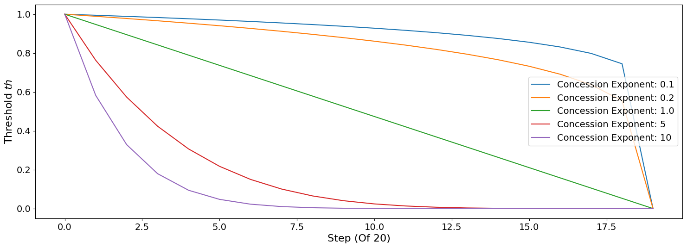

Developing an agent for SCML2021 (OneShot)
------------------------------------------

In 2021, we introduced a new track called SCML-OneShot which implements
a simplified problem in which the agent can focus on the many to many
concurrent negotiation problem without needing to worry about long term
planning or production planning as is the case with the standard and
collusion tracks.

**SCML-OneShot brief introduction** Please refer to the first tutorial
for a brief introduction about the world simulated in this game as well
as pointers to more information. We will assume knowledge of at least
this brief introduction in the remainder of this tutorial.

.. code:: ipython3

    from collections import defaultdict
    import random
    from negmas import ResponseType
    from scml.oneshot import *
    from scml.scml2020 import is_system_agent
    from pprint import pprint

    def try_agent(agent_type, n_processes=2):
        """Runs an agent in a world simulation against a randomly behaving agent"""
        return try_agents([RandomOneShotAgent, agent_type], n_processes)

    def try_agents(agent_types, n_processes=2, n_trials=1, draw=True, agent_params=None):
        """
        Runs a simulation with the given agent_types, and n_processes n_trial times.
        Optionally also draws a graph showing what happened
        """
        type_scores = defaultdict(float)
        counts = defaultdict(int)
        agent_scores = dict()
        for _ in range(n_trials):
            p = n_processes if isinstance(n_processes, int) else random.randint(*n_processes)
            world = SCML2020OneShotWorld(
            **SCML2020OneShotWorld.generate(agent_types, agent_params=agent_params, n_steps=10,
                                            n_processes=p, random_agent_types=True),
            construct_graphs=True,
            )
            world.run()

            all_scores = world.scores()
            for aid, agent in world.agents.items():
                if is_system_agent(aid):
                    continue
                key = aid if n_trials == 1 else f"{aid}@{world.id[:4]}"
                agent_scores[key] = (
                     agent.type_name.split(':')[-1].split('.')[-1],
                     all_scores[aid],
                     '(bankrupt)' if world.is_bankrupt[aid] else ''
                    )
            for aid, agent in world.agents.items():
                if is_system_agent(aid):
                    continue
                type_ = agent.type_name.split(':')[-1].split('.')[-1]
                type_scores[type_] += all_scores[aid]
                counts[type_] += 1
        type_scores = {k: v/counts[k] if counts[k] else v for k, v in type_scores.items()}
        if draw:
            world.draw(
                what=["contracts-concluded"],
                steps=(0, world.n_steps - 1),
                together=True, ncols=1, figsize=(20, 20)
            )
            plt.show()

        return world, agent_scores, type_scores

    def analyze_contracts(world):
        """
        Analyzes the contracts signed in the given world
        """
        import pandas as pd
        data = pd.DataFrame.from_records(world.saved_contracts)
        return data.groupby(["seller_name", "buyer_name"])[["quantity", "unit_price"]].mean()

    def print_agent_scores(agent_scores):
        """
        Prints scores of individiual agent instances
        """
        for aid, (type_, score, bankrupt) in agent_scores.items():
            print(f"Agent {aid} of type {type_} has a final score of {score} {bankrupt}")

    def print_type_scores(type_scores):
        """Prints scores of agent types"""
        pprint(sorted(tuple(type_scores.items()), key=lambda x: -x[1]))

Now we are ready to develop a do-nothing agent:

.. code:: ipython3

    class MyOneShotDoNothing(OneShotAgent):
        """My Agent that does nothing"""
        def propose(self, negotiator_id, state):
            return None
        def respond(self, negotiator_id, state, offer):
            return ResponseType.END_NEGOTIATION

    world, ascores, tscores = try_agent(MyOneShotDoNothing)

.. image:: 02.develop_agent_scml2020_oneshot_files/02.develop_agent_scml2020_oneshot_3_0.png

In all of the graph representing world simulations, we use short names
that represent the type of the agent. For example an agent named
``03Ran@1`` is an agent of type ``RandomOneShotAgent`` at production
level 1 that was the third agent to create. ``MDN`` here is a shorthand
for ``MyOneShotDoNothingAgent`` (we will usually remove ``OneShot`` and
``Agent`` from the name before shortening it).

Looking at the ``contracts-concluded``, we can see that none of the
concluded contracts involved our do-nothing agent. Nevertheless, these
agents still had *exogenous contracts* which means that they will lose
money. A do-nothing agent will usually lose money in this game.

Let’s check the scores of different agents to confirm:

.. code:: ipython3

    print_agent_scores(ascores)

.. parsed-literal::

    Agent 00MDN@0 of type MyOneShotDoNothing has a final score of 0.5618181128339336
    Agent 01Ran@0 of type RandomOneShotAgent has a final score of 0.933819980498316
    Agent 02MDN@0 of type MyOneShotDoNothing has a final score of 0.6849210221645556
    Agent 03MDN@0 of type MyOneShotDoNothing has a final score of 0.6039422056361495
    Agent 04MDN@1 of type MyOneShotDoNothing has a final score of 0.7754821463007091
    Agent 05MDN@1 of type MyOneShotDoNothing has a final score of 0.8958313153141294
    Agent 06Ran@1 of type RandomOneShotAgent has a final score of 0.803545995694227
    Agent 07Ran@1 of type RandomOneShotAgent has a final score of 0.9426235727688185
    Agent 08MDN@1 of type MyOneShotDoNothing has a final score of 0.48704975546325124
    Agent 09Ran@1 of type RandomOneShotAgent has a final score of 0.7924968546119284
    Agent 10Ran@1 of type RandomOneShotAgent has a final score of 0.9599564144107027
    Agent 11Ran@1 of type RandomOneShotAgent has a final score of 0.8833928132562742

Notice that our do-nothing agent always loses money. That is because it
cannot get any contracts from negotiation to satisfy its needs from the
exogenous contracts but it still has to pay for disposal cost and
shortfall penalty.

.. code:: ipython3

    print_type_scores(tscores)

.. parsed-literal::

    [('RandomOneShotAgent', 0.8859726052067113),
     ('MyOneShotDoNothing', 0.6681740929521213)]

Notice how the do-nothing agent is even worse than acting randomly. This
is usually the case in the OneShot game.

We can also have a look at the *exogenous* contracts that drive the
market.

.. code:: ipython3

    analyze_contracts(world)

.. raw:: html

    

    
    <table border="1" class="dataframe">
      <thead>
        <tr style="text-align: right;">
          <th></th>
          <th></th>
          <th>quantity</th>
          <th>unit_price</th>
        </tr>
        <tr>
          <th>seller_name</th>
          <th>buyer_name</th>
          <th></th>
          <th></th>
        </tr>
      </thead>
      <tbody>
        <tr>
          <th rowspan="5" valign="top">01Ran@0</th>
          <th>06Ran@1</th>
          <td>4.700000</td>
          <td>15.400000</td>
        </tr>
        <tr>
          <th>07Ran@1</th>
          <td>4.250000</td>
          <td>11.250000</td>
        </tr>
        <tr>
          <th>09Ran@1</th>
          <td>4.200000</td>
          <td>14.600000</td>
        </tr>
        <tr>
          <th>10Ran@1</th>
          <td>5.375000</td>
          <td>14.125000</td>
        </tr>
        <tr>
          <th>11Ran@1</th>
          <td>4.888889</td>
          <td>14.222222</td>
        </tr>
        <tr>
          <th>04MDN@1</th>
          <th>BUYER</th>
          <td>5.000000</td>
          <td>27.400000</td>
        </tr>
        <tr>
          <th>05MDN@1</th>
          <th>BUYER</th>
          <td>2.500000</td>
          <td>26.700000</td>
        </tr>
        <tr>
          <th>06Ran@1</th>
          <th>BUYER</th>
          <td>2.375000</td>
          <td>28.250000</td>
        </tr>
        <tr>
          <th>07Ran@1</th>
          <th>BUYER</th>
          <td>5.400000</td>
          <td>28.100000</td>
        </tr>
        <tr>
          <th>08MDN@1</th>
          <th>BUYER</th>
          <td>5.000000</td>
          <td>29.000000</td>
        </tr>
        <tr>
          <th>09Ran@1</th>
          <th>BUYER</th>
          <td>9.500000</td>
          <td>29.300000</td>
        </tr>
        <tr>
          <th>10Ran@1</th>
          <th>BUYER</th>
          <td>2.555556</td>
          <td>29.777778</td>
        </tr>
        <tr>
          <th>11Ran@1</th>
          <th>BUYER</th>
          <td>3.800000</td>
          <td>26.200000</td>
        </tr>
        <tr>
          <th rowspan="4" valign="top">SELLER</th>
          <th>00MDN@0</th>
          <td>9.600000</td>
          <td>10.900000</td>
        </tr>
        <tr>
          <th>01Ran@0</th>
          <td>9.800000</td>
          <td>10.200000</td>
        </tr>
        <tr>
          <th>02MDN@0</th>
          <td>8.300000</td>
          <td>9.700000</td>
        </tr>
        <tr>
          <th>03MDN@0</th>
          <td>9.300000</td>
          <td>10.500000</td>
        </tr>
      </tbody>
    </table>
    

There are few things to note about the distribution of the *exogenous*
contracts:

-  The unit price of the raw material is always lower than that of the
   final product. This is the source of profitability in this market.
-  Each agent has a different mean and standar deviation for the
   quantities in its exogenous contracts. This means that different
   agents will have different utility functions but these utility
   functions for different steps are related because the exogenous
   contract is sampled from some common distribution for each agent for
   all the steps which makes learning more useful in the game.

Building your own agent
~~~~~~~~~~~~~~~~~~~~~~~

A one-shot agent needs only to do negotiation. The simplest possible
version (``MyOneShotRandom`` above) just responded to offers from its
partners and proposed new offers to them.

Looking at the graph for the world simulation, we can see immediately
some features of the one-shot simulation that are not replicated in the
full SCML game:

-  All negotiation requests are accepted. In fact in the one-shot game,
   the agent need not consider requesting negotiations or deciding the
   negotiation agenda as the system takes care of this ensuring that on
   every simulated day every agent is negotiating with its suppliers and
   or consumers about trade on that day (and only that day).
-  Contracts in the one-shot game are always executed (despite not
   showing that in the graph). There is no concept of a breach. Failure
   to honor contracts is instead penalized monetarily. Contracts are
   also never cancelled or nullified. This greatly simplifies the
   problem as the agent does not need to keep track of contract
   execution.
-  Production is too fast that it does not affect the agent reasoning.
   In the terminology to be presented in the following tutorial, there
   is no need for an explicit production strategy.
-  There is no need to consider future negotiations while reasoning
   about a the current set of negotiations. This greatly simplifies
   agent design as there is no long-term planning. In the terminology to
   be presented in the following section, there is no need for a trading
   strategy

Your AWI
^^^^^^^^

As described in the `previous
tutorial <http://www.yasserm.com/scml/scml2020docs/tutorials/01.run_scml2020.html>`__,
your agent can sense and act in the simulation by accessing methods and
properties of its AWI which is accessible at any time as:

.. code:: python

   self.awi

You can see all of these methods and properties specific for the
**OneShotAWI** and its descendents
`here <http://www.yasserm.com/scml/scml2020docs/api/scml.oneshot.OneShotAWI.html>`__.

Your ufun
^^^^^^^^^

The Oneshot game has the advantage that it is possible at the end of
each simulation step (day) to calculate **exactly** the profit you will
be getting for the set of contracts you have (either through negotiation
or as exogenous contracts). We provide a utility function class
(`OneShotUtilityFunction <http://www.yasserm.com/scml/scml2020docs/api/scml.oneshot.OneShotUFun.html>`__
which can be used normally as any NegMAS
`UtilityFunction <http://www.yasserm.com/negmas/api/negmas.preferences.UtilityFunction.html>`__.
This ufun is available to your all the time (a new one is created for
each simulation step) and is accessible as:

.. code:: python

   self.ufun

The most important services this ufun class provides for you are the
following:

-  ``from_offers``: This method receives a list of outcomes and a list
   of booleans indicating whether each of them is for buying or for
   selling. It returns to you the profit you will get if all of these
   outcomes *and nothing else* became contracts. An outcome is just a
   tuple (quantity, delivery time, unit price). You can use this
   callback during negotiation to judge hypothetical agreements with
   your partners.
-  ``from_contracts``: This method is the same as ``from_offers`` but it
   receives a list of ``Contract`` objects. It is useful after all
   negotiations are finished to calculate the profit you will be getting
   for this step.
-  ``is_breach``: will tell you whether or not getting the given total
   input and output quantities will make you cause a breach. Notice that
   breaches are expected in the OneShot track as any mismatch in the
   quantities of inputs and outputs will constitute a breach.
-  ``breach_level``: returns a value between zero and one specifying the
   level of breach that will be recorded for a given total input and
   output quantities.
-  ``find_limit``: finds either the maximum or the minimum possible
   profit (minimum profit is maximm loss) attainable in the current
   simulation step (day). This is useful when you want to normalize
   utility values between zero and one. Two of the agents we will
   develop during this tutorial will use this feature.
-  ``max_utility``, ``min_utility``: give the maximum and minimum
   utilities/profits attainable. Note that you must prepare them by
   calling ``find_limit``. We will go into how to do that later.
-  ``best``, ``worst``: give more information about the cases of maximum
   and minimum profit (i.e. the total input and output quantity needed,
   the prodcible quantity, best possible prices for buying and selling,
   etc). Again, these are not available except after calling
   ``find_limit``.

Your callbacks
^^^^^^^^^^^^^^

Your agent needs to implement methods that are called by the system at
various time during the negotiation. You can find a full list in the
`game description <>`__.

The most important ones are:

-  ``init()`` called once at the beginning of the simulation
   (i.e. before the first day starts). At this point, your AWI is set
   but you should not assume anything else.
-  ``before_step()`` called at the **beginning** of *every day*. At this
   point, your ``ufun`` is set and market information is available.
-  ``step()`` called at the **end** of *every day*. You can use this to
   analyze what happened during the day and modify your strategy in the
   future.
-  ``on_negotiation_success()``/``on_negotiation_failure()`` called
   after each negotiation is concluded to let you know what happened in
   it.
-  Depending on your base-class, you will also need to implement methods
   that allow you to control negotiations. These will be explained in
   details in the following sections but here is a summary:

   -  **OneShotAgent** If your agent is based on ``OneShotAgent``, you
      will get a ``propose()`` call when you need to offer something to
      one of our partners during negotiation and ``respond()`` when
      asked to respond to one of its offers.
   -  **OneShotSyncAgent** If your agent is based on
      ``OneShotSyncAgent`` you will get a call to ``first_proposals()``
      once every day to set your first proposal in all negotiations and
      a ``counter_all()`` call to counter offers from your partners. The
      system will try to always give you one offer from each partner in
      the ``counter_all()`` call but that is not guaranteed and
      sometimes it may be called with a subset of the offers.
   -  **OneShotSingleAgreementAgent** If your agent is based on
      ``OneShotSingleAgreementAgent`` you will have to implement
      ``is_acceptable()`` to decide if a given offer is acceptable to
      you, ``best_offer()`` to find the *best* offer in a given
      negotiation for your agent and ``is_better()`` to compare two
      offers. Once you implement these, the agent will implement all
      callback for you trying to get **a single** agreement that
      maximizes your utility. Note that, again, it is not guaranteed
      that you will get a single agreement at the end but the system
      will try its best to achieve that.

Now we can start working on our agent.

There are three base classes for one-shot agents (``OneShotAgent``,
``SyncOneShotAgent``, and ``SingleAgreementOneShotAgent``). We will
discuss them in more details in what follows.

OneShotAgent
~~~~~~~~~~~~

This is the base class of all agents for SCML-OneShot. Both
``SyncOneShotAgent`` and ``SingleAgreementOneShotAgent`` inherit from
this class and provide support for a simplified way of developing your
agent (or so we think). It is perfectly OK to use ``OneShotAgent``
directly as the base of your agent.

We have already seen the ``OneShotAgent`` class for which you need to
override ``propose`` and may also override ``respond`` to handle
negotiations independently. The ``propose`` method receives the
negotiation state (an object of the type ``SAOState`` including among
other things the current negotiation step, relative time, last offer,
etc) and is required to return an ``Outcome`` (See ``negmas``
documentation) as an offer. The ``respond`` method receives a
negotiation state and an offer (``Outcome``) from the opponent and needs
to respond to it by a decision from the ``ResponseType`` enumeration
(``REJECT_OFFER``, ``ACCEPT_OFFER``, and ``END_NEGOTIATION``). Other
than these two negotiation related callbacks, the agent receives an
``init`` call just after it joins the simulatin and a ``step`` call
after each step. The agent is also informed about failure/success of
negotiations through the
``on_negotiation_success``/``on_negotiation_failure`` callbacks. That is
all. A one-shot agent needs to only think about what should it do to
respond to each of these six callbacks. All of these callbacks except
``propose`` are optional.

Simple OneShotAgent
^^^^^^^^^^^^^^^^^^^

We have already seen how to develop a do-nothing agent using the
``OneShotAgent`` class. Let’s try to develop some more meaningful agent
using the same base class.

.. code:: ipython3

    class SimpleAgent(OneShotAgent):
        """A greedy agent based on OneShotAgent"""

        def before_step(self):
            self.secured = 0

        def on_negotiation_success(self, contract, mechanism):
            self.secured += contract.agreement["quantity"]

        def propose(self, negotiator_id: str, state) -> "Outcome":
            return self.best_offer(negotiator_id)

        def respond(self, negotiator_id, state, offer):
            my_needs = self._needed(negotiator_id)
            if my_needs <= 0:
                return ResponseType.END_NEGOTIATION
            return (
                ResponseType.ACCEPT_OFFER
                if offer[QUANTITY] <= my_needs
                else ResponseType.REJECT_OFFER
            )

        def best_offer(self, negotiator_id):
            my_needs = self._needed(negotiator_id)
            if my_needs <= 0:
                return None
            ami = self.get_nmi(negotiator_id)
            if not ami:
                return None
            quantity_issue = ami.issues[QUANTITY]
            unit_price_issue = ami.issues[UNIT_PRICE]
            offer = [-1] * 3
            offer[QUANTITY] = max(
                min(my_needs, quantity_issue.max_value),
                quantity_issue.min_value
            )
            offer[TIME] = self.awi.current_step
            if self._is_selling(ami):
                offer[UNIT_PRICE] = unit_price_issue.max_value
            else:
                offer[UNIT_PRICE] = unit_price_issue.min_value
            return tuple(offer)

        def _needed(self, negotiator_id=None):
            return self.awi.current_exogenous_input_quantity + \
                   self.awi.current_exogenous_output_quantity - \
                   self.secured

        def _is_selling(self, ami):
            return ami.annotation["product"] == self.awi.my_output_product

    world, ascores, tscores = try_agent(SimpleAgent)

.. image:: 02.develop_agent_scml2020_oneshot_files/02.develop_agent_scml2020_oneshot_12_0.png

Let’s see how well did this agent behave:

.. code:: ipython3

    print_type_scores(tscores)

.. parsed-literal::

    [('SimpleAgent', 1.1834734588935005),
     ('RandomOneShotAgent', 0.40920799626165133)]

This simple agent is slightly better than the random agent. Let’s
understand how it works:

The main idea of this agent is pretty simple. It tries to *secure* as
much of its needs (sales/supplies) as possible in every negotiation at
the best possible price for itself.

To achieve this goal, the agent keeps track of the quantity it secured
in its ``init``, ``step`` and ``on_negotiation_success`` callbacks.

.. code:: python

   def before_step(self):
       self.secured = 0

   def on_negotiation_success(self, contract, mechanism):
       self.secured += contract.agreement["quantity"]

Moreover, it defines a helper that calculates the amount it needs by
subtracting the exogenous quantity it has from the amount it secured:

.. code:: python

   def _needed(self):
       return (
           self.awi.current_exogenous_input_quantity
           + self.awi.current_exogenous_output_quantity
           - self.secured
       )

Notice that either the exogenous input quantity or the exogenous output
quantity (or both) will always be zero. Now that the agent can calculate
how much it needs to buy/sell, it implements the negotiation related
call-backs (``propose`` and ``respond``).

Here is the full implementation of ``propose``:

.. code:: python

   def propose(self, negotiator_id: str, state) -> "Outcome":
       return self.best_offer(negotiator_id)

The agent is always offering its best offer which is calculated in the
``best_offer`` method to be discussed later. It does not conceed at all.

Responding to opponent offers is also simple:

-  it starts by calculating its needs using the helper ``needed``, and
   ends the negotiation if it needs no more sales/supplies

.. code:: python

       my_needs = self._needed()
       if my_needs <= 0:
           return ResponseType.END_NEGOTIATION

-  If the offered quantity is less than its needs, accept the offer.
   Otherwise reject the offer.

.. code:: python

       return (
           ResponseType.ACCEPT_OFFER
           if offer[QUANTITY] <= my_needs
           else ResponseType.REJECT_OFFER
       )

Most of the code is in the ``best_offer`` method which calculates the
best offer for a negotiation *given the agreements reached so far*.
Let’s check it line by line:

-  The agent checks its needs and returns ``None`` ending the
   negotiation if it needs no more sales/supplies. We also get access to
   the AMI.

.. code:: python

       my_needs = self._needed()
       if my_needs <= 0:
           return None
       ami = self.get_nmi(negotiator_id)
       if not ami:
           return None

-  It then finds out the ``Issue`` objects corresponding to the quantity
   and unit-price for this negotiation and initializes an offer (we have
   3 issues)

.. code:: python

       quantity_issue = ami.issues[QUANTITY]
       unit_price_issue = ami.issues[UNIT_PRICE]
       offer = [-1] * 3

-  The time is always the current step.

.. code:: python

       offer[TIME] = self.awi.current_step

-  The quantity to offer is simply the needs of the agent without mapped
   within the range of the quantities in the negotiation agenda (note
   that this may lead the agent to buy more than its needs).

.. code:: python

       offer[QUANTITY] = max(min(my_needs, quantity_issue.max_value), quantity_issue.min_value)

-  Finally, the unit price is the maximum possible unit price if the
   agent is selling otherwise it is the minimum possible price. Note
   that ``is_selling()`` assumes that the agent will never find itself
   in a middle layer in a deep negotiation. We will alleviate this issue
   later.

.. code:: python

       if self._is_selling(ami):
           offer[UNIT_PRICE] = unit_price_issue.max_value
       else:
           offer[UNIT_PRICE] = unit_price_issue.min_value
       return tuple(offer)

A better greedy agent
~~~~~~~~~~~~~~~~~~~~~

One problem with our ``SimpleAgent`` is that it does not take price into
account in two ways:

-  When asked to ``propose``, it *always* proposes an offer with the
   best price for itself. It **never concedes** on prices. In many cases
   this will lead to disagreement.
-  When asked to ``respond`` to an offer, *it does not even check the
   price*. This may lead to bad agreements (i.e. very high buying
   prices/very low selling prices).

We will try to remedie both of these issues in the following agent:

.. code:: ipython3

    class BetterAgent(SimpleAgent):
        """A greedy agent based on OneShotAgent with more sane strategy"""

        def __init__(self, *args, concession_exponent=0.2, **kwargs):
            super().__init__(*args, **kwargs)
            self._e = concession_exponent

        def propose(self, negotiator_id: str, state) -> "Outcome":
            offer = super().propose(negotiator_id, state)
            if not offer:
                return None
            offer = list(offer)
            offer[UNIT_PRICE] = self._find_good_price(
                self.get_nmi(negotiator_id), state
            )
            return tuple(offer)

        def respond(self, negotiator_id, state, offer):
            response = super().respond(negotiator_id, state, offer)
            if response != ResponseType.ACCEPT_OFFER:
                return response
            ami = self.get_nmi(negotiator_id)
            return (
                response if
                self._is_good_price(ami, state, offer[UNIT_PRICE])
                else ResponseType.REJECT_OFFER
            )

        def _is_good_price(self, ami, state, price):
            """Checks if a given price is good enough at this stage"""
            mn, mx = self._price_range(ami)
            th = self._th(state.step, ami.n_steps)
            # a good price is one better than the threshold
            if self._is_selling(ami):
                return (price - mn) >= th * (mx - mn)
            else:
                return (mx - price) >= th * (mx - mn)

        def _find_good_price(self, ami, state):
            """Finds a good-enough price conceding linearly over time"""
            mn, mx = self._price_range(ami)
            th = self._th(state.step, ami.n_steps)
            # offer a price that is around th of your best possible price
            if self._is_selling(ami):
                return mn + th * (mx - mn)
            else:
                return mx - th * (mx - mn)

        def _price_range(self, ami):
            """Finds the minimum and maximum prices"""
            mn = ami.issues[UNIT_PRICE].min_value
            mx = ami.issues[UNIT_PRICE].max_value
            return mn, mx

        def _th(self, step, n_steps):
            """calculates a descending threshold (0 <= th <= 1)"""
            return ((n_steps - step - 1) / (n_steps - 1)) ** self._e

    world, ascores, tscores = try_agent(BetterAgent)

.. image:: 02.develop_agent_scml2020_oneshot_files/02.develop_agent_scml2020_oneshot_17_0.png

Let’s see how well did this agent behave:

.. code:: ipython3

    print_type_scores(tscores)

.. parsed-literal::

    [('BetterAgent', 1.9375134565879335),
     ('RandomOneShotAgent', 0.04304236536779151)]

It seems that ``BetterAgent`` is getting higher scores than
``SimpleAgent`` as expected. Let’s dive into the agent and analyze how
it works:

The main idea in ``BetterAgent`` is to treat the *price* issue
separately to avoid the two issues presented earlier:

-  **Never conceding during proposal** This is solved in the ``propose``
   method by just overriding the price with a ``good-enough`` price:

   .. code:: python

        offer[UNIT_PRICE] = self._find_good_price(self.get_nmi(negotiator_id), state)

   As an aside, notice that we needed to convert the offer to a list in
   order to overwrite the price then back into a tuple to send it to the
   partner.

-  **Never checking prices of offers** This is solved in the ``respond``
   method by checking whether or not the price offered is a
   ``good-enough`` price:

   .. code:: python

        return (
            response
            if self._is_good_price(ami, state, offer[UNIT_PRICE])
            else ResponseType.REJECT_OFFER
        )

What we mean by a ``good-enough`` price is defined in ``_is_good_price``
and ``_find_good_price`` methods. Both start by getting the limits of
the unit-price in the negotiation agenda and a threshold value ``th``:

.. code:: python

   mn, mx = self._price_range(ami, state)
   th = self._th(mn, mx, state.step, ami.n_steps)

The price range is clear enough. For the threshold ``th`` is a value
that starts at :math:`1.0` and goes down toward :math:`0.0` over the
negotiation time under the control of an agent specific parameter ``_e``
called the concession exponent. Let’s see how does this look for
different concession exponents:

.. code:: ipython3

    x = np.arange(20)
    fig = plt.figure()
    for e in [0.1, 0.2, 1.0, 5, 10]:
        a = BetterAgent(concession_exponent=e)
        y = [a._th(i, 20) for i in x]
        plt.plot(x, y, label=f"Concession Exponent: {e}")
        plt.xlabel("Step (Of 20)"); plt.ylabel("Threshold $th$")
        plt.legend()

You can see that the smaller the exponent the more *hard-headed* will
the agent be. Setting the concession exponent to :math:`0` will recover
the behavior of the ``SimpleAgent`` in offering but will make it
insisting on an unrealistic best price when responding to partner offers
(can you see why?) which is definitely a bad idea. Setting it to
:math:`\inf` will recover the behavior of ``SimpleAgent`` in responding
to offers but will make its offers least favorable for itself in terms
of price (can you see why?)

Given this threshold function, we can now define ``is_good_price`` and
``_find_good_price``:

-  ``_is_good_price`` simply compares the price given to it to the
   current threshold defined by multiplying ``th`` by the price
   range\ ``mx - mn``

   -  When selling this is achieved by comparing the difference between
      the price and minimum price to the curren threshold:

   .. code:: python

      return (price - mn) >= th * (mx - mn)

   You can check that this will give the maximum unit price in the first
   step and gradually goes down to the minimum unit price in the last
   step (``n_steps - 1``)

   -  When buying we go the other way around (starting at minimum price
      and going up over time to the maximum price):

   .. code:: python

      return (mx - price) >= th * (mx - mn)

-  ``_find_good_price`` works in the same fashion but rather than
   checking the goodness of a price, it simply uses the threshold to
   generate a ``good-enough`` price:
   ``python     if self._is_selling(ami):         return mn + th * (mx - mn)     else:         return mx - th * (mx - mn)``

Thinking about other negotiations
~~~~~~~~~~~~~~~~~~~~~~~~~~~~~~~~~

So far, our agent behaved **indepdendently** in each negotiation without
considering what is happening in the others (except when one of them
completes changing the amount ``secured``). A simple way to consider
other negotiations is to use the prices offered in them to limit our
concessions. The following agent implements this idea

.. code:: ipython3

    class AdaptiveAgent(BetterAgent):
        """Considers best price offers received when making its decisions"""

        def before_step(self):
            super().before_step()
            self._best_selling, self._best_buying = 0.0, float("inf")

        def respond(self, negotiator_id, state, offer):
            """Save the best price received"""
            response = super().respond(negotiator_id, state, offer)
            ami = self.get_nmi(negotiator_id)
            if self._is_selling(ami):
                self._best_selling = max(offer[UNIT_PRICE], self._best_selling)
            else:
                self._best_buying = min(offer[UNIT_PRICE], self._best_buying)
            return response

        def _price_range(self, ami):
            """Limits the price by the best price received"""
            mn, mx = super()._price_range(ami)
            if self._is_selling(ami):
                mn = max(mn, self._best_selling)
            else:
                mx = min(mx, self._best_buying)
            return mn, mx

    world, ascores, tscores = try_agent(AdaptiveAgent)

.. image:: 02.develop_agent_scml2020_oneshot_files/02.develop_agent_scml2020_oneshot_23_0.png

Let’s see how well did this agent behave:

.. code:: ipython3

    print_type_scores(tscores)

.. parsed-literal::

    [('AdaptiveAgent', 1.6540962807223063),
     ('RandomOneShotAgent', 0.09027638393369423)]

Not as good as the previous agent at least in this simulation (we will
make a more rigorous comparison later). One possiblity here is that the
agent became too hard-headed again because now whenever it sees a good
price on one negotiation, it insists on it for all the rest. This may
not be a good idea sometimes as it may lead to more disagreements. In
general *the agent must balance getting good prices with matching its
input and output quantities*.

Learning over time
~~~~~~~~~~~~~~~~~~

Up until now, our simple agents did not change their behavior over
simulation time. Whatever they do in one day depends only on information
about what is happening on that day. This may not be optimal. For one,
the agent may be able to learn about different partners over the
simulation time. The following agent tries to do that in a *simplistic*
manner by changing the limits of the price it is willing to accept based
on accomulated statistics per agent

.. code:: ipython3

    class LearningAgent(AdaptiveAgent):
        def __init__(
            self,
            *args,
            acc_price_slack=float("inf"),
            step_price_slack=0.0,
            opp_price_slack=0.0,
            opp_acc_price_slack=0.2,
            range_slack = 0.03,
            **kwargs
        ):
            super().__init__(*args, **kwargs)
            self._acc_price_slack = acc_price_slack
            self._step_price_slack = step_price_slack
            self._opp_price_slack = opp_price_slack
            self._opp_acc_price_slack = opp_acc_price_slack
            self._range_slack = range_slack

        def init(self):
            """Initialize the quantities and best prices received so far"""
            super().init()
            self._best_acc_selling, self._best_acc_buying = 0.0, float("inf")
            self._best_opp_selling = defaultdict(float)
            self._best_opp_buying = defaultdict(lambda: float("inf"))
            self._best_opp_acc_selling = defaultdict(float)
            self._best_opp_acc_buying = defaultdict(lambda: float("inf"))

        def step(self):
            """Initialize the quantities and best prices received for next step"""
            super().step()
            self._best_opp_selling = defaultdict(float)
            self._best_opp_buying = defaultdict(lambda: float("inf"))

        def on_negotiation_success(self, contract, mechanism):
            """Record sales/supplies secured"""
            super().on_negotiation_success(contract, mechanism)

            # update my current best price to use for limiting concession in other
            # negotiations
            up = contract.agreement["unit_price"]
            if self._is_selling(mechanism):
                partner = contract.annotation["buyer"]
                self._best_acc_selling = max(up, self._best_acc_selling)
                self._best_opp_acc_selling[partner] = max(up, self._best_opp_acc_selling[partner])
            else:
                partner = contract.annotation["seller"]
                self._best_acc_buying = min(up, self._best_acc_buying)
                self._best_opp_acc_buying[partner] = min(up, self._best_opp_acc_buying[partner])

        def respond(self, negotiator_id, state, offer):
            # find the quantity I still need and end negotiation if I need nothing more
            response = super().respond(negotiator_id, state, offer)
            # update my current best price to use for limiting concession in other
            # negotiations
            ami = self.get_nmi(negotiator_id)
            up = offer[UNIT_PRICE]
            if self._is_selling(ami):
                partner = ami.annotation["buyer"]
                self._best_opp_selling[partner] = max(up, self._best_selling)
            else:
                partner = ami.annotation["seller"]
                self._best_opp_buying[partner] = min(up, self._best_buying)
            return response

        def _price_range(self, ami):
            """Limits the price by the best price received"""
            mn = ami.issues[UNIT_PRICE].min_value
            mx = ami.issues[UNIT_PRICE].max_value
            if self._is_selling(ami):
                partner = ami.annotation["buyer"]
                mn = min(mx * (1 - self._range_slack), max(
                    [mn]
                    + [
                        p * (1 - slack)
                        for p, slack in (
                            (self._best_selling, self._step_price_slack),
                            (self._best_acc_selling, self._acc_price_slack),
                            (self._best_opp_selling[partner], self._opp_price_slack),
                            (
                                self._best_opp_acc_selling[partner],
                                self._opp_acc_price_slack,
                            ),
                        )
                    ]
                ))
            else:
                partner = ami.annotation["seller"]
                mx = max(mn * (1 + self._range_slack),  min(
                    [mx]
                    + [
                        p * (1 + slack)
                        for p, slack in (
                            (self._best_buying, self._step_price_slack),
                            (self._best_acc_buying, self._acc_price_slack),
                            (self._best_opp_buying[partner], self._opp_price_slack),
                            (
                                self._best_opp_acc_buying[partner],
                                self._opp_acc_price_slack,
                            ),
                        )
                    ]
                ))
            return mn, mx

    world, ascores, tscores = try_agent(LearningAgent)

.. image:: 02.develop_agent_scml2020_oneshot_files/02.develop_agent_scml2020_oneshot_28_0.png

.. code:: ipython3

    print_type_scores(tscores)

.. parsed-literal::

    [('LearningAgent', 1.3687108068212783),
     ('RandomOneShotAgent', 0.6337669285716161)]

The main idea of this agent is to limit the minimum price (for selling)
and/or maximum price (for buying) based on events not only in this day
but up until now. To do that, the agent accomulates best prices received
in the same way ``AdaptiveAgent`` did in ``init()`` and ``step()``.

There are four simple differences between this agent and the previous
one:

1. It allows a controlled ``slack`` in price constraining. For example,
   if an agent of this type received a selling price of :math:`10`, it
   will limit the minimum price considered *good-enough* in other
   negotiations to :math:`10 \times (1 - s)` where :math:`s` is the
   slack term (e.g. setting :math:`s=0.1`, leads to accepting offers at
   a price of :math:`9` as good enough). This may give the agent more
   flexibility and most importantly, this parameter **can be learned
   offline using any appropriate ML method**
2. A best price **per partner** is kept in a ``defaultdict()`` that is
   initialized in ``init`` and updated in the same way the *partner
   independent* best prices are updated
3. An ``accumulated`` statistic is kept (one for wll agents and one per
   agent) that is only initialized in ``init()`` and keeps being
   adjusted in ``on_negotiation_success`` without being reset in
   ``step()``
4. It keeps a ``range_slack`` to avoid setting too high minimum (or too
   low maximum) price. In effect, if the ``range_slack`` is :math:`x`
   then prices within the best :math:`100x\%` of the best price are
   *always considered good enough*

The main logic is in ``_price_range()``. As usual, it starts by getting
the price range from the ``AMI``:

.. code:: python

   mn = ami.issues[UNIT_PRICE].min_value
   mx = ami.issues[UNIT_PRICE].max_value

If the agent is a seller, it finds the partner ID:

.. code:: python

   partner = ami.annotation["buyer"]

Now that the partner is known, we can read the best offers received so
far (in this day and over all days) for this partner. We can also
retrieve the corresponding two partner-independent best prices with the
corresponding slacks:

.. code:: python

   (
       (self._best_selling, self._step_price_slack),
       (self._best_acc_selling, self._acc_price_slack),
       (self._best_opp_selling[partner], self._opp_price_slack),
       (
           self._best_opp_acc_selling[partner],
           self._opp_acc_price_slack,
       ),
   )

For each price :math:`p` and slack value :math:`slack`, we find the
corrsponding price limit as:

.. code:: python

   p * (1 - slack)

We then set the *good-enough* price limit to be the **maximum** of these
four prices and the minimum price of the current negotiation (adjusted
by the ``range_slack`` value). Finally we make sure that this is not too
high by taking the **minimum** of this value and the maximum price of
the current negotiation.

More General Simple Agent (advanced)
~~~~~~~~~~~~~~~~~~~~~~~~~~~~~~~~~~~~

.. container::

   This section is not necessary for SCML-OneShot 2022 competition
   because all worlds in the competition will have exactly 2 processes
   (3 products). It is here for readers interested in making their
   agents future-proof.

One issue that the ``SimpleAgent`` had was that it assumed that it is
either in the first level of the production chain or in the last level.
To make an agent that works anywhere, we need just minor modifications:

.. code:: ipython3

    class DeepSimpleAgent(SimpleAgent):
        """A greedy agent based on OneShotSyncAgent that does something
        when in the middle of the production chain"""

        def before_step(self):
            self._sales = self._supplies = 0

        def on_negotiation_success(self, contract, mechanism):
            if contract.annotation["product"] == self.awi.my_input_product:
                self._sales += contract.agreement["quantity"]
            else:
                self._supplies += contract.agreement["quantity"]

        def _needed(self, negotiator_id):
            summary = self.awi.exogenous_contract_summary
            secured = (
                self._sales
                if self._is_selling(self.get_nmi(negotiator_id))
                else self._supplies
            )
            demand = min(summary[0][0], summary[-1][0]) / (self.awi.n_competitors + 1)
            return  demand - secured

Firstly, we now keep track of our sales and supplies separately:

.. code:: python

   def before_step(self):
       self._sales = self._supplies = 0

   def on_negotiation_success(self, contract, mechanism):
       if contract.annotation["seller"] == self.id:
           self._sales += contract.agreement["quantity"]
       else:
           self._supplies += contract.agreement["quantity"]

To find out whether a contract is for sales or supplies, we simply check
that the ``seller`` in the contract annotation is us.

We need now one more chanage which is to separate the calculation of our
needs for supplies and sales:

.. code:: python

   def _needed(self, negotiator_id):
       summary = self.awi.exogenous_contract_summary
       secured = (
           self._sales if self._is_selling(self.get_nmi(negotiator_id)) else self._supplies
       )
       demand = min(summary[0][0], summary[-1][0]) / (self.awi.n_competitors + 1)
       return demand - secured

here we start by reading the summary information of exogenous contracts
into ``summary``. This is a list of two valued tuples giving the
**total** quantity and **total** price (in that order) of all current
exogenous contracts for all products. We also find the amount we secured
(depending on whether this is a buy or a sell negotiation) and the
number of competitors (i.e. agents in the same production level as us).
We assume that we need to buy (and sell) the same quantity as the
minimum of the raw material and final product exogenous contracts
divided equally between us and our competitors (we add one to
``n_competitors`` to count ourselves).

Now, let’s see how does this agent behave compared with the previous
agent in a deep world simulation

.. code:: ipython3

    world, ascores, tscores = try_agents([BetterAgent, DeepSimpleAgent], n_processes=3)

.. image:: 02.develop_agent_scml2020_oneshot_files/02.develop_agent_scml2020_oneshot_34_0.png

Examining the graph above, you can see that ``DeepSimple`` agents could
get contracts when they were in the middle of the production chain. The
``Simple`` agent on the other hand cannot do so.

Agents in the package ``scml.oneshot.agents`` were designed to work in
deep production graphs not only in the first and last layer whenever
that is possible.

We can check the results now:

.. code:: ipython3

    print_type_scores(tscores)

.. parsed-literal::

    [('DeepSimpleAgent', 0.7988395672301384), ('BetterAgent', 0.7647935048997926)]

Even though our new ``DeepSimpleAgent`` was able to get contracts which
in the middle, it seems that it did worse than ``SimpleAgent`` in terms
of final profits. This may be just a quirk of this specific
configuration. We will leave it to the reader to investigate this issue
(if they choose to).

Given that the utility function of the agent is defined in terms of a
*complete set of contracts*, it is not trivial to define a utility
function for each negotiation independent from the others (which is why
this is an inherently concurrent negotiation world). It may be easier
then to think of all negotiations in a synchronized manner. This means
that the agent keeps collecting offers from its partners and when it has
a *complete set*, it responds to all of them. Moreover, to start
negotiations in which the agent finds itself the first propsoer, it
needs to define a first proposal for each negotiation. This is why
``SyncOneShotAgent`` allows you to do.

You can now start developing your own agent for SCML-OneShot (A startup
skeleton project is available here). The rest of this tutorial will
introduce two other optional alternatives

OneShotSyncAgent
~~~~~~~~~~~~~~~~

One problem that plagued all of our agents so far is that they have to
make decisions (``respond``, ``propose``) about negotiations **on the
spot**. This makes it difficult to consider **all other negotiations**
while making decisions.

Because the utility function is defined for **a complete set of
negotiation agreements** and not for any single negotiation by itself,
it makes sense to try to make decisions **centrally** by collecting
offers from partners then responding to all of them at once. It is
possible to do that by utilizing the response type ``ResponseType.WAIT``
supported by NegMAS but this entails a lot of house-keeping.

To simplify this task, we provide another base class for agents that
does all of this house keeping for you exposing a simple interface that
**syncrhonizes** all negotiations (as much as allowed by the underlying
platform). The main goal of this base agent is to allow the developer to
think about *all negotiations together* but it has some important
caveats which we will discuss later. Here is an example of writing the
do-nothing agent in this form:

.. code:: ipython3

    from negmas import SAOResponse
    class MySyncOneShotDoNothing(OneShotSyncAgent):
        """My Agent that does nothing"""
        def counter_all(self, offers, states):
            """Respond to a set of offers given the negotiation state of each."""
            return dict(zip(self.negotiators.keys(),
                            [SAOResponse(ResponseType.END_NEGOTIATION, None)]
                            * len(self.negotiators)
                           ))

        def first_proposals(self):
            """Decide a first proposal on every negotiation.
            Returning None for a negotiation means ending it."""
            return dict(zip(self.negotiators.keys(),
                            [None] * len(self.negotiators)
                           ))

    world, ascores, tscores = try_agent(MySyncOneShotDoNothing)

.. image:: 02.develop_agent_scml2020_oneshot_files/02.develop_agent_scml2020_oneshot_40_0.png

As you can see, in this case, we need to override ``counter_all`` to
counter offers received from *all* the partners and ``first_proposals``
to decide a first offer for *each* partner. Notice that this is a
many-to-many negotiation scenario. This means that if multiple agents at
every level are using sync variants, loops may happen with the
possiblity of a deadlock.

For that reason the system will randomly break such loops when they
happen which implies that **``counter_all`` may receive a subset of the
offers from partners not all of them**. In the worst case,
``counter_all`` may receive just one offer each time from one of the
partners losing all synchronity between responses.

Other than these two negotiation related callbacks, the agent receives
an ``init`` call just after it joins the simulatin and a ``step`` call
after each step. The agent is also informed about failure/success of
negotiations through the
``on_negotiation_success``/``on_negotiation_failure`` callbacks. That is
all. A one-shot agent needs to only think about what should it do to
respond to each of these six callbacks. All of these callbacks except
``counter_all`` and ``first_proposals`` are optional.

SyncAgent
^^^^^^^^^

The main advantage of using the ``OneShotSyncAgent`` is that you do not
need to keep track of state variables (like ``secured``, ``_supplies``
and ``_sales`` used earlier) and you have a common place to make your
decisions about **all** negotiations at the same time. Here is a simple
greedy agent using this approach.

.. code:: ipython3

    class SyncAgent(OneShotSyncAgent, BetterAgent):
        """A greedy agent based on OneShotSyncAgent"""

        def __init__(self, *args, threshold=0.5, **kwargs):
            super().__init__(*args, **kwargs)
            self._threshold = threshold

        def before_step(self):
            super().before_step()
            self.ufun.find_limit(True)
            self.ufun.find_limit(False)

        def first_proposals(self):
            """Decide a first proposal on every negotiation.
            Returning None for a negotiation means ending it."""
            return  dict(zip(
                    self.negotiators.keys(),
                    (self.best_offer(_) for _ in self.negotiators.keys())
            ))

        def counter_all(self, offers, states):
            """Respond to a set of offers given the negotiation state of each."""
            responses = {
                k: SAOResponse(ResponseType.REJECT_OFFER, v)
                for k, v in self.first_proposals().items()
            }
            my_needs = self._needed()
            is_selling = ( self._is_selling(self.get_nmi(_)) for _ in offers.keys() )
            sorted_offers = sorted(
                zip(offers.values(), is_selling),
                key=lambda x: (- x[0][UNIT_PRICE]) if x[1] else x[0][UNIT_PRICE]
            )
            secured, outputs, chosen = 0, [], dict()
            for i, k in enumerate(offers.keys()):
                offer, is_output = sorted_offers[i]
                secured += offer[QUANTITY]
                if secured >= my_needs:
                    break
                chosen[k] = offer
                outputs.append(is_output)

            u = self.ufun.from_offers(tuple(chosen.values()), tuple(outputs))
            rng = self.ufun.max_utility - self.ufun.min_utility
            threshold = self._threshold * rng + self.ufun.min_utility
            if u >= threshold:
                for k, v in chosen.items():
                    responses[k] = SAOResponse(ResponseType.ACCEPT_OFFER, None)
            return responses

    world, ascores, tscores = try_agent(SyncAgent)

.. image:: 02.develop_agent_scml2020_oneshot_files/02.develop_agent_scml2020_oneshot_43_0.png

This agent shows a case of parameterizing your agent so that it can be
tested with different hyper-parameters. You do that by passing whatever
parameters you like as keyword arguments to the constctor:

.. code:: python

   def __init__(self, *args, threshold=0.3, **kwargs):
       super().__init__(*args, **kwargs)
       self._threshold = threshold

The one paramter we have is a threshold of utility relative to the
maximum possile utility that we are willing to accept.

This agent also shows a case in which we use the built-in utility
function implemented by the system (see `Section 2.3 of the game
description <http://www.yasserm.com/scml/scml2021oneshot.pdf>`__). This
ufun is accessible as ``ufun``. By default the ufun will return the
profit in dollars for a given set of negotiation outcomes, offers,
agreements, or contracts. Note that the ufun assumes that what it is
given *is the complete set of agreements and no others will be added to
them later*. This value may be positive or negative (loss). In some
cases you need to get the utility value normalized to a range between
zero and one. This agent will do that. To do this normalization, we need
to know the value of maximum and minimum utilities. You can of course
solve the corresponding optimziation problem but we did that for you.
All you need is call ``find_limit`` and pass it a boolean (``True`` for
calculating the highest possible utility and ``False`` for calculating
the lowest possible utility). To avoid doing this calculation
repeatedly, you should store the results in ``ufun.best`` or
``ufun.worst`` for highest and lowest utility. After that, you can
access the maximum possible utility as ``max_utility`` and minimum
possible utility as ``min_utility``. We do that in the ``before_step()``
method (called at the beginning of every day):

.. code:: python

    def before_step(self):
        super().init()
        self.ufun.find_limit(True)
        self.ufun.find_limit(False)

After this call, we can access ``maximum_utility``, ``minimum_utility``,
``best``, ``worst`` members of the ufun. As explained earlier, ``best``
and ``worst`` give extra information about the conditions for achieving
maximum and minimum utility.

We need to implement two methods: ``first_proposals`` (to generate a
good first proposal for each negotiation) and ``counter_all`` (for
countering a set of offers). We inherit from ``SimpleAgent`` in order to
get access to ``best_offer`` and ``_is_selling`` methods (we could have
repeated them here again of course. Note that, because of the way
inheritence works in python, we must inherit from ``OneShotSyncAgent``
before ``SimpleAgent``.

The first set of proposals in ``first_proposals`` is simply the
``best_offer`` for each negotiation which is calculated using this
generator expression:

.. code:: python

   (self.best_offer(_) for _ in self.negotiators.keys())

Almost all the code now resides in the ``counter_all`` method. We will
go over it here:

-  We start by initializing our response by the best offer for each
   negotiation using ``first_proposals`` and calculating our needs using
   ``_needed``

.. code:: python

   responses = {
       k: SAOResponse(ResponseType.REJECT_OFFER, _)
       for k, v in self.first_proposals().items()
   }
   my_needs = self._needed(None)

-  We then sort the offers so that earlier offers have *better* prices
   for us. For sell offers, this means descendingly and for buy offers
   ascendingly.

.. code:: python

   is_selling = (self._is_selling(self.get_nmi(_)) for _ in offers.keys())
   sorted_offers = sorted(
       zip(offers.values(), is_selling),
       key=lambda x: (-x[0][UNIT_PRICE]) if x[1] else x[0][UNIT_PRICE],
   )

-  We *greedily* find a set of offers that satisfy all our needs (or as
   much as possible from them).

.. code:: python

   secured, outputs, chosen = 0, [], dict()
   for i, k in enumerate(offers.keys()):
       offer, is_output = sorted_offers[i]
       secured += offer[QUANTITY]
       if secured >= my_needs:
           break
       chosen[k] = offer
       outputs.append(is_output)

-  Finally, we calculate the utility of accepting these *and only these*
   offers and accept the chosen offers if they provide 70% of the
   maximum possible utility. Otherwise, we reject all offers sending the
   default ``best_offer`` value back.

.. code:: python

   u = self.ufun.from_offers(tuple(chosen.values()), tuple(outputs))
   rng = self.ufun.max_utility - self.ufun.min_utility
   threshold = self._threshold * rng + self.ufun.min_utility
   if u >= threshold:
       for k, v in chosen.items():
           responses[k] = SAOResponse(ResponseType.ACCEPT_OFFER, None)
   return responses

Let’s see how did it do:

.. code:: ipython3

    print_type_scores(tscores)

.. parsed-literal::

    [('SyncAgent', 1.081781283820725), ('RandomOneShotAgent', 0.8713396060467092)]

This base-class simplifies the job of the agent developer by providing a
single function (``counter_all``) in which to handle all offers it
receive (most of the time, remember that sometimes you will receive a
subset of the offers in the call). In principle the agent can then
decide to accept a few of these offers and keep negotiating.

In many cases, it may be possible to secure all of the agent’s needs
(i.e. supplies or sales) using a **single** contract with one of its
partners. In such cases, the agent can think about the negotiations it
is engaged in as a **competetive negotiation** not very dissimilar from
an auction that also allows it to offer. This can lead to a further
simplification, the agent can be designed to get **at most one
agreement** from the set of negotiation and end all the rest once this
is achieved. This is what the ``SingleAgreementOneShotAgent`` does.

SingleAgreementOneShotAgent
~~~~~~~~~~~~~~~~~~~~~~~~~~~

This base classs allows you to develop agents that can get **at most**
one agreement from the set of negotiation at every simulation step.

This controller manages a set of negotiations from which only a single
one – at most – is likely to result in an agreement. To guarentee a
single agreement, pass ``strict=True``.

The general algorithm for this controller is something like this:

-  Receive offers from all partners.

-  Find the best offer among them by calling the abstract ``best_offer``
   method.

-  Check if this best offer is acceptable using the abstract
   ``is_acceptable`` method.

   -  If the best offer is acceptable, accept it and end all other
      negotiations.
   -  If the best offer is still not acceptable, then all offers are
      rejected and with the partner who sent it receiving the result of
      ``best_outcome`` while the rest of the partners receive the result
      of ``make_outcome``.

-  The default behavior of ``best_outcome`` is to return the outcome
   with maximum utility.

-  The default behavior of ``make_outcome`` is to return the best offer
   received in this round if it is valid for the respective negotiation
   and the result of ``best_outcome`` otherwise.

To use this agent, you need to implement three methods:

-  ``is_acceptable`` decides whether an offer is now acceptable. For
   this simple agent, we accept an offer if it provides us with a
   decreasing fraction of the maximum utility attainable. Notice that,
   because we set ``mn`` to ``min_utility``, the agent may actually
   accept offers with negative utility!! This can easily be fixed by
   setting ``mn`` to zero but will lead to much less trade.

.. code:: python

   mx, mn = self.ufun.max_utility, self.ufun.min_utility
   u = (self.ufun(offer) - mn) / (mx - mn)
   return u >= (1 - state.relative_time)

-  ``best_offer`` finds the best offer among a set of offers. Here we
   simply compare their utility

.. code:: python

   ufuns = [(self.ufun(_), i) for i, _ in enumerate(offers.values())]
   keys = list(offers.keys())
   return keys[max(ufuns)[1]]

-  ``is_better`` which compares two offers from the same negotiator. We
   simply compare their utility value:

.. code:: python

   return self.ufun(a) > self.ufun(b)

Here is the full agent

.. code:: ipython3

    class SimpleSingleAgreementAgent(OneShotSingleAgreementAgent):
        """A greedy agent based on OneShotSingleAgreementAgent"""

        def before_step(self):
            self.ufun.find_limit(True) # finds highest utility
            self.ufun.find_limit(False) # finds lowest utility

        def is_acceptable(self, offer, source, state) -> bool:
            mx, mn = self.ufun.max_utility , self.ufun.min_utility
            u = (self.ufun(offer) - mn) / (mx - mn)
            return  u >= (1-state.relative_time)

        def best_offer(self, offers):
            ufuns = [(self.ufun(_), i)
                     for i, _ in enumerate(offers.values())]
            keys = list(offers.keys())
            return keys[max(ufuns)[1]]

        def is_better(self, a, b, negotiator, state):
            return self.ufun(a) > self.ufun(b)

    world, ascors, tscores = try_agent(SimpleSingleAgreementAgent)

.. image:: 02.develop_agent_scml2020_oneshot_files/02.develop_agent_scml2020_oneshot_48_0.png

.. code:: ipython3

    print_type_scores(tscores)

.. parsed-literal::

    [('SimpleSingleAgreementAgent', 0.8667195207905396),
     ('RandomOneShotAgent', 0.31892984970939936)]

Using Independent Negotiators
~~~~~~~~~~~~~~~~~~~~~~~~~~~~~

The SCML game is at its core a concurrent negotiation problem. That is
why the default ``OneShotAgent`` receives all calls from the simulator
and responds to them centerally. Nevertheless, you man want to structure
your agent in a different way. Let’s assume that you found a way to
create *independent utility functions* to be used with each of your
partners. Assuming that your ufuns can summarize what is expected to
happen in all other negotiations, you can use the
``OneShotIndNegotiatorsAgent`` to build an agent that delegates all of
its control to independent negotiators that use these per-partner
utility functions.

In this case, you only need to implement ``generate_ufuns()`` which is
responsible of creating these **independent per-partner utility
functions** every day. You need also to specify the negotiator to be
used with each partner. By default the agent will create an
``AspirationNegotiator`` for each of your partners. You can override
this default behavior by passing custom
``default_negotiator_type``/``default_negotiator_params`` to the agent
constructor. If you need even more control, you can override
``generate_negotiator()`` to create a custom negotiator object per
partner every day.

This is an example agent that uses this approach:

.. code:: ipython3

    from scml.oneshot import OneShotIndNegotiatorsAgent

    class AssumeOthersFailIndNeg(OneShotIndNegotiatorsAgent):
        def generate_ufuns(self):
            return defaultdict(lambda: self.ufun)
    world, ascors, tscores = try_agent(AssumeOthersFailIndNeg)
    print_type_scores(tscores)

.. image:: 02.develop_agent_scml2020_oneshot_files/02.develop_agent_scml2020_oneshot_51_0.png

.. parsed-literal::

    [('AssumeOthersFailIndNeg', 0.12092155343081437),
     ('RandomOneShotAgent', -0.6405390914149994)]

This agent simply uses its **central** ufun for each negotiator. This is
not a very good strategy because each negotiator is now assuming that
*all other negotiations will fail*. Can you see why?

Let’s make a slightly more meaningful agent. This time, the utility
function used per partner will try to find a favorable price but will
not care about quantity. This is obviously not a good strategy either
because the agent may over-contract.

.. code:: ipython3

    from negmas.preferences import LinearAdditiveUtilityFunction, LinearUtilityFunction
    from negmas.preferences.value_fun import AffineFun, IdentityFun

    class GreedyIndNeg(OneShotIndNegotiatorsAgent):
        def generate_ufuns(self):
            d = dict()
            # generate ufuns that prefer higher prices when selling
            for partner_id in self.awi.my_consumers:
                issues = self.awi.current_output_issues
                if self.awi.is_system(partner_id):
                    continue
                d[partner_id] = LinearUtilityFunction(
                    weights=dict(
                        quantity=0.1,
                        time=0.0,
                        unit_price=0.9,
                    ),
                    issues=issues,
                    reserved_value=0.0,
                )
            # generate ufuns that prefer lower prices when selling
            for partner_id in self.awi.my_suppliers:
                issues = self.awi.current_input_issues
                if self.awi.is_system(partner_id):
                    continue
                d[partner_id] = LinearAdditiveUtilityFunction(
                    dict(
                        quantity=IdentityFun(),
                        time=IdentityFun(),
                        unit_price=AffineFun(slope=-1, bias=issues[UNIT_PRICE].max_value),
                    ),
                    weights=dict(
                        quantity=0.1,
                        time=0.0,
                        unit_price=0.9,
                    ),
                    issues=issues,
                    reserved_value=0.0,
                )
            return d

    world, ascors, tscores = try_agent(GreedyIndNeg)

    print_type_scores(tscores)

.. image:: 02.develop_agent_scml2020_oneshot_files/02.develop_agent_scml2020_oneshot_53_0.png

.. parsed-literal::

    [('GreedyIndNeg', 0.29327982535353675),
     ('RandomOneShotAgent', -0.3280710088344561)]

Using A Negotiator from the Genius Platform
^^^^^^^^^^^^^^^^^^^^^^^^^^^^^^^^^^^^^^^^^^^

One advantage of this type of agents is that it allows you to use almost
any `Genius <http://ii.tudelft.nl/genius/>`__ including most winners of
past ANAC competitions as your negotiator once you could come up with a
good utility function per partner (not an easy task at all).

To be able to use these genius negotiators, you need to have some extra
constraints on your utility function:

-  All ufuns are of the type ``LinearAdditiveUtilityFunction`` or
   ``LinearUtilityFunction``.
-  All ufuns are normalized with a maximum value of 1.0. You can use
   ``normalize_ufuns=True`` to gruarantee that.
-  All ufuns have a finite reserved value and at least one outcome is
   above it. You can guarantee that by using ``set_reservation=True``.
-  All weights of the utility function must be between zero and one and
   the weights must sum to one.

If all of these conditions are satisfied, you can use a Genius based
negotiator by following these steps:

1. Install the negmas-genius bridge by running on the terminal (this
   will download the bridge):

   .. code:: bash

      negmas genius-setup

2. Run a world or a tournament as usual.

You need to have ``java`` installed (15.0 or later). *Please note that
we do not officially support any Genius agents for SCML. Moreover, due
to the way the bridge is implemented, these agents will tend to be much
slower than negotiators developed directly in python and may suffer from
more timeouts as a result. It may be a good idea to reimplement whatever
strategy you prefer in python to guarantee stable performance*.

If your Genius negotiation did not start, you can explicitly run the
negmas-genius bridge using one of the following two commands:

-  Start the negmas-genius bridbe by running on the terminal:
   ``bash  negmas genius``
-  In some cases, the aforementioned command may not work correctly
   (specially on windows), you can replace it with:
   ``bash  java -jar $HOME/nemgas/files/geniusbridge.jar``

The only change you need to do in your code is to choose an appropriate
``GeniusNegotiator``. Note that not all agents in the genius platform
will work correctly. Here is an example

.. code:: ipython3

    # import a specific agent from the Genius platform
    from negmas.genius import NiceTitForTat

    class GeniusIndNeg(GreedyIndNeg):
        def __init__(self, *args, **kwargs):
            kwargs["default_negotiator_type"] = NiceTitForTat
            kwargs["normalize_ufuns"] = True
            super().__init__(*args, **kwargs)

    world, ascors, tscores = try_agent(GeniusIndNeg)
    print_type_scores(tscores)

.. image:: 02.develop_agent_scml2020_oneshot_files/02.develop_agent_scml2020_oneshot_55_0.png

.. parsed-literal::

    [('GeniusIndNeg', 1.0803797329669167),
     ('RandomOneShotAgent', 0.01461169468008266)]

Comparing all agents
~~~~~~~~~~~~~~~~~~~~

Let’s run a tournament comparing all agents we developed in this
tutorial (we will ignore the do-nothing agents)

.. code:: ipython3

    # may take a long time
    _, _, tscores = try_agents(
        [
            SimpleAgent, DeepSimpleAgent,
            BetterAgent, LearningAgent,
            AdaptiveAgent, SyncAgent,
            SimpleSingleAgreementAgent,
            GreedyIndNeg, GeniusIndNeg
        ],
        n_trials=20,
        n_processes=2,
        draw=False
    )
    print_type_scores(tscores)

.. parsed-literal::

    [('BetterAgent', 1.1874231846596959),
     ('AdaptiveAgent', 1.179037078493458),
     ('LearningAgent', 1.1071699572872975),
     ('GeniusIndNeg', 0.9619441666008351),
     ('SimpleAgent', 0.9613996470664397),
     ('SyncAgent', 0.8908643375788454),
     ('SimpleSingleAgreementAgent', 0.7712921019437593),
     ('GreedyIndNeg', 0.3105679942368415),
     ('DeepSimpleAgent', 0.2296499362091902)]

The way we just compared these agents is not unbiased because not all
agents are allowed to control the same factories in the same simulation
envoironment. The best way to compare these agents is to run a
tournament between them. You already learned how to do that in the
previous tutorial and we will not repeate it here.

*If you are running this notebook, please note that the tournament
running methods ``anac2021_*`` may not work within a notebook
environment. You can just move your code to a normal python script and
it will run correctly*

You can find all the agents available in the ``scml`` package for the
one-shot game under ``scml.oneshot.agents`` including the ones developed
in this tutorial (with some modifications):

.. code:: ipython3

    import scml.oneshot.agents as agents
    pprint([ _ for _ in agents.__dir__() if _.endswith("Agent")])

.. parsed-literal::

    ['RandomOneShotAgent',
     'SyncRandomOneShotAgent',
     'SingleAgreementRandomAgent',
     'SingleAgreementAspirationAgent',
     'GreedyOneShotAgent',
     'GreedySyncAgent',
     'GreedySingleAgreementAgent',
     'OneshotDoNothingAgent']

Running SCML2020 agents (advanced)
~~~~~~~~~~~~~~~~~~~~~~~~~~~~~~~~~~

.. container::

   This section is not necessary for SCML-OneShot 2022 competition.

The SCML-OneShot game is much simpler than the full SCML2020 game used
in the ANAC 2020 SCML league or the ANAC 2021 SCML standard and
collusion tracks. Nevertheless, we provide an out-of-the-box adapter
allowing agents developed for the full competition to run in the on-shot
track (with some rough edges). Let’s try to do that here:

.. code:: ipython3

    from scml.scml2020.agents import BuyCheapSellExpensiveAgent, DecentralizingAgent
    from scml.oneshot.agents import SingleAgreementAspirationAgent as AspirationAgent
    _, _, tscores = try_agents(
    [SimpleAgent, DeepSimpleAgent, BetterAgent, LearningAgent,
    AdaptiveAgent, SyncAgent, AspirationAgent,
    BuyCheapSellExpensiveAgent, DecentralizingAgent],
    n_processes = 2,
    n_trials = 10,
    draw = False,
    )

.. code:: ipython3

    print_type_scores(tscores)

.. parsed-literal::

    [('AdaptiveAgent', 1.292577800675111),
     ('BetterAgent', 1.1015928141682376),
     ('SyncAgent', 1.0870765677825986),
     ('LearningAgent', 1.051964299956667),
     ('SimpleAgent', 1.0143791782314702),
     ('SingleAgreementAspirationAgent', 0.9831247639434478),
     ('DecentralizingAgent', 0.6135450812249436),
     ('DeepSimpleAgent', 0.4803111916323573),
     ('BuyCheapSellExpensiveAgent', 0.4428900385918905)]

For an SCML agent participating in the OneShot game, the main issues to
take into account are the following:

1. The system will **override** the agenda the agent proposes in
   negotiation requests with the same agenda it always uses for the
   one-shot game. More specifically, the time will be the current step
   for buying negotiation requests and the next step for selling
   negotiation requests. Quantities and unit prices will also be
   adjusted as explaind in the `OneShot game
   description <http://www.yasserm.com/scml/scml2021oneshot.pdf>`__.
2. The agent will not be able to do any trade about any steps beyond the
   next step.

With that we end our tutorial. Have fun developing your agent.

Download :download:`Notebook<notebooks/02.develop_agent_scml2020_oneshot.ipynb>`.
