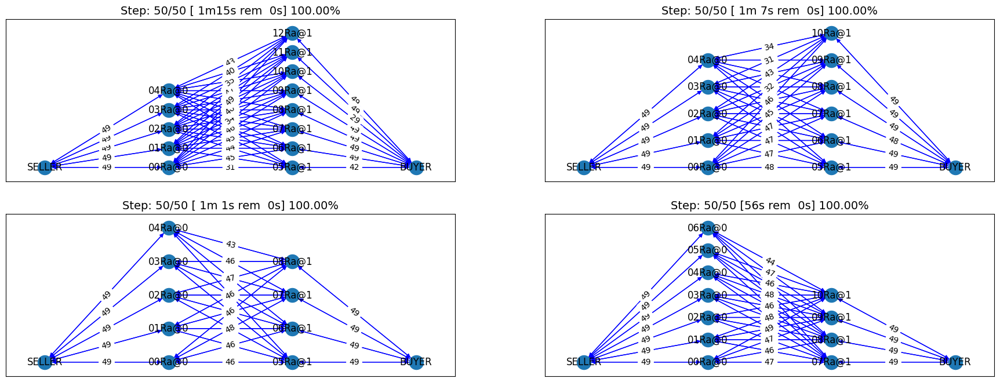
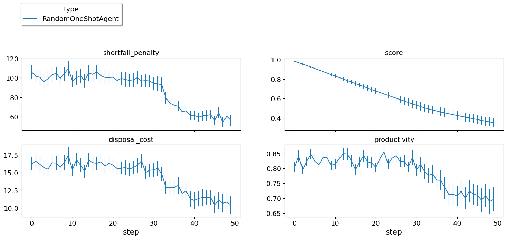
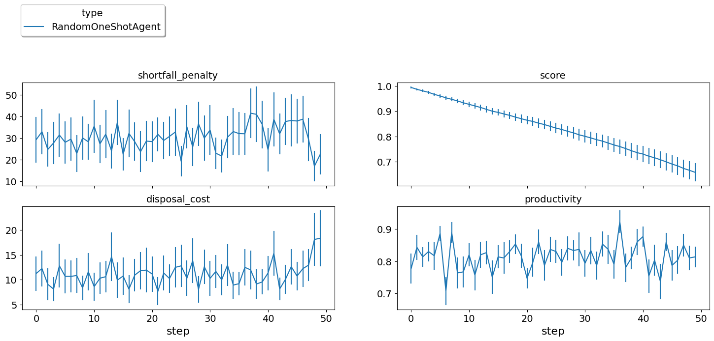
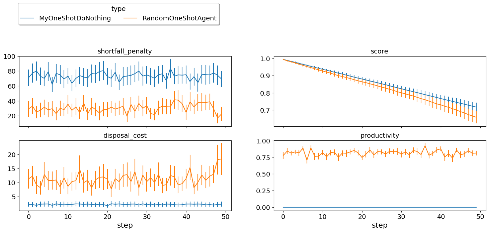
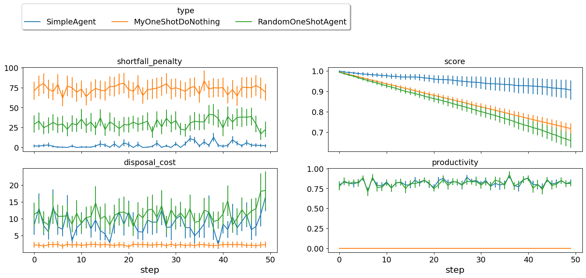
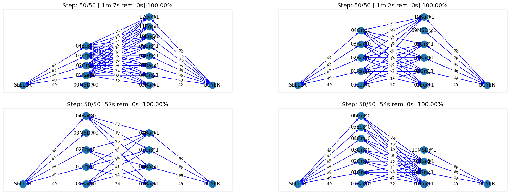
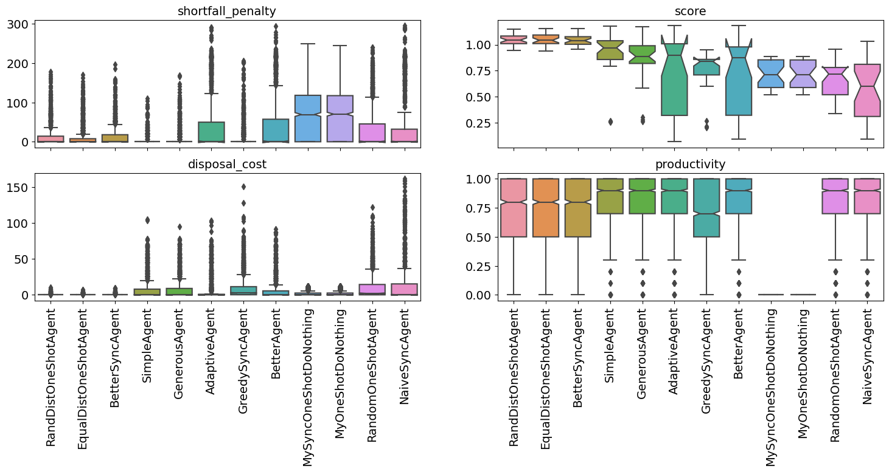
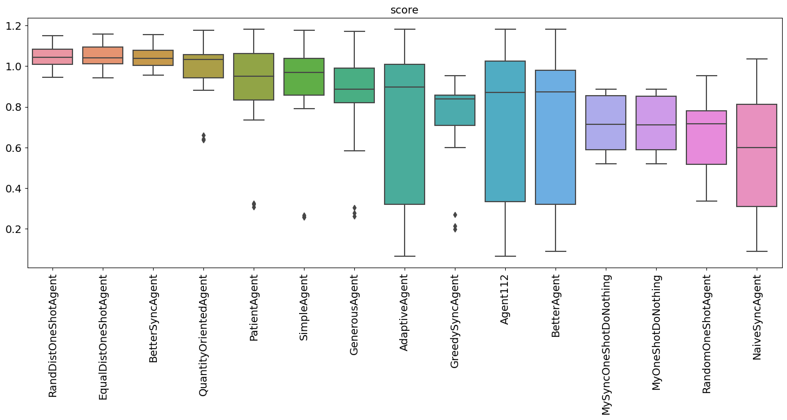

Developing an agent for SCML2024 (OneShot)
------------------------------------------

In 2021, we introduced a new track called SCML-OneShot which implements
a simplified problem in which the agent can focus on the many to many
concurrent negotiation problem without needing to worry about long term
planning or production planning as is the case with the standard and
collusion tracks.

**SCML-OneShot brief introduction** Please refer to the first tutorial
for a `brief
introduction <https://scml.readthedocs.io/en/latest/tutorials/01.run_scml2020.html>`__
about the world simulated in this game as well as pointers to more
information. We will assume knowledge of at least this brief
introduction in the remainder of this tutorial.

First things first, let’s create some helper functions that will allow
us to evaluate different agents we develop in this tutorial:

.. code:: ipython3

    from negmas import SAOResponse, ResponseType, Outcome, SAOState

    from scml.oneshot.world import SCML2024OneShotWorld as W
    from scml.oneshot import *
    from scml.runner import WorldRunner
    import pandas as pd
    from rich.jupyter import print

.. code:: ipython3

    # create a runner that encapsulates a number of configs to evaluate agents
    # in the same conditions every time

    CONFIGS, REPS, STEPS = 10, 3, 50
    context = ANACOneShotContext(n_steps=STEPS, world_params=dict(construct_graphs=True))
    single_agent_runner = WorldRunner(
        context, n_configs=CONFIGS, n_repetitions=REPS, save_worlds=True
    )
    full_market_runner = WorldRunner.from_runner(
        single_agent_runner, control_all_agents=True
    )

Here we use the ``WorldRunner`` class which is designed to allow us to
compare multiple agents in **exactly** the same conditions. To create a
``WorldRunner``, you need to pass a context which is used for generating
the worlds in which the agents are evaluated. the SCML package defines
several contexts that allow us to control these worlds. For example the
``StrongSupplierContext`` will always create worlds in which the agent
being evaluated is in the first production level :math:`L_0` with more
agents on this level than on the next level. You cand define your own
contexts for experimenting with specific conditions (e.g. specific
exogenous contract distribution, market structure, etc). The most
general context which will produce any world that your agent may
encounter in the `ANAC comptition <https://scml.cs.brown.edu>`__ is the
``ANACOneShotContext`` for one-shot worlds and ``ANACStdContext`` for
standard worlds.

We create two runners:

1. **single_agent_runner** in which a single agent is being evaluated
   while the rest of the agents are sampled randomly from a subset of
   SCML built-in agents.
2. **full_market_runner** in which *all* agents in the market are
   controlled by the agent type being evaluated. This may be helpful in
   understanding how your agent behaves in this extreme condition but
   can be misleading as an estimate of the agent’s performance in the
   official ANAC competition.

This is time to describe some of the tools that the ``WorldRunner``
gives you to evaluate the agent. The ``WorldRunner`` is a Callable. You
just call it with the class (agent type) you want to evaluate. You can
optionally pass parameters if you would like to compared different
parameters for example. Remember in this case to also pass a name to
differentiate between different parameter choices.

.. container::

   We are using a relatively large nubmer of configurations, repetitions
   per configuration and steps (days) per repetition. If you are running
   this notebook for the first time, consider reducing CONFIGS, REPS,
   STEPS above to make it run faster.

Testing a completely random agent
~~~~~~~~~~~~~~~~~~~~~~~~~~~~~~~~~

Let’s try an agent that behaves randomly:

.. code:: ipython3

    full_market_runner(RandomOneShotAgent);

We can use the runner now to display the worlds for a given type that we
evaluated:

.. code:: ipython3

    full_market_runner.draw_worlds_of(RandomOneShotAgent);





Lots of contracts have been reached, but were they good contracts? We
can use the runner now to plot several statistics
(e.g. shortfall-penalty, disposal-cost, productivity, and score in this
example). There are more than 42 such statistics that you can display.

.. code:: ipython3

    full_market_runner.plot_stats(agg=False);





The score is going down *monotonically* showing that this random agent
is losing money every step. Note that this test was when the agent
controller *every* factory in the market. This is very different than
the ANAC competition in whic the agent controls a single agent. Luckily,
we already have a runner that tests exactly this case. Let’s see how
does ``RandomOneShotAgent`` behave in such cases:

.. code:: ipython3

    single_agent_runner(RandomOneShotAgent)
    single_agent_runner.draw_worlds_of(RandomOneShotAgent);


.. code:: ipython3

    single_agent_runner.plot_stats(agg=False);





Still losing money but much less than before. The fact that other agents
made sense actually help our random agent get higher score. We can now
check the distribution of scores for our agent using the
``score_summary`` method:

.. code:: ipython3

    single_agent_runner.score_summary()


.. raw:: html

    <div>
    <style scoped>
        .dataframe tbody tr th:only-of-type {
            vertical-align: middle;
        }

        .dataframe tbody tr th {
            vertical-align: top;
        }

        .dataframe thead th {
            text-align: right;
        }
    </style>
    <table border="1" class="dataframe">
      <thead>
        <tr style="text-align: right;">
          <th></th>
          <th>type</th>
          <th>score</th>
          <th>count</th>
          <th>mean</th>
          <th>std</th>
          <th>min</th>
          <th>25%</th>
          <th>50%</th>
          <th>75%</th>
          <th>max</th>
        </tr>
      </thead>
      <tbody>
        <tr>
          <th>0</th>
          <td>RandomOneShotAgent</td>
          <td>0.65793</td>
          <td>30.0</td>
          <td>0.65793</td>
          <td>0.185348</td>
          <td>0.336662</td>
          <td>0.517957</td>
          <td>0.71734</td>
          <td>0.780287</td>
          <td>0.954094</td>
        </tr>
      </tbody>
    </table>
    </div>


You may have noticed that in some worlds multiple agents were of this
random type (having Ra in their names). We can check which agent in each
world was evaluated using the ``agents_per_world_of`` method:

.. code:: ipython3

    single_agent_runner.agents_per_world_of(RandomOneShotAgent)


.. parsed-literal::

    {'c0_RandomOneShotAgent_2/20240307H102843381773DM6bvVuL': [00Ra@0],
     'c1_RandomOneShotAgent_2/20240307H102843395130xCD2AEh6': [09Ra@1],
     'c2_RandomOneShotAgent_2/20240307H1028434068309wSk61hc': [03Ra@0],
     'c3_RandomOneShotAgent_2/20240307H1028434193944qJf2mRi': [10Ra@1],
     'c4_RandomOneShotAgent_2/20240307H1028434348725FI408iN': [02Ra@0],
     'c5_RandomOneShotAgent_2/20240307H102843446517qRCJQARL': [06Ra@1],
     'c6_RandomOneShotAgent_2/20240307H1028434575457oq3tBfI': [07Ra@1],
     'c7_RandomOneShotAgent_2/20240307H1028434712435BW7DlOy': [10Ra@1],
     'c8_RandomOneShotAgent_2/20240307H1028434854184xqGXFax': [12Ra@1],
     'c9_RandomOneShotAgent_2/20240307H102843497378K9hijmDw': [09Ra@1]}


This random agent always loses money. Can we do better? Let’s start by
an agent that does absolutely nothing.

An agent that does nothing
~~~~~~~~~~~~~~~~~~~~~~~~~~

.. code:: ipython3

    class MyOneShotDoNothing(OneShotPolicy):
        """My Agent that does nothing"""

        def act(self, state):
            return {}


    ""
    single_agent_runner(MyOneShotDoNothing)
    single_agent_runner.draw_worlds_of(MyOneShotDoNothing);


In all of the graph representing world simulations, we use short names
that represent the type of the agent. For example an agent named
``03Ran@1`` is an agent of type ``RandomOneShotAgent`` at production
level 1 that was the third agent to create. ``MDN`` here is a shorthand
for ``MyOneShotDoNothingAgent`` (we will usually remove ``OneShot`` and
``Agent`` from the name before shortening it).

Notice how there is exactly one agent of our type (MDN) in each
simulation. Moreover, these are in exactly the same palces in which the
random agents evaluated were before. This is how we can guarantee that
the comparison is fair.

Looking at the ``contracts-signed``, we can see that none of the
concluded contracts involved our do-nothing agent. Nevertheless, these
agents still had *exogenous contracts* which means that they will lose
money. A do-nothing agent will usually lose money in this game.

Let’s check the scores of different agents to confirm:

.. code:: ipython3

    single_agent_runner.score_summary()


.. raw:: html

    <div>
    <style scoped>
        .dataframe tbody tr th:only-of-type {
            vertical-align: middle;
        }

        .dataframe tbody tr th {
            vertical-align: top;
        }

        .dataframe thead th {
            text-align: right;
        }
    </style>
    <table border="1" class="dataframe">
      <thead>
        <tr style="text-align: right;">
          <th></th>
          <th>type</th>
          <th>score</th>
          <th>count</th>
          <th>mean</th>
          <th>std</th>
          <th>min</th>
          <th>25%</th>
          <th>50%</th>
          <th>75%</th>
          <th>max</th>
        </tr>
      </thead>
      <tbody>
        <tr>
          <th>0</th>
          <td>MyOneShotDoNothing</td>
          <td>0.716924</td>
          <td>30.0</td>
          <td>0.716924</td>
          <td>0.128240</td>
          <td>0.518197</td>
          <td>0.587324</td>
          <td>0.711476</td>
          <td>0.852739</td>
          <td>0.885616</td>
        </tr>
        <tr>
          <th>1</th>
          <td>RandomOneShotAgent</td>
          <td>0.657930</td>
          <td>30.0</td>
          <td>0.657930</td>
          <td>0.185348</td>
          <td>0.336662</td>
          <td>0.517957</td>
          <td>0.717340</td>
          <td>0.780287</td>
          <td>0.954094</td>
        </tr>
      </tbody>
    </table>
    </div>


.. code:: ipython3

    single_agent_runner.plot_stats(agg=False);





It is clear that our do-nothing agent always loses money and is even
worse than acting randomly. That is because it cannot get any contracts
from negotiation to satisfy its needs from the exogenous contracts but
it still has to pay for disposal cost and shortfall penalty. This is by
design. We set the penalties so that this is almost always the case to
encourage agents to trade.

We can also have a look at the *exogenous* contracts that drive the
market.

.. code:: ipython3

    import math
    from typing import Iterable


    def analyze_contracts(worlds, exogenous_only=True):
        """
        Analyzes the contracts signed in the given world
        """
        dfs = []
        for world in worlds:
            dfs.append(pd.DataFrame.from_records(world.saved_contracts))
        data = pd.concat(dfs)
        if exogenous_only:
            data = data.loc[
                (data["seller_name"] == "SELLER") | (data["buyer_name"] == "BUYER"), :
            ]
        return data.groupby(["seller_name", "buyer_name"])[["quantity", "unit_price"]].agg(
            dict(quantity=("sum", "count"), unit_price="mean")
        )


    analyze_contracts(single_agent_runner.worlds_of())


.. raw:: html

    <div>
    <style scoped>
        .dataframe tbody tr th:only-of-type {
            vertical-align: middle;
        }

        .dataframe tbody tr th {
            vertical-align: top;
        }

        .dataframe thead tr th {
            text-align: left;
        }

        .dataframe thead tr:last-of-type th {
            text-align: right;
        }
    </style>
    <table border="1" class="dataframe">
      <thead>
        <tr>
          <th></th>
          <th></th>
          <th colspan="2" halign="left">quantity</th>
          <th>unit_price</th>
        </tr>
        <tr>
          <th></th>
          <th></th>
          <th>sum</th>
          <th>count</th>
          <th>mean</th>
        </tr>
        <tr>
          <th>seller_name</th>
          <th>buyer_name</th>
          <th></th>
          <th></th>
          <th></th>
        </tr>
      </thead>
      <tbody>
        <tr>
          <th>04Eq@1</th>
          <th>BUYER</th>
          <td>2442</td>
          <td>300</td>
          <td>28.000000</td>
        </tr>
        <tr>
          <th>05Eq@1</th>
          <th>BUYER</th>
          <td>5406</td>
          <td>600</td>
          <td>27.550000</td>
        </tr>
        <tr>
          <th>05Ra@1</th>
          <th>BUYER</th>
          <td>4344</td>
          <td>852</td>
          <td>26.542254</td>
        </tr>
        <tr>
          <th>06Eq@1</th>
          <th>BUYER</th>
          <td>2106</td>
          <td>300</td>
          <td>29.160000</td>
        </tr>
        <tr>
          <th>06Gr@1</th>
          <th>BUYER</th>
          <td>6834</td>
          <td>900</td>
          <td>27.133333</td>
        </tr>
        <tr>
          <th>06MDN@1</th>
          <th>BUYER</th>
          <td>1371</td>
          <td>150</td>
          <td>28.200000</td>
        </tr>
        <tr>
          <th>06Ra@1</th>
          <th>BUYER</th>
          <td>6375</td>
          <td>750</td>
          <td>28.240000</td>
        </tr>
        <tr>
          <th>07Eq@1</th>
          <th>BUYER</th>
          <td>2742</td>
          <td>300</td>
          <td>27.460000</td>
        </tr>
        <tr>
          <th>07Gr@1</th>
          <th>BUYER</th>
          <td>13638</td>
          <td>1500</td>
          <td>27.752000</td>
        </tr>
        <tr>
          <th>07MDN@1</th>
          <th>BUYER</th>
          <td>774</td>
          <td>150</td>
          <td>27.860000</td>
        </tr>
        <tr>
          <th>07Ra@1</th>
          <th>BUYER</th>
          <td>3630</td>
          <td>744</td>
          <td>27.229839</td>
        </tr>
        <tr>
          <th>08Eq@1</th>
          <th>BUYER</th>
          <td>5460</td>
          <td>600</td>
          <td>27.780000</td>
        </tr>
        <tr>
          <th>08Gr@1</th>
          <th>BUYER</th>
          <td>8766</td>
          <td>1200</td>
          <td>27.085000</td>
        </tr>
        <tr>
          <th>08Ra@1</th>
          <th>BUYER</th>
          <td>10638</td>
          <td>1200</td>
          <td>28.075000</td>
        </tr>
        <tr>
          <th>09Gr@1</th>
          <th>BUYER</th>
          <td>4668</td>
          <td>888</td>
          <td>28.250000</td>
        </tr>
        <tr>
          <th>09MDN@1</th>
          <th>BUYER</th>
          <td>2382</td>
          <td>300</td>
          <td>26.990000</td>
        </tr>
        <tr>
          <th>09Ra@1</th>
          <th>BUYER</th>
          <td>9996</td>
          <td>1200</td>
          <td>27.562500</td>
        </tr>
        <tr>
          <th>10Eq@1</th>
          <th>BUYER</th>
          <td>2910</td>
          <td>480</td>
          <td>27.412500</td>
        </tr>
        <tr>
          <th>10Gr@1</th>
          <th>BUYER</th>
          <td>3054</td>
          <td>546</td>
          <td>28.241758</td>
        </tr>
        <tr>
          <th>10MDN@1</th>
          <th>BUYER</th>
          <td>2817</td>
          <td>300</td>
          <td>27.930000</td>
        </tr>
        <tr>
          <th>10Ra@1</th>
          <th>BUYER</th>
          <td>4341</td>
          <td>600</td>
          <td>27.715000</td>
        </tr>
        <tr>
          <th>11Eq@1</th>
          <th>BUYER</th>
          <td>4182</td>
          <td>600</td>
          <td>27.690000</td>
        </tr>
        <tr>
          <th>11Gr@1</th>
          <th>BUYER</th>
          <td>2178</td>
          <td>300</td>
          <td>29.160000</td>
        </tr>
        <tr>
          <th>11Ra@1</th>
          <th>BUYER</th>
          <td>1890</td>
          <td>300</td>
          <td>29.440000</td>
        </tr>
        <tr>
          <th>12Gr@1</th>
          <th>BUYER</th>
          <td>4320</td>
          <td>600</td>
          <td>27.930000</td>
        </tr>
        <tr>
          <th>12MDN@1</th>
          <th>BUYER</th>
          <td>1143</td>
          <td>150</td>
          <td>28.480000</td>
        </tr>
        <tr>
          <th>12Ra@1</th>
          <th>BUYER</th>
          <td>4023</td>
          <td>450</td>
          <td>28.360000</td>
        </tr>
        <tr>
          <th>13Ra@1</th>
          <th>BUYER</th>
          <td>4824</td>
          <td>600</td>
          <td>29.290000</td>
        </tr>
        <tr>
          <th rowspan="24" valign="top">SELLER</th>
          <th>00Eq@0</th>
          <td>9894</td>
          <td>1200</td>
          <td>9.940000</td>
        </tr>
        <tr>
          <th>00Gr@0</th>
          <td>2658</td>
          <td>300</td>
          <td>10.260000</td>
        </tr>
        <tr>
          <th>00MDN@0</th>
          <td>1338</td>
          <td>150</td>
          <td>10.100000</td>
        </tr>
        <tr>
          <th>00Ra@0</th>
          <td>12636</td>
          <td>1350</td>
          <td>9.940000</td>
        </tr>
        <tr>
          <th>01Eq@0</th>
          <td>5304</td>
          <td>600</td>
          <td>9.930000</td>
        </tr>
        <tr>
          <th>01Gr@0</th>
          <td>8532</td>
          <td>900</td>
          <td>9.893333</td>
        </tr>
        <tr>
          <th>01Ra@0</th>
          <td>13176</td>
          <td>1500</td>
          <td>10.064000</td>
        </tr>
        <tr>
          <th>02Eq@0</th>
          <td>11064</td>
          <td>1200</td>
          <td>10.035000</td>
        </tr>
        <tr>
          <th>02Gr@0</th>
          <td>7554</td>
          <td>900</td>
          <td>9.893333</td>
        </tr>
        <tr>
          <th>02MDN@0</th>
          <td>1317</td>
          <td>150</td>
          <td>10.020000</td>
        </tr>
        <tr>
          <th>02Ra@0</th>
          <td>7059</td>
          <td>750</td>
          <td>10.108000</td>
        </tr>
        <tr>
          <th>03Eq@0</th>
          <td>7608</td>
          <td>900</td>
          <td>10.013333</td>
        </tr>
        <tr>
          <th>03Gr@0</th>
          <td>8688</td>
          <td>900</td>
          <td>10.133333</td>
        </tr>
        <tr>
          <th>03MDN@0</th>
          <td>1446</td>
          <td>150</td>
          <td>10.220000</td>
        </tr>
        <tr>
          <th>03Ra@0</th>
          <td>9660</td>
          <td>1050</td>
          <td>10.145714</td>
        </tr>
        <tr>
          <th>04Eq@0</th>
          <td>10392</td>
          <td>1200</td>
          <td>9.985000</td>
        </tr>
        <tr>
          <th>04Gr@0</th>
          <td>10854</td>
          <td>1200</td>
          <td>9.960000</td>
        </tr>
        <tr>
          <th>04Ra@0</th>
          <td>2352</td>
          <td>300</td>
          <td>9.840000</td>
        </tr>
        <tr>
          <th>05Eq@0</th>
          <td>5448</td>
          <td>600</td>
          <td>9.850000</td>
        </tr>
        <tr>
          <th>05Gr@0</th>
          <td>8400</td>
          <td>900</td>
          <td>9.986667</td>
        </tr>
        <tr>
          <th>06Eq@0</th>
          <td>2904</td>
          <td>300</td>
          <td>9.720000</td>
        </tr>
        <tr>
          <th>06Gr@0</th>
          <td>2400</td>
          <td>300</td>
          <td>10.340000</td>
        </tr>
        <tr>
          <th>06Ra@0</th>
          <td>2898</td>
          <td>300</td>
          <td>10.120000</td>
        </tr>
        <tr>
          <th>07Ra@0</th>
          <td>2760</td>
          <td>300</td>
          <td>10.160000</td>
        </tr>
      </tbody>
    </table>
    </div>


There are few things to note about the distribution of the *exogenous*
contracts:

-  The unit price of the raw material is always lower than that of the
   final product. This is the source of profitability in this market.
-  Each agent has a different mean and standar deviation for the
   quantities in its exogenous contracts. This means that different
   agents will have different utility functions but these utility
   functions for different steps are related because the exogenous
   contract is sampled from some common distribution for each agent for
   all the steps which makes learning more useful in the game.

Building your own agent
~~~~~~~~~~~~~~~~~~~~~~~

A one-shot agent needs only to do negotiation. The simplest possible
version (``MyDoNothingAgent`` above) just responded to offers from its
partners and proposed new offers to them.

Looking at the graph for the world simulation, we can see immediately
some features of the one-shot simulation that are not replicated in the
full SCML game:

-  All negotiation requests are accepted. In fact in the one-shot game,
   the agent need not consider requesting negotiations or deciding the
   negotiation agenda as the system takes care of this ensuring that on
   every simulated day every agent is negotiating with its suppliers and
   or consumers about trade on that day (and only that day).
-  Contracts in the one-shot game are always executed (despite not
   showing that in the graph). There is no concept of a breach. Failure
   to honor contracts is instead penalized monetarily. Contracts are
   also never cancelled or nullified. This greatly simplifies the
   problem as the agent does not need to keep track of contract
   execution.
-  Production is too fast that it does not affect the agent reasoning.
   In the terminology to be presented in the following tutorial, there
   is no need for an explicit production strategy.
-  There is no need to consider future negotiations while reasoning
   about a the current set of negotiations. This greatly simplifies
   agent design as there is no long-term planning. In the terminology to
   be presented in the following section, there is no need for a trading
   strategy

Your AWI
^^^^^^^^

As described in the `previous
tutorial <https://scml.readthedocs.io/en/latest/tutorials/01.run_scml2020.html>`__,
your agent can sense and act in the simulation by accessing methods and
properties of its AWI which is accessible at any time as:

.. code:: python

   self.awi

You can see all of these methods and properties specific for the
**OneShotAWI** and its descendents
`here <https://scml.readthedocs.io/en/latest/api/scml.oneshot.OneShotAWI.html>`__.

Your ufun
^^^^^^^^^

The Oneshot game has the advantage that it is possible at the end of
each simulation step (day) to calculate **exactly** the profit you will
be getting for the set of contracts you have (either through negotiation
or as exogenous contracts). We provide a utility function class
(`OneShotUtilityFunction <https://scml.readthedocs.io/en/latest/api/scml.oneshot.OneShotUFun.html>`__
which can be used normally as any NegMAS
`UtilityFunction <http://www.yasserm.com/negmas/api/negmas.preferences.UtilityFunction.html>`__.
This ufun is available to your all the time (a new one is created for
each simulation step) and is accessible as:

.. code:: python

   self.ufun

The most important services this ufun class provides for you are the
following:

-  ``from_offers``: This method receives a list of outcomes and a list
   of booleans indicating whether each of them is for buying or for
   selling. It returns to you the profit you will get if all of these
   outcomes *and nothing else* became contracts. An outcome is just a
   tuple (quantity, delivery time, unit price). You can use this
   callback during negotiation to judge hypothetical agreements with
   your partners.
-  ``from_contracts``: This method is the same as ``from_offers`` but it
   receives a list of ``Contract`` objects. It is useful after all
   negotiations are finished to calculate the profit you will be getting
   for this step.
-  ``is_breach``: will tell you whether or not getting the given total
   input and output quantities will make you cause a breach. Notice that
   breaches are expected in the OneShot track as any mismatch in the
   quantities of inputs and outputs will constitute a breach.
-  ``breach_level``: returns a value between zero and one specifying the
   level of breach that will be recorded for a given total input and
   output quantities.
-  ``find_limit``: finds either the maximum or the minimum possible
   profit (minimum profit is maximm loss) attainable in the current
   simulation step (day). This is useful when you want to normalize
   utility values between zero and one. Two of the agents we will
   develop during this tutorial will use this feature.
-  ``max_utility``, ``min_utility``: give the maximum and minimum
   utilities/profits attainable. Note that you must prepare them by
   calling ``find_limit``. We will go into how to do that later.
-  ``best``, ``worst``: give more information about the cases of maximum
   and minimum profit (i.e. the total input and output quantity needed,
   the prodcible quantity, best possible prices for buying and selling,
   etc). Again, these are not available except after calling
   ``find_limit``.

Your callbacks
^^^^^^^^^^^^^^

Your agent needs to implement methods that are called by the system at
various time during the negotiation. You can find a full list in the
`game
description <https://yasserfarouk.github.io/files/scml/y2024/scml2024oneshot.pdf>`__.

The most important ones are:

-  ``init()`` called once at the beginning of the simulation
   (i.e. before the first day starts). At this point, your AWI is set
   but you should not assume anything else.
-  ``before_step()`` called at the **beginning** of *every day*. At this
   point, your ``ufun`` is set and market information is available.
-  ``step()`` called at the **end** of *every day*. You can use this to
   analyze what happened during the day and modify your strategy in the
   future.
-  ``on_negotiation_success()``/``on_negotiation_failure()`` called
   after each negotiation is concluded to let you know what happened in
   it.
-  Depending on your base-class, you will also need to implement methods
   that allow you to control negotiations. These will be explained in
   details in the following sections but here is a summary:

   -  **OneShotAgent** If your agent is based on ``OneShotAgent``, you
      will get a ``propose()`` call when you need to offer something to
      one of our partners during negotiation and ``respond()`` when
      asked to respond to one of its offers.
   -  **OneShotSyncAgent** If your agent is based on
      ``OneShotSyncAgent`` you will get a call to ``first_proposals()``
      once every day to set your first proposal in all negotiations and
      a ``counter_all()`` call to counter offers from your partners. The
      system will try to always give you one offer from each partner in
      the ``counter_all()`` call but that is not guaranteed and
      sometimes it may be called with a subset of the offers.
   -  **OneShotPolicy** This is very similar to ``OneShotSyncAgent``
      with only one callback ``act()`` which receives the AWI (as
      ``state``) and returns a mapping from each partner to an
      ``SAOResponse`` (i.e. acceptance, ending negotiation, or rejection
      and a counter offer). This is mostly there to help build RL agents
      (see next tutorial).
   -  **OneShotSingleAgreementAgent** If your agent is based on
      ``OneShotSingleAgreementAgent`` you will have to implement
      ``is_acceptable()`` to decide if a given offer is acceptable to
      you, ``best_offer()`` to find the *best* offer in a given
      negotiation for your agent and ``is_better()`` to compare two
      offers. Once you implement these, the agent will implement all
      callback for you trying to get **a single** agreement that
      maximizes your utility. Note that, again, it is not guaranteed
      that you will get a single agreement at the end but the system
      will try its best to achieve that.

Now we can start working on our agent.

We will discuss these different base classes and basing your agent in
each of them in more details in what follows.

OneShotAgent
~~~~~~~~~~~~

This is the base class of all agents for SCML-OneShot. Both
``SyncOneShotAgent`` and ``SingleAgreementOneShotAgent`` inherit from
this class and provide support for a simplified way of developing your
agent (or so we think). It is perfectly OK to use ``OneShotAgent``
directly as the base of your agent.

As discussed earlier, you will receive a ``propose`` and ``respond``
call for each round in each negotiation. The ``propose`` method receives
the negotiation state (an object of the type
```SAOState`` <https://negmas.readthedocs.io/en/latest/api/negmas.sao.SAOState.html>`__
including among other things the current negotiation step, relative
time, last offer, etc) and is required to return an ``Outcome`` which is
just a tuple of a quantity, delivery time (must be this simulation step)
and unit price, in that order (See ```negmas``
documentation <https://negmas.readthedocs.io/en/latest>`__) as an offer.
The ``respond`` method receives a negotiation state and an offer
(``Outcome``) from the opponent and needs to respond to it by a decision
from the ```ResponseType``
enumeration <https://negmas.readthedocs.io/en/latest/api/negmas.gb.ResponseType.html>`__
(``REJECT_OFFER``, ``ACCEPT_OFFER``, and ``END_NEGOTIATION``). Other
than these two negotiation related callbacks, the agent receives an
``init`` call just after it joins the simulatin and a
``before_step``/``step`` call before/after each simulation step. The
agent is also informed about failure/success of negotiations through the
``on_negotiation_success``/``on_negotiation_failure`` callbacks. That is
all. A one-shot agent needs to only think about what should it do to
respond to each of these seven callbacks. All of these callbacks except
``propose`` and ``respond`` are optional.

Simple OneShotAgent
^^^^^^^^^^^^^^^^^^^

We have already seen how to develop a do-nothing agent using the
``OneShotAgent`` class. Let’s try to develop some more meaningful agent
using the same base class.

.. code:: ipython3

    class SimpleAgent(OneShotAgent):
        """A greedy agent based on OneShotAgent"""

        def propose(self, negotiator_id: str, state) -> "Outcome":
            return self.best_offer(negotiator_id)

        def respond(self, negotiator_id, state, source=""):
            offer = state.current_offer
            my_needs = self._needed(negotiator_id)
            if my_needs <= 0:
                return ResponseType.END_NEGOTIATION
            return (
                ResponseType.ACCEPT_OFFER
                if offer[QUANTITY] <= my_needs
                else ResponseType.REJECT_OFFER
            )

        def best_offer(self, negotiator_id):
            my_needs = self._needed(negotiator_id)
            if my_needs <= 0:
                return None
            ami = self.get_nmi(negotiator_id)
            if not ami:
                return None
            quantity_issue = ami.issues[QUANTITY]

            offer = [-1] * 3
            offer[QUANTITY] = max(
                min(my_needs, quantity_issue.max_value), quantity_issue.min_value
            )
            offer[TIME] = self.awi.current_step
            offer[UNIT_PRICE] = self._find_good_price(ami)
            return tuple(offer)

        def _find_good_price(self, ami):
            """Finds a good-enough price."""
            unit_price_issue = ami.issues[UNIT_PRICE]
            if self._is_selling(ami):
                return unit_price_issue.max_value
            return unit_price_issue.min_value

        def is_seller(self, negotiator_id):
            return negotiator_id in self.awi.current_negotiation_details["sell"].keys()

        def _needed(self, negotiator_id=None):
            return (
                self.awi.needed_sales
                if self.is_seller(negotiator_id)
                else self.awi.needed_supplies
            )

        def _is_selling(self, ami):
            return ami.annotation["product"] == self.awi.my_output_product

Let’s see how well did this agent behave:

.. code:: ipython3

    single_agent_runner(SimpleAgent)
    single_agent_runner.score_summary()


.. raw:: html

    <div>
    <style scoped>
        .dataframe tbody tr th:only-of-type {
            vertical-align: middle;
        }

        .dataframe tbody tr th {
            vertical-align: top;
        }

        .dataframe thead th {
            text-align: right;
        }
    </style>
    <table border="1" class="dataframe">
      <thead>
        <tr style="text-align: right;">
          <th></th>
          <th>type</th>
          <th>score</th>
          <th>count</th>
          <th>mean</th>
          <th>std</th>
          <th>min</th>
          <th>25%</th>
          <th>50%</th>
          <th>75%</th>
          <th>max</th>
        </tr>
      </thead>
      <tbody>
        <tr>
          <th>2</th>
          <td>SimpleAgent</td>
          <td>0.905806</td>
          <td>30.0</td>
          <td>0.905806</td>
          <td>0.243713</td>
          <td>0.256752</td>
          <td>0.857049</td>
          <td>0.969827</td>
          <td>1.038091</td>
          <td>1.176166</td>
        </tr>
        <tr>
          <th>0</th>
          <td>MyOneShotDoNothing</td>
          <td>0.716924</td>
          <td>30.0</td>
          <td>0.716924</td>
          <td>0.128240</td>
          <td>0.518197</td>
          <td>0.587324</td>
          <td>0.711476</td>
          <td>0.852739</td>
          <td>0.885616</td>
        </tr>
        <tr>
          <th>1</th>
          <td>RandomOneShotAgent</td>
          <td>0.657930</td>
          <td>30.0</td>
          <td>0.657930</td>
          <td>0.185348</td>
          <td>0.336662</td>
          <td>0.517957</td>
          <td>0.717340</td>
          <td>0.780287</td>
          <td>0.954094</td>
        </tr>
      </tbody>
    </table>
    </div>


we can check how the score and other statistics of this type of agent
changes over time:

.. code:: ipython3

    single_agent_runner.plot_stats(agg=False);





This simple agent is better than the random agent and our do-nothing
agent. It can make around 1% profit. Let’s understand how it works:

The main idea of this agent is pretty simple. It tries to *secure* as
much of its needs (sales/supplies) as possible in every negotiation at
the best possible price for itself.

To achieve this goal, the agent uses the fact that the ``AWI`` already
keeps track of this information as ``needed_supplies`` and
``needed_sales``. Therefore, it defines a helper that calculates the
amount it needs by subtracting the exogenous quantity it has from the
amount it secured

.. code:: python

   def _needed(self):
       self.awi.needed_sales if self.is_seller(negotiator_id) else self.awi.needed_supplies

where it uses ``needed_sales`` if the current negotiation is for selling
and ``needed_supplies`` otherwise. Now that the agent can calculate how
much it needs to buy/sell, it implements the negotiation related
call-backs (``propose`` and ``respond``).

Here is the full implementation of ``propose``:

.. code:: python

   def propose(self, negotiator_id: str, state) -> "Outcome":
       return self.best_offer(negotiator_id)

The agent is always offering its best offer which is calculated in the
``best_offer`` method to be discussed later. It does not conceed at all.

Responding to opponent offers is also simple:

-  it starts by calculating its needs using the helper ``_needed``, and
   ends the negotiation if it needs no more sales/supplies

.. code:: python

       my_needs = self._needed()
       if my_needs <= 0:
           return ResponseType.END_NEGOTIATION

-  If the offered quantity is less than its needs, accept the offer.
   Otherwise reject the offer.

.. code:: python

       return (
           ResponseType.ACCEPT_OFFER
           if offer[QUANTITY] <= my_needs
           else ResponseType.REJECT_OFFER
       )

Most of the code is in the ``best_offer`` method which calculates the
best offer for a negotiation *given the agreements reached so far*.
Let’s check it line by line:

-  The agent checks its needs and returns ``None`` ending the
   negotiation if it needs no more sales/supplies. We also get access to
   the AMI.

.. code:: python

       my_needs = self._needed()
       if my_needs <= 0:
           return None
       ami = self.get_nmi(negotiator_id)
       if not ami:
           return None

-  It then finds out the ``Issue`` objects corresponding to the quantity
   and unit-price for this negotiation and initializes an offer (we have
   3 issues)

.. code:: python

       quantity_issue = ami.issues[QUANTITY]
       unit_price_issue = ami.issues[UNIT_PRICE]
       offer = [-1] * 3

-  The time is always the current step.

.. code:: python

       offer[TIME] = self.awi.current_step

-  The quantity to offer is simply the needs of the agent without mapped
   within the range of the quantities in the negotiation agenda (note
   that this may lead the agent to buy more than its needs).

.. code:: python

       offer[QUANTITY] = max(min(my_needs, quantity_issue.max_value), quantity_issue.min_value)

-  Finally, the unit price is the maximum possible unit price if the
   agent is selling otherwise it is the minimum possible price. Note
   that ``is_selling()`` assumes that the agent will never find itself
   in a middle layer in a deep negotiation. We will alleviate this issue
   later.

.. code:: python

       if self._is_selling(ami):
           offer[UNIT_PRICE] = unit_price_issue.max_value
       else:
           offer[UNIT_PRICE] = unit_price_issue.min_value
       return tuple(offer)

A (suposedly) better greedy agent
~~~~~~~~~~~~~~~~~~~~~~~~~~~~~~~~~

One problem with our ``SimpleAgent`` is that it does not take price into
account in two ways:

-  When asked to ``propose``, it *always* proposes an offer with the
   best price for itself. It **never concedes** on prices. In many cases
   this will lead to disagreement.
-  When asked to ``respond`` to an offer, *it does not even check the
   price*. This may lead to bad agreements (i.e. very high buying
   prices/very low selling prices).

We will try to remedie both of these issues in the following agent:

.. code:: ipython3

    class BetterAgent(SimpleAgent):
        """A greedy agent based on OneShotAgent with more sane strategy"""

        def __init__(self, *args, concession_exponent=0.2, **kwargs):
            super().__init__(*args, **kwargs)
            self._e = concession_exponent

        def respond(self, negotiator_id, state, source=""):
            offer = state.current_offer
            if offer is None:
                return ResponseType.REJECT_OFFER
            response = super().respond(negotiator_id, state, source)
            if response != ResponseType.ACCEPT_OFFER:
                return response
            nmi = self.get_nmi(negotiator_id)
            return (
                response
                if self._is_good_price(nmi, state, offer[UNIT_PRICE])
                else ResponseType.REJECT_OFFER
            )

        def _is_good_price(self, nmi, state, price):
            """Checks if a given price is good enough at this stage"""
            mn, mx = self._price_range(nmi)
            th = self._th(state.step, nmi.n_steps)
            # a good price is one better than the threshold
            if self._is_selling(nmi):
                return (price - mn) >= th * (mx - mn)
            else:
                return (mx - price) >= th * (mx - mn)

        def _find_good_price(self, nmi):
            """Finds a good-enough price conceding linearly over time"""
            state = nmi.state
            mn, mx = self._price_range(nmi)
            th = self._th(state.step, nmi.n_steps)
            # offer a price that is around th of your best possible price
            if self._is_selling(nmi):
                return int(mn + th * (mx - mn))
            else:
                return int(mx - th * (mx - mn))

        def _price_range(self, nmi):
            """Finds the minimum and maximum prices"""
            mn = nmi.issues[UNIT_PRICE].min_value
            mx = nmi.issues[UNIT_PRICE].max_value
            return mn, mx

        def _th(self, step, n_steps):
            """calculates a descending threshold (0 <= th <= 1)"""
            return ((n_steps - step - 1) / (n_steps - 1)) ** self._e

Let’s see how well did this agent behave:

.. code:: ipython3

    single_agent_runner(BetterAgent)
    single_agent_runner.score_summary()


.. raw:: html

    <div>
    <style scoped>
        .dataframe tbody tr th:only-of-type {
            vertical-align: middle;
        }

        .dataframe tbody tr th {
            vertical-align: top;
        }

        .dataframe thead th {
            text-align: right;
        }
    </style>
    <table border="1" class="dataframe">
      <thead>
        <tr style="text-align: right;">
          <th></th>
          <th>type</th>
          <th>score</th>
          <th>count</th>
          <th>mean</th>
          <th>std</th>
          <th>min</th>
          <th>25%</th>
          <th>50%</th>
          <th>75%</th>
          <th>max</th>
        </tr>
      </thead>
      <tbody>
        <tr>
          <th>3</th>
          <td>SimpleAgent</td>
          <td>0.905806</td>
          <td>30.0</td>
          <td>0.905806</td>
          <td>0.243713</td>
          <td>0.256752</td>
          <td>0.857049</td>
          <td>0.969827</td>
          <td>1.038091</td>
          <td>1.176166</td>
        </tr>
        <tr>
          <th>0</th>
          <td>BetterAgent</td>
          <td>0.742522</td>
          <td>30.0</td>
          <td>0.742522</td>
          <td>0.355723</td>
          <td>0.087694</td>
          <td>0.320086</td>
          <td>0.871921</td>
          <td>0.978388</td>
          <td>1.181927</td>
        </tr>
        <tr>
          <th>1</th>
          <td>MyOneShotDoNothing</td>
          <td>0.716924</td>
          <td>30.0</td>
          <td>0.716924</td>
          <td>0.128240</td>
          <td>0.518197</td>
          <td>0.587324</td>
          <td>0.711476</td>
          <td>0.852739</td>
          <td>0.885616</td>
        </tr>
        <tr>
          <th>2</th>
          <td>RandomOneShotAgent</td>
          <td>0.657930</td>
          <td>30.0</td>
          <td>0.657930</td>
          <td>0.185348</td>
          <td>0.336662</td>
          <td>0.517957</td>
          <td>0.717340</td>
          <td>0.780287</td>
          <td>0.954094</td>
        </tr>
      </tbody>
    </table>
    </div>


It seems that ``BetterAgent`` is much worse than the ``SimpleAgent``. It
is as good as the randomly behaving agent!! We failed :-(

Still, Let’s dive into the agent and analyze how it works:

The main idea in ``BetterAgent`` is to treat the *price* issue
separately to avoid the two issues presented earlier:

-  **Never conceding during proposal** This is solved in the ``propose``
   method by just overriding the price with a ``good-enough`` price:

   .. code:: python

        offer[UNIT_PRICE] = self._find_good_price(self.get_nmi(negotiator_id), state)

   As an aside, notice that we needed to convert the offer to a list in
   order to overwrite the price then back into a tuple to send it to the
   partner.

-  **Never checking prices of offers** This is solved in the ``respond``
   method by checking whether or not the price offered is a
   ``good-enough`` price:

   .. code:: python

        return (
            response
            if self._is_good_price(ami, state, offer[UNIT_PRICE])
            else ResponseType.REJECT_OFFER
        )

   As we will see later, this is not much of an issue in SCML OneShot
   2023 though.

What we mean by a ``good-enough`` price is defined in ``_is_good_price``
and ``_find_good_price`` methods. Both start by getting the limits of
the unit-price in the negotiation agenda and a threshold value ``th``:

.. code:: python

   mn, mx = self._price_range(ami, state)
   th = self._th(mn, mx, state.step, ami.n_steps)

The price range is clear enough. For the threshold ``th`` is a value
that starts at :math:`1.0` and goes down toward :math:`0.0` over the
negotiation time under the control of an agent specific parameter ``_e``
called the concession exponent. Let’s see how does this look for
different concession exponents:

.. code:: ipython3

    x = np.arange(20)
    fig = plt.figure()
    for e in [0.1, 0.2, 1.0, 5, 10]:
        a = BetterAgent(concession_exponent=e)
        y = [a._th(i, 20) for i in x]
        plt.plot(x, y, label=f"Concession Exponent: {e}")
        plt.xlabel("Step (Of 20)")
        plt.ylabel("Threshold $th$")
        plt.legend()


.. image:: 02.develop_agent_scml2024_oneshot_files/02.develop_agent_scml2024_oneshot_38_0.png


You can see that the smaller the exponent the more *hard-headed* will
the agent be. Setting the concession exponent to :math:`0` will recover
the behavior of the ``SimpleAgent`` in offering but will make it
insisting on an unrealistic best price when responding to partner offers
(can you see why?) which is definitely a bad idea. Setting it to
:math:`\inf` will recover the behavior of ``SimpleAgent`` in responding
to offers but will make its offers least favorable for itself in terms
of price (can you see why?)

Given this threshold function, we can now define ``is_good_price`` and
``_find_good_price``:

-  ``_is_good_price`` simply compares the price given to it to the
   current threshold defined by multiplying ``th`` by the price
   range\ ``mx - mn``

   -  When selling this is achieved by comparing the difference between
      the price and minimum price to the curren threshold:

   .. code:: python

      return (price - mn) >= th * (mx - mn)

   You can check that this will give the maximum unit price in the first
   step and gradually goes down to the minimum unit price in the last
   step (``n_steps - 1``)

   -  When buying we go the other way around (starting at minimum price
      and going up over time to the maximum price):

   .. code:: python

      return (mx - price) >= th * (mx - mn)

-  ``_find_good_price`` works in the same fashion but rather than
   checking the goodness of a price, it simply uses the threshold to
   generate a ``good-enough`` price:

   .. code:: python

      if self._is_selling(ami):
          return mn + th * (mx - mn)
      else:
          return mx - th * (mx - mn)

Why did not this approach work
^^^^^^^^^^^^^^^^^^^^^^^^^^^^^^

As you may have noticed, ``BetterAgent`` is not relly better than
``SimpleAgent``. why? The main reason is that price does not really
matter that much in the settings for SCML 2024 OneShot because the price
range is limited to only two consecutive values (e.g. (9, 10)) which
increases the relative importance of avoiding penalties by matching
demand and supply.

Thinking about other negotiations
~~~~~~~~~~~~~~~~~~~~~~~~~~~~~~~~~

So far, our agent behaved **indepdendently** in each negotiation without
considering what is happening in the others (except when one of them
completes changing the amount ``secured``). A simple way to consider
other negotiations is to use the prices offered in them to limit our
concessions. The following agent implements this idea

.. code:: ipython3

    class AdaptiveAgent(BetterAgent):
        """Considers best price offers received when making its decisions"""

        def before_step(self):
            self._best_selling, self._best_buying = 0.0, float("inf")

        def respond(self, negotiator_id, state, source=""):
            """Save the best price received"""
            offer = state.current_offer
            response = super().respond(negotiator_id, state, source)
            nmi = self.get_nmi(negotiator_id)
            if self._is_selling(nmi):
                self._best_selling = max(offer[UNIT_PRICE], self._best_selling)
            else:
                self._best_buying = min(offer[UNIT_PRICE], self._best_buying)
            return response

        def _price_range(self, nmi):
            """Limits the price by the best price received"""
            mn, mx = super()._price_range(nmi)
            if self._is_selling(nmi):
                mn = max(mn, self._best_selling)
            else:
                mx = min(mx, self._best_buying)
            return mn, mx

Let’s see how well did this agent behave:

.. code:: ipython3

    single_agent_runner(AdaptiveAgent)
    single_agent_runner.score_summary()


.. raw:: html

    <div>
    <style scoped>
        .dataframe tbody tr th:only-of-type {
            vertical-align: middle;
        }

        .dataframe tbody tr th {
            vertical-align: top;
        }

        .dataframe thead th {
            text-align: right;
        }
    </style>
    <table border="1" class="dataframe">
      <thead>
        <tr style="text-align: right;">
          <th></th>
          <th>type</th>
          <th>score</th>
          <th>count</th>
          <th>mean</th>
          <th>std</th>
          <th>min</th>
          <th>25%</th>
          <th>50%</th>
          <th>75%</th>
          <th>max</th>
        </tr>
      </thead>
      <tbody>
        <tr>
          <th>4</th>
          <td>SimpleAgent</td>
          <td>0.905806</td>
          <td>30.0</td>
          <td>0.905806</td>
          <td>0.243713</td>
          <td>0.256752</td>
          <td>0.857049</td>
          <td>0.969827</td>
          <td>1.038091</td>
          <td>1.176166</td>
        </tr>
        <tr>
          <th>0</th>
          <td>AdaptiveAgent</td>
          <td>0.756491</td>
          <td>30.0</td>
          <td>0.756491</td>
          <td>0.367015</td>
          <td>0.064872</td>
          <td>0.318639</td>
          <td>0.897773</td>
          <td>1.008595</td>
          <td>1.181927</td>
        </tr>
        <tr>
          <th>1</th>
          <td>BetterAgent</td>
          <td>0.742522</td>
          <td>30.0</td>
          <td>0.742522</td>
          <td>0.355723</td>
          <td>0.087694</td>
          <td>0.320086</td>
          <td>0.871921</td>
          <td>0.978388</td>
          <td>1.181927</td>
        </tr>
        <tr>
          <th>2</th>
          <td>MyOneShotDoNothing</td>
          <td>0.716924</td>
          <td>30.0</td>
          <td>0.716924</td>
          <td>0.128240</td>
          <td>0.518197</td>
          <td>0.587324</td>
          <td>0.711476</td>
          <td>0.852739</td>
          <td>0.885616</td>
        </tr>
        <tr>
          <th>3</th>
          <td>RandomOneShotAgent</td>
          <td>0.657930</td>
          <td>30.0</td>
          <td>0.657930</td>
          <td>0.185348</td>
          <td>0.336662</td>
          <td>0.517957</td>
          <td>0.717340</td>
          <td>0.780287</td>
          <td>0.954094</td>
        </tr>
      </tbody>
    </table>
    </div>


Not even as good as ``BetterAgent``, at least in this simulation. One
possiblity here is that the agent became too hard-headed again because
now whenever it sees a good price on one negotiation, it insists on it
for all the rest. This may not be a good idea sometimes as it may lead
to more disagreements. In general *the agent must balance getting good
prices with matching its input and output quantities*.

Let’s just now see what happens if we are generous enough to grant our
partner the best price for **them** half of the time. This should work
because price is not important in SCML-OneShot

.. code:: ipython3

    class GenerousAgent(SimpleAgent):
        """A greedy agent that always gives the best price for the opponent"""

        def _find_good_price(self, nmi):
            """Finds a good-enough price conceding linearly over time"""
            i = nmi.issues[UNIT_PRICE]
            return i.min_value if random.random() < 0.5 else i.max_value

.. code:: ipython3

    single_agent_runner(GenerousAgent);

.. code:: ipython3

    single_agent_runner.score_summary()


.. raw:: html

    <div>
    <style scoped>
        .dataframe tbody tr th:only-of-type {
            vertical-align: middle;
        }

        .dataframe tbody tr th {
            vertical-align: top;
        }

        .dataframe thead th {
            text-align: right;
        }
    </style>
    <table border="1" class="dataframe">
      <thead>
        <tr style="text-align: right;">
          <th></th>
          <th>type</th>
          <th>score</th>
          <th>count</th>
          <th>mean</th>
          <th>std</th>
          <th>min</th>
          <th>25%</th>
          <th>50%</th>
          <th>75%</th>
          <th>max</th>
        </tr>
      </thead>
      <tbody>
        <tr>
          <th>5</th>
          <td>SimpleAgent</td>
          <td>0.905806</td>
          <td>30.0</td>
          <td>0.905806</td>
          <td>0.243713</td>
          <td>0.256752</td>
          <td>0.857049</td>
          <td>0.969827</td>
          <td>1.038091</td>
          <td>1.176166</td>
        </tr>
        <tr>
          <th>2</th>
          <td>GenerousAgent</td>
          <td>0.850194</td>
          <td>30.0</td>
          <td>0.850194</td>
          <td>0.240858</td>
          <td>0.260795</td>
          <td>0.819196</td>
          <td>0.886290</td>
          <td>0.989907</td>
          <td>1.171139</td>
        </tr>
        <tr>
          <th>0</th>
          <td>AdaptiveAgent</td>
          <td>0.756491</td>
          <td>30.0</td>
          <td>0.756491</td>
          <td>0.367015</td>
          <td>0.064872</td>
          <td>0.318639</td>
          <td>0.897773</td>
          <td>1.008595</td>
          <td>1.181927</td>
        </tr>
        <tr>
          <th>1</th>
          <td>BetterAgent</td>
          <td>0.742522</td>
          <td>30.0</td>
          <td>0.742522</td>
          <td>0.355723</td>
          <td>0.087694</td>
          <td>0.320086</td>
          <td>0.871921</td>
          <td>0.978388</td>
          <td>1.181927</td>
        </tr>
        <tr>
          <th>3</th>
          <td>MyOneShotDoNothing</td>
          <td>0.716924</td>
          <td>30.0</td>
          <td>0.716924</td>
          <td>0.128240</td>
          <td>0.518197</td>
          <td>0.587324</td>
          <td>0.711476</td>
          <td>0.852739</td>
          <td>0.885616</td>
        </tr>
        <tr>
          <th>4</th>
          <td>RandomOneShotAgent</td>
          <td>0.657930</td>
          <td>30.0</td>
          <td>0.657930</td>
          <td>0.185348</td>
          <td>0.336662</td>
          <td>0.517957</td>
          <td>0.717340</td>
          <td>0.780287</td>
          <td>0.954094</td>
        </tr>
      </tbody>
    </table>
    </div>


We finally *kind of* recover the performance of the ``SimpleAgent``.
That is how *unimportant* reasoning about prices is for SCML-OneShot.
The situation changes dramatically in SCML-Std though as prices become
more important.

OneShotSyncAgent
~~~~~~~~~~~~~~~~

One problem that plagued all of our agents so far is that they have to
make decisions (``respond``, ``propose``) about negotiations **on the
spot**. This makes it difficult to consider **all other negotiations**
while making decisions.

Because the utility function is defined for **a complete set of
negotiation agreements** and not for any single negotiation by itself,
it makes sense to try to make decisions **centrally** by collecting
offers from partners then responding to all of them at once. It is
possible to do that by utilizing the response type ``ResponseType.WAIT``
supported by NegMAS but this entails a lot of house-keeping.

To simplify this task, we provide another base class for agents that
does all of this house keeping for you exposing a simple interface that
**syncrhonizes** all negotiations (as much as allowed by the underlying
platform). The main goal of this base agent is to allow the developer to
think about *all negotiations together* but it has some important
caveats which we will discuss later. Here is an example of writing the
do-nothing agent in this form:

.. code:: ipython3

    class MySyncOneShotDoNothing(OneShotSyncAgent):
        """My Agent that does nothing"""

        def counter_all(self, offers, states):
            """Respond to a set of offers given the negotiation state of each."""
            return dict()

        def first_proposals(self):
            """Decide a first proposal on every negotiation.
            Returning None for a negotiation means ending it."""
            return dict()

.. code:: ipython3

    single_agent_runner(MySyncOneShotDoNothing)
    single_agent_runner.draw_worlds_of(MySyncOneShotDoNothing);





As you can see, in this case, we need to override ``counter_all`` to
counter offers received from *all* the partners and ``first_proposals``
to decide a first offer for *each* partner.

Other than these two negotiation related callbacks, the agent receives
an ``init`` call just after it joins the simulatin and a ``step`` call
after each step. The agent is also informed about failure/success of
negotiations through the
``on_negotiation_success``/``on_negotiation_failure`` callbacks. That is
all. A one-shot agent needs to only think about what should it do to
respond to each of these six callbacks. All of these callbacks except
``counter_all`` and ``first_proposals`` are optional.

A not so-good SyncAgent
^^^^^^^^^^^^^^^^^^^^^^^

The main advantage of using the ``OneShotSyncAgent`` is that you do not
need to keep track of state variables (like ``secured``, ``_supplies``
and ``_sales`` used earlier) and you have a common place to make your
decisions about **all** negotiations at the same time. Here is a simple
greedy agent using this approach.

.. code:: ipython3

    class NaiveSyncAgent(OneShotSyncAgent):
        """A greedy agent based on OneShotSyncAgent"""

        def __init__(self, *args, threshold=0.5, **kwargs):
            super().__init__(*args, **kwargs)
            self._threshold = threshold

        def before_step(self):
            super().before_step()
            self.ufun.find_limit(True)
            self.ufun.find_limit(False)

        def first_proposals(self):
            """Decide a first proposal on every negotiation.
            Returning None for a negotiation means ending it."""
            return dict(
                zip(
                    self.negotiators.keys(),
                    (self.best_offer(_) for _ in self.negotiators.keys()),
                )
            )

        def counter_all(self, offers, states):
            """Respond to a set of offers given the negotiation state of each."""

            # Initialize all responses by my best options
            responses = {
                k: SAOResponse(ResponseType.REJECT_OFFER, v)
                for k, v in self.first_proposals().items()
            }

            # find how much quantity do I still need
            my_needs = self._needed()

            # Am I a seller?
            is_selling = (self._is_selling(self.get_nmi(_)) for _ in offers.keys())

            # sort my offres by price (descendingly/ascendingly for a seller/buyer)
            sorted_offers = sorted(
                zip(offers.values(), is_selling),
                key=lambda x: (-x[0][UNIT_PRICE]) if x[1] else x[0][UNIT_PRICE],
            )

            # greedly choose offers until my needs are satsified
            secured, outputs, chosen = 0, [], dict()
            for i, k in enumerate(offers.keys()):
                offer, is_output = sorted_offers[i]
                secured += offer[QUANTITY]
                if secured >= my_needs:
                    break
                chosen[k] = offer
                outputs.append(is_output)

            # calculate the utility of selected offers
            u = self.ufun.from_offers(tuple(chosen.values()), tuple(outputs))

            # if the utility of selected offers is high enough, accept them
            rng = self.ufun.max_utility - self.ufun.min_utility
            threshold = self._threshold * rng + self.ufun.min_utility
            if u >= threshold:
                for k, v in chosen.items():
                    responses[k] = SAOResponse(ResponseType.ACCEPT_OFFER, None)
            return responses

        def best_offer(self, negotiator_id):
            my_needs = self._needed(negotiator_id)
            if my_needs <= 0:
                return None
            ami = self.get_nmi(negotiator_id)
            if not ami:
                return None
            quantity_issue = ami.issues[QUANTITY]

            offer = [-1] * 3
            offer[QUANTITY] = max(
                min(my_needs, quantity_issue.max_value), quantity_issue.min_value
            )
            offer[TIME] = self.awi.current_step
            offer[UNIT_PRICE] = self._find_good_price(ami)
            return tuple(offer)

        def is_seller(self, negotiator_id):
            return negotiator_id in self.awi.current_negotiation_details["sell"].keys()

        def _needed(self, negotiator_id=None):
            return (
                self.awi.needed_sales
                if self.is_seller(negotiator_id)
                else self.awi.needed_supplies
            )

        def _find_good_price(self, nmi):
            """Finds a good-enough price conceding linearly over time"""
            if self._is_selling(nmi):
                return nmi.issues[UNIT_PRICE].min_value
            return nmi.issues[UNIT_PRICE].max_value

        def _is_selling(self, ami):
            return ami.annotation["product"] == self.awi.my_output_product

This agent shows a case of parameterizing your agent so that it can be
tested with different hyper-parameters. You do that by passing whatever
parameters you like as keyword arguments to the constctor:

.. code:: python

   def __init__(self, *args, threshold=0.3, **kwargs):
       super().__init__(*args, **kwargs)
       self._threshold = threshold

The one paramter we have is a threshold of utility relative to the
maximum possile utility that we are willing to accept.

This agent also shows a case in which we use the built-in utility
function implemented by the system (see `Section 2.3 of the game
description <http://www.yasserm.com/scml/scml2021oneshot.pdf>`__). This
ufun is accessible as ``ufun``. By default the ufun will return the
profit in dollars for a given set of negotiation outcomes, offers,
agreements, or contracts. Note that the ufun assumes that what it is
given *is the complete set of agreements and no others will be added to
them later*. This value may be positive or negative (loss). In some
cases you need to get the utility value normalized to a range between
zero and one. This agent will do that. To do this normalization, we need
to know the value of maximum and minimum utilities. You can of course
solve the corresponding optimziation problem but we did that for you.
All you need is call ``find_limit`` and pass it a boolean (``True`` for
calculating the highest possible utility and ``False`` for calculating
the lowest possible utility). To avoid doing this calculation
repeatedly, you should store the results in ``ufun.best`` or
``ufun.worst`` for highest and lowest utility. After that, you can
access the maximum possible utility as ``max_utility`` and minimum
possible utility as ``min_utility``. We do that in the ``before_step()``
method (called at the beginning of every day):

.. code:: python

    def before_step(self):
        super().init()
        self.ufun.find_limit(True)
        self.ufun.find_limit(False)

After this call, we can access ``maximum_utility``, ``minimum_utility``,
``best``, ``worst`` members of the ufun. As explained earlier, ``best``
and ``worst`` give extra information about the conditions for achieving
maximum and minimum utility.

We need to implement two methods: ``first_proposals`` (to generate a
good first proposal for each negotiation) and ``counter_all`` (for
countering a set of offers). We inherit from ``SimpleAgent`` in order to
get access to ``best_offer`` and ``_is_selling`` methods (we could have
repeated them here again of course. Note that, because of the way
inheritence works in python, we must inherit from ``OneShotSyncAgent``
before ``SimpleAgent``.

The first set of proposals in ``first_proposals`` is simply the
``best_offer`` for each negotiation which is calculated using this
generator expression:

.. code:: python

   (self.best_offer(_) for _ in self.negotiators.keys())

Almost all the code now resides in the ``counter_all`` method. We will
go over it here:

-  We start by initializing our response by the best offer for each
   negotiation using ``first_proposals`` and calculating our needs using
   ``_needed``

.. code:: python

   responses = {
       k: SAOResponse(ResponseType.REJECT_OFFER, _)
       for k, v in self.first_proposals().items()
   }
   my_needs = self._needed(None)

-  We then sort the offers so that earlier offers have *better* prices
   for us. For sell offers, this means descendingly and for buy offers
   ascendingly.

.. code:: python

   is_selling = (self._is_selling(self.get_nmi(_)) for _ in offers.keys())
   sorted_offers = sorted(
       zip(offers.values(), is_selling),
       key=lambda x: (-x[0][UNIT_PRICE]) if x[1] else x[0][UNIT_PRICE],
   )

-  We *greedily* find a set of offers that satisfy all our needs (or as
   much as possible from them).

.. code:: python

   secured, outputs, chosen = 0, [], dict()
   for i, k in enumerate(offers.keys()):
       offer, is_output = sorted_offers[i]
       secured += offer[QUANTITY]
       if secured >= my_needs:
           break
       chosen[k] = offer
       outputs.append(is_output)

-  Finally, we calculate the utility of accepting these *and only these*
   offers and accept the chosen offers if they provide 70% of the
   maximum possible utility. Otherwise, we reject all offers sending the
   default ``best_offer`` value back.

.. code:: python

   u = self.ufun.from_offers(tuple(chosen.values()), tuple(outputs))
   rng = self.ufun.max_utility - self.ufun.min_utility
   threshold = self._threshold * rng + self.ufun.min_utility
   if u >= threshold:
       for k, v in chosen.items():
           responses[k] = SAOResponse(ResponseType.ACCEPT_OFFER, None)
   return responses

Let’s see how did it do:

.. code:: ipython3

    single_agent_runner(NaiveSyncAgent)
    single_agent_runner.score_summary()


.. raw:: html

    <div>
    <style scoped>
        .dataframe tbody tr th:only-of-type {
            vertical-align: middle;
        }

        .dataframe tbody tr th {
            vertical-align: top;
        }

        .dataframe thead th {
            text-align: right;
        }
    </style>
    <table border="1" class="dataframe">
      <thead>
        <tr style="text-align: right;">
          <th></th>
          <th>type</th>
          <th>score</th>
          <th>count</th>
          <th>mean</th>
          <th>std</th>
          <th>min</th>
          <th>25%</th>
          <th>50%</th>
          <th>75%</th>
          <th>max</th>
        </tr>
      </thead>
      <tbody>
        <tr>
          <th>7</th>
          <td>SimpleAgent</td>
          <td>0.905806</td>
          <td>30.0</td>
          <td>0.905806</td>
          <td>0.243713</td>
          <td>0.256752</td>
          <td>0.857049</td>
          <td>0.969827</td>
          <td>1.038091</td>
          <td>1.176166</td>
        </tr>
        <tr>
          <th>2</th>
          <td>GenerousAgent</td>
          <td>0.850194</td>
          <td>30.0</td>
          <td>0.850194</td>
          <td>0.240858</td>
          <td>0.260795</td>
          <td>0.819196</td>
          <td>0.886290</td>
          <td>0.989907</td>
          <td>1.171139</td>
        </tr>
        <tr>
          <th>0</th>
          <td>AdaptiveAgent</td>
          <td>0.756491</td>
          <td>30.0</td>
          <td>0.756491</td>
          <td>0.367015</td>
          <td>0.064872</td>
          <td>0.318639</td>
          <td>0.897773</td>
          <td>1.008595</td>
          <td>1.181927</td>
        </tr>
        <tr>
          <th>1</th>
          <td>BetterAgent</td>
          <td>0.742522</td>
          <td>30.0</td>
          <td>0.742522</td>
          <td>0.355723</td>
          <td>0.087694</td>
          <td>0.320086</td>
          <td>0.871921</td>
          <td>0.978388</td>
          <td>1.181927</td>
        </tr>
        <tr>
          <th>4</th>
          <td>MySyncOneShotDoNothing</td>
          <td>0.717437</td>
          <td>30.0</td>
          <td>0.717437</td>
          <td>0.128590</td>
          <td>0.518223</td>
          <td>0.587364</td>
          <td>0.712251</td>
          <td>0.853799</td>
          <td>0.885967</td>
        </tr>
        <tr>
          <th>3</th>
          <td>MyOneShotDoNothing</td>
          <td>0.716924</td>
          <td>30.0</td>
          <td>0.716924</td>
          <td>0.128240</td>
          <td>0.518197</td>
          <td>0.587324</td>
          <td>0.711476</td>
          <td>0.852739</td>
          <td>0.885616</td>
        </tr>
        <tr>
          <th>6</th>
          <td>RandomOneShotAgent</td>
          <td>0.657930</td>
          <td>30.0</td>
          <td>0.657930</td>
          <td>0.185348</td>
          <td>0.336662</td>
          <td>0.517957</td>
          <td>0.717340</td>
          <td>0.780287</td>
          <td>0.954094</td>
        </tr>
        <tr>
          <th>5</th>
          <td>NaiveSyncAgent</td>
          <td>0.578200</td>
          <td>30.0</td>
          <td>0.578200</td>
          <td>0.288741</td>
          <td>0.087481</td>
          <td>0.308480</td>
          <td>0.600469</td>
          <td>0.810890</td>
          <td>1.034915</td>
        </tr>
      </tbody>
    </table>
    </div>


Ok it works but you did not expect it to work well. right? We called it
``Naive`` for a reason.

This base-class simplifies the job of the agent developer by providing a
single function (``counter_all``) in which to handle all offers it
receive (most of the time, remember that sometimes you will receive a
subset of the offers in the call). In principle the agent can then
decide to accept a few of these offers and keep negotiating.

The problem with this agent is that it defines a **good offer**
independently for each negotiation which defeats the purpose of having
the chance to decide centrally what to do for all negotiations. That is
made even less effective by the fact that in SCML 2024, price does not
matter that much. In the following section, we design a very simple
alternative that tries to resolve this issue

A better SyncAgent
~~~~~~~~~~~~~~~~~~

We start by defining a simple helper function that distributes a given
quantity :math:`q` over :math:`n` partners.

.. code:: ipython3

    def distribute(q: int, n: int) -> list[int]:
        """Distributes n values over m bins with at
        least one item per bin assuming q > n"""
        from numpy.random import choice
        from collections import Counter

        if q < n:
            lst = [0] * (n - q) + [1] * q
            random.shuffle(lst)
            return lst

        if q == n:
            return [1] * n
        r = Counter(choice(n, q - n))
        return [r.get(_, 0) + 1 for _ in range(n)]

Here are few examples of how it would distribute :math:`10` units over
:math:`4` partners

.. code:: ipython3

    [distribute(10, 4) for _ in range(5)]


.. parsed-literal::

    [[3, 2, 2, 3], [2, 2, 4, 2], [3, 3, 2, 2], [2, 4, 2, 2], [1, 3, 2, 4]]


.. code:: ipython3

    [distribute(2, 4) for _ in range(5)]


.. parsed-literal::

    [[1, 0, 0, 1], [1, 1, 0, 0], [0, 1, 0, 1], [0, 1, 1, 0], [0, 1, 1, 0]]


We will also need a helper function to find all subsets of a given set
(powerset):

.. code:: ipython3

    from itertools import chain, combinations


    def powerset(iterable):
        s = list(iterable)
        return chain.from_iterable(combinations(s, r) for r in range(len(s) + 1))

.. code:: ipython3

    class BetterSyncAgent(OneShotSyncAgent):
        """An agent that distributes its needs over its partners randomly."""

        def distribute_needs(self) -> dict[str, int]:
            """Distributes my needs randomly over all my partners"""

            dist = dict()
            for needs, all_partners in [
                (self.awi.needed_supplies, self.awi.my_suppliers),
                (self.awi.needed_sales, self.awi.my_consumers),
            ]:
                # find suppliers and consumers still negotiating with me
                partner_ids = [_ for _ in all_partners if _ in self.negotiators.keys()]
                partners = len(partner_ids)

                # if I need nothing, end all negotiations
                if needs <= 0:
                    dist.update(dict(zip(partner_ids, [0] * partners)))
                    continue

                # distribute my needs over my (remaining) partners.
                dist.update(dict(zip(partner_ids, distribute(needs, partners))))
            return dist

        def first_proposals(self):
            # just randomly distribute my needs over my partners (with best price for me).
            s, p = self._step_and_price(best_price=True)
            distribution = self.distribute_needs()
            d = {k: (q, s, p) if q > 0 else None for k, q in distribution.items()}
            return d

        def counter_all(self, offers, states):
            response = dict()
            # process for sales and supplies independently
            for needs, all_partners, issues in [
                (
                    self.awi.needed_supplies,
                    self.awi.my_suppliers,
                    self.awi.current_input_issues,
                ),
                (
                    self.awi.needed_sales,
                    self.awi.my_consumers,
                    self.awi.current_output_issues,
                ),
            ]:
                # get a random price
                price = issues[UNIT_PRICE].rand()
                # find active partners
                partners = {_ for _ in all_partners if _ in offers.keys()}

                # find the set of partners that gave me the best offer set
                # (i.e. total quantity nearest to my needs)
                plist = list(powerset(partners))
                best_diff, best_indx = float("inf"), -1
                for i, partner_ids in enumerate(plist):
                    others = partners.difference(partner_ids)
                    offered = sum(offers[p][QUANTITY] for p in partner_ids)
                    diff = abs(offered - needs)
                    if diff < best_diff:
                        best_diff, best_indx = diff, i
                    if diff == 0:
                        break

                # If the best combination of offers is good enough, accept them and end all
                # other negotiations
                th = self._current_threshold(
                    min([_.relative_time for _ in states.values()])
                )
                if best_diff <= th:
                    partner_ids = plist[best_indx]
                    others = list(partners.difference(partner_ids))
                    response |= {
                        k: SAOResponse(ResponseType.ACCEPT_OFFER, offers[k])
                        for k in partner_ids
                    } | {k: SAOResponse(ResponseType.END_NEGOTIATION, None) for k in others}
                    continue

                # If I still do not have a good enough offer, distribute my current needs
                # randomly over my partners.
                distribution = self.distribute_needs()
                response.update(
                    {
                        k: SAOResponse(ResponseType.END_NEGOTIATION, None)
                        if q == 0
                        else SAOResponse(
                            ResponseType.REJECT_OFFER, (q, self.awi.current_step, price)
                        )
                        for k, q in distribution.items()
                    }
                )
            return response

        def _current_threshold(self, r: float):
            mn, mx = 0, self.awi.n_lines // 2
            return mn + (mx - mn) * (r**4.0)

        def _step_and_price(self, best_price=False):
            """Returns current step and a random (or max) price"""
            s = self.awi.current_step
            seller = self.awi.is_first_level
            issues = (
                self.awi.current_output_issues if seller else self.awi.current_input_issues
            )
            pmin = issues[UNIT_PRICE].min_value
            pmax = issues[UNIT_PRICE].max_value
            if best_price:
                return s, pmax if seller else pmin
            return s, random.randint(pmin, pmax)

.. code:: ipython3

    single_agent_runner(BetterSyncAgent)
    single_agent_runner.score_summary()


.. raw:: html

    <div>
    <style scoped>
        .dataframe tbody tr th:only-of-type {
            vertical-align: middle;
        }

        .dataframe tbody tr th {
            vertical-align: top;
        }

        .dataframe thead th {
            text-align: right;
        }
    </style>
    <table border="1" class="dataframe">
      <thead>
        <tr style="text-align: right;">
          <th></th>
          <th>type</th>
          <th>score</th>
          <th>count</th>
          <th>mean</th>
          <th>std</th>
          <th>min</th>
          <th>25%</th>
          <th>50%</th>
          <th>75%</th>
          <th>max</th>
        </tr>
      </thead>
      <tbody>
        <tr>
          <th>2</th>
          <td>BetterSyncAgent</td>
          <td>1.045027</td>
          <td>30.0</td>
          <td>1.045027</td>
          <td>0.058560</td>
          <td>0.954717</td>
          <td>1.003720</td>
          <td>1.039322</td>
          <td>1.076773</td>
          <td>1.155156</td>
        </tr>
        <tr>
          <th>8</th>
          <td>SimpleAgent</td>
          <td>0.905806</td>
          <td>30.0</td>
          <td>0.905806</td>
          <td>0.243713</td>
          <td>0.256752</td>
          <td>0.857049</td>
          <td>0.969827</td>
          <td>1.038091</td>
          <td>1.176166</td>
        </tr>
        <tr>
          <th>3</th>
          <td>GenerousAgent</td>
          <td>0.850194</td>
          <td>30.0</td>
          <td>0.850194</td>
          <td>0.240858</td>
          <td>0.260795</td>
          <td>0.819196</td>
          <td>0.886290</td>
          <td>0.989907</td>
          <td>1.171139</td>
        </tr>
        <tr>
          <th>0</th>
          <td>AdaptiveAgent</td>
          <td>0.756491</td>
          <td>30.0</td>
          <td>0.756491</td>
          <td>0.367015</td>
          <td>0.064872</td>
          <td>0.318639</td>
          <td>0.897773</td>
          <td>1.008595</td>
          <td>1.181927</td>
        </tr>
        <tr>
          <th>1</th>
          <td>BetterAgent</td>
          <td>0.742522</td>
          <td>30.0</td>
          <td>0.742522</td>
          <td>0.355723</td>
          <td>0.087694</td>
          <td>0.320086</td>
          <td>0.871921</td>
          <td>0.978388</td>
          <td>1.181927</td>
        </tr>
        <tr>
          <th>5</th>
          <td>MySyncOneShotDoNothing</td>
          <td>0.717437</td>
          <td>30.0</td>
          <td>0.717437</td>
          <td>0.128590</td>
          <td>0.518223</td>
          <td>0.587364</td>
          <td>0.712251</td>
          <td>0.853799</td>
          <td>0.885967</td>
        </tr>
        <tr>
          <th>4</th>
          <td>MyOneShotDoNothing</td>
          <td>0.716924</td>
          <td>30.0</td>
          <td>0.716924</td>
          <td>0.128240</td>
          <td>0.518197</td>
          <td>0.587324</td>
          <td>0.711476</td>
          <td>0.852739</td>
          <td>0.885616</td>
        </tr>
        <tr>
          <th>7</th>
          <td>RandomOneShotAgent</td>
          <td>0.657930</td>
          <td>30.0</td>
          <td>0.657930</td>
          <td>0.185348</td>
          <td>0.336662</td>
          <td>0.517957</td>
          <td>0.717340</td>
          <td>0.780287</td>
          <td>0.954094</td>
        </tr>
        <tr>
          <th>6</th>
          <td>NaiveSyncAgent</td>
          <td>0.578200</td>
          <td>30.0</td>
          <td>0.578200</td>
          <td>0.288741</td>
          <td>0.087481</td>
          <td>0.308480</td>
          <td>0.600469</td>
          <td>0.810890</td>
          <td>1.034915</td>
        </tr>
      </tbody>
    </table>
    </div>


This is *almost* the highest score we got so far even though that agent
is not that intelligent in its decision making. It is roughly on-bar
with our ``SimpleAgent``. Let’s check it in details:

The main idea is to generate offers that will (assuming all accepted)
give us all the quantity we need (to buy/sell). Moreover, we accept a
set of offers if the total quantity they provide is within some small
margin from the quantity we need.

helpers
^^^^^^^

We have a helper helper function (``_step_and_price``) to return the
current step and either the best or a good-enough price.

The core computation of the agent is implemented in the
``distribute_needs()`` method which is responsible of calculating a
quantity for each partner (notice that price is completely ignored
here).

We treat suppliers and consumers independently here by looping twice
once for each:

.. code:: python

   for needs, all_partners in [
       (self.awi.needed_supplies, self.awi.my_suppliers),
       (self.awi.needed_sales, self.awi.my_consumers),
   ]:
       ...

The process for ditributing my needs is straight forward:

1. find suppliers and consumers still negotiating with me
   ``python     partner_ids = [_ for _ in all_partners if _ in self.negotiators.keys()]     partners = len(partner_ids)``

2. if I need nothing, end all negotiations

   .. code:: python

      if needs <= 0:
          dist.update(dict(zip(partner_ids, [0] * partners)))
          continue

3. otherwise, distribute my needs randomly using the ``distribute``
   function defined earler:

   .. code:: python

      dist.update(dict(zip(partner_ids, distribute(needs, partners))))

Now we can move the main part of the agent which consists of the two
abstract method implementations (``first_proposals`` and
``counter_all``).

First set of offers
^^^^^^^^^^^^^^^^^^^

The first set of proposals from the agent use the best price and will
distribute the total quantity needed randomly between all partners:

.. code:: python

   s, p = self._step_and_price(best_price=True)
   distribution = self.distribute_needs()

We then just return the quantity for each partner or ``None`` to end the
negotiation if the quantity was :math:`0`

.. code:: python

   return dict((k, (q, s, p) if q > 0 else None) for k, q in distribution.items())

Countering offers
^^^^^^^^^^^^^^^^^

When receiving offers, we again treat suppliers and consumers
independelty:

.. code:: python

   for needs, all_partners, issues in [
       (
           self.awi.needed_supplies,
           self.awi.my_suppliers,
           self.awi.current_input_issues,
       ),
       (
           self.awi.needed_sales,
           self.awi.my_consumers,
           self.awi.current_output_issues,
       ),
   ]:
       ...

By treating our suppliers and consumers independetly, our agent can work
– in principle – even if it finds itself in the middle of a deep supply
chain (i.e. more than two production levels as in SCML-Std). Strictly
speaking, this is not necessary for SCML-OneShot but it is a form of
future-proofing that we get at a small cost.

When we receive some offers (in ``counter_all``) we start by finding the
subset of them (together) that best satisfy our needs up to a predefined
threshold (defaulting to zero)

.. code:: python

   plist = list(powerset(partners))
   best_diff, best_indx = float("inf"), -1
   for i, partner_ids in enumerate(plist):
       others = partners.difference(partner_ids)
       offered = sum(offers[p][QUANTITY] for p in partner_ids)
       diff = abs(offered - needs)
       if diff < best_diff:
           best_diff, best_indx = diff, i
       if diff == 0:
           break

If the best subset satisfies our needs up to a threshold (set as zero by
default), we simply accept all of them ending all other negotiations:

.. code:: python

   th = self._current_threshold(min([_.relative_time for _ in states.values()]))
   if best_diff <= th:
       partner_ids = plist[best_indx]
       others = list(partners.difference(partner_ids))
       response |= {
           k: SAOResponse(ResponseType.ACCEPT_OFFER, offers[k]) for k in partner_ids
       } | {k: SAOResponse(ResponseType.END_NEGOTIATION, None) for k in others}
       continue

*Note that we could slightly improve that by only rejecting the
remaining offers and offering whatever we still need to buy/sell to them
when the threshold is nonezero and the best subset has a total quantity
less than our needs. This may improve our results slightly but will
complicate the code so we do not pursue it in this tutorial.*

If the best subset does not satisfy our needs up to the predefined
threshold, we simply ignore all offers and generate a new random offer
for our partners:

.. code:: python

   distribution = self.distribute_needs()
   return {
       k: SAOResponse(ResponseType.END_NEGOTIATION, None)
       if q == 0
       else SAOResponse(ResponseType.REJECT_OFFER, (q, s, p))
       for k, q in distribution.items()
   }

*Note that we simply end the negotiation with some partners (selected
randomly) if our needs are less than the number of our partners (see
``distribute_needs()``.*

Possible Improvements
^^^^^^^^^^^^^^^^^^^^^

There are obvious ways to improve this agent:

1. When countering offers, we should take into account the history of
   negotiation with each partner (in this round and previously) to make
   a more meaningful distribution of quantities over partners. Currently
   this is just random. We should also consider the probability that our
   offers will be accepted when deciding how to distribute the quantity
   we still need over our partners.
2. Choosing which negotiators to end the negotiation with when we need a
   small quantity to buy/sell, is currently random. We could try to find
   a way to only end negotiation with negotiators least likely to
   provide us with our remaining needs.
3. As indicated earlier, we should not just end the negotiation with all
   unselected partners when we accept some subset of the offers if the
   threshold was nonzero and the total quantity we are accepting is not
   enough to satisfy our needs.
4. We should take the number of rounds remiaining in the negotiation
   when deciding whether to accept a subset of offers (e.g. have a
   higher threshold near the end of the negotiation), and when deciding
   what quantities to distribute over our partners (e.g. offer more than
   what we need near the end of the negotiation under the assumption
   that only some of them will be accepted).
5. May be consider prices more when approaching our total needs.

Comparing all agents
~~~~~~~~~~~~~~~~~~~~

We can now summarize the results of comparing all agents developed so
far and while we are at it, compare them with three built-in agents in
the scml package:

.. code:: ipython3

    for t in (RandDistOneShotAgent, EqualDistOneShotAgent, GreedySyncAgent):
        single_agent_runner(t)

.. code:: ipython3

    single_agent_runner.plot_stats(notch=True);





or in more details:

.. code:: ipython3

    single_agent_runner.plot_stats(agg=False, stats="score", legend_ncols=4, ylegend=1.4);


You can easily notice that our SimpleAgent is actually hard to beat. No
built-in agents can actually beat it. The one that comes closes is
```RandDistOneShotAgent`` <https://scml.readthedocs.io/en/latest/autoapi/scml/oneshot/agents/rand/index.html#scml.oneshot.agents.rand.RandDistOneShotAgent>`__.

The way we just compared these agents is unbiased because all agents are
allowed to control the same factories in the same simulation
envoironment. Nevertheless, it is not the exact method used in the ANAC
competition. The best way to compare these agents is to run a tournament
between them. You already learned how to do that in the previous
tutorial and we will not repeate it here.

*If you are running this notebook, please note that the tournament
running methods ``anac2024_*`` may not work within a notebook
environment. You can just move your code to a normal python script and
it will run correctly*

Just out of curiousity, let’s see how do these agents compare against
each other if they are allowed to control the whole market instead of a
single agent:

.. code:: ipython3

    full_market_runner = WorldRunner.from_runner(
        single_agent_runner, control_all_agents=True
    )
    for a in (
        BetterSyncAgent,
        SimpleAgent,
        GenerousAgent,
        BetterAgent,
        AdaptiveAgent,
        MyOneShotDoNothing,
        MySyncOneShotDoNothing,
        NaiveSyncAgent,
        RandDistOneShotAgent,
        EqualDistOneShotAgent,
        GreedySyncAgent,
    ):
        full_market_runner(a)

.. code:: ipython3

    full_market_runner.plot_stats();


.. code:: ipython3

    full_market_runner.score_summary()


.. raw:: html

    <div>
    <style scoped>
        .dataframe tbody tr th:only-of-type {
            vertical-align: middle;
        }

        .dataframe tbody tr th {
            vertical-align: top;
        }

        .dataframe thead th {
            text-align: right;
        }
    </style>
    <table border="1" class="dataframe">
      <thead>
        <tr style="text-align: right;">
          <th></th>
          <th>type</th>
          <th>score</th>
          <th>count</th>
          <th>mean</th>
          <th>std</th>
          <th>min</th>
          <th>25%</th>
          <th>50%</th>
          <th>75%</th>
          <th>max</th>
        </tr>
      </thead>
      <tbody>
        <tr>
          <th>4</th>
          <td>GenerousAgent</td>
          <td>1.070493</td>
          <td>345.0</td>
          <td>1.070493</td>
          <td>0.135989</td>
          <td>0.536034</td>
          <td>1.032085</td>
          <td>1.085166</td>
          <td>1.142087</td>
          <td>1.300736</td>
        </tr>
        <tr>
          <th>10</th>
          <td>SimpleAgent</td>
          <td>1.068242</td>
          <td>345.0</td>
          <td>1.068242</td>
          <td>0.139472</td>
          <td>0.536031</td>
          <td>1.028666</td>
          <td>1.080434</td>
          <td>1.147335</td>
          <td>1.294385</td>
        </tr>
        <tr>
          <th>9</th>
          <td>RandDistOneShotAgent</td>
          <td>1.027933</td>
          <td>345.0</td>
          <td>1.027933</td>
          <td>0.093962</td>
          <td>0.712678</td>
          <td>0.965100</td>
          <td>1.032097</td>
          <td>1.100143</td>
          <td>1.242283</td>
        </tr>
        <tr>
          <th>3</th>
          <td>EqualDistOneShotAgent</td>
          <td>1.024942</td>
          <td>345.0</td>
          <td>1.024942</td>
          <td>0.096280</td>
          <td>0.706985</td>
          <td>0.975430</td>
          <td>1.034344</td>
          <td>1.090284</td>
          <td>1.249036</td>
        </tr>
        <tr>
          <th>2</th>
          <td>BetterSyncAgent</td>
          <td>1.008757</td>
          <td>345.0</td>
          <td>1.008757</td>
          <td>0.091677</td>
          <td>0.710329</td>
          <td>0.952090</td>
          <td>1.021285</td>
          <td>1.072802</td>
          <td>1.228448</td>
        </tr>
        <tr>
          <th>1</th>
          <td>BetterAgent</td>
          <td>0.931797</td>
          <td>345.0</td>
          <td>0.931797</td>
          <td>0.264753</td>
          <td>-0.006554</td>
          <td>0.720905</td>
          <td>1.023227</td>
          <td>1.139277</td>
          <td>1.353749</td>
        </tr>
        <tr>
          <th>0</th>
          <td>AdaptiveAgent</td>
          <td>0.931182</td>
          <td>345.0</td>
          <td>0.931182</td>
          <td>0.267260</td>
          <td>0.002970</td>
          <td>0.721272</td>
          <td>1.015031</td>
          <td>1.145970</td>
          <td>1.358184</td>
        </tr>
        <tr>
          <th>8</th>
          <td>NaiveSyncAgent</td>
          <td>0.737871</td>
          <td>345.0</td>
          <td>0.737871</td>
          <td>0.181944</td>
          <td>0.282766</td>
          <td>0.608280</td>
          <td>0.696524</td>
          <td>0.886265</td>
          <td>1.053605</td>
        </tr>
        <tr>
          <th>5</th>
          <td>GreedySyncAgent</td>
          <td>0.726222</td>
          <td>345.0</td>
          <td>0.726222</td>
          <td>0.128911</td>
          <td>0.251198</td>
          <td>0.642664</td>
          <td>0.723267</td>
          <td>0.824934</td>
          <td>1.008826</td>
        </tr>
        <tr>
          <th>7</th>
          <td>MySyncOneShotDoNothing</td>
          <td>0.628966</td>
          <td>345.0</td>
          <td>0.628966</td>
          <td>0.156728</td>
          <td>0.170207</td>
          <td>0.516510</td>
          <td>0.637839</td>
          <td>0.740412</td>
          <td>0.941539</td>
        </tr>
        <tr>
          <th>6</th>
          <td>MyOneShotDoNothing</td>
          <td>0.628928</td>
          <td>345.0</td>
          <td>0.628928</td>
          <td>0.156759</td>
          <td>0.172867</td>
          <td>0.516478</td>
          <td>0.642465</td>
          <td>0.740913</td>
          <td>0.942300</td>
        </tr>
      </tbody>
    </table>
    </div>


You can find all the agents available in the ``scml`` package for the
one-shot game under ``scml.oneshot.agents`` including the ones developed
in this tutorial (with some modifications):

.. code:: ipython3

    import scml.oneshot.agents as agents

    print([_ for _ in agents.__dir__() if _.endswith("Agent")])


.. raw:: html

    <pre style="white-space:pre;overflow-x:auto;line-height:normal;font-family:Menlo,'DejaVu Sans Mono',consolas,'Courier New',monospace"><span style="font-weight: bold">[</span>
        <span style="color: #008000; text-decoration-color: #008000">'SingleAgreementAspirationAgent'</span>,
        <span style="color: #008000; text-decoration-color: #008000">'GreedyOneShotAgent'</span>,
        <span style="color: #008000; text-decoration-color: #008000">'GreedySyncAgent'</span>,
        <span style="color: #008000; text-decoration-color: #008000">'GreedySingleAgreementAgent'</span>,
        <span style="color: #008000; text-decoration-color: #008000">'OneshotDoNothingAgent'</span>,
        <span style="color: #008000; text-decoration-color: #008000">'RandomOneShotAgent'</span>,
        <span style="color: #008000; text-decoration-color: #008000">'RandDistOneShotAgent'</span>,
        <span style="color: #008000; text-decoration-color: #008000">'EqualDistOneShotAgent'</span>,
        <span style="color: #008000; text-decoration-color: #008000">'SyncRandomOneShotAgent'</span>,
        <span style="color: #008000; text-decoration-color: #008000">'SingleAgreementRandomAgent'</span>
    <span style="font-weight: bold">]</span>
    </pre>


Running against winners from previous years
-------------------------------------------

| You can compare your agent against any agents previously submitted to
  SCML (same track). To do that, you need to install the ``scml-agents``
  package from pip:

   pip install scml-agents

You can then get agents using the ``get_agents()`` function from this
package:

.. code:: ipython3

    from scml_agents import get_agents

    winners = [
        get_agents(y, track="oneshot", winners_only=True, as_class=True)[0]
        for y in (2021, 2022, 2023)
    ]
    print(winners)


.. raw:: html

    <pre style="white-space:pre;overflow-x:auto;line-height:normal;font-family:Menlo,'DejaVu Sans Mono',consolas,'Courier New',monospace"><span style="font-weight: bold">[</span>
        <span style="font-weight: bold">&lt;</span><span style="color: #ff00ff; text-decoration-color: #ff00ff; font-weight: bold">class</span><span style="color: #000000; text-decoration-color: #000000"> </span><span style="color: #008000; text-decoration-color: #008000">'scml_agents.scml2021.oneshot.team_86.agent112.Agent112'</span><span style="color: #000000; text-decoration-color: #000000">&gt;,</span>
    <span style="color: #000000; text-decoration-color: #000000">    &lt;class </span><span style="color: #008000; text-decoration-color: #008000">'scml_agents.scml2022.oneshot.team_134.agent119.PatientAgent'</span><span style="color: #000000; text-decoration-color: #000000">&gt;,</span>
    <span style="color: #000000; text-decoration-color: #000000">    &lt;class </span><span style="color: #008000; text-decoration-color: #008000">'scml_agents.scml2023.oneshot.team_poli_usp.quantity_oriented_agent.QuantityOrientedAgent'</span><span style="font-weight: bold">&gt;</span>
    <span style="font-weight: bold">]</span>
    </pre>


Let’s add them to the mix

.. code:: ipython3

    for t in winners:
        single_agent_runner(t)

.. code:: ipython3

    single_agent_runner.score_summary()


.. raw:: html

    <div>
    <style scoped>
        .dataframe tbody tr th:only-of-type {
            vertical-align: middle;
        }

        .dataframe tbody tr th {
            vertical-align: top;
        }

        .dataframe thead th {
            text-align: right;
        }
    </style>
    <table border="1" class="dataframe">
      <thead>
        <tr style="text-align: right;">
          <th></th>
          <th>type</th>
          <th>score</th>
          <th>count</th>
          <th>mean</th>
          <th>std</th>
          <th>min</th>
          <th>25%</th>
          <th>50%</th>
          <th>75%</th>
          <th>max</th>
        </tr>
      </thead>
      <tbody>
        <tr>
          <th>12</th>
          <td>RandDistOneShotAgent</td>
          <td>1.050543</td>
          <td>30.0</td>
          <td>1.050543</td>
          <td>0.056464</td>
          <td>0.943806</td>
          <td>1.009891</td>
          <td>1.043736</td>
          <td>1.083475</td>
          <td>1.149113</td>
        </tr>
        <tr>
          <th>4</th>
          <td>EqualDistOneShotAgent</td>
          <td>1.050253</td>
          <td>30.0</td>
          <td>1.050253</td>
          <td>0.063765</td>
          <td>0.941294</td>
          <td>1.010509</td>
          <td>1.041863</td>
          <td>1.093314</td>
          <td>1.157501</td>
        </tr>
        <tr>
          <th>3</th>
          <td>BetterSyncAgent</td>
          <td>1.045027</td>
          <td>30.0</td>
          <td>1.045027</td>
          <td>0.058560</td>
          <td>0.954717</td>
          <td>1.003720</td>
          <td>1.039322</td>
          <td>1.076773</td>
          <td>1.155156</td>
        </tr>
        <tr>
          <th>11</th>
          <td>QuantityOrientedAgent</td>
          <td>0.991510</td>
          <td>30.0</td>
          <td>0.991510</td>
          <td>0.137315</td>
          <td>0.635187</td>
          <td>0.942474</td>
          <td>1.033218</td>
          <td>1.056788</td>
          <td>1.175083</td>
        </tr>
        <tr>
          <th>10</th>
          <td>PatientAgent</td>
          <td>0.909359</td>
          <td>30.0</td>
          <td>0.909359</td>
          <td>0.237183</td>
          <td>0.306590</td>
          <td>0.832855</td>
          <td>0.951183</td>
          <td>1.062123</td>
          <td>1.181927</td>
        </tr>
        <tr>
          <th>14</th>
          <td>SimpleAgent</td>
          <td>0.905806</td>
          <td>30.0</td>
          <td>0.905806</td>
          <td>0.243713</td>
          <td>0.256752</td>
          <td>0.857049</td>
          <td>0.969827</td>
          <td>1.038091</td>
          <td>1.176166</td>
        </tr>
        <tr>
          <th>5</th>
          <td>GenerousAgent</td>
          <td>0.850194</td>
          <td>30.0</td>
          <td>0.850194</td>
          <td>0.240858</td>
          <td>0.260795</td>
          <td>0.819196</td>
          <td>0.886290</td>
          <td>0.989907</td>
          <td>1.171139</td>
        </tr>
        <tr>
          <th>0</th>
          <td>AdaptiveAgent</td>
          <td>0.756491</td>
          <td>30.0</td>
          <td>0.756491</td>
          <td>0.367015</td>
          <td>0.064872</td>
          <td>0.318639</td>
          <td>0.897773</td>
          <td>1.008595</td>
          <td>1.181927</td>
        </tr>
        <tr>
          <th>6</th>
          <td>GreedySyncAgent</td>
          <td>0.753260</td>
          <td>30.0</td>
          <td>0.753260</td>
          <td>0.198388</td>
          <td>0.198635</td>
          <td>0.708680</td>
          <td>0.837813</td>
          <td>0.858390</td>
          <td>0.951864</td>
        </tr>
        <tr>
          <th>1</th>
          <td>Agent112</td>
          <td>0.742568</td>
          <td>30.0</td>
          <td>0.742568</td>
          <td>0.358775</td>
          <td>0.065792</td>
          <td>0.334495</td>
          <td>0.870720</td>
          <td>1.025299</td>
          <td>1.181927</td>
        </tr>
        <tr>
          <th>2</th>
          <td>BetterAgent</td>
          <td>0.742522</td>
          <td>30.0</td>
          <td>0.742522</td>
          <td>0.355723</td>
          <td>0.087694</td>
          <td>0.320086</td>
          <td>0.871921</td>
          <td>0.978388</td>
          <td>1.181927</td>
        </tr>
        <tr>
          <th>8</th>
          <td>MySyncOneShotDoNothing</td>
          <td>0.717437</td>
          <td>30.0</td>
          <td>0.717437</td>
          <td>0.128590</td>
          <td>0.518223</td>
          <td>0.587364</td>
          <td>0.712251</td>
          <td>0.853799</td>
          <td>0.885967</td>
        </tr>
        <tr>
          <th>7</th>
          <td>MyOneShotDoNothing</td>
          <td>0.716924</td>
          <td>30.0</td>
          <td>0.716924</td>
          <td>0.128240</td>
          <td>0.518197</td>
          <td>0.587324</td>
          <td>0.711476</td>
          <td>0.852739</td>
          <td>0.885616</td>
        </tr>
        <tr>
          <th>13</th>
          <td>RandomOneShotAgent</td>
          <td>0.657930</td>
          <td>30.0</td>
          <td>0.657930</td>
          <td>0.185348</td>
          <td>0.336662</td>
          <td>0.517957</td>
          <td>0.717340</td>
          <td>0.780287</td>
          <td>0.954094</td>
        </tr>
        <tr>
          <th>9</th>
          <td>NaiveSyncAgent</td>
          <td>0.578200</td>
          <td>30.0</td>
          <td>0.578200</td>
          <td>0.288741</td>
          <td>0.087481</td>
          <td>0.308480</td>
          <td>0.600469</td>
          <td>0.810890</td>
          <td>1.034915</td>
        </tr>
      </tbody>
    </table>
    </div>


.. code:: ipython3

    single_agent_runner.plot_stats(stats="score");





``QuantityOrientedAgent``, the winner of SCML 2023 OneShot is the best
performing agent followed by ``PatientAgent`` winner of the SCML 2022
OneShot competition. Nevertheless, the differences between these agens
and our ``SimpleAgent`` Can you beat them? The next tutorial explains
how to try to achieve that using Reinforcement Learning but now you have
enough information to build your own agent for SCML OneShot. Happy
hacking


Download :download:`Notebook<notebooks/02.develop_agent_scml2024_oneshot.ipynb>`.
