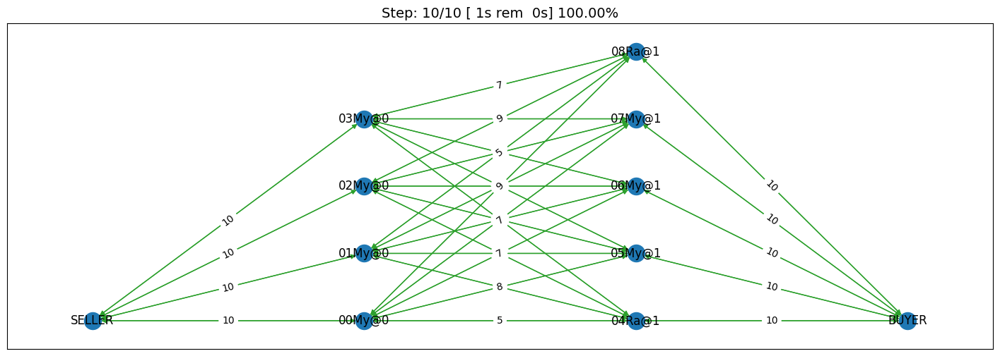

Developing an agent using RL (new in 2024)
------------------------------------------

The SCML game provides a new and interesting challenge for reinforcement
learning and multi-agent reinforcement learning research. The main
challenges in this game are:

1. Each world is different which means that a single policy is not
   likely to work effectively in all worlds. This means that it may be
   beneficial to train multiple RL agents and design a way to switch
   between them depending on the situation. This approach was shown to
   be effective in simple automated negotiations
   `before <https://arxiv.org/pdf/2102.03588>`__.
2. The environment is partially observable because the agent has no
   access to the state of other agents.
3. The environment is not deterministic because different penalties and
   exogenous contracts are sampled from probabilistic distributions and
   do affect the behavior of all agents in the environment.
4. The state space is huge. The information available to the agent
   through the ``awi`` despite being partial is still large enough that
   just passing everything to the RL training algorithm is not likely to
   work.
5. Reward is sparce. No rewards of anykind are received - natively -
   during negotiations. The only rewards received by the agent are
   changes in its balance calculated at the end of every simulated day.

The SCML game is a realistic game for which any advance can readily be
translated into a real-world application. Some of the best peforming
agents in past iterations of SCML (OneShot) did use RL in some capacity.
It was difficult to develop these agents because no native support was
provided. In SCML 2024, we provide native support for developing RL
agents both for the OneShot and Standard tracks. This tutorial walks you
through the process involved in developing, training, and submitting a
simple RL agent for SCML 2024 OneShot. The process is exactly the same
for the standard track.

Moving Pieces
~~~~~~~~~~~~~

.. figure:: rl.jpg
   :alt: SCML RL Components

   SCML RL Components

RL support in SCML depends on multiple simple components. This section
of the tutorial introduces all the moving pieces and describe how they
fit together.

Developing an RL agent for SCML
~~~~~~~~~~~~~~~~~~~~~~~~~~~~~~~

The first step is to decide the contexts you are going to use for your
RL agent. As explained above, an RL agent can use multiple models
depending on the context it finds itself in. In this example we use two
contexts, one for :math:`L_0` agents and another for :math:`L_1` agents.

Context Design
^^^^^^^^^^^^^^

The function ``make_context`` below can be used to create either of
these contexts:

.. code:: ipython3

    N_SUPPLIERS = (1, 8)
    N_CONSUMERS = (1, 8)
    def make_context(as_supplier: bool):
        """Generates a context for the agent acting as a supplier or as a consumer"""
        n_agents_per_level = (
            min(N_SUPPLIERS[0], N_CONSUMERS[0]),  # type: ignore
            max(N_SUPPLIERS[1], N_CONSUMERS[1]),  # type: ignore
        )
        if as_supplier:
            return LimitedPartnerNumbersOneShotContext(
                n_suppliers=(0, 0),  # suppliers have no suppliers
                n_consumers=N_CONSUMERS,
                n_competitors=(N_SUPPLIERS[0] - 1, N_SUPPLIERS[1] - 1),
                n_agents_per_level=n_agents_per_level,
                level=0,  # suppliers are always in the first level
            )

        return LimitedPartnerNumbersOneShotContext(
            n_suppliers=N_SUPPLIERS,
            n_consumers=(0, 0),  # consumers have no consumers
            n_competitors=(N_CONSUMERS[0] - 1, N_CONSUMERS[1] - 1),
            n_agents_per_level=n_agents_per_level,
            level=-1,  # consumers are always in the last level
        )

Observation Manager Design
^^^^^^^^^^^^^^^^^^^^^^^^^^

The second step, is to decide what observations are we going to get from
the environment. This is the responsibility of the
``ObservationManager``. Here we simply use one of the built-in
observation managers.

.. container:: alert alert-warning

   ::

      The built-in observation manager is just a baseline that is not expected to behave well. Please be sure to design your own observation manager. You can use the code of the built-in observation manager as an example.

Our observation manager is implemented by ``MyObservationManager`` in
which we show all the methods that you need to implement for your
observation manager.

.. code:: ipython3

    from gymnasium import spaces

    class MyObservationManager(LimitedPartnerNumbersObservationManager):
        """This is my observation manager implementing encoding and decoding the state used by the RL algorithm"""

        def make_space(self) -> spaces.Space:
            """Creates the observation space"""
            return super().make_space()

        def encode(self, state: OneShotState) -> np.ndarray:
            """Encodes an observation from the agent's state"""
            return super().encode(state)

        def make_first_observation(self, awi: OneShotAWI) -> np.ndarray:
            """Creates the initial observation (returned from gym's reset())"""
            return super().make_first_observation(awi)

        def get_offers(
            self, awi: OneShotAWI, encoded: np.ndarray
        ) -> dict[str, SAOResponse]:
            """Gets the offers from an encoded state"""
            return super().get_offers(awi, encoded)

Training
^^^^^^^^

Now that we have a way to observe the environment, we can train two
models for our two contexts. ``train_models()`` below achieves this by
simply creating an environment for each context, instantiate an A2C
trainer (from the stable_baselines3 library) and calls its ``learn()``
method to train the model. The two learned models are then returned.

.. code:: ipython3

    from stable_baselines3 import A2C
    from scml.oneshot.rl.action import UnconstrainedActionManager
    from scml.oneshot.rl.agent import OneShotRLAgent
    from scml.oneshot.rl.env import OneShotEnv

    def train_models(type_ = "limited", n_training=100):
        # choose the type of the model. Possibilities supported are:
        # fixed: Supports a single world configuration
        # limited: Supports a limited range of world configuration
        # unlimited: Supports any range of world configurations

        def make_env(supplier, extra_checks: bool = False) -> OneShotEnv:
            context = make_context(supplier)
            return OneShotEnv(
                action_manager=UnconstrainedActionManager(context=context),
                observation_manager=MyObservationManager(
                    context=context, extra_checks=extra_checks
                ),
                context=context,
                extra_checks=False,
            )
        models = []
        for as_supplier in (False, True):
            suffix = 'supplier' if as_supplier else 'consumer'
            print(f"Training as {suffix}")
            # create a gymnasium environment for training
            env = make_env(as_supplier, extra_checks=True)

            # choose a training algorithm
            model = A2C("MlpPolicy", env, verbose=0)

            # train the model
            model.learn(total_timesteps=n_training, progress_bar=True)
            print(f"\tFinished training the model for {n_training} steps")
            models.append(model)
        return models

We can now train our models

.. code:: ipython3

    trained_models = train_models()

.. parsed-literal::

    Training as consumer

.. raw:: html

    <pre style="white-space:pre;overflow-x:auto;line-height:normal;font-family:Menlo,'DejaVu Sans Mono',consolas,'Courier New',monospace"></pre>

.. parsed-literal::

    Output()

.. raw:: html

    <pre style="white-space:pre;overflow-x:auto;line-height:normal;font-family:Menlo,'DejaVu Sans Mono',consolas,'Courier New',monospace">
    </pre>

.. parsed-literal::

    	Finished training the model for 100 steps
    Training as supplier

.. raw:: html

    <pre style="white-space:pre;overflow-x:auto;line-height:normal;font-family:Menlo,'DejaVu Sans Mono',consolas,'Courier New',monospace"></pre>

.. parsed-literal::

    Output()

.. raw:: html

    <pre style="white-space:pre;overflow-x:auto;line-height:normal;font-family:Menlo,'DejaVu Sans Mono',consolas,'Courier New',monospace">
    </pre>

.. parsed-literal::

    	Finished training the model for 100 steps

Creating the Agent
^^^^^^^^^^^^^^^^^^

The final step is to create our agent class ``MyAgent``. This class
simply inherits from the ``OneShotRLAgent`` class and updates the
initialization paratmers to use the models we just trained. Note that
each model should be wrapped in a ``Policy`` object which is done by the
``model_wrapper`` method below. Also note that we use pass our
observation manager to the base ``OneShotRLAgent`` alongside the model.

.. container:: alert alert-info

   ::

      It is possible to use different observation managers for differnt models.
       
      Make sure that the context used to train the model is the same as the one used for the observation manager.

.. code:: ipython3

    from scml.oneshot.rl.common import model_wrapper
    class MyAgent(OneShotRLAgent):
        """
        This is the only class you *need* to implement. The current skeleton simply loads a single model
        that is supposed to be saved in MODEL_PATH (train.py can be used to train such a model).
        """

        def __init__(self, *args, trainde_models=trained_models, **kwargs):
            # update keyword arguments
            kwargs.update(
                dict(
                    # load models from MODEL_PATH
                    models=tuple(model_wrapper(_) for _ in trained_models),
                    # create corresponding observation managers
                    observation_managers=(
                        MyObservationManager(context=make_context(True)),
                        MyObservationManager(context=make_context(False)),
                    ),
                )
            )
            # Initialize the base OneShotRLAgent with model paths and observation managers.
            super().__init__(*args, **kwargs)

Now we can have an agent that can be tested as we did in the previous
tutorial:

.. code:: ipython3

    world, ascores, tscores = try_agent(MyAgent)
    print_type_scores(tscores)

.. parsed-literal::

    [('RandomOneShotAgent', 0.24982980587974019), ('MyAgent', 0.11534350394659702)]

What next?
^^^^^^^^^^

As expected, the trained model is too weak for several reasons:

1. We trained it for only few steps (not even a complete world
   simulation). You will want to increase the number of steps during
   training.
2. The contexts we used are too general. A supplier with one other
   competitor and ten consumers is in a situation that is very different
   than one with ten other competitors and two consumers. You may need
   to think more carefully about what contexts makes sense for this
   problem.
3. The observation manager just does not make much sense. The built-in
   observation manager keeps track of the offers received and just few
   other parameters from the environment. This is not enough most likely
   to train a strong agent. Maybe, most of your time will be spent
   trying to comeup with good observation managers.
4. The reward function received by the agent during training is simply
   the profit/loss acrued every day. This is too sparse as there is no
   signal during negotiations. You may consider doing reward shaping by
   creating a reward function and passing it to the environment used in
   training.

Download :download:`Notebook<notebooks/03.rl.ipynb>`.
