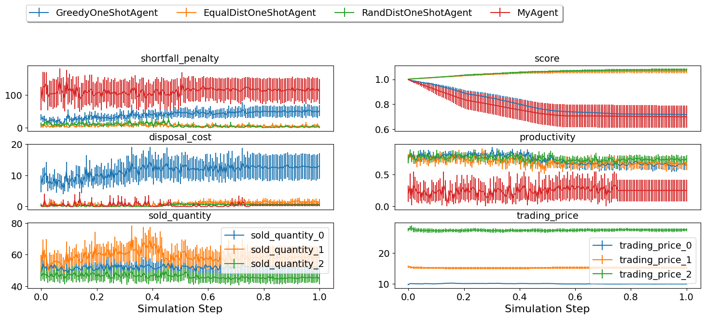

Developing an agent using RL (new in 2024)
------------------------------------------

The SCML game provides a new and interesting challenge for reinforcement
learning and multi-agent reinforcement learning research. The main
challenges in this game are:

1. Each world is different which means that a single policy is not
   likely to work effectively in all worlds. This means that it may be
   beneficial to train multiple RL agents and design a way to switch
   between them depending on the situation. This approach was shown to
   be effective in simple automated negotiations
   `before <https://arxiv.org/pdf/2102.03588>`__.
2. The environment is partially observable because the agent has no
   access to the state of other agents.
3. The environment is not deterministic because different penalties and
   exogenous contracts are sampled from probabilistic distributions and
   do affect the behavior of all agents in the environment.
4. The state space is huge. The information available to the agent
   through the ``awi`` despite being partial is still large enough that
   just passing everything to the RL training algorithm is not likely to
   work.
5. Reward is sparce. No rewards of anykind are received - natively -
   during negotiations. The only rewards received by the agent are
   changes in its balance calculated at the end of every simulated day.

The SCML game is a realistic game for which any advance can readily be
translated into a real-world application. Some of the best peforming
agents in past iterations of SCML (OneShot) did use RL in some capacity.
It was difficult to develop these agents because no native support was
provided. In SCML 2024, we provide native support for developing RL
agents both for the OneShot and Standard tracks. This tutorial walks you
through the process involved in developing, training, and submitting a
simple RL agent for SCML 2024 OneShot. The process is exactly the same
for the standard track.

Moving Pieces
~~~~~~~~~~~~~

RL support in SCML depends on multiple simple components. This section
of the tutorial introduces all the moving pieces and describe how they
fit together. The overall design is shown in the following figure:

   SCML RL Components

The Context
^^^^^^^^^^^

One of the unique features of SCML compared with other RL games is the
fact that every SCML simulation is different. For example, a market with
two suppliers and a hundred consumers is pretty different from one with
a hundred suppliers and two consumers. This makes it unlikely that a
single RL agent can achieve high scores in *all* simulations. Agents
that used machine learning in general and RL in particular in SCML 2019
to 2023 tended to train a dedicated model for each *set* of simulations
that were judged to be similar enough for a single model to work well.
We support this multi-model approach through the concept of a world
**context**. A
`Context <https://scml.readthedocs.io/en/latest/api/scml.oneshot.Context.html#scml.oneshot.Context>`__
has two roles in SCML:

1. It can be used to **generate** worlds satisfying the constraint(s)
   defined by that context. For example, a
   `FixedPartnerNumberOneShotContext <https://scml.readthedocs.io/en/latest/api/scml.oneshot.FixedPartnerNumbersOneShotContext.html#fixedpartnernumbersoneshotcontext>`__
   will always generate oneshot worlds that have the specificed number
   of suppliers and consumers. This is done by calling the
   `generate <https://scml.readthedocs.io/en/latest/api/scml.oneshot.Context.html#scml.oneshot.Context.generate>`__
   method.
2. It can be used to **test** whether a given world/api/context
   satsifies the constraint(s) defined by the context. This is done by
   calling the
   `is_valid_world <https://scml.readthedocs.io/en/latest/api/scml.oneshot.Context.html#scml.oneshot.Context.is_valid_world>`__/`is_valid_awi <https://scml.readthedocs.io/en/latest/api/scml.oneshot.Context.html#scml.oneshot.Context.is_valid_awi>`__/`contains_context <https://scml.readthedocs.io/en/latest/api/scml.oneshot.Context.html#scml.oneshot.Context.contains_context>`__
   methods or simply using ``in``. For example (``world in context``)
   will be ``True`` only if ``world`` could have been generated by
   ``context``.

The Environment
^^^^^^^^^^^^^^^

As is always the case in RL, we need the following components: An
**environment** which represents the game, an **agent** (or multiple
agents) that that receive **observations** from the environment and
return **actions** to it, and a **reward function** which provides
feedback to the agent (during training). These directly translate to the
components of the RL subsystem of SCML and the environment is what pulls
all of this together.

`OneShotEnv <https://scml.readthedocs.io/en/latest/api/scml.oneshot.OneShotEnv.html#oneshotenv>`__
is the base environment class. It instantiates ``OneShotWorld``\ s based
on the given ``Context``. The agent is represented within this
environment with a
`Placeholder <https://scml.readthedocs.io/en/latest/api/scml.oneshot.Placeholder.html#oneshotdummyagent>`__
which just acts as a placeholder for the RL agent interacting with this
environment. You do not need to modify this placeholder agent or touch
the environment (but you can if you wish to change how the interaction
between it and the agent goes). The environment keeps track of the rest
of the components as well and uses them to interact with the true
``OneShotRLAgent`` developed by the participant. These are the
``RewardFunction``, ``ObservactionManger`` and ``ActionManager``
explained next.

.. container:: alert alert-block alert-info

   ::

      The environment is used <strong>offine</strong> during agent development for training and testing (See the left and middle panels above). In the official competition, worlds are generated directly and no environment is created (right panel above).

During training and testing of the RL model, the environment enacts the
following process:

1. The context is used to generate a world in the beginning of the
   session and for generating new worlds once the current world
   simulation is done.
2. At every *step*, the environment uses the **ObservationManager** to
   **encode** the current state and pass it to the model being trained
   or tested.
3. The model generates actions which are **decoded** using the
   **ActionManager** as offers/counter offers in all negotiations in
   which the RL agent is involved. These offers are passed back to the
   world and the simulation is stepped.
4. At the end of every step, the **RewardFunction** is used to calculate
   the appropriate reward to be returned to the training algorithm
   during training.

Observation Manager
^^^^^^^^^^^^^^^^^^^

The observation manger is responsible of, well, managing ovbservation by
implementing the following functionality:

1. Creation of the appropriate `gymnasium observation
   space <https://gymnasium.farama.org/api/spaces/>`__ to be used by the
   model representing the agent strategy. This is implemented by the
   `mak_space <https://scml.readthedocs.io/en/latest/api/scml.oneshot.ObservationManager.html#scml.oneshot.ObservationManager.make_space>`__
   method.
2. **Encoding** the current state of the environment as seen by the
   agent into an **observation** to be passed to the model. This
   observation must be compatible with the *action-space* created by
   this observation manager. This is implemented by the
   `encode <https://scml.readthedocs.io/en/latest/api/scml.oneshot.ObservationManager.html#scml.oneshot.ObservationManager.encode>`__
   method.

The observation manager can optionally implement a
`get_offers <https://scml.readthedocs.io/en/latest/api/scml.oneshot.ObservationManager.html#scml.oneshot.ObservationManager.get_offers>`__
method to extract partner offers from the encoded state. This
functionality is not needed by RL agents but it may be helpful for
debugging.

As explained in the previous section, the environment mainly uses the
ObaservationManager() to encode the state of the world for the
consumption of the RL agent. SCML’s full observation of the agent (See
`awi.state <https://scml.readthedocs.io/en/latest/api/scml.oneshot.OneShotState.html>`__)
is extremely large. This means that the ability of the
ObservationManager to balance keeping track of useful information and
explosion of the state-space size will be an important factor in the
success of RL agents in SCML. We suspect this component is where most of
the designer effort needs to be spent.

Action Manager
^^^^^^^^^^^^^^

The action manager is responsible of managing the actions flowing from
the agent to environment. It must provide the following functionality:

1. Creation of the appropriate `gymnasium action
   space <https://gymnasium.farama.org/api/spaces/>`__ to be used by the
   model representing the agent strategy. This is implemented by the
   `mak_space <https://scml.readthedocs.io/en/latest/api/scml.oneshot.ActionManager.html#scml.oneshot.ActionManager.make_space>`__
   method.
2. **Decoding** the action generated by the agent’s model into a mapping
   of partners to counter-offers/responses. This is implemented by the
   `decode <https://scml.readthedocs.io/en/latest/api/scml.oneshot.ActionManager.html#scml.oneshot.ActionManager.decode>`__
   method

Optaionlly, the action manager can also implement *encoding* of any
given response to partners into a model-compatible action in the
`encode <https://scml.readthedocs.io/en/latest/api/scml.oneshot.ActionManager.html#scml.oneshot.ActionManager.encode>`__
method. This is mostly used for debugging purposes.

Reward Function
^^^^^^^^^^^^^^^

During training, the environment needs to generate rewards for the RL
policy being trained. This is the responsibility of the
`RewardFunction <https://scml.readthedocs.io/en/latest/api/scml.oneshot.rl.RewardFunction.html>`__.
The default reward function simply returns the difference in agent’s
balance (money in the wallet) before and after executing its action.
This is guaranteed to be zero as long as negotiations are going on and
will only be nonzero at the end of every simulation day when profits are
calculated by the simulator. You may consider designing a different
reward function for your agent. The reward function is called twice in
every step of the environment (i.e. every negotiation step):

1. The ``before_action`` method is called *before* the agent acts in the
   environment and is allowed to return arbitrary data.
2. The ``__call__`` method is called *after* the agent acts in the
   environment and it receives whatever data returned from
   ``before_action``. This method is responsible of returning a
   real-valued reward to be passed to the agent.

The Agent
^^^^^^^^^

There are two RL-related agent types in SCML:

1. `OneShotRLAgent <https://scml.readthedocs.io/en/latest/api/scml.oneshot.OneShotRLAgent.html>`__
   is the main class responsible for implementing RL agents that can run
   in the OneShotWorld and compete in the scml-oneshot track.
2. `Placeholder <https://scml.readthedocs.io/en/latest/api/scml.oneshot.Placeholder.html#placeholder>`__
   which is used internally by the environment as a place-holder for the
   RL agent controlled by the ``OneShotRLAgent``. You should not need to
   care about this agent type.

The ``OneShotRLAgent`` receives lists of models, observation and action
managers and a fall-back agent type. During initialization
(`init <https://scml.readthedocs.io/en/latest/reference/scml.html#scml.OneShotAgent.init>`__
call), the agent loops through the observation and action managers
checking whether the current world is compatible with them (i.e. in the
contexts they are compatible with). Once such a match is found, the
corresponding model is selected to act in this world simulation. You can
have this test done only at initialization (default) or every step (see
``dynamic_context_switching``) and you can use the given order of
observation/action managers or randomize it every check. If no
observation/action manager are found to be compatible with the current
simulation, the ``fallback_agent_type`` is used to create a fall-back
agent which takes over in interacting with the simulation.

You do not usually need to change anything about how this agent works
but you can modify how it handles multiple contexts/models, use dynamic
context switching, randomize model checking order, change the fall-back
agent, etc.

Model
'''''

An ``RLModel`` is what you train for a given context. It takes the
output of the ObservationManager as observations and generates actions
for the ActionManager to pass into the simulation. You can write your
own models by hand but, most likely, you will let an RL training
algorithm train this model offline. You can then use the appropriate
model for each world through the ``OneShotAgent`` explained above.

.. container:: alert alert-block alert-info

   ::

      You need to wrap trained models using wrap_model() before using them in OneShotRLAgent.

How to train your dragon (agent)?
~~~~~~~~~~~~~~~~~~~~~~~~~~~~~~~~~

The process of developing your own RL agent for the scml competition is
straight forward:

1. You need to decide what contexts will you be using. You can use any
   contexts in the scml package or design your own.
2. Create observation and action managers that are compatible with the
   contexts you decided (if ones are not already available in the scml
   package).
3. Train one model per context using the corresponding observation and
   action manager.
4. Test your models offline until you are satisfied of their
   performance.
5. Design a fallback agent that can be used whenever the world
   simulation does not match any of the contexts you designer/used.
6. Create a ``OneShotRLAgent`` (or ``StdRLAgent`` for the standard
   track) that simply loads the models you trained with their
   appropriate observation and action managers.
7. Submit your agent to the competition with the saved models.

What can you change?
~~~~~~~~~~~~~~~~~~~~

The moving parts that you control to develop your RL agent for SCML are
the following:

1. **Context**. You can design your own contexts that represent the
   environments for which your models are trained. You can use as many
   contexts and train as many models as you need. We use one context for
   acting as a supplier and another for acting as a consumer in the
   `code
   template <https://yasserfarouk.github.io/files/scml/y2024/oneshot_rl.zip>`__.

2. **RewardFunction**. You can design your own reward function and use
   it for training one or more of your models. You can use different
   reward functions for different contexts. We simply use the balance
   change at the end of the simulated day as the reward in the `code
   template <https://yasserfarouk.github.io/files/scml/y2024/oneshot_rl.zip>`__.

3. **ObservationManager**. You can design what your agent observes in
   the environment. The default observation manager currently uses the
   following data from the AWI:

   -  Received offers to be responded to
   -  Needed sales and supplies
   -  Number of production lines
   -  Agent level (i.e. level 0 or 1)
   -  Relative negotiation time (within the day)
   -  Relative simulation time (day within the simulation)
   -  disposal cost
   -  shortfall penalty
   -  current trading prices of input and output products

4. **ActionManager**. You can decide what kinds of actions does your
   agent generate and how can these be translated into negotiation
   actions during the competition. The default action manager can be
   used diretly to negotiate in any simulation.

5. **Training Algorithm**. You can change the training algorithm used
   for your models. You can even have different training algorithms for
   different models in different contexts. This is all done offline so
   you are completely free here. We use
   `A2C <https://stable-baselines3.readthedocs.io/en/master/modules/a2c.html>`__
   in the `code
   template <https://yasserfarouk.github.io/files/scml/y2024/oneshot_rl.zip>`__.

6. **Model Architecture** You can design the neural architecture of your
   models in any way you like as long as it matches the training
   algorithm you are using and the observation/action manager they
   employ. We use a simple MLP architecture in the `code
   template <https://yasserfarouk.github.io/files/scml/y2024/oneshot_rl.zip>`__.

7. **Fallback Strategy**. If a world does not match any of the contexts
   you designed, the system will use your fallback-strategy for the
   simulation represented by this world. You can modify the fallback
   strategy as well. The default fall-back agent is the
   `GreedyOneShotAgent <https://scml.readthedocs.io/en/latest/api/scml.oneshot.GreedyOneShotAgent.html>`__

Developing an RL agent for SCML
~~~~~~~~~~~~~~~~~~~~~~~~~~~~~~~

In which we give a full example of developing an RL agent for SCML. You
can use the `oneshot
template <https://yasserfarouk.github.io/files/scml/y2024/oneshot_rl.zip>`__
or the `std
template <https://yasserfarouk.github.io/files/scml/y2024/std_rl.zip>`__
provided by the organizers to simplify this process. The following
example is roughly based on these templates.

The first step is to decide the contexts you are going to use for your
RL agent. As explained above, an RL agent can use multiple models
depending on the context it finds itself in. In this example we use two
contexts, one for :math:`L_0` agents and another for :math:`L_1` agents.

Context Design
^^^^^^^^^^^^^^

The function ``make_context`` below can be used to create either of
these contexts:

.. code:: ipython3

    def make_context(as_supplier: bool):
        """Generates a context for the agent acting as a supplier or as a consumer"""
        if as_supplier:
            return SupplierContext()

        return ConsumerContext()

Observation Manager Design
^^^^^^^^^^^^^^^^^^^^^^^^^^

The second step, is to decide what observations are we going to get from
the environment. This is the responsibility of the
``ObservationManager``. Here we simply use one of the built-in
observation managers.

.. container:: alert alert-block alert-warning

   ::

      The built-in observation manager is just a baseline that is not expected to behave well. Please be sure to design your own observation manager. You can use the code of the built-in observation manager as an example.

Our observation manager is implemented by ``MyObservationManager`` in
which we show all the methods that you need to implement for your
observation manager.

.. code:: ipython3

    from gymnasium import spaces

    class MyRewardFunction(DefaultRewardFunction):
        def before_action(self, awi: OneShotAWI):
            return super().before_action(awi)

        def __call__(self, awi: OneShotAWI, action: dict[str, SAOResponse], info) -> float:
            return super().__call__(awi, action, info)

    class MyObservationManager(FlexibleObservationManager):
        """This is my observation manager implementing encoding and decoding the state used by the RL algorithm"""

        def make_space(self) -> spaces.Space:
            """Creates the observation space"""
            return super().make_space()

        def encode(self, state: OneShotState) -> np.ndarray:
            """Encodes an observation from the agent's state"""
            return super().encode(state)

        def make_first_observation(self, awi: OneShotAWI) -> np.ndarray:
            """Creates the initial observation (returned from gym's reset())"""
            return super().make_first_observation(awi)

        def get_offers(
            self, awi: OneShotAWI, encoded: np.ndarray
        ) -> dict[str, SAOResponse]:
            """Gets the offers from an encoded state"""
            return super().get_offers(awi, encoded)

Training
^^^^^^^^

Now that we have a way to observe the environment, we can train two
models for our two contexts. ``train_models()`` below achieves this by
simply creating an environment for each context, instantiate an A2C
trainer (from the stable_baselines3 library) and calls its ``learn()``
method to train the model. The two learned models are then returned.

.. code:: ipython3

    from stable_baselines3 import A2C
    from scml.oneshot.rl.action import FlexibleActionManager
    from scml.oneshot.rl.agent import OneShotRLAgent
    from scml.oneshot.rl.env import OneShotEnv

    def train_models(type_="limited", n_training=100):
        # choose the type of the model. Possibilities supported are:
        # fixed: Supports a single world configuration
        # limited: Supports a limited range of world configuration
        # unlimited: Supports any range of world configurations

        def make_env(supplier, extra_checks: bool = False) -> OneShotEnv:
            context = make_context(supplier)
            return OneShotEnv(
                action_manager=FlexibleActionManager(context=context),
                observation_manager=MyObservationManager(
                    context=context, extra_checks=extra_checks
                ),
                context=context,
                reward_function=MyRewardFunction(),
            )

        models = []
        for as_supplier in (False, True):
            suffix = "supplier" if as_supplier else "consumer"
            print(f"Training as {suffix}")
            # create a gymnasium environment for training
            env = make_env(as_supplier)

            # choose a training algorithm
            model = A2C("MlpPolicy", env, verbose=0)

            # train the model
            model.learn(total_timesteps=n_training)
            print(f"\tFinished training the model for {n_training} steps")
            models.append(model)
        return models

We can now train our models

.. code:: ipython3

    trained_models = train_models()

.. parsed-literal::

    Training as consumer
    	Finished training the model for 100 steps
    Training as supplier
    	Finished training the model for 100 steps

Creating the Agent
^^^^^^^^^^^^^^^^^^

The final step is to create our agent class ``MyAgent``. This class
simply inherits from the ``OneShotRLAgent`` class and updates the
initialization paratmers to use the models we just trained. Note that
each model should be wrapped in a ``Policy`` object which is done by the
``model_wrapper`` method below. Also note that we use pass our
observation manager to the base ``OneShotRLAgent`` alongside the model.

.. container:: alert alert-block alert-info

   ::

      It is possible to use different observation managers for differnt models.
       
      Make sure that the context used to train the model is the same as the one used for the observation manager.

.. code:: ipython3

    from scml.oneshot.rl.common import model_wrapper

    class MyAgent(OneShotRLAgent):
        """
        This is the only class you *need* to implement. The current skeleton simply loads a single model
        that is supposed to be saved in MODEL_PATH (train.py can be used to train such a model).
        """

        def __init__(self, *args, trainde_models=trained_models, **kwargs):
            # update keyword arguments
            kwargs.update(
                dict(
                    # load models from MODEL_PATH
                    models=tuple(model_wrapper(_) for _ in trained_models),
                    # create corresponding observation managers
                    observation_managers=(
                        MyObservationManager(context=SupplierContext()),
                        MyObservationManager(context=ConsumerContext()),
                    ),
                    action_managers=(
                        FlexibleActionManager(context=SupplierContext()),
                        FlexibleActionManager(context=ConsumerContext())
                    ),
                )
            )
            # Initialize the base OneShotRLAgent with model paths and observation managers.
            super().__init__(*args, **kwargs)

Now we have an agent that can be tested as we did in the previous
tutorial:

.. code:: ipython3

    worlds = []
    for _ in range(6):
        world, _ = ANACOneShotContext(placeholder_types=(MyAgent,)).generate()
        worlds.append(world)
        world.run()

.. code:: ipython3

    SCML2024OneShotWorld.plot_combined_stats(worlds, pertype=True, perishable=True)

As we should have expected, given the few training steps we used and the
use of basic observation and action manager and the default sparse
reward function, the agent did not behave very well.

What next?
^^^^^^^^^^

As expected, the trained model is too weak for several reasons:

1. We trained it for only few steps (not even a complete world
   simulation). You will want to increase the number of steps during
   training.
2. The contexts we used are too general. A supplier with one other
   competitor and ten consumers is in a situation that is very different
   than one with ten other competitors and two consumers. You may need
   to think more carefully about what contexts makes sense for this
   problem.
3. The observation manager just does not make much sense. The built-in
   observation manager keeps track of the offers received and just few
   other parameters from the environment. This is not enough most likely
   to train a strong agent. Maybe, most of your time will be spent
   trying to come up with good observation managers.
4. The reward function received by the agent during training is simply
   the profit/loss accrued every day. This is too sparse as there is no
   signal during negotiations. You may consider doing reward shaping by
   creating a reward function and passing it to the environment used in
   training.

A note about SCML Standard
~~~~~~~~~~~~~~~~~~~~~~~~~~

This tutorial used the scml-oneshot simulation to show how to develop an
RL agent. The same process works once you change every mention of
OneShot with Std in the explanation above for the scml-std game. Be
aware though that the standard track of SCML does not restrict the
number of production levels to two as in the oneshot track. This means
that the agent may find itself in the middle of the production graph
negotiating on both sides for supplies and sales. This means that using
two contexts one when we are in the first production level and another
when we are in the last is not going to be enough for scml-std and we
need at least a third context in which the agent is in the middle of the
production graph.

Download :download:`Notebook<notebooks/03.rl.ipynb>`.
