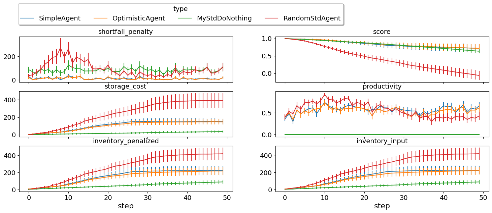

Developing an agent for SCML2024 (Standard)
-------------------------------------------

In 2024, we introduced a new implementation of the SCML-Standard track
which simplified its API making it exactly the same as the simpler
SCML-OneShot track. The older version of the game is not supported
anymore.

**SCML-Std brief introduction** Please refer to the first tutorial for a
brief introduction about the world simulated in this game as well as
pointers to more information. We will assume knowledge of at least this
brief introduction in the remainder of this tutorial.

The main differences between the Standard and OneShot simulation that
will affect this tutorial are the following:

1. Agents can negotiate **future contracts** instead of only being
   allowed to negotiate about deliveries on the same day. This means
   that we better consider future contracts when negotiating instead of
   trying to secure all of our needs on the day they arise.
2. Negotiated **prices have a larger range** which necessitates
   reasoning about prices as well as quantity matching. This means that
   we should be careful about accepting good prices (i.e. low prices
   when buying and high prices when selling).
3. Production graphs can be **deeper** which means that some agents will
   negotiate with **both** their suppliers and consumers at the same
   time. This means that our agent may find itself in the **middle** of
   the production graph with no exogenous contracts. In such cases, the
   agent may set some target production level and try to achieve it
   instead of relying on its exogenous contracts to set its targets.

Let’s defines some helper functions that will be used throughout this
tutorial to test our agents.

The core function is ``try_agents`` which allows you to pass a list of
agent types and tries them in predefined configurations. Note that the

.. code:: ipython3

    from collections import defaultdict
    import random
    from negmas import ResponseType, SAOResponse
    from scml.std import *
    from scml.std.world import PLACEHOLDER_AGENT_PREFIX
    from scml.std.common import is_system_agent
    from rich import print
    import math
    from typing import Iterable

    CONFIGS = dict()
    DefaultTypes = [GreedyStdAgent, RandomStdAgent, SyncRandomStdAgent]

    def try_agent(agent_type, alone=False, **kwargs):
        """Runs an agent in a world simulation against a randomly behaving agent"""
        if alone:
            return try_agents([agent_type], **kwargs)
        return try_agents(DefaultTypes + [agent_type], **kwargs)

    def make_configs(n, n_trials, n_processes, n_steps=10):
        types = [f"{PLACEHOLDER_AGENT_PREFIX}{i}" for i in range(n)]
        return [
            (
                types,
                SCML2024StdWorld.generate(
                    types,
                    agent_params=None,
                    n_steps=10,
                    n_processes=n_processes,
                    random_agent_types=True,
                    construct_graphs=True,
                ),
            )
            for _ in range(n_trials)
        ]

    def try_agents(
        agent_types,
        n_processes=3,
        n_trials=4,
        n_steps=10,
        draw=True,
        agent_params=None,
        debug=True,
    ):
        """
        Runs a simulation with the given agent_types, and n_processes n_trial times.
        Optionally also draws a graph showing what happened
        """
        n = len(agent_types)
        if (n, n_processes) not in CONFIGS:
            CONFIGS[(n, n_processes)] = make_configs(n, n_trials, n_processes, n_steps)
        n_rem = n_trials - len(CONFIGS[(n, n_processes)])
        if n_rem > 0:
            CONFIGS[(n, n_processes)] += make_configs(n, (n_rem), n_processes, n_steps)
        configs = CONFIGS[(n, n_processes)]
        type_scores = defaultdict(float)
        counts = defaultdict(int)
        agent_scores = dict()
        worlds = []
        for old_types, config in configs[:n_trials]:
            p = (
                n_processes
                if isinstance(n_processes, int)
                else random.randint(*n_processes)
            )
            world = SCML2024StdWorld(
                **SCML2024StdWorld.replace_agents(
                    config, old_types, agent_types, agent_params
                ),
                debug=debug,
            )
            worlds.append(world)
            world.run()

            all_scores = world.scores()
            for aid, agent in world.agents.items():
                if is_system_agent(aid):
                    continue
                key = aid if n_trials == 1 else f"{aid}@{world.id[:4]}"
                agent_scores[key] = (
                    agent.type_name.split(":")[-1].split(".")[-1],
                    all_scores[aid],
                    "(bankrupt)" if world.is_bankrupt[aid] else "",
                )
            for aid, agent in world.agents.items():
                if is_system_agent(aid):
                    continue
                type_ = agent.type_name.split(":")[-1].split(".")[-1]
                type_scores[type_] += all_scores[aid]
                counts[type_] += 1
        type_scores = {k: v / counts[k] if counts[k] else v for k, v in type_scores.items()}
        if draw:
            draw_worlds(worlds)

        return worlds, agent_scores, type_scores

    def draw_worlds(worlds):
        n_trials = len(worlds)
        mx = min(n_trials, 2)
        fig = plt.figure(figsize=(11 * mx, 8))
        axs = fig.subplots(int(math.ceil(n_trials / mx)), mx)
        if isinstance(axs, Iterable):
            axs = axs.flatten()
        for ax, world in zip(axs if n_trials > 1 else [axs], worlds):
            world.draw(
                what=["contracts-concluded"],
                steps=(0, world.n_steps - 1),
                together=True,
                ncols=1,
                axs=ax,
            )
        plt.show()

    def plot_stats(worlds, stats="score", pertype=False, legend=False, **kwargs):
        SCML2024StdWorld.plot_combined_stats(
            worlds, stats=stats, n_steps=None, pertype=pertype, legend=legend, **kwargs
        )

    def analyze_contracts(worlds):
        """
        Analyzes the contracts signed in the given world
        """
        import pandas as pd

        dfs = []
        for world in worlds:
            dfs.append(pd.DataFrame.from_records(world.saved_contracts))
        data = pd.concat(dfs)
        return data.groupby(["seller_name", "buyer_name"])[["quantity", "unit_price"]].agg(
            dict(quantity=("sum", "count"), unit_price="mean")
        )

    def print_agent_scores(agent_scores):
        """
        Prints scores of individiual agent instances
        """
        for aid, (type_, score, bankrupt) in agent_scores.items():
            print(f"Agent {aid} of type {type_} has a final score of {score} {bankrupt}")

    def print_type_scores(type_scores):
        """Prints scores of agent types"""
        print(sorted(tuple(type_scores.items()), key=lambda x: -x[1]))

.. code:: ipython3

    worlds, ascores, tscores = try_agent(RandomStdAgent, alone=True)

.. image:: 04.develop_agent_scml2024_std_files/04.develop_agent_scml2024_std_2_0.png

.. code:: ipython3

    print_type_scores(tscores)

.. raw:: html

    <pre style="white-space:pre;overflow-x:auto;line-height:normal;font-family:Menlo,'DejaVu Sans Mono',consolas,'Courier New',monospace">[('RandomStdAgent', 0.03587383970674268)]
    </pre>

.. code:: ipython3

    plot_stats(worlds)

.. image:: 04.develop_agent_scml2024_std_files/04.develop_agent_scml2024_std_4_0.png

This score is much lower than what we got in the oneshot world. Some of
the reasons for that are the following:

1. In the standard game, the range of prices is large enough that price
   matters. Choosing a random price is not a good idea here. In the
   oneshot game, on the other hand, price range was extremely small that
   the price did not really matter.
2. In the oneshot game, all negotiations happen about deliveries on the
   same day and products are perishable so you do not accomulate stock
   over time. In the standard game, on the other hand, negotiations are
   about deliveries on the same day or the future. Picking randomly from
   those will reduce the probability of picking what you need today and
   increase the probability of picking something you do not really need
   in the future.

Now we are ready to develop a do-nothing agent, but first, let’s try
some of the built in agents to see how do they behave.

.. code:: ipython3

    worlds, ascores, tscores = try_agent(SyncRandomStdAgent, alone=True)
    print_type_scores(tscores)
    plot_stats(worlds)

.. image:: 04.develop_agent_scml2024_std_files/04.develop_agent_scml2024_std_6_0.png

.. raw:: html

    <pre style="white-space:pre;overflow-x:auto;line-height:normal;font-family:Menlo,'DejaVu Sans Mono',consolas,'Courier New',monospace">[('SyncRandomStdAgent', 0.9185676954179436)]
    </pre>

.. image:: 04.develop_agent_scml2024_std_files/04.develop_agent_scml2024_std_6_2.png

.. code:: ipython3

    worlds, ascores, tscores = try_agent(GreedyStdAgent, alone=True)
    print_type_scores(tscores)
    plot_stats(worlds)

.. image:: 04.develop_agent_scml2024_std_files/04.develop_agent_scml2024_std_7_0.png

.. raw:: html

    <pre style="white-space:pre;overflow-x:auto;line-height:normal;font-family:Menlo,'DejaVu Sans Mono',consolas,'Courier New',monospace">[('GreedyStdAgent', 0.963690745962998)]
    </pre>

.. image:: 04.develop_agent_scml2024_std_files/04.develop_agent_scml2024_std_7_2.png

The two builtin agents behaved roughly similarliy but one of them is
more likely seems to get many more contracts.

Let’s check how does oneshot agents behave in this simulation:

.. code:: ipython3

    from scml.oneshot.agents import RandDistOneShotAgent

    worlds, ascores, tscores = try_agent(RandDistOneShotAgent, alone=True)
    print_type_scores(tscores)
    plot_stats(worlds)

.. image:: 04.develop_agent_scml2024_std_files/04.develop_agent_scml2024_std_9_0.png

.. raw:: html

    <pre style="white-space:pre;overflow-x:auto;line-height:normal;font-family:Menlo,'DejaVu Sans Mono',consolas,'Courier New',monospace">[('RandDistOneShotAgent', 0.7517116322669039)]
    </pre>

.. image:: 04.develop_agent_scml2024_std_files/04.develop_agent_scml2024_std_9_2.png

This agent got literally no contracts. The reason is that it is designed
for a shallow world of two production levels. Agents in the middle never
have agreements with anyone and this halts the whole market.

Some oneshot agents can work in deeper production graphs like the
following agent but they still cannot usually get good scores because
they wait to the last minute to try getting their needed supply and
negotiate for sales. This is not expected to work well in SCML-Std and
it does not:

.. code:: ipython3

    worlds, ascores, tscores = try_agent(GreedyOneShotAgent, alone=True)
    print_type_scores(tscores)
    plot_stats(worlds)

.. image:: 04.develop_agent_scml2024_std_files/04.develop_agent_scml2024_std_11_0.png

.. raw:: html

    <pre style="white-space:pre;overflow-x:auto;line-height:normal;font-family:Menlo,'DejaVu Sans Mono',consolas,'Courier New',monospace">[('GreedyOneShotAgent', 0.3804299108739227)]
    </pre>

.. image:: 04.develop_agent_scml2024_std_files/04.develop_agent_scml2024_std_11_2.png

Now, we are ready to start working on our agent:

.. code:: ipython3

    class MyStdDoNothing(StdPolicy):
        """My Agent that does nothing"""

        def act(self, state):
            return {
                partner: SAOResponse(ResponseType.END_NEGOTIATION, None)
                for partner in state.my_suppliers + state.my_consumers
            }

.. code:: ipython3

    worlds, ascores, tscores = try_agent(MyStdDoNothing)

.. image:: 04.develop_agent_scml2024_std_files/04.develop_agent_scml2024_std_14_0.png

In all of the graph representing world simulations, we use short names
that represent the type of the agent. For example an agent named
``01Gr@0`` is an agent of type ``GreedyStdAgent`` at production level 1
that was the third agent to create. ``MSD`` here is a shorthand for
``MyStdDoNothingAgent``.

Looking at the ``contracts-concluded``, we can see that none of the
concluded contracts involved our do-nothing agent. Nevertheless, these
agents still had *exogenous contracts* which means that they will lose
money. A do-nothing agent will usually lose money in this game.

Let’s check the scores of different agents to confirm:

.. code:: ipython3

    print_agent_scores(ascores)

.. raw:: html

    <pre style="white-space:pre;overflow-x:auto;line-height:normal;font-family:Menlo,'DejaVu Sans Mono',consolas,'Courier New',monospace">Agent 00Ra@0@SCML of type RandomStdAgent has a final score of 0.5835303352883182
    </pre>

.. raw:: html

    <pre style="white-space:pre;overflow-x:auto;line-height:normal;font-family:Menlo,'DejaVu Sans Mono',consolas,'Courier New',monospace">Agent 01Ra@0@SCML of type RandomStdAgent has a final score of -0.011510183150527924 (bankrupt)
    </pre>

.. raw:: html

    <pre style="white-space:pre;overflow-x:auto;line-height:normal;font-family:Menlo,'DejaVu Sans Mono',consolas,'Courier New',monospace">Agent 02SRS@0@SCML of type SyncRandomStdAgent has a final score of 1.0914680071754974
    </pre>

.. raw:: html

    <pre style="white-space:pre;overflow-x:auto;line-height:normal;font-family:Menlo,'DejaVu Sans Mono',consolas,'Courier New',monospace">Agent 03Ra@0@SCML of type RandomStdAgent has a final score of 0.5222391259039886
    </pre>

.. raw:: html

    <pre style="white-space:pre;overflow-x:auto;line-height:normal;font-family:Menlo,'DejaVu Sans Mono',consolas,'Courier New',monospace">Agent 04MSD@1@SCML of type MyStdDoNothing has a final score of 1.0
    </pre>

.. raw:: html

    <pre style="white-space:pre;overflow-x:auto;line-height:normal;font-family:Menlo,'DejaVu Sans Mono',consolas,'Courier New',monospace">Agent 05Gr@1@SCML of type GreedyStdAgent has a final score of 0.8006518237046701
    </pre>

.. raw:: html

    <pre style="white-space:pre;overflow-x:auto;line-height:normal;font-family:Menlo,'DejaVu Sans Mono',consolas,'Courier New',monospace">Agent 06Gr@1@SCML of type GreedyStdAgent has a final score of 1.1171332265427407
    </pre>

.. raw:: html

    <pre style="white-space:pre;overflow-x:auto;line-height:normal;font-family:Menlo,'DejaVu Sans Mono',consolas,'Courier New',monospace">Agent 07Gr@1@SCML of type GreedyStdAgent has a final score of 1.318543913865625
    </pre>

.. raw:: html

    <pre style="white-space:pre;overflow-x:auto;line-height:normal;font-family:Menlo,'DejaVu Sans Mono',consolas,'Courier New',monospace">Agent 08Ra@1@SCML of type RandomStdAgent has a final score of -0.2513688772104863 (bankrupt)
    </pre>

.. raw:: html

    <pre style="white-space:pre;overflow-x:auto;line-height:normal;font-family:Menlo,'DejaVu Sans Mono',consolas,'Courier New',monospace">Agent 09Gr@1@SCML of type GreedyStdAgent has a final score of 1.1152881200111617
    </pre>

.. raw:: html

    <pre style="white-space:pre;overflow-x:auto;line-height:normal;font-family:Menlo,'DejaVu Sans Mono',consolas,'Courier New',monospace">Agent 10Gr@1@SCML of type GreedyStdAgent has a final score of 0.6371031947182872
    </pre>

.. raw:: html

    <pre style="white-space:pre;overflow-x:auto;line-height:normal;font-family:Menlo,'DejaVu Sans Mono',consolas,'Courier New',monospace">Agent 11SRS@2@SCML of type SyncRandomStdAgent has a final score of 1.1845674353903455
    </pre>

.. raw:: html

    <pre style="white-space:pre;overflow-x:auto;line-height:normal;font-family:Menlo,'DejaVu Sans Mono',consolas,'Courier New',monospace">Agent 12Ra@2@SCML of type RandomStdAgent has a final score of -0.5236226204265346 (bankrupt)
    </pre>

.. raw:: html

    <pre style="white-space:pre;overflow-x:auto;line-height:normal;font-family:Menlo,'DejaVu Sans Mono',consolas,'Courier New',monospace">Agent 13SRS@2@SCML of type SyncRandomStdAgent has a final score of 1.1041305102395003
    </pre>

.. raw:: html

    <pre style="white-space:pre;overflow-x:auto;line-height:normal;font-family:Menlo,'DejaVu Sans Mono',consolas,'Courier New',monospace">Agent 14Ra@2@SCML of type RandomStdAgent has a final score of -0.3118719980881885 (bankrupt)
    </pre>

.. raw:: html

    <pre style="white-space:pre;overflow-x:auto;line-height:normal;font-family:Menlo,'DejaVu Sans Mono',consolas,'Courier New',monospace">Agent 15Ra@2@SCML of type RandomStdAgent has a final score of 0.4823638636673501
    </pre>

.. raw:: html

    <pre style="white-space:pre;overflow-x:auto;line-height:normal;font-family:Menlo,'DejaVu Sans Mono',consolas,'Courier New',monospace">Agent 00MSD@0@SCML of type MyStdDoNothing has a final score of 0.7551159814440324
    </pre>

.. raw:: html

    <pre style="white-space:pre;overflow-x:auto;line-height:normal;font-family:Menlo,'DejaVu Sans Mono',consolas,'Courier New',monospace">Agent 01SRS@0@SCML of type SyncRandomStdAgent has a final score of 0.4058135040032555
    </pre>

.. raw:: html

    <pre style="white-space:pre;overflow-x:auto;line-height:normal;font-family:Menlo,'DejaVu Sans Mono',consolas,'Courier New',monospace">Agent 02Ra@0@SCML of type RandomStdAgent has a final score of 0.7530540109193432
    </pre>

.. raw:: html

    <pre style="white-space:pre;overflow-x:auto;line-height:normal;font-family:Menlo,'DejaVu Sans Mono',consolas,'Courier New',monospace">Agent 03Gr@0@SCML of type GreedyStdAgent has a final score of 0.9852933856645596
    </pre>

.. raw:: html

    <pre style="white-space:pre;overflow-x:auto;line-height:normal;font-family:Menlo,'DejaVu Sans Mono',consolas,'Courier New',monospace">Agent 04MSD@0@SCML of type MyStdDoNothing has a final score of 0.446088593708925
    </pre>

.. raw:: html

    <pre style="white-space:pre;overflow-x:auto;line-height:normal;font-family:Menlo,'DejaVu Sans Mono',consolas,'Courier New',monospace">Agent 05Ra@0@SCML of type RandomStdAgent has a final score of 0.21667939684212875
    </pre>

.. raw:: html

    <pre style="white-space:pre;overflow-x:auto;line-height:normal;font-family:Menlo,'DejaVu Sans Mono',consolas,'Courier New',monospace">Agent 06Ra@0@SCML of type RandomStdAgent has a final score of 0.7174630513930531
    </pre>

.. raw:: html

    <pre style="white-space:pre;overflow-x:auto;line-height:normal;font-family:Menlo,'DejaVu Sans Mono',consolas,'Courier New',monospace">Agent 07Ra@1@SCML of type RandomStdAgent has a final score of 0.2365102168322169
    </pre>

.. raw:: html

    <pre style="white-space:pre;overflow-x:auto;line-height:normal;font-family:Menlo,'DejaVu Sans Mono',consolas,'Courier New',monospace">Agent 08SRS@1@SCML of type SyncRandomStdAgent has a final score of 0.9496240786383395
    </pre>

.. raw:: html

    <pre style="white-space:pre;overflow-x:auto;line-height:normal;font-family:Menlo,'DejaVu Sans Mono',consolas,'Courier New',monospace">Agent 10MSD@1@SCML of type MyStdDoNothing has a final score of 1.0
    </pre>

.. raw:: html

    <pre style="white-space:pre;overflow-x:auto;line-height:normal;font-family:Menlo,'DejaVu Sans Mono',consolas,'Courier New',monospace">Agent 11MSD@2@SCML of type MyStdDoNothing has a final score of 0.8602450675647509
    </pre>

.. raw:: html

    <pre style="white-space:pre;overflow-x:auto;line-height:normal;font-family:Menlo,'DejaVu Sans Mono',consolas,'Courier New',monospace">Agent 12MSD@2@SCML of type MyStdDoNothing has a final score of 0.6971926606540689
    </pre>

.. raw:: html

    <pre style="white-space:pre;overflow-x:auto;line-height:normal;font-family:Menlo,'DejaVu Sans Mono',consolas,'Courier New',monospace">Agent 13Gr@2@SCML of type GreedyStdAgent has a final score of 0.9989456221749038
    </pre>

.. raw:: html

    <pre style="white-space:pre;overflow-x:auto;line-height:normal;font-family:Menlo,'DejaVu Sans Mono',consolas,'Courier New',monospace">Agent 14SRS@2@SCML of type SyncRandomStdAgent has a final score of 1.1086219379063835
    </pre>

.. raw:: html

    <pre style="white-space:pre;overflow-x:auto;line-height:normal;font-family:Menlo,'DejaVu Sans Mono',consolas,'Courier New',monospace">Agent 16SRS@2@SCML of type SyncRandomStdAgent has a final score of 1.1600505479956373
    </pre>

.. raw:: html

    <pre style="white-space:pre;overflow-x:auto;line-height:normal;font-family:Menlo,'DejaVu Sans Mono',consolas,'Courier New',monospace">Agent 17MSD@2@SCML of type MyStdDoNothing has a final score of 0.4957376429580529
    </pre>

.. raw:: html

    <pre style="white-space:pre;overflow-x:auto;line-height:normal;font-family:Menlo,'DejaVu Sans Mono',consolas,'Courier New',monospace">Agent 00Gr@0@SCML of type GreedyStdAgent has a final score of 1.0967977805945475
    </pre>

.. raw:: html

    <pre style="white-space:pre;overflow-x:auto;line-height:normal;font-family:Menlo,'DejaVu Sans Mono',consolas,'Courier New',monospace">Agent 01MSD@0@SCML of type MyStdDoNothing has a final score of 0.2664821489394195
    </pre>

.. raw:: html

    <pre style="white-space:pre;overflow-x:auto;line-height:normal;font-family:Menlo,'DejaVu Sans Mono',consolas,'Courier New',monospace">Agent 04SRS@0@SCML of type SyncRandomStdAgent has a final score of 1.0508131055101728
    </pre>

.. raw:: html

    <pre style="white-space:pre;overflow-x:auto;line-height:normal;font-family:Menlo,'DejaVu Sans Mono',consolas,'Courier New',monospace">Agent 05Ra@1@SCML of type RandomStdAgent has a final score of -0.5422611347465074 (bankrupt)
    </pre>

.. raw:: html

    <pre style="white-space:pre;overflow-x:auto;line-height:normal;font-family:Menlo,'DejaVu Sans Mono',consolas,'Courier New',monospace">Agent 06MSD@1@SCML of type MyStdDoNothing has a final score of 1.0
    </pre>

.. raw:: html

    <pre style="white-space:pre;overflow-x:auto;line-height:normal;font-family:Menlo,'DejaVu Sans Mono',consolas,'Courier New',monospace">Agent 11Gr@1@SCML of type GreedyStdAgent has a final score of 0.8696861703536307
    </pre>

.. raw:: html

    <pre style="white-space:pre;overflow-x:auto;line-height:normal;font-family:Menlo,'DejaVu Sans Mono',consolas,'Courier New',monospace">Agent 12Gr@2@SCML of type GreedyStdAgent has a final score of 1.146523803778313
    </pre>

.. raw:: html

    <pre style="white-space:pre;overflow-x:auto;line-height:normal;font-family:Menlo,'DejaVu Sans Mono',consolas,'Courier New',monospace">Agent 15MSD@2@SCML of type MyStdDoNothing has a final score of 0.7389387752472338
    </pre>

.. raw:: html

    <pre style="white-space:pre;overflow-x:auto;line-height:normal;font-family:Menlo,'DejaVu Sans Mono',consolas,'Courier New',monospace">Agent 16Gr@2@SCML of type GreedyStdAgent has a final score of 1.3405699619810418
    </pre>

.. raw:: html

    <pre style="white-space:pre;overflow-x:auto;line-height:normal;font-family:Menlo,'DejaVu Sans Mono',consolas,'Courier New',monospace">Agent 17Ra@2@SCML of type RandomStdAgent has a final score of 0.7743356706720631
    </pre>

.. raw:: html

    <pre style="white-space:pre;overflow-x:auto;line-height:normal;font-family:Menlo,'DejaVu Sans Mono',consolas,'Courier New',monospace">Agent 01Gr@0@SCML of type GreedyStdAgent has a final score of 1.0625428168552271
    </pre>

.. raw:: html

    <pre style="white-space:pre;overflow-x:auto;line-height:normal;font-family:Menlo,'DejaVu Sans Mono',consolas,'Courier New',monospace">Agent 03MSD@0@SCML of type MyStdDoNothing has a final score of 0.38704782906088236
    </pre>

.. raw:: html

    <pre style="white-space:pre;overflow-x:auto;line-height:normal;font-family:Menlo,'DejaVu Sans Mono',consolas,'Courier New',monospace">Agent 04Ra@0@SCML of type RandomStdAgent has a final score of 0.24410799640319686
    </pre>

.. raw:: html

    <pre style="white-space:pre;overflow-x:auto;line-height:normal;font-family:Menlo,'DejaVu Sans Mono',consolas,'Courier New',monospace">Agent 05MSD@0@SCML of type MyStdDoNothing has a final score of 0.4551086832641586
    </pre>

.. raw:: html

    <pre style="white-space:pre;overflow-x:auto;line-height:normal;font-family:Menlo,'DejaVu Sans Mono',consolas,'Courier New',monospace">Agent 06Gr@0@SCML of type GreedyStdAgent has a final score of 1.1833724442438789
    </pre>

.. raw:: html

    <pre style="white-space:pre;overflow-x:auto;line-height:normal;font-family:Menlo,'DejaVu Sans Mono',consolas,'Courier New',monospace">Agent 09Ra@1@SCML of type RandomStdAgent has a final score of 0.3102331541751521
    </pre>

.. raw:: html

    <pre style="white-space:pre;overflow-x:auto;line-height:normal;font-family:Menlo,'DejaVu Sans Mono',consolas,'Courier New',monospace">Agent 10SRS@1@SCML of type SyncRandomStdAgent has a final score of 1.020005437704114
    </pre>

.. raw:: html

    <pre style="white-space:pre;overflow-x:auto;line-height:normal;font-family:Menlo,'DejaVu Sans Mono',consolas,'Courier New',monospace">Agent 12MSD@1@SCML of type MyStdDoNothing has a final score of 1.0
    </pre>

.. raw:: html

    <pre style="white-space:pre;overflow-x:auto;line-height:normal;font-family:Menlo,'DejaVu Sans Mono',consolas,'Courier New',monospace">Agent 14MSD@2@SCML of type MyStdDoNothing has a final score of 0.7119620767782724
    </pre>

.. raw:: html

    <pre style="white-space:pre;overflow-x:auto;line-height:normal;font-family:Menlo,'DejaVu Sans Mono',consolas,'Courier New',monospace">Agent 15Gr@2@SCML of type GreedyStdAgent has a final score of 1.0826080727333998
    </pre>

.. raw:: html

    <pre style="white-space:pre;overflow-x:auto;line-height:normal;font-family:Menlo,'DejaVu Sans Mono',consolas,'Courier New',monospace">Agent 18Gr@2@SCML of type GreedyStdAgent has a final score of 1.0055025090347856
    </pre>

Notice that our do-nothing agent can never make money. That is because
it cannot get any contracts from negotiation to satisfy its needs from
the exogenous contracts but it still have to pay for disposal cost and
shortfall penalties when it is in the first or last production levels.

.. code:: ipython3

    print_type_scores(tscores)

.. raw:: html

    <pre style="white-space:pre;overflow-x:auto;line-height:normal;font-family:Menlo,'DejaVu Sans Mono',consolas,'Courier New',monospace">[
        ('SyncRandomStdAgent', 1.022017714341071),
        ('GreedyStdAgent', 1.019515897613306),
        ('MyStdDoNothing', 0.7009942471156998),
        ('RandomStdAgent', 0.157149558270027)
    ]
    </pre>

We can also have a look at the *exogenous* contracts that drive the
market.

.. code:: ipython3

    analyze_contracts((worlds[0],))

.. raw:: html

    

    
    <table border="1" class="dataframe">
      <thead>
        <tr>
          <th></th>
          <th></th>
          <th colspan="2" halign="left">quantity</th>
          <th>unit_price</th>
        </tr>
        <tr>
          <th></th>
          <th></th>
          <th>sum</th>
          <th>count</th>
          <th>mean</th>
        </tr>
        <tr>
          <th>seller_name</th>
          <th>buyer_name</th>
          <th></th>
          <th></th>
          <th></th>
        </tr>
      </thead>
      <tbody>
        <tr>
          <th rowspan="6" valign="top">00Ra@0</th>
          <th>05Gr@1</th>
          <td>39</td>
          <td>9</td>
          <td>13.333333</td>
        </tr>
        <tr>
          <th>06Gr@1</th>
          <td>57</td>
          <td>10</td>
          <td>13.200000</td>
        </tr>
        <tr>
          <th>07Gr@1</th>
          <td>34</td>
          <td>9</td>
          <td>13.444444</td>
        </tr>
        <tr>
          <th>08Ra@1</th>
          <td>76</td>
          <td>6</td>
          <td>14.833333</td>
        </tr>
        <tr>
          <th>09Gr@1</th>
          <td>40</td>
          <td>10</td>
          <td>13.400000</td>
        </tr>
        <tr>
          <th>10Gr@1</th>
          <td>40</td>
          <td>10</td>
          <td>13.400000</td>
        </tr>
        <tr>
          <th rowspan="6" valign="top">01Ra@0</th>
          <th>05Gr@1</th>
          <td>46</td>
          <td>9</td>
          <td>13.222222</td>
        </tr>
        <tr>
          <th>06Gr@1</th>
          <td>47</td>
          <td>9</td>
          <td>13.444444</td>
        </tr>
        <tr>
          <th>07Gr@1</th>
          <td>31</td>
          <td>10</td>
          <td>13.600000</td>
        </tr>
        <tr>
          <th>08Ra@1</th>
          <td>92</td>
          <td>5</td>
          <td>16.000000</td>
        </tr>
        <tr>
          <th>09Gr@1</th>
          <td>54</td>
          <td>10</td>
          <td>13.100000</td>
        </tr>
        <tr>
          <th>10Gr@1</th>
          <td>44</td>
          <td>10</td>
          <td>13.400000</td>
        </tr>
        <tr>
          <th rowspan="6" valign="top">02SRS@0</th>
          <th>05Gr@1</th>
          <td>15</td>
          <td>6</td>
          <td>14.000000</td>
        </tr>
        <tr>
          <th>06Gr@1</th>
          <td>6</td>
          <td>3</td>
          <td>14.000000</td>
        </tr>
        <tr>
          <th>07Gr@1</th>
          <td>5</td>
          <td>3</td>
          <td>15.000000</td>
        </tr>
        <tr>
          <th>08Ra@1</th>
          <td>33</td>
          <td>5</td>
          <td>16.600000</td>
        </tr>
        <tr>
          <th>09Gr@1</th>
          <td>9</td>
          <td>4</td>
          <td>14.750000</td>
        </tr>
        <tr>
          <th>10Gr@1</th>
          <td>9</td>
          <td>4</td>
          <td>15.000000</td>
        </tr>
        <tr>
          <th rowspan="6" valign="top">03Ra@0</th>
          <th>05Gr@1</th>
          <td>42</td>
          <td>10</td>
          <td>13.400000</td>
        </tr>
        <tr>
          <th>06Gr@1</th>
          <td>43</td>
          <td>10</td>
          <td>13.500000</td>
        </tr>
        <tr>
          <th>07Gr@1</th>
          <td>44</td>
          <td>10</td>
          <td>13.200000</td>
        </tr>
        <tr>
          <th>08Ra@1</th>
          <td>46</td>
          <td>5</td>
          <td>15.000000</td>
        </tr>
        <tr>
          <th>09Gr@1</th>
          <td>45</td>
          <td>10</td>
          <td>13.300000</td>
        </tr>
        <tr>
          <th>10Gr@1</th>
          <td>35</td>
          <td>8</td>
          <td>13.625000</td>
        </tr>
        <tr>
          <th rowspan="5" valign="top">05Gr@1</th>
          <th>11SRS@2</th>
          <td>5</td>
          <td>2</td>
          <td>29.000000</td>
        </tr>
        <tr>
          <th>12Ra@2</th>
          <td>20</td>
          <td>5</td>
          <td>29.600000</td>
        </tr>
        <tr>
          <th>13SRS@2</th>
          <td>1</td>
          <td>1</td>
          <td>28.000000</td>
        </tr>
        <tr>
          <th>14Ra@2</th>
          <td>35</td>
          <td>8</td>
          <td>29.875000</td>
        </tr>
        <tr>
          <th>15Ra@2</th>
          <td>32</td>
          <td>7</td>
          <td>29.857143</td>
        </tr>
        <tr>
          <th rowspan="5" valign="top">06Gr@1</th>
          <th>11SRS@2</th>
          <td>10</td>
          <td>3</td>
          <td>28.000000</td>
        </tr>
        <tr>
          <th>12Ra@2</th>
          <td>13</td>
          <td>4</td>
          <td>28.750000</td>
        </tr>
        <tr>
          <th>13SRS@2</th>
          <td>1</td>
          <td>1</td>
          <td>27.000000</td>
        </tr>
        <tr>
          <th>14Ra@2</th>
          <td>36</td>
          <td>8</td>
          <td>29.500000</td>
        </tr>
        <tr>
          <th>15Ra@2</th>
          <td>36</td>
          <td>7</td>
          <td>30.285714</td>
        </tr>
        <tr>
          <th rowspan="5" valign="top">07Gr@1</th>
          <th>11SRS@2</th>
          <td>3</td>
          <td>3</td>
          <td>28.000000</td>
        </tr>
        <tr>
          <th>12Ra@2</th>
          <td>22</td>
          <td>5</td>
          <td>29.600000</td>
        </tr>
        <tr>
          <th>13SRS@2</th>
          <td>5</td>
          <td>3</td>
          <td>28.000000</td>
        </tr>
        <tr>
          <th>14Ra@2</th>
          <td>25</td>
          <td>7</td>
          <td>30.000000</td>
        </tr>
        <tr>
          <th>15Ra@2</th>
          <td>30</td>
          <td>6</td>
          <td>29.833333</td>
        </tr>
        <tr>
          <th rowspan="5" valign="top">08Ra@1</th>
          <th>11SRS@2</th>
          <td>11</td>
          <td>4</td>
          <td>26.000000</td>
        </tr>
        <tr>
          <th>12Ra@2</th>
          <td>87</td>
          <td>5</td>
          <td>27.000000</td>
        </tr>
        <tr>
          <th>13SRS@2</th>
          <td>5</td>
          <td>4</td>
          <td>25.500000</td>
        </tr>
        <tr>
          <th>14Ra@2</th>
          <td>98</td>
          <td>6</td>
          <td>27.666667</td>
        </tr>
        <tr>
          <th>15Ra@2</th>
          <td>103</td>
          <td>6</td>
          <td>28.666667</td>
        </tr>
        <tr>
          <th rowspan="5" valign="top">09Gr@1</th>
          <th>11SRS@2</th>
          <td>4</td>
          <td>3</td>
          <td>27.000000</td>
        </tr>
        <tr>
          <th>12Ra@2</th>
          <td>13</td>
          <td>4</td>
          <td>29.500000</td>
        </tr>
        <tr>
          <th>13SRS@2</th>
          <td>4</td>
          <td>2</td>
          <td>27.500000</td>
        </tr>
        <tr>
          <th>14Ra@2</th>
          <td>30</td>
          <td>7</td>
          <td>30.571429</td>
        </tr>
        <tr>
          <th>15Ra@2</th>
          <td>26</td>
          <td>6</td>
          <td>30.000000</td>
        </tr>
        <tr>
          <th rowspan="5" valign="top">10Gr@1</th>
          <th>11SRS@2</th>
          <td>25</td>
          <td>7</td>
          <td>27.142857</td>
        </tr>
        <tr>
          <th>12Ra@2</th>
          <td>26</td>
          <td>5</td>
          <td>29.000000</td>
        </tr>
        <tr>
          <th>13SRS@2</th>
          <td>12</td>
          <td>5</td>
          <td>26.800000</td>
        </tr>
        <tr>
          <th>14Ra@2</th>
          <td>47</td>
          <td>9</td>
          <td>29.333333</td>
        </tr>
        <tr>
          <th>15Ra@2</th>
          <td>22</td>
          <td>4</td>
          <td>27.250000</td>
        </tr>
        <tr>
          <th>11SRS@2</th>
          <th>BUYER</th>
          <td>54</td>
          <td>10</td>
          <td>47.800000</td>
        </tr>
        <tr>
          <th>12Ra@2</th>
          <th>BUYER</th>
          <td>26</td>
          <td>9</td>
          <td>42.666667</td>
        </tr>
        <tr>
          <th>13SRS@2</th>
          <th>BUYER</th>
          <td>26</td>
          <td>7</td>
          <td>42.142857</td>
        </tr>
        <tr>
          <th>14Ra@2</th>
          <th>BUYER</th>
          <td>53</td>
          <td>10</td>
          <td>49.800000</td>
        </tr>
        <tr>
          <th>15Ra@2</th>
          <th>BUYER</th>
          <td>40</td>
          <td>8</td>
          <td>51.250000</td>
        </tr>
        <tr>
          <th rowspan="4" valign="top">SELLER</th>
          <th>00Ra@0</th>
          <td>49</td>
          <td>10</td>
          <td>9.900000</td>
        </tr>
        <tr>
          <th>01Ra@0</th>
          <td>32</td>
          <td>8</td>
          <td>10.500000</td>
        </tr>
        <tr>
          <th>02SRS@0</th>
          <td>55</td>
          <td>10</td>
          <td>9.700000</td>
        </tr>
        <tr>
          <th>03Ra@0</th>
          <td>58</td>
          <td>10</td>
          <td>9.600000</td>
        </tr>
      </tbody>
    </table>
    

There are few things to note about the distribution of the *exogenous*
contracts:

-  The unit price of the raw material is always lower than that of the
   final product. This is the source of profitability in this market.
-  Each agent has a different mean and standar deviation for the
   quantities in its exogenous contracts. This means that different
   agents will have different utility functions but these utility
   functions for different steps are related because the exogenous
   contract is sampled from some common distribution for each agent for
   all the steps which makes learning more useful in the game.

Building your own agent
~~~~~~~~~~~~~~~~~~~~~~~

A standard agent needs only to do negotiation. The simplest possible
version (``MyDoNothingAgent`` above) just responded to offers from its
partners and proposed new offers to them.

Your AWI
^^^^^^^^

As described in a `previous
tutorial <https://scml.readthedocs.io/en/latest/tutorials/01.run_scml2020.html>`__,
your agent can sense and act in the simulation by accessing methods and
properties of its AWI which is accessible at any time as:

.. code:: python

   self.awi

You can see all of these methods and properties specific for the
**StdAWI** and its descendents
`here <https://scml.readthedocs.io/en/latest/api/scml.std.StdAWI.html>`__.

Your ufun
^^^^^^^^^

The Std game has the advantage that it is possible at the end of each
simulation step (day) to calculate **exactly** the profit you will be
getting for the set of contracts you have (either through negotiation or
as exogenous contracts). We provide a utility function class
(`StdUtilityFunction <https://scml.readthedocs.io/en/latest/api/scml.std.StdUFun.html>`__
which can be used normally as any NegMAS
`UtilityFunction <http://www.yasserm.com/negmas/api/negmas.preferences.UtilityFunction.html>`__.
This ufun is available to your all the time (a new one is created for
each simulation step) and is accessible as:

.. code:: python

   self.ufun

The most important services this ufun class provides for you are the
following:

-  ``from_offers``: This method receives a list of outcomes and a list
   of booleans indicating whether each of them is for buying or for
   selling. It returns to you the profit you will get if all of these
   outcomes *and nothing else* became contracts. An outcome is just a
   tuple (quantity, delivery time, unit price). You can use this
   callback during negotiation to judge hypothetical agreements with
   your partners. **Note that only offers to be delivered today will be
   considered**
-  ``from_contracts``: This method is the same as ``from_offers`` but it
   receives a list of ``Contract`` objects. It is useful after all
   negotiations are finished to calculate the profit you will be getting
   for this step. **Note that only contracts to be delivered today will
   be considered**
-  ``is_breach``: will tell you whether or not getting the given total
   input and output quantities will make you cause a breach. Notice that
   breaches are expected in the Standard track as any mismatch in the
   quantities of inputs and outputs will constitute a breach.
-  ``breach_level``: returns a value between zero and one specifying the
   level of breach that will be recorded for a given total input and
   output quantities.
-  ``find_limit``: finds either the maximum or the minimum possible
   profit (minimum profit is maximum loss) attainable in the current
   simulation step (day). This is useful when you want to normalize
   utility values between zero and one. Two of the agents we will
   develop during this tutorial will use this feature.
-  ``max_utility``, ``min_utility``: give the maximum and minimum
   utilities/profits attainable. Note that you must prepare them by
   calling ``find_limit``. We will go into how to do that later.
-  ``best``, ``worst``: give more information about the cases of maximum
   and minimum profit (i.e. the total input and output quantity needed,
   the prodcible quantity, best possible prices for buying and selling,
   etc). Again, these are not available except after calling
   ``find_limit``.

Your callbacks
^^^^^^^^^^^^^^

Your agent needs to implement methods that are called by the system at
various time during the negotiation. You can find a full list in the
`game
description <https://yasserfarouk.github.io/files/scml/y2024/scml2024.pdf>`__.

The most important ones are:

-  ``init()`` called once at the beginning of the simulation
   (i.e. before the first day starts). At this point, your AWI is set
   but you should not assume anything else.
-  ``before_step()`` called at the **beginning** of *every day*. At this
   point, your ``ufun`` is set and market information is available.
-  ``step()`` called at the **end** of *every day*. You can use this to
   analyze what happened during the day and modify your strategy in the
   future.
-  ``on_negotiation_success()``/``on_negotiation_failure()`` called
   after each negotiation is concluded to let you know what happened in
   it.
-  Depending on your base-class, you will also need to implement methods
   that allow you to control negotiations. These will be explained in
   details in the following sections but here is a summary:

   -  **StdAgent** If your agent is based on ``StdAgent``, you will get
      a ``propose()`` call when you need to offer something to one of
      our partners during negotiation and ``respond()`` when asked to
      respond to one of its offers.
   -  **StdSyncAgent** If your agent is based on ``StdSyncAgent`` you
      will get a call to ``first_proposals()`` once every day to set
      your first proposal in all negotiations and a ``counter_all()``
      call to counter offers from your partners. The system will try to
      always give you one offer from each partner in the
      ``counter_all()`` call but that is not guaranteed and sometimes it
      may be called with a subset of the offers.

Now we can start working on our agent.

There are two base classes for standard agents (``StdAgent``, and
``SyncStdAgent``). We will discuss them in more details in what follows.

StdAgent
~~~~~~~~

This is the base class of all agents for SCML-Std. ``SyncStdAgent``
inherit from this class and provide support for a simplified way of
developing your agent (or so we think). It is perfectly OK to use
``StdAgent`` directly as the base of your agent.

We have already seen the ``StdAgent`` class for which you need to
override ``propose`` and may also override ``respond`` to handle
negotiations independently. The ``propose`` method receives the
negotiation state (an object of the type ``SAOState`` including among
other things the current negotiation step, relative time, last offer,
etc) and is required to return an ``Outcome`` (See ``negmas``
documentation) as an offer. The ``respond`` method receives a
negotiation state and an offer (``Outcome``) from the opponent and needs
to respond to it by a decision from the ``ResponseType`` enumeration
(``REJECT_OFFER``, ``ACCEPT_OFFER``, and ``END_NEGOTIATION``). Other
than these two negotiation related callbacks, the agent receives an
``init`` call just after it joins the simulatin and a ``step`` call
after each step. The agent is also informed about failure/success of
negotiations through the
``on_negotiation_success``/``on_negotiation_failure`` callbacks. That is
all. A one-shot agent needs to only think about what should it do to
respond to each of these six callbacks. All of these callbacks except
``propose`` are optional.

Simple StdAgent
^^^^^^^^^^^^^^^

We have already seen how to develop a do-nothing agent using the
``StdAgent`` class. Let’s try to develop some more meaningful agent
using the same base class.

.. code:: ipython3

    class SimpleAgent(StdAgent):
        """A greedy agent based on StdAgent"""

        def __init__(self, *args, production_level=0.25, future_concession=0.1, **kwargs):
            super().__init__(*args, **kwargs)
            self.production_level = production_level
            self.future_concession = future_concession

        def init(self):
            profile = self.awi.profile
            if profile.shortfall_penalty_mean:
                self.ratio = min(
                    1.0,
                    max(0.0, profile.storage_cost_mean / profile.shortfall_penalty_mean),
                )
            else:
                self.ratio = 1.0

        def propose(self, negotiator_id: str, state):
            return self.good_offer(negotiator_id, state)

        def respond(self, negotiator_id, state, source=""):
            # accept any quantity needed at a good price
            offer = state.current_offer
            return (
                ResponseType.ACCEPT_OFFER
                if self.is_needed(negotiator_id, offer)
                and self.is_good_price(negotiator_id, offer, state)
                else ResponseType.REJECT_OFFER
            )

        def is_needed(self, partner, offer):
            if offer is None:
                return False
            return offer[QUANTITY] <= self._needs(partner, offer[TIME])

        def is_good_price(self, partner, offer, state):
            if offer is None:
                return False
            nmi = self.get_nmi(partner)
            if not nmi:
                return ResponseType.END_NEGOTIATION
            issues = nmi.issues
            minp = issues[UNIT_PRICE].min_value
            maxp = issues[UNIT_PRICE].max_value
            r = state.relative_time
            if offer[TIME] > self.awi.current_step:
                r *= self.future_concession
            if self.is_consumer(partner):
                return offer[UNIT_PRICE] >= minp + (1 - r) * (maxp - minp)
            return -offer[UNIT_PRICE] >= -minp + (1 - r) * (minp - maxp)

        def good_offer(self, partner, state):
            nmi = self.get_nmi(partner)
            if not nmi:
                return None
            issues = nmi.issues
            qissue = issues[QUANTITY]
            pissue = issues[UNIT_PRICE]
            for t in sorted(list(issues[TIME].all)):
                needed = self._needs(partner, t)
                if needed <= 0:
                    continue
                offer = [-1] * 3
                offer[QUANTITY] = max(min(needed, qissue.max_value), qissue.min_value)
                offer[TIME] = t
                r = state.relative_time
                if t > self.awi.current_step:
                    r *= self.future_concession
                minp, maxp = pissue.min_value, pissue.max_value
                if self.is_consumer(partner):
                    offer[UNIT_PRICE] = int(minp + (maxp - minp) * (1 - r) + 0.5)
                else:
                    offer[UNIT_PRICE] = int(minp + (maxp - minp) * r + 0.5)
                return tuple(offer)
            return None

        def is_consumer(self, partner):
            return partner in self.awi.my_consumers

        def _needs(self, partner, t):
            # find my needs today
            if self.awi.is_first_level:
                total_needs = self.awi.needed_sales
            elif self.awi.is_last_level:
                total_needs = self.awi.needed_supplies
            else:
                total_needs = self.production_level * self.awi.n_lines
            # print(f"{self.id} ({self.awi.current_step}): Exogenous: {self.awi.current_exogenous_input_quantity if self.awi.is_first_level else (self.awi.current_exogenous_output_quantity if self.awi.is_last_level else 0)}\t Today: {total_needs}\t", end="")
            # estimate future needs
            if self.is_consumer(partner):
                total_needs += (
                    self.production_level * self.awi.n_lines * (t - self.awi.current_step)
                )
                # print(f"{self.id} ({self.awi.current_step}): Future: {total_needs}\t", end="")
                total_needs -= self.awi.total_sales_until(t)
                # print(f"{self.id} ({self.awi.current_step}): Needed: {total_needs}")
            else:
                total_needs += (
                    self.production_level
                    * self.awi.n_lines
                    * (self.awi.n_steps - t - 1)
                    * (1 - self.ratio)
                )
                # print(f"{self.id} ({self.awi.current_step}): Future: {total_needs}\t", end="")
                total_needs -= self.awi.total_supplies_between(t, self.awi.n_steps - 1)
                # print(f"{self.id} ({self.awi.current_step}): Needed: {total_needs}")
            # subtract already signed contracts
            return int(total_needs)

.. code:: ipython3

    worlds, ascores, tscores = try_agent(SimpleAgent, alone=True)

.. image:: 04.develop_agent_scml2024_std_files/04.develop_agent_scml2024_std_24_0.png

Let’s see how well did this agent behave:

.. code:: ipython3

    print_type_scores(tscores)

.. raw:: html

    <pre style="white-space:pre;overflow-x:auto;line-height:normal;font-family:Menlo,'DejaVu Sans Mono',consolas,'Courier New',monospace">[('SimpleAgent', 0.9867541438632966)]
    </pre>

.. code:: ipython3

    plot_stats(worlds)

.. image:: 04.develop_agent_scml2024_std_files/04.develop_agent_scml2024_std_27_0.png

This simple agent is better than the random agent. Let’s understand how
it works:

The main idea of this agent is pretty simple. It tries to *secure* as
much of its needs (sales/supplies) as possible in every negotiation at
the best possible price for itself.

To achieve this goal, the agent uses the fact that the ``AWI`` already
keeps track of this information as ``needed_supplies`` and
``needed_sales``. Therefore, it defines a helper that calculates the
amount it needs by subtracting the exogenous quantity it has from the
amount it secured

.. code:: python

   def _needed(self):
       if self.awi.is_middle_level:
           return self.awi.n_lines
       self.awi.needed_sales if self.is_seller(negotiator_id) else self.awi.needed_supplies

where it uses ``needed_sales`` if the current negotiation is for selling
and ``needed_supplies`` otherwise. Now that the agent can calculate how
much it needs to buy/sell, it implements the negotiation related
call-backs (``propose`` and ``respond``).

Here is the full implementation of ``propose``:

.. code:: python

   def propose(self, negotiator_id: str, state) -> "Outcome":
       return self.best_offer(negotiator_id)

The agent is always offering its best offer which is calculated in the
``best_offer`` method to be discussed later. It does not conceed at all.

Responding to opponent offers is also simple:

-  it starts by calculating its needs using the helper ``_needed``, and
   ends the negotiation if it needs no more sales/supplies

.. code:: python

       my_needs = self._needed()
       if my_needs <= 0:
           return ResponseType.END_NEGOTIATION

-  If the offered quantity is less than its needs, accept the offer.
   Otherwise reject the offer.

.. code:: python

       return (
           ResponseType.ACCEPT_OFFER
           if offer[QUANTITY] <= my_needs
           else ResponseType.REJECT_OFFER
       )

Most of the code is in the ``best_offer`` method which calculates the
best offer for a negotiation *given the agreements reached so far*.
Let’s check it line by line:

-  The agent checks its needs and returns ``None`` ending the
   negotiation if it needs no more sales/supplies. We also get access to
   the AMI.

.. code:: python

       my_needs = self._needed()
       if my_needs <= 0:
           return None
       ami = self.get_nmi(negotiator_id)
       if not ami:
           return None

-  It then finds out the ``Issue`` objects corresponding to the quantity
   and unit-price for this negotiation and initializes an offer (we have
   3 issues)

.. code:: python

       quantity_issue = ami.issues[QUANTITY]
       unit_price_issue = ami.issues[UNIT_PRICE]
       offer = [-1] * 3

-  The time is always the current step.

.. code:: python

       offer[TIME] = self.awi.current_step

-  The quantity to offer is simply the needs of the agent without mapped
   within the range of the quantities in the negotiation agenda (note
   that this may lead the agent to buy more than its needs).

.. code:: python

       offer[QUANTITY] = max(min(my_needs, quantity_issue.max_value), quantity_issue.min_value)

-  Finally, the unit price is the maximum possible unit price if the
   agent is selling otherwise it is the minimum possible price. Note
   that ``is_selling()`` assumes that the agent will never find itself
   in a middle layer in a deep negotiation. We will alleviate this issue
   later.

.. code:: python

       if self._is_selling(ami):
           offer[UNIT_PRICE] = unit_price_issue.max_value
       else:
           offer[UNIT_PRICE] = unit_price_issue.min_value
       return tuple(offer)

A (suposedly) better greedy agent
~~~~~~~~~~~~~~~~~~~~~~~~~~~~~~~~~

One problem with our ``SimpleAgent`` is that it does not take price into
account in two ways:

-  When asked to ``propose``, it *always* proposes an offer with the
   best price for itself. It **never concedes** on prices. In many cases
   this will lead to disagreement.
-  When asked to ``respond`` to an offer, *it does not even check the
   price*. This may lead to bad agreements (i.e. very high buying
   prices/very low selling prices).

We will try to remedie both of these issues in the following agent:

.. code:: ipython3

    class OptimisticAgent(SimpleAgent):
        """A greedy agent based on SimpleAgent with more sane strategy"""

        def propose(self, negotiator_id, state):
            offer = self.good_offer(negotiator_id, state)
            if offer is None:
                return offer
            offered = self._offered(negotiator_id)
            offered[negotiator_id] = {offer[TIME]: offer[QUANTITY]}
            return offer

        def before_step(self):
            self.offered_sales = defaultdict(lambda: defaultdict(int))
            self.offered_supplies = defaultdict(lambda: defaultdict(int))

        def on_negotiation_success(self, contract, mechanism):
            partner = [_ for _ in contract.partners if _ != self.id][0]
            offered = self._offered(partner)
            offered[partner] = dict()

        def _offered(self, partner):
            if self.is_consumer(partner):
                return self.offered_sales
            return self.offered_supplies

        def _needs(self, partner, t):
            n = super()._needs(partner, t)
            offered = self._offered(partner)
            for k, v in offered[partner].items():
                if k > t:
                    continue
                n = max(0, n - v)
            return int(n)

.. code:: ipython3

    worlds, ascores, tscores = try_agent(OptimisticAgent, alone=True)

.. image:: 04.develop_agent_scml2024_std_files/04.develop_agent_scml2024_std_31_0.png

Let’s see how well did this agent behave:

.. code:: ipython3

    print_type_scores(tscores)

.. raw:: html

    <pre style="white-space:pre;overflow-x:auto;line-height:normal;font-family:Menlo,'DejaVu Sans Mono',consolas,'Courier New',monospace">[('OptimisticAgent', 0.7990401508868769)]
    </pre>

.. code:: ipython3

    plot_stats(worlds)

.. image:: 04.develop_agent_scml2024_std_files/04.develop_agent_scml2024_std_34_0.png

It seems that ``BetterAgent`` is getting a score that is not any better
than ``SimpleAgent``. Let’s dive into the agent and analyze how it
works:

The main idea in ``BetterAgent`` is to treat the *price* issue
separately to avoid the two issues presented earlier:

-  **Never conceding during proposal** This is solved in the ``propose``
   method by just overriding the price with a ``good-enough`` price:

   .. code:: python

        offer[UNIT_PRICE] = self._find_good_price(self.get_nmi(negotiator_id), state)

   As an aside, notice that we needed to convert the offer to a list in
   order to overwrite the price then back into a tuple to send it to the
   partner.

-  **Never checking prices of offers** This is solved in the ``respond``
   method by checking whether or not the price offered is a
   ``good-enough`` price:

   .. code:: python

        return (
            response
            if self._is_good_price(ami, state, offer[UNIT_PRICE])
            else ResponseType.REJECT_OFFER
        )

What we mean by a ``good-enough`` price is defined in ``_is_good_price``
and ``_find_good_price`` methods. Both start by getting the limits of
the unit-price in the negotiation agenda and a threshold value ``th``:

.. code:: python

   mn, mx = self._price_range(ami, state)
   th = self._th(mn, mx, state.step, ami.n_steps)

The price range is clear enough. For the threshold ``th`` is a value
that starts at :math:`1.0` and goes down toward :math:`0.0` over the
negotiation time under the control of an agent specific parameter ``_e``
called the concession exponent. Let’s see how does this look for
different concession exponents:

StdSyncAgent
~~~~~~~~~~~~

One problem that plagued all of our agents so far is that they have to
make decisions (``respond``, ``propose``) about negotiations **on the
spot**. This makes it difficult to consider **all other negotiations**
while making decisions.

Because the utility function is defined for **a complete set of
negotiation agreements** and not for any single negotiation by itself,
it makes sense to try to make decisions **centrally** by collecting
offers from partners then responding to all of them at once. It is
possible to do that by utilizing the response type ``ResponseType.WAIT``
supported by NegMAS but this entails a lot of house-keeping.

To simplify this task, we provide another base class for agents that
does all of this house keeping for you exposing a simple interface that
**syncrhonizes** all negotiations (as much as allowed by the underlying
platform). The main goal of this base agent is to allow the developer to
think about *all negotiations together* but it has some important
caveats which we will discuss later. Here is an example of writing the
do-nothing agent in this form:

.. code:: ipython3

    class MySyncOneShotDoNothing(StdSyncAgent):
        """My Agent that does nothing"""

        def counter_all(self, offers, states):
            """Respond to a set of offers given the negotiation state of each."""
            return dict()

        def first_proposals(self):
            """Decide a first proposal on every negotiation.
            Returning None for a negotiation means ending it."""
            return dict()

.. code:: ipython3

    worlds, ascores, tscores = try_agent(MySyncOneShotDoNothing)

.. image:: 04.develop_agent_scml2024_std_files/04.develop_agent_scml2024_std_38_0.png

.. code:: ipython3

    print_type_scores(tscores)

.. raw:: html

    <pre style="white-space:pre;overflow-x:auto;line-height:normal;font-family:Menlo,'DejaVu Sans Mono',consolas,'Courier New',monospace">[
        ('GreedyStdAgent', 1.0630159007414333),
        ('SyncRandomStdAgent', 0.9744455669960419),
        ('MySyncOneShotDoNothing', 0.7012747890048796),
        ('RandomStdAgent', 0.0036680426839358336)
    ]
    </pre>

As you can see, in this case, we need to override ``counter_all`` to
counter offers received from *all* the partners and ``first_proposals``
to decide a first offer for *each* partner.

Other than these two negotiation related callbacks, the agent receives
an ``init`` call just after it joins the simulatin and a ``step`` call
after each step. The agent is also informed about failure/success of
negotiations through the
``on_negotiation_success``/``on_negotiation_failure`` callbacks. That is
all. A one-shot agent needs to only think about what should it do to
respond to each of these six callbacks. All of these callbacks except
``counter_all`` and ``first_proposals`` are optional.

.. code:: ipython3

    class SimpleSyncAgent(StdSyncAgent, OptimisticAgent):
        """An agent that distributes its needs over its partners randomly."""

        def first_proposals(self):
            """Decide a first proposal on every negotiation.
            Returning None for a negotiation means ending it."""
            return {
                partner: SAOResponse(
                    ResponseType.REJECT_OFFER, OptimisticAgent.propose(self, partner, state)
                )
                for partner, state in self.awi.current_states.items()
            }

        def counter_all(self, offers, states) -> dict:
            """Respond to a set of offers given the negotiation state of each."""
            # find all responses
            responses = {k: OptimisticAgent.respond(self, k, s) for k, s in states.items()}
            # find counter offers for rejected offers
            myoffers = {
                k: OptimisticAgent.propose(self, k, s)
                for k, s in states.items()
                if responses[k] == ResponseType.REJECT_OFFER
            }
            # compile final responses
            return {
                k: SAOResponse(
                    responses[k],
                    myoffers.get(
                        k, offers[k] if responses[k] == ResponseType.ACCEPT_OFFER else None
                    ),
                )
                for k in states.keys()
            }

        def propose(self, negotiator_id, state):
            return StdSyncAgent.propose(self, negotiator_id, state)

        def respond(self, negotiator_id, state, source=""):
            return StdSyncAgent.respond(self, negotiator_id, state, source)

.. code:: ipython3

    worlds, ascores, tscores = try_agent(SimpleSyncAgent, alone=True)

.. image:: 04.develop_agent_scml2024_std_files/04.develop_agent_scml2024_std_42_0.png

.. code:: ipython3

    print_type_scores(tscores)

.. raw:: html

    <pre style="white-space:pre;overflow-x:auto;line-height:normal;font-family:Menlo,'DejaVu Sans Mono',consolas,'Courier New',monospace">[('SimpleSyncAgent', 0.7512520020682307)]
    </pre>

.. code:: ipython3

    plot_stats(worlds)

This agent behaves exactly the same as ``BetterAgent``. We simply just
call ``propose()`` and ``respond()`` from ``BetterAgent``
**independently** for each negotiator and do not really use the fact
that we have access to all the offers and can respond to all of them
centrally now.

A better SyncAgent
~~~~~~~~~~~~~~~~~~

We start by defining a simple helper function that distributes a given
quantity :math:`q` over :math:`n` partners.

.. code:: ipython3

    def distribute(q: int, n: int) -> list[int]:
        """Distributes n values over m bins with at least one item per bin assuming q > n"""
        from numpy.random import choice
        from collections import Counter

        if q < n:
            lst = [0] * (n - q) + [1] * q
            random.shuffle(lst)
            return lst

        if q == n:
            return [1] * n
        r = Counter(choice(n, q - n))
        return [r.get(_, 0) + 1 for _ in range(n)]

Here are few examples of how it would distribute :math:`10` units over
:math:`4` partners

.. code:: ipython3

    [distribute(10, 4) for _ in range(5)]

.. parsed-literal::

    [[4, 2, 3, 1], [3, 4, 2, 1], [3, 1, 2, 4], [3, 2, 2, 3], [3, 3, 3, 1]]

.. code:: ipython3

    [distribute(2, 4) for _ in range(5)]

.. parsed-literal::

    [[1, 0, 0, 1], [1, 1, 0, 0], [0, 0, 1, 1], [1, 1, 0, 0], [1, 0, 0, 1]]

We will also need a helper function to find all subsets of a given set
(powerset):

.. code:: ipython3

    from itertools import chain, combinations

    def powerset(iterable):
        s = list(iterable)
        return chain.from_iterable(combinations(s, r) for r in range(len(s) + 1))

.. code:: ipython3

    import itertools

    class ProactiveAgent(SimpleSyncAgent):
        def __init__(self, *args, threshold=None, ptoday=0.75, productivity=0.6, **kwargs):
            super().__init__(*args, **kwargs)
            if threshold is None:
                threshold = random.random() * 0.2 + 0.2
            self._threshold = threshold
            self._ptoday = ptoday
            self._productivity = productivity

        def distribute_todays_needs(self, partners=None) -> dict[str, int]:
            """Distributes my needs randomly over all my partners"""
            if partners is None:
                partners = self.negotiators.keys()

            response = dict(zip(partners, itertools.repeat(0)))
            for is_partner, edge_needs in (
                (self.is_supplier, self.awi.needed_supplies),
                (self.is_consumer, self.awi.needed_sales),
            ):
                needs = int(
                    self.awi.n_lines * self._productivity
                    if self.awi.is_middle_level
                    else edge_needs
                )
                # find my partners and the quantity I need
                active_partners = [_ for _ in partners if is_partner(_)]
                if not active_partners or needs < 1:
                    continue
                random.shuffle(active_partners)
                active_partners = active_partners[
                    : max(1, int(self._ptoday * len(active_partners)))
                ]
                n_partners = len(active_partners)

                # if I need nothing, end all negotiations
                if needs <= 0 or n_partners <= 0:
                    continue

                # If my needs are small, use a subset of negotiators
                if needs < n_partners:
                    active_partners = random.sample(
                        active_partners, random.randint(1, needs)
                    )
                    n_partners = len(active_partners)

                # distribute my needs over my (remaining) partners.
                response |= dict(zip(active_partners, distribute(needs, n_partners)))

            return response

        def sample_future_offer(self, partner_id):
            nmi = self.get_nmi(partner_id)
            outcome = nmi.random_outcome()
            return outcome

        def is_supplier(self, negotiator_id):
            return negotiator_id in self.awi.my_suppliers

        def first_proposals(self):
            # just randomly distribute my needs over my partners (with best price for me).
            s, p = self._step_and_price(best_price=True)
            distribution = self.distribute_todays_needs()
            d = {k: (q, s, p) if q > 0 else None for k, q in distribution.items()}
            return d

        def counter_all(self, offers, states):
            response = dict()
            # process for sales and supplies independently
            for edge_needs, all_partners, issues in [
                (
                    self.awi.needed_supplies,
                    self.awi.my_suppliers,
                    self.awi.current_input_issues,
                ),
                (
                    self.awi.needed_sales,
                    self.awi.my_consumers,
                    self.awi.current_output_issues,
                ),
            ]:
                needs = int(
                    self.awi.n_lines * self._productivity
                    if self.awi.is_middle_level
                    else edge_needs
                )
                # get a random price
                price = issues[UNIT_PRICE].rand()
                # find active partners
                partners = {_ for _ in all_partners if _ in offers.keys()}

                # find the set of partners that gave me the best offer set
                # (i.e. total quantity nearest to my needs)
                plist = list(powerset(partners))
                best_diff, best_indx = float("inf"), -1
                for i, partner_ids in enumerate(plist):
                    others = partners.difference(partner_ids)
                    offered = sum(offers[p][QUANTITY] for p in partner_ids)
                    diff = abs(offered - needs)
                    if diff < best_diff:
                        best_diff, best_indx = diff, i
                    if diff == 0:
                        break

                # If the best combination of offers is good enough, accept them and end all
                # other negotiations
                if best_diff <= self._threshold:
                    partner_ids = plist[best_indx]
                    others = list(partners.difference(partner_ids))
                    response.update(
                        {
                            k: SAOResponse(ResponseType.ACCEPT_OFFER, offers[k])
                            for k in partner_ids
                        }
                        | {
                            k: SAOResponse(ResponseType.END_NEGOTIATION, None)
                            for k in others
                        }
                    )
                    continue

                # If I still do not have a good enough offer, distribute my current needs
                # randomly over my partners.
                distribution = self.distribute_todays_needs()
                response |= {
                    k: SAOResponse(ResponseType.REJECT_OFFER, self.sample_future_offer(k))
                    if q == 0
                    else SAOResponse(
                        ResponseType.REJECT_OFFER, (q, self.awi.current_step, price)
                    )
                    for k, q in distribution.items()
                }
            return response

        def _step_and_price(self, best_price=False):
            """Returns current step and a random (or max) price"""
            s = self.awi.current_step
            seller = self.awi.is_first_level
            issues = (
                self.awi.current_output_issues if seller else self.awi.current_input_issues
            )
            pmin = issues[UNIT_PRICE].min_value
            pmax = issues[UNIT_PRICE].max_value
            if best_price:
                return s, pmax if seller else pmin
            return s, random.randint(pmin, pmax)

.. code:: ipython3

    worlds, ascores, tscores = try_agent(ProactiveAgent, alone=True)

.. image:: 04.develop_agent_scml2024_std_files/04.develop_agent_scml2024_std_53_0.png

.. code:: ipython3

    print_type_scores(tscores)

.. raw:: html

    <pre style="white-space:pre;overflow-x:auto;line-height:normal;font-family:Menlo,'DejaVu Sans Mono',consolas,'Courier New',monospace">[('ProactiveAgent', 0.8740755133796848)]
    </pre>

.. code:: ipython3

    print_type_scores(tscores)

.. raw:: html

    <pre style="white-space:pre;overflow-x:auto;line-height:normal;font-family:Menlo,'DejaVu Sans Mono',consolas,'Courier New',monospace">[('ProactiveAgent', 0.8740755133796848)]
    </pre>

This is the highest score we got so far even though that agent is not
that intelligent in its decision making. Let’s check it in details:

The main idea is to generate offers that will (assuming all accepted)
give us all the quantity we need (to buy/sell). Moreover, we accept a
set of offers if the total quantity they provide is within some small
margin from the quantity we need.

We have a helper method to calculate the quantity we need at any time
which simply subtracts the secured quantity from our total exogenous
contract quantities:

.. code:: python

   def _needs(self):
       if self.awi.is_first_level:
           return self.awi.needed_sales
       return self.awi.needed_supplies

Another helper function (``_step_and_price``) is defined to return the
current step and one of the two prices in the agenda:

.. code:: python

   def _step_and_price(self, best_price=False):
       """Returns current step and a random (or max) price"""
       s = self.awi.current_step
       seller = self.awi.is_first_level
       issues = self.awi.current_output_issues if seller else self.awi.current_input_issues
       pmin = issues[UNIT_PRICE].min_value
       pmax = issues[UNIT_PRICE].max_value
       if best_price:
           return s, pmax
       return s, random.randint(pmin, pmax)

The core computation of the agent is implemented in the
``distribute_needs()`` method which is responsible of calculating a
quantity for each partner (notice that price is completely ignored
here).

Firstly, we find our partner and our needs and if we do not need
anything, we simply return :math:`0` for all partners:

.. code:: python

     partner_ids = list(self.negotiators.keys())
     partners = len(partner_ids)
     needs = self._needs()
     if needs <= 0:
         return dict(zip(partner_ids, [0] * partners))

If our needs cannot be distributed over all partners, we select some of
our partners randomly and return :math:`0` for them (as we will see,
this will end the negotiation with these partners):

.. code:: python

   if needs < partners:
       to_end = random.sample(partner_ids, (partners - needs))
       response = dict(zip(to_end, [0] * len(to_end)))
       partner_ids = [_ for _ in partner_ids if _ not in to_end]
       partners = len(partner_ids)

Finally, we simply distribute our needs over the remaining partners
uniformly:

.. code:: python

   response.update(dict(zip(partner_ids, distribute(needs, partners))))

Now we can move the main part of the agent which consists of the two
abstract method implementations (``first_proposals`` and
``counter_all``).

First set of offers
^^^^^^^^^^^^^^^^^^^

The first set of proposals from the agent use the best price and will
distribute the total quantity needed randomly between all partners:

.. code:: python

   s, p = self._step_and_price(best_price=True)
   distribution = self.distribute_needs()

We then just return the quantity for each partner or ``None`` to end the
negotiation if the quantity was :math:`0`

.. code:: python

   return dict((k, (q, s, p) if q > 0 else None) for k, q in distribution.items())

Countering offers
^^^^^^^^^^^^^^^^^

When we receive some offers (in ``counter_all``) we start by finding the
subset of them (together) that best satisfy our needs up to a predefined
threshold (defaulting to zero)

.. code:: python

   plist = list(powerset(partners))
   best_diff, best_indx = float("inf"), -1
   for i, partner_ids in enumerate(plist):
       others = partners.difference(partner_ids)
       offered = sum(offers[p][QUANTITY] for p in partner_ids)
       diff = abs(offered - needs)
       if diff < best_diff:
           best_diff, best_indx = diff, i
       if diff == 0:
           break

If the best subset satisfies our needs up to a threshold (set as zero by
default), we simply accept all of them ending all other negotiations:

.. code:: python

   if best_diff <= self._threshold:
       partner_ids = plist[best_indx]
       others = list(partners.difference(partner_ids))
       return {k: SAOResponse(ResponseType.ACCEPT_OFFER, None) for k in partner_ids} | {
           k: SAOResponse(ResponseType.END_NEGOTIATION, None) for k in others
       }

*Note that we could slightly improve that by only rejecting the
remaining offers and offering whatever we still need to buy/sell to them
when the threshold is nonezero and the best subset has a total quantity
less than our needs. This may improve our results slightly but will
complicate the code so we do not pursue it in this tutorial.*

If the best subset does not satisfy our needs up to the predefined
threshold, we simply ignore all offers and generate a new random offer
for our partners:

.. code:: python

   distribution = self.distribute_needs()
   return {
       k: SAOResponse(ResponseType.END_NEGOTIATION, None)
       if q == 0
       else SAOResponse(ResponseType.REJECT_OFFER, (q, s, p))
       for k, q in distribution.items()
   }

*Note that we simply end the negotiation with some partners (selected
randomly) if our needs are less than the number of our partners (see
``distribute_needs()``.*

Possible Improvements
^^^^^^^^^^^^^^^^^^^^^

There are obvious ways to improve this agent:

1. When countering offers, we should take into account the history of
   negotiation with each partner (in this round and previously) to make
   a more meaningful distribution of quantities over partners. Currently
   this is just random. We should also consider the probability that our
   offers will be accepted when deciding how to distribute the quantity
   we still need over our partners.
2. Choosing which negotiators to end the negotiation with when we need a
   small quantity to buy/sell, is currently random. We could try to find
   a way to only end negotiation with negotiators least likely to
   provide us with our remaining needs.
3. As indicated earlier, we should not just end the negotiation with all
   unselected partners when we accept some subset of the offers if the
   threshold was nonzero and the total quantity we are accepting is not
   enough to satisfy our needs.
4. We should take the number of rounds remiaining in the negotiation
   when deciding whether to accept a subset of offers (e.g. have a
   higher threshold near the end of the negotiation), and when deciding
   what quantities to distribute over our partners (e.g. offer more than
   what we need near the end of the negotiation under the assumption
   that only some of them will be accepted).
5. May be consider prices more when approaching our total needs.

In many cases, it may be possible to secure all of the agent’s needs
(i.e. supplies or sales) using a **single** contract with one of its
partners. In such cases, the agent can think about the negotiations it
is engaged in as a **competetive negotiation** not very dissimilar from
an auction that also allows it to offer. This can lead to a further
simplification, the agent can be designed to get **at most one
agreement** from the set of negotiation and end all the rest once this
is achieved. This is what the ``SingleAgreementOneShotAgent`` does.

Comparing all agents
~~~~~~~~~~~~~~~~~~~~

Let’s run a tournament comparing all agents we developed in this
tutorial (we will ignore the do-nothing agents)

.. code:: ipython3

    # may take a long time
    worlds, _, tscores = try_agents(
        [
            SimpleAgent,
            OptimisticAgent,
            SimpleSyncAgent,
            ProactiveAgent,
        ],
        n_trials=20,
        n_processes=2,
        draw=False,
    )
    print_type_scores(tscores)

.. raw:: html

    <pre style="white-space:pre;overflow-x:auto;line-height:normal;font-family:Menlo,'DejaVu Sans Mono',consolas,'Courier New',monospace">[
        ('SimpleAgent', 0.9460638217457741),
        ('ProactiveAgent', 0.887173521918521),
        ('OptimisticAgent', 0.7894631528935026),
        ('SimpleSyncAgent', 0.6945466585295658)
    ]
    </pre>

.. code:: ipython3

    plot_stats(worlds, pertype=True, legend=True, ylegend=1.2)

.. image:: 04.develop_agent_scml2024_std_files/04.develop_agent_scml2024_std_59_0.png

The way we just compared these agents is not unbiased because not all
agents are allowed to control the same factories in the same simulation
envoironment. The best way to compare these agents is to run a
tournament between them. You already learned how to do that in the
previous tutorial and we will not repeate it here.

*If you are running this notebook, please note that the tournament
running methods ``anac2023_*`` may not work within a notebook
environment. You can just move your code to a normal python script and
it will run correctly*

You can find all the agents available in the ``scml`` package for the
one-shot game under ``scml.oneshot.agents`` including the ones developed
in this tutorial (with some modifications):

.. code:: ipython3

    import scml.oneshot.agents as agents

    pprint([_ for _ in agents.__dir__() if _.endswith("Agent")])

.. parsed-literal::

    ['SingleAgreementAspirationAgent',
     'GreedyOneShotAgent',
     'GreedySyncAgent',
     'GreedySingleAgreementAgent',
     'OneshotDoNothingAgent',
     'RandomOneShotAgent',
     'RandDistOneShotAgent',
     'EqualDistOneShotAgent',
     'SyncRandomOneShotAgent',
     'SingleAgreementRandomAgent']

Download :download:`Notebook<notebooks/04.develop_agent_scml2024_std.ipynb>`.
