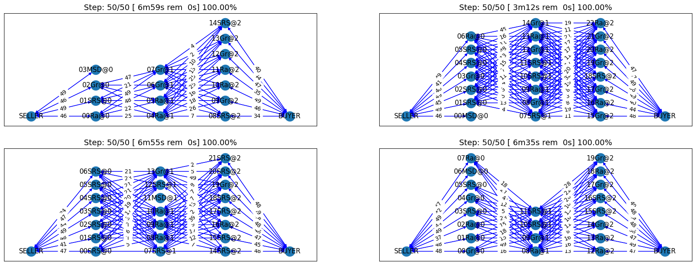

Developing an agent for SCML2024 (Standard)
-------------------------------------------

In 2024, we introduced a new implementation of the SCML-Standard track
which simplified its API making it exactly the same as the simpler
SCML-OneShot track. The older version of the game is not supported
anymore.

**SCML-Std brief introduction** Please refer to the first tutorial for a
brief introduction about the world simulated in this game as well as
pointers to more information. We will assume knowledge of at least this
brief introduction in the remainder of this tutorial.

The main differences between the Standard and OneShot simulation that
will affect this tutorial are the following:

1. Agents can negotiate **future contracts** instead of only being
   allowed to negotiate about deliveries on the same day. This means
   that we better consider future contracts when negotiating instead of
   trying to secure all of our needs on the day they arise.
2. Negotiated **prices have a larger range** which necessitates
   reasoning about prices as well as quantity matching. This means that
   we should be careful about accepting good prices (i.e. low prices
   when buying and high prices when selling).
3. Production graphs can be **deeper** which means that some agents will
   negotiate with **both** their suppliers and consumers at the same
   time. This means that our agent may find itself in the **middle** of
   the production graph with no exogenous contracts. In such cases, the
   agent may set some target production level and try to achieve it
   instead of relying on its exogenous contracts to set its targets.

First things first, let’s create some helper functions that will allow
us to evaluate different agents we develop in this tutorial.

Here we use the ``WorldRunner`` class which is designed to allow us to
compare multiple agents in **exactly** the same conditions. To create a
``WorldRunner``, you need to pass a context which is used for generating
the worlds in which the agents are evaluated. the SCML package defines
several contexts that allow us to control these worlds. For example the
``StrongSupplierContext`` will always create worlds in which the agent
being evaluated is in the first production level :math:`L_0` with more
agents on this level than on the next level. You cand define your own
contexts for experimenting with specific conditions (e.g. specific
exogenous contract distribution, market structure, etc). The most
general context which will produce any world that your agent may
encounter in the `ANAC comptition <https://scml.cs.brown.edu>`__ is the
``ANACOneShotContext`` for one-shot worlds and ``ANACStdContext`` for
standard worlds.

We create two runners:

1. **single_agent_runner** in which a single agent is being evaluated
   while the rest of the agents are sampled randomly from a subset of
   SCML built-in agents.
2. **full_market_runner** in which *all* agents in the market are
   controlled by the agent type being evaluated. This may be helpful in
   understanding how your agent behaves in this extreme condition but
   can be misleading as an estimate of the agent’s performance in the
   official ANAC competition.

.. container::

   We are using a relatively large nubmer of configurations, repetitions
   per configuration and steps (days) per repetition. If you are running
   this notebook for the first time, consider reducing CONFIGS, REPS,
   STEPS above to make it run faster.

This is time to describe some of the tools that the ``WorldRunner``
gives you to evaluate the agent. The ``WorldRunner`` is a Callable. You
just call it with the class (agent type) you want to evaluate. You can
optionally pass parameters if you would like to compared different
parameters for example. Remember in this case to also pass a name to
differentiate between different parameter choices.

.. code:: ipython3

    import pandas as pd
    import math
    from typing import Iterable
    from rich.jupyter import print

    from negmas import SAOResponse, ResponseType, Outcome, SAOState
    from scml.std import *
    from scml.runner import WorldRunner

.. code:: ipython3

    # create a runner that encapsulates a number of configs to evaluate agents
    # in the same conditions every time
    CONFIGS, REPS, STEPS = 10, 3, 50
    context = ANACStdContext(
        n_steps=STEPS, n_processes=3, world_params=dict(construct_graphs=True)
    )
    single_agent_runner = WorldRunner(
        context, n_configs=CONFIGS, n_repetitions=REPS, save_worlds=True
    )
    full_market_runner = WorldRunner.from_runner(
        single_agent_runner, control_all_agents=True
    )

Testing a completely random agent
~~~~~~~~~~~~~~~~~~~~~~~~~~~~~~~~~

Let’s try an agent that behaves randomly:

.. code:: ipython3

    full_market_runner(RandomStdAgent);

We can use the runner now to display the worlds for a given type that we
evaluated:

.. code:: ipython3

    full_market_runner.draw_worlds_of(RandomStdAgent);

Lots of contracts have been reached, but were they good contracts? We
can use the runner now to plot several statistics
(e.g. shortfall-penalty, disposal-cost, productivity, and score in this
example). There are more than 42 such statistics that you can display.

.. code:: ipython3

    full_market_runner.plot_stats(agg=False);

The score is going down *monotonically* showing that this random agent
is losing money every step. It is clear that the agent gets too high
shortfall penalty and storage cost. The ``inventory_input`` plot shows
the amount of the input product in the inventory at the end of each
simulation step. It is clear that the agent accomulates too much of this
product as it cannot sell it when it is in the first production level
and seems to buy too much when it is in the last production level.

This score is much lower than what we got in the oneshot world. Some of
the reasons for that are the following:

1. In the standard game, the range of prices is large enough that price
   matters. Choosing a random price is not a good idea here. In the
   oneshot game, on the other hand, price range was extremely small that
   the price did not really matter.
2. In the oneshot game, all negotiations happen about deliveries on the
   same day and products are perishable so you do not accomulate stock
   over time. In the standard game, on the other hand, negotiations are
   about deliveries on the same day or the future. Picking randomly from
   those will reduce the probability of picking what you need today and
   increase the probability of picking something you do not really need
   in the future.

Now we are ready to develop a do-nothing agent, but first, let’s try
some of the built in agents to see how do they behave.

.. code:: ipython3

    full_market_runner(SyncRandomStdAgent)
    full_market_runner(GreedyStdAgent);

We can also add a couple of one-shot agents in the mix

.. code:: ipython3

    from scml.oneshot.agents import *

    full_market_runner(RandomOneShotAgent)
    full_market_runner(GreedyOneShotAgent)
    full_market_runner(RandDistOneShotAgent)
    full_market_runner(EqualDistOneShotAgent);

and look at the final results:

.. code:: ipython3

    full_market_runner.plot_stats(stats="score");

The two builtin agents behaved roughly similarliy and outperformed all
one-shot agents even though the random std agent is even worse than the
random one-shot agent (because it samples from a much larger outcome
space).

Note that this test was when the agent controller *every* factory in the
market. This is very different than the ANAC competition in whic the
agent controls a single agent. Luckily, we already have a runner that
tests exactly this case. Let’s see how does ``RandomStdAgent`` behave in
such cases:

.. code:: ipython3

    single_agent_runner(RandomStdAgent);

.. code:: ipython3

    single_agent_runner.plot_stats(agg=False);

Still losing money at the same level. The fact that other agents made
sense did not help our random agent get higher score. This is very
different from the one-shot case (if you have already checked the
previous tutorial). We can now check the distribution of scores for our
agent using the ``score_summary`` method:

.. code:: ipython3

    single_agent_runner.score_summary()

.. raw:: html

    

    
    <table border="1" class="dataframe">
      <thead>
        <tr style="text-align: right;">
          <th></th>
          <th>type</th>
          <th>score</th>
          <th>count</th>
          <th>mean</th>
          <th>std</th>
          <th>min</th>
          <th>25%</th>
          <th>50%</th>
          <th>75%</th>
          <th>max</th>
        </tr>
      </thead>
      <tbody>
        <tr>
          <th>0</th>
          <td>RandomStdAgent</td>
          <td>-0.061693</td>
          <td>30.0</td>
          <td>-0.061693</td>
          <td>0.708594</td>
          <td>-1.504509</td>
          <td>-0.510917</td>
          <td>-0.183504</td>
          <td>0.474423</td>
          <td>0.981504</td>
        </tr>
      </tbody>
    </table>
    

Now, we are ready to start working on our agent.

A do-nothing agent
~~~~~~~~~~~~~~~~~~

.. code:: ipython3

    class MyStdDoNothing(StdPolicy):
        """My Agent that does nothing"""

        def act(self, state):
            return {}

.. code:: ipython3

    single_agent_runner(MyStdDoNothing)
    single_agent_runner.draw_worlds_of(MyStdDoNothing);

In all of the graph representing world simulations, we use short names
that represent the type of the agent. For example an agent named
``01Gr@0`` is an agent of type ``GreedyStdAgent`` at production level 1
that was the third agent to create. ``MSD`` here is a shorthand for
``MyStdDoNothingAgent``.

Looking at the ``contracts-signed``, we can see that none of the
concluded contracts involved our do-nothing agent. Nevertheless, these
agents still had *exogenous contracts* which means that they will lose
money. A do-nothing agent will usually lose money in this game.

Let’s check the scores of different agents to confirm:

.. code:: ipython3

    single_agent_runner.plot_stats(agg=False);

.. image:: 04.develop_agent_scml2024_std_files/04.develop_agent_scml2024_std_26_0.png

Our do-nothing agent can never makes money. That is because it cannot
get any contracts from negotiation to satisfy its needs from the
exogenous contracts but it still have to pay for disposal cost and
shortfall penalties when it is in the first or last production levels.
Nevertheless, it is *better* than behaving randomly in a clear inversion
of the situation in the SCML oneshot game. One reason is that the
outcome space is too large now that behaving randomly is almost never
going to get you good contracts (no contracts will be better). Another
reason is that agents in the middle of the production graph are better
of not trading at all than if they acrue any imbalance between their
sales and supplies which is highly likely if they behave randomly.

.. code:: ipython3

    single_agent_runner.score_summary()

.. raw:: html

    

    
    <table border="1" class="dataframe">
      <thead>
        <tr style="text-align: right;">
          <th></th>
          <th>type</th>
          <th>score</th>
          <th>count</th>
          <th>mean</th>
          <th>std</th>
          <th>min</th>
          <th>25%</th>
          <th>50%</th>
          <th>75%</th>
          <th>max</th>
        </tr>
      </thead>
      <tbody>
        <tr>
          <th>0</th>
          <td>MyStdDoNothing</td>
          <td>0.634120</td>
          <td>30.0</td>
          <td>0.634120</td>
          <td>0.303902</td>
          <td>0.123079</td>
          <td>0.504789</td>
          <td>0.704111</td>
          <td>0.878543</td>
          <td>1.000000</td>
        </tr>
        <tr>
          <th>1</th>
          <td>RandomStdAgent</td>
          <td>-0.061693</td>
          <td>30.0</td>
          <td>-0.061693</td>
          <td>0.708594</td>
          <td>-1.504509</td>
          <td>-0.510917</td>
          <td>-0.183504</td>
          <td>0.474423</td>
          <td>0.981504</td>
        </tr>
      </tbody>
    </table>
    

We can also have a look at the *exogenous* contracts that drive the
market.

.. code:: ipython3

    def analyze_contracts(worlds, exogenous_only=True):
        """
        Analyzes the contracts signed in the given world
        """
        dfs = []
        for world in worlds:
            dfs.append(pd.DataFrame.from_records(world.saved_contracts))
        data = pd.concat(dfs)
        if exogenous_only:
            data = data.loc[
                (data["seller_name"] == "SELLER") | (data["buyer_name"] == "BUYER"), :
            ]
        return data.groupby(["seller_name", "buyer_name"])[["quantity", "unit_price"]].agg(
            dict(quantity=("sum", "count"), unit_price="mean")
        )

    analyze_contracts(single_agent_runner.worlds_of())

.. raw:: html

    

    
    <table border="1" class="dataframe">
      <thead>
        <tr>
          <th></th>
          <th></th>
          <th colspan="2" halign="left">quantity</th>
          <th>unit_price</th>
        </tr>
        <tr>
          <th></th>
          <th></th>
          <th>sum</th>
          <th>count</th>
          <th>mean</th>
        </tr>
        <tr>
          <th>seller_name</th>
          <th>buyer_name</th>
          <th></th>
          <th></th>
          <th></th>
        </tr>
      </thead>
      <tbody>
        <tr>
          <th>08SRS@2</th>
          <th>BUYER</th>
          <td>582</td>
          <td>210</td>
          <td>44.285714</td>
        </tr>
        <tr>
          <th>09Gr@2</th>
          <th>BUYER</th>
          <td>1092</td>
          <td>282</td>
          <td>44.340426</td>
        </tr>
        <tr>
          <th>10Ra@2</th>
          <th>BUYER</th>
          <td>1536</td>
          <td>300</td>
          <td>44.840000</td>
        </tr>
        <tr>
          <th>10SRS@2</th>
          <th>BUYER</th>
          <td>2928</td>
          <td>300</td>
          <td>48.800000</td>
        </tr>
        <tr>
          <th>11MSD@2</th>
          <th>BUYER</th>
          <td>1143</td>
          <td>150</td>
          <td>46.360000</td>
        </tr>
        <tr>
          <th>11Ra@2</th>
          <th>BUYER</th>
          <td>1635</td>
          <td>360</td>
          <td>46.800000</td>
        </tr>
        <tr>
          <th>12Gr@2</th>
          <th>BUYER</th>
          <td>4158</td>
          <td>846</td>
          <td>44.843972</td>
        </tr>
        <tr>
          <th>12Ra@2</th>
          <th>BUYER</th>
          <td>2808</td>
          <td>588</td>
          <td>45.948980</td>
        </tr>
        <tr>
          <th>12SRS@2</th>
          <th>BUYER</th>
          <td>2988</td>
          <td>300</td>
          <td>33.380000</td>
        </tr>
        <tr>
          <th>13Gr@2</th>
          <th>BUYER</th>
          <td>6270</td>
          <td>864</td>
          <td>43.750000</td>
        </tr>
        <tr>
          <th>13Ra@2</th>
          <th>BUYER</th>
          <td>7752</td>
          <td>1188</td>
          <td>43.156566</td>
        </tr>
        <tr>
          <th>14Gr@2</th>
          <th>BUYER</th>
          <td>1206</td>
          <td>288</td>
          <td>44.666667</td>
        </tr>
        <tr>
          <th>14MSD@2</th>
          <th>BUYER</th>
          <td>1527</td>
          <td>150</td>
          <td>45.780000</td>
        </tr>
        <tr>
          <th>14Ra@2</th>
          <th>BUYER</th>
          <td>8979</td>
          <td>1050</td>
          <td>41.928571</td>
        </tr>
        <tr>
          <th>14SRS@2</th>
          <th>BUYER</th>
          <td>2052</td>
          <td>540</td>
          <td>45.722222</td>
        </tr>
        <tr>
          <th>15Gr@2</th>
          <th>BUYER</th>
          <td>1710</td>
          <td>294</td>
          <td>45.959184</td>
        </tr>
        <tr>
          <th>15MSD@2</th>
          <th>BUYER</th>
          <td>1416</td>
          <td>150</td>
          <td>44.040000</td>
        </tr>
        <tr>
          <th>15Ra@2</th>
          <th>BUYER</th>
          <td>9714</td>
          <td>1338</td>
          <td>42.439462</td>
        </tr>
        <tr>
          <th>15SRS@2</th>
          <th>BUYER</th>
          <td>1878</td>
          <td>492</td>
          <td>47.243902</td>
        </tr>
        <tr>
          <th>16MSD@2</th>
          <th>BUYER</th>
          <td>744</td>
          <td>141</td>
          <td>45.340426</td>
        </tr>
        <tr>
          <th>16Ra@2</th>
          <th>BUYER</th>
          <td>6216</td>
          <td>999</td>
          <td>45.468468</td>
        </tr>
        <tr>
          <th>16SRS@2</th>
          <th>BUYER</th>
          <td>1194</td>
          <td>294</td>
          <td>47.489796</td>
        </tr>
        <tr>
          <th>17Gr@2</th>
          <th>BUYER</th>
          <td>3666</td>
          <td>816</td>
          <td>45.294118</td>
        </tr>
        <tr>
          <th>17Ra@2</th>
          <th>BUYER</th>
          <td>2484</td>
          <td>300</td>
          <td>46.260000</td>
        </tr>
        <tr>
          <th>17SRS@2</th>
          <th>BUYER</th>
          <td>1272</td>
          <td>282</td>
          <td>46.234043</td>
        </tr>
        <tr>
          <th>18Ra@2</th>
          <th>BUYER</th>
          <td>2616</td>
          <td>576</td>
          <td>44.447917</td>
        </tr>
        <tr>
          <th>18SRS@2</th>
          <th>BUYER</th>
          <td>3114</td>
          <td>594</td>
          <td>46.525253</td>
        </tr>
        <tr>
          <th>19Gr@2</th>
          <th>BUYER</th>
          <td>4224</td>
          <td>816</td>
          <td>45.977941</td>
        </tr>
        <tr>
          <th>19SRS@2</th>
          <th>BUYER</th>
          <td>2046</td>
          <td>300</td>
          <td>42.620000</td>
        </tr>
        <tr>
          <th>20Ra@2</th>
          <th>BUYER</th>
          <td>2238</td>
          <td>300</td>
          <td>48.420000</td>
        </tr>
        <tr>
          <th>20SRS@2</th>
          <th>BUYER</th>
          <td>3912</td>
          <td>594</td>
          <td>44.636364</td>
        </tr>
        <tr>
          <th>21Gr@2</th>
          <th>BUYER</th>
          <td>1500</td>
          <td>288</td>
          <td>47.312500</td>
        </tr>
        <tr>
          <th>21SRS@2</th>
          <th>BUYER</th>
          <td>2190</td>
          <td>546</td>
          <td>44.681319</td>
        </tr>
        <tr>
          <th>22Ra@2</th>
          <th>BUYER</th>
          <td>2034</td>
          <td>288</td>
          <td>46.208333</td>
        </tr>
        <tr>
          <th>22SRS@2</th>
          <th>BUYER</th>
          <td>2142</td>
          <td>294</td>
          <td>42.204082</td>
        </tr>
        <tr>
          <th rowspan="28" valign="top">SELLER</th>
          <th>00Gr@0</th>
          <td>5334</td>
          <td>852</td>
          <td>10.190141</td>
        </tr>
        <tr>
          <th>00MSD@0</th>
          <td>840</td>
          <td>141</td>
          <td>10.191489</td>
        </tr>
        <tr>
          <th>00Ra@0</th>
          <td>3084</td>
          <td>681</td>
          <td>10.207048</td>
        </tr>
        <tr>
          <th>00SRS@0</th>
          <td>5160</td>
          <td>1014</td>
          <td>10.112426</td>
        </tr>
        <tr>
          <th>01Gr@0</th>
          <td>2808</td>
          <td>300</td>
          <td>9.920000</td>
        </tr>
        <tr>
          <th>01Ra@0</th>
          <td>5532</td>
          <td>864</td>
          <td>10.118056</td>
        </tr>
        <tr>
          <th>01SRS@0</th>
          <td>10386</td>
          <td>1662</td>
          <td>10.119134</td>
        </tr>
        <tr>
          <th>02Gr@0</th>
          <td>12000</td>
          <td>1476</td>
          <td>10.060976</td>
        </tr>
        <tr>
          <th>02Ra@0</th>
          <td>672</td>
          <td>228</td>
          <td>9.763158</td>
        </tr>
        <tr>
          <th>02SRS@0</th>
          <td>8580</td>
          <td>1146</td>
          <td>9.790576</td>
        </tr>
        <tr>
          <th>03Gr@0</th>
          <td>6228</td>
          <td>870</td>
          <td>9.813793</td>
        </tr>
        <tr>
          <th>03MSD@0</th>
          <td>894</td>
          <td>150</td>
          <td>10.120000</td>
        </tr>
        <tr>
          <th>03Ra@0</th>
          <td>4422</td>
          <td>672</td>
          <td>9.937500</td>
        </tr>
        <tr>
          <th>03SRS@0</th>
          <td>9336</td>
          <td>1164</td>
          <td>9.881443</td>
        </tr>
        <tr>
          <th>04Gr@0</th>
          <td>2526</td>
          <td>300</td>
          <td>10.000000</td>
        </tr>
        <tr>
          <th>04MSD@0</th>
          <td>417</td>
          <td>105</td>
          <td>9.742857</td>
        </tr>
        <tr>
          <th>04Ra@0</th>
          <td>4401</td>
          <td>903</td>
          <td>10.156146</td>
        </tr>
        <tr>
          <th>04SRS@0</th>
          <td>6888</td>
          <td>1074</td>
          <td>9.944134</td>
        </tr>
        <tr>
          <th>05Gr@0</th>
          <td>1890</td>
          <td>288</td>
          <td>10.104167</td>
        </tr>
        <tr>
          <th>05Ra@0</th>
          <td>4770</td>
          <td>522</td>
          <td>9.919540</td>
        </tr>
        <tr>
          <th>05SRS@0</th>
          <td>10926</td>
          <td>1368</td>
          <td>10.118421</td>
        </tr>
        <tr>
          <th>06Gr@0</th>
          <td>5238</td>
          <td>846</td>
          <td>10.021277</td>
        </tr>
        <tr>
          <th>06MSD@0</th>
          <td>507</td>
          <td>129</td>
          <td>9.883721</td>
        </tr>
        <tr>
          <th>06Ra@0</th>
          <td>2595</td>
          <td>429</td>
          <td>9.993007</td>
        </tr>
        <tr>
          <th>06SRS@0</th>
          <td>2382</td>
          <td>498</td>
          <td>9.975904</td>
        </tr>
        <tr>
          <th>07Gr@0</th>
          <td>1800</td>
          <td>288</td>
          <td>10.020833</td>
        </tr>
        <tr>
          <th>07Ra@0</th>
          <td>1506</td>
          <td>288</td>
          <td>10.354167</td>
        </tr>
        <tr>
          <th>07SRS@0</th>
          <td>1692</td>
          <td>270</td>
          <td>10.088889</td>
        </tr>
      </tbody>
    </table>
    

There are few things to note about the distribution of the *exogenous*
contracts:

-  The unit price of the raw material is always lower than that of the
   final product. This is the source of profitability in this market.
-  Each agent has a different mean and standar deviation for the
   quantities in its exogenous contracts. This means that different
   agents will have different utility functions but these utility
   functions for different steps are related because the exogenous
   contract is sampled from some common distribution for each agent for
   all the steps which makes learning more useful in the game.

Building your own agent
~~~~~~~~~~~~~~~~~~~~~~~

A standard agent needs only to do negotiation. The simplest possible
version (``MyDoNothingAgent`` above) just responded to offers from its
partners and proposed new offers to them.

Your AWI
^^^^^^^^

As described in a `previous
tutorial <https://scml.readthedocs.io/en/latest/tutorials/01.run_scml2020.html>`__,
your agent can sense and act in the simulation by accessing methods and
properties of its AWI which is accessible at any time as:

.. code:: python

   self.awi

You can see all of these methods and properties specific for the
**StdAWI** and its descendents
`here <https://scml.readthedocs.io/en/latest/api/scml.std.StdAWI.html>`__.

Your ufun
^^^^^^^^^

The Std game has the advantage that it is possible at the end of each
simulation step (day) to calculate **exactly** the profit you will be
getting for the set of contracts you have (either through negotiation or
as exogenous contracts). We provide a utility function class
(`StdUtilityFunction <https://scml.readthedocs.io/en/latest/api/scml.std.StdUFun.html>`__
which can be used normally as any NegMAS
`UtilityFunction <http://www.yasserm.com/negmas/api/negmas.preferences.UtilityFunction.html>`__.
This ufun is available to your all the time (a new one is created for
each simulation step) and is accessible as:

.. code:: python

   self.ufun

The most important services this ufun class provides for you are the
following:

-  ``from_offers``: This method receives a list of outcomes and a list
   of booleans indicating whether each of them is for buying or for
   selling. It returns to you the profit you will get if all of these
   outcomes *and nothing else* became contracts. An outcome is just a
   tuple (quantity, delivery time, unit price). You can use this
   callback during negotiation to judge hypothetical agreements with
   your partners. **Note that only offers to be delivered today will be
   considered**
-  ``from_contracts``: This method is the same as ``from_offers`` but it
   receives a list of ``Contract`` objects. It is useful after all
   negotiations are finished to calculate the profit you will be getting
   for this step. **Note that only contracts to be delivered today will
   be considered**
-  ``is_breach``: will tell you whether or not getting the given total
   input and output quantities will make you cause a breach. Notice that
   breaches are expected in the Standard track as any mismatch in the
   quantities of inputs and outputs will constitute a breach.
-  ``breach_level``: returns a value between zero and one specifying the
   level of breach that will be recorded for a given total input and
   output quantities.
-  ``find_limit``: finds either the maximum or the minimum possible
   profit (minimum profit is maximum loss) attainable in the current
   simulation step (day). This is useful when you want to normalize
   utility values between zero and one. Two of the agents we will
   develop during this tutorial will use this feature.
-  ``max_utility``, ``min_utility``: give the maximum and minimum
   utilities/profits attainable. Note that you must prepare them by
   calling ``find_limit``. We will go into how to do that later.
-  ``best``, ``worst``: give more information about the cases of maximum
   and minimum profit (i.e. the total input and output quantity needed,
   the prodcible quantity, best possible prices for buying and selling,
   etc). Again, these are not available except after calling
   ``find_limit``.

Your callbacks
^^^^^^^^^^^^^^

Your agent needs to implement methods that are called by the system at
various time during the negotiation. You can find a full list in the
`game
description <https://yasserfarouk.github.io/files/scml/y2024/scml2024.pdf>`__.

The most important ones are:

-  ``init()`` called once at the beginning of the simulation
   (i.e. before the first day starts). At this point, your AWI is set
   but you should not assume anything else.
-  ``before_step()`` called at the **beginning** of *every day*. At this
   point, your ``ufun`` is set and market information is available.
-  ``step()`` called at the **end** of *every day*. You can use this to
   analyze what happened during the day and modify your strategy in the
   future.
-  ``on_negotiation_success()``/``on_negotiation_failure()`` called
   after each negotiation is concluded to let you know what happened in
   it.
-  Depending on your base-class, you will also need to implement methods
   that allow you to control negotiations. These will be explained in
   details in the following sections but here is a summary:

   -  **StdAgent** If your agent is based on ``StdAgent``, you will get
      a ``propose()`` call when you need to offer something to one of
      our partners during negotiation and ``respond()`` when asked to
      respond to one of its offers.
   -  **StdSyncAgent** If your agent is based on ``StdSyncAgent`` you
      will get a call to ``first_proposals()`` once every day to set
      your first proposal in all negotiations and a ``counter_all()``
      call to counter offers from your partners. The system will try to
      always give you one offer from each partner in the
      ``counter_all()`` call but that is not guaranteed and sometimes it
      may be called with a subset of the offers.

Now we can start working on our agent.

There are two base classes for standard agents (``StdAgent``, and
``SyncStdAgent``). We will discuss them in more details in what follows.

StdAgent
~~~~~~~~

This is the base class of all agents for SCML-Std. ``SyncStdAgent``
inherit from this class and provide support for a simplified way of
developing your agent (or so we think). It is perfectly OK to use
``StdAgent`` directly as the base of your agent.

We have already seen the ``StdAgent`` class for which you need to
override ``propose`` and may also override ``respond`` to handle
negotiations independently. The ``propose`` method receives the
negotiation state (an object of the type ``SAOState`` including among
other things the current negotiation step, relative time, last offer,
etc) and is required to return an ``Outcome`` (See ``negmas``
documentation) as an offer. The ``respond`` method receives a
negotiation state and an offer (``Outcome``) from the opponent and needs
to respond to it by a decision from the ``ResponseType`` enumeration
(``REJECT_OFFER``, ``ACCEPT_OFFER``, and ``END_NEGOTIATION``). Other
than these two negotiation related callbacks, the agent receives an
``init`` call just after it joins the simulatin and a ``step`` call
after each step. The agent is also informed about failure/success of
negotiations through the
``on_negotiation_success``/``on_negotiation_failure`` callbacks. That is
all. A one-shot agent needs to only think about what should it do to
respond to each of these six callbacks. All of these callbacks except
``propose`` are optional.

Simple StdAgent
^^^^^^^^^^^^^^^

We have already seen how to develop a do-nothing agent using the
``StdAgent`` class. Let’s try to develop some more meaningful agent
using the same base class.

.. code:: ipython3

    class SimpleAgent(StdAgent):
        """A greedy agent based on StdAgent"""

        def __init__(self, *args, production_level=0.25, future_concession=0.1, **kwargs):
            super().__init__(*args, **kwargs)
            self.production_level = production_level
            self.future_concession = future_concession

        def propose(self, negotiator_id: str, state):
            return self.good_offer(negotiator_id, state)

        def respond(self, negotiator_id, state, source=""):
            # accept any quantity needed at a good price
            offer = state.current_offer
            return (
                ResponseType.ACCEPT_OFFER
                if self.is_needed(negotiator_id, offer)
                and self.is_good_price(negotiator_id, offer, state)
                else ResponseType.REJECT_OFFER
            )

        def is_needed(self, partner, offer):
            if offer is None:
                return False
            return offer[QUANTITY] <= self._needs(partner, offer[TIME])

        def is_good_price(self, partner, offer, state):
            # ending the negotiation is bad
            if offer is None:
                return False
            nmi = self.get_nmi(partner)
            if not nmi:
                return False
            issues = nmi.issues
            minp = issues[UNIT_PRICE].min_value
            maxp = issues[UNIT_PRICE].max_value
            # use relative negotiation time to concede
            # for offers about today but conede less for
            # future contracts
            r = state.relative_time
            if offer[TIME] > self.awi.current_step:
                r *= self.future_concession
            # concede linearly
            if self.is_consumer(partner):
                return offer[UNIT_PRICE] >= minp + (1 - r) * (maxp - minp)
            return -offer[UNIT_PRICE] >= -minp + (1 - r) * (minp - maxp)

        def good_offer(self, partner, state):
            nmi = self.get_nmi(partner)
            if not nmi:
                return None
            issues = nmi.issues
            qissue = issues[QUANTITY]
            pissue = issues[UNIT_PRICE]
            for t in sorted(list(issues[TIME].all)):
                # find my needs for this day
                needed = self._needs(partner, t)
                if needed <= 0:
                    continue
                offer = [-1] * 3
                # ask for as much as I need for this day
                offer[QUANTITY] = max(min(needed, qissue.max_value), qissue.min_value)
                offer[TIME] = t
                # use relative negotiation time to concede
                # for offers about today but conede less for
                # future contracts
                r = state.relative_time
                if t > self.awi.current_step:
                    r *= self.future_concession
                # concede linearly on price
                minp, maxp = pissue.min_value, pissue.max_value
                if self.is_consumer(partner):
                    offer[UNIT_PRICE] = int(minp + (maxp - minp) * (1 - r) + 0.5)
                else:
                    offer[UNIT_PRICE] = int(minp + (maxp - minp) * r + 0.5)
                return tuple(offer)
            # just end the negotiation if I need nothing
            return None

        def is_consumer(self, partner):
            return partner in self.awi.my_consumers

        def _needs(self, partner, t):
            # find my needs today
            if self.awi.is_first_level:
                total_needs = self.awi.needed_sales
            elif self.awi.is_last_level:
                total_needs = self.awi.needed_supplies
            else:
                total_needs = self.production_level * self.awi.n_lines
            # estimate future needs
            if self.is_consumer(partner):
                total_needs += (
                    self.production_level * self.awi.n_lines * (t - self.awi.current_step)
                )
                total_needs -= self.awi.total_sales_until(t)
            else:
                total_needs += (
                    self.production_level * self.awi.n_lines * (self.awi.n_steps - t - 1)
                )
                total_needs -= self.awi.total_supplies_between(t, self.awi.n_steps - 1)
            # subtract already signed contracts
            return int(total_needs)

.. code:: ipython3

    single_agent_runner(SimpleAgent);

Let’s see how well did this agent behave:

.. code:: ipython3

    single_agent_runner.score_summary()

.. raw:: html

    

    
    <table border="1" class="dataframe">
      <thead>
        <tr style="text-align: right;">
          <th></th>
          <th>type</th>
          <th>score</th>
          <th>count</th>
          <th>mean</th>
          <th>std</th>
          <th>min</th>
          <th>25%</th>
          <th>50%</th>
          <th>75%</th>
          <th>max</th>
        </tr>
      </thead>
      <tbody>
        <tr>
          <th>2</th>
          <td>SimpleAgent</td>
          <td>0.718652</td>
          <td>30.0</td>
          <td>0.718652</td>
          <td>0.626017</td>
          <td>-0.840914</td>
          <td>0.827423</td>
          <td>0.999168</td>
          <td>1.043844</td>
          <td>1.212995</td>
        </tr>
        <tr>
          <th>0</th>
          <td>MyStdDoNothing</td>
          <td>0.634120</td>
          <td>30.0</td>
          <td>0.634120</td>
          <td>0.303902</td>
          <td>0.123079</td>
          <td>0.504789</td>
          <td>0.704111</td>
          <td>0.878543</td>
          <td>1.000000</td>
        </tr>
        <tr>
          <th>1</th>
          <td>RandomStdAgent</td>
          <td>-0.061693</td>
          <td>30.0</td>
          <td>-0.061693</td>
          <td>0.708594</td>
          <td>-1.504509</td>
          <td>-0.510917</td>
          <td>-0.183504</td>
          <td>0.474423</td>
          <td>0.981504</td>
        </tr>
      </tbody>
    </table>
    

.. code:: ipython3

    single_agent_runner.plot_stats(agg=False, legend_ncols=5);

This simple agent is better than the random agent. Let’s understand how
it works:

The main idea of this agent is pretty simple. It tries to *secure* as
much of its needs (sales/supplies) as possible in every negotiation at
the best possible price for itself conceding on price over time. Once
today’s needs are secure it tries to secure some of what expects to need
in the future.

Here is the full implementation of ``propose``:

.. code:: python

   def propose(self, negotiator_id: str, state) -> "Outcome":
       return self.good_offer(negotiator_id)

The agent concedes in price and finds the best quantity to offer (and
the best day to offer the delivery) in the ``good_offer()`` method which
we will explain later.

The ``respond`` method is also verys simple:

.. code:: python

   def respond(self, negotiator_id, state, source=""):
       offer = state.current_offer
       return (
           ResponseType.ACCEPT_OFFER
           if self.is_needed(negotiator_id, offer)
           and self.is_good_price(negotiator_id, offer, state)
           else ResponseType.REJECT_OFFER
       )

It simply accepts the offer if it is *needed* and had a *good price* and
rejects it otherwise. Note that this agent never ends a negotiation
because it can always just keep rejecting everything but maybe a good
offer will come later.

The agent needs three main subroutines: - ``is_needed()`` to decide if
an offer is needed. - ``is_good_price()`` to decide if the price is good
given the delivery date and quantity offered. - ``good_offer()`` to
generate a good offer.

All of these subroutines need to know how much an agent needs to
buy/sell to a given negotiator at agiven delivery date which is what
``_needs()`` does. We start by discecting this method:

The first step is to find our *total* needs today which depends on our
location in the supply chain:

.. code:: python

   if self.awi.is_first_level:
       total_needs = self.awi.needed_sales
   elif self.awi.is_last_level:
       total_needs = self.awi.needed_supplies
   else:
       total_needs = self.production_level * self.awi.n_lines

If we are in the first or last level, we can directly read our needs
from the ``AWI``. For agents in the middle of the supply chain, these
needs will read zero as it can just do nothing. To make some profit, we
set a production level (25% in this example) and assume that we always
need to buy and sell enough to achieve this level of production. This
what the last line above does.

This is just what we need to buy/sell today. We then need to convert
that into what we are *expecting* to need by the time ``t`` passed to
``_needs()``. This depends on whether we are negotiating with a consumer
or a supplier. If it is a consumer, we need to add the *expected*
production until the time ``t`` and then subtract whatever sales we
already secured *until* ``t``:

.. code:: python

   total_needs += self.production_level * self.awi.n_lines * (t - self.awi.current_step)
   total_needs -= self.awi.total_sales_until(t)

If it is a supplier, we need to add what we expect to produce *after*
time ``t`` and subtract any supplies we secured *after* ``t``:

.. code:: python

   total_needs += self.production_level * self.awi.n_lines * (self.awi.n_steps - t - 1)
   total_needs -= self.awi.total_supplies_between(t, self.awi.n_steps - 1)

Now that we know how to calcualte the quantity we should buy/sell at any
day, we can go back into our three subroutines:

``is_needed()`` is the simplest as it just checks if the quantity in the
offer is less than or equal the needs at the delivery date offered:

.. code:: python

   return offer[QUANTITY] <= self._needs(partner, offer[TIME])

``is_good_price()`` is also simple. We find the relative time in the
negotiation (``r``). The nearer are we to the end of the negotiation, we
simply accept worse prices (higher for buying and lower for selling):

.. code:: python

   if self.is_consumer(partner):
       return offer[UNIT_PRICE] >= minp + (1 - r) * (maxp - minp)
   return -offer[UNIT_PRICE] >= -minp + (1 - r) * (minp - maxp)

Moreover, we concede less if this offer is about he future (because we
can have other chances to negotiate a better deal):

.. code:: python

   r = state.relative_time
   if offer[TIME] > self.awi.current_step:
       r *= self.future_concession

Finally, we need to generate good offers in ``good_offer()``. The main
idea here is to always try to satisfy what we need today before tomorrow
and tomorrow before the day after. That is why we loop over delivery
days from now to the negotiation horizon:

.. code:: python

   for t in sorted(list(issues[TIME].all)):
       ...

For each delivery day, we start by finding our needs using ``_needs()``
and offer as much of it as we can:

.. code:: python

   offer[QUANTITY] = max(min(needed, qissue.max_value), qissue.min_value)

The only remaining issue is price. We simply concede linearly (as we did
in ``is_good_price()``) depending on the relative time in the
negotiation (taking care to concede only to 10% of what we can for
future contracts). This code is very similar to what we showed before in
``is_good_price()``.

A (suposedly) better greedy agent
~~~~~~~~~~~~~~~~~~~~~~~~~~~~~~~~~

One problem with our ``SimpleAgent`` is that it does not take its
*standing offers* into account. For example, if I need 10 items and I am
negotiating with 5 partners, I will offer all of them to give me these
10 items and I may end up securing 50 which will lead to penalties. The
following agent tries to remedie this by just assuming that all standing
offers will be accepted. This is the other extreme. In the example
above, it will just offer 10 for the first partner.

This is done in the ``_needs()`` method below. It starts by just getting
the needs the same was as in ``SimpleAgent``:

.. code:: python

   n = super()._needs(partner, t)

but it then reduces this by whatever we currently offer after the given
time ``t``:

.. code:: python

   n = max(0, n - v)

The rest of the code keeps track of our offers (``offered_sales``,
``offered_supplies``) for each partner at every day.

.. code:: ipython3

    from collections import defaultdict

    class OptimisticAgent(SimpleAgent):
        """A greedy agent based on SimpleAgent with more sane strategy"""

        def propose(self, negotiator_id, state):
            offer = self.good_offer(negotiator_id, state)
            if offer is None:
                return offer
            offered = self._offered(negotiator_id)
            offered[negotiator_id] = {offer[TIME]: offer[QUANTITY]}
            return offer

        def before_step(self):
            self.offered_sales = defaultdict(lambda: defaultdict(int))
            self.offered_supplies = defaultdict(lambda: defaultdict(int))

        def on_negotiation_success(self, contract, mechanism):
            partner = [_ for _ in contract.partners if _ != self.id][0]
            offered = self._offered(partner)
            offered[partner] = dict()

        def _offered(self, partner):
            if self.is_consumer(partner):
                return self.offered_sales
            return self.offered_supplies

        def _needs(self, partner, t):
            n = super()._needs(partner, t)
            offered = self._offered(partner)
            for k, v in offered[partner].items():
                if k > t:
                    continue
                n = max(0, n - v)
            return int(n)

.. code:: ipython3

    single_agent_runner(OptimisticAgent);

Let’s see how well did this agent behave:

.. code:: ipython3

    single_agent_runner.score_summary()

.. raw:: html

    

    
    <table border="1" class="dataframe">
      <thead>
        <tr style="text-align: right;">
          <th></th>
          <th>type</th>
          <th>score</th>
          <th>count</th>
          <th>mean</th>
          <th>std</th>
          <th>min</th>
          <th>25%</th>
          <th>50%</th>
          <th>75%</th>
          <th>max</th>
        </tr>
      </thead>
      <tbody>
        <tr>
          <th>3</th>
          <td>SimpleAgent</td>
          <td>0.718652</td>
          <td>30.0</td>
          <td>0.718652</td>
          <td>0.626017</td>
          <td>-0.840914</td>
          <td>0.827423</td>
          <td>0.999168</td>
          <td>1.043844</td>
          <td>1.212995</td>
        </tr>
        <tr>
          <th>1</th>
          <td>OptimisticAgent</td>
          <td>0.715633</td>
          <td>30.0</td>
          <td>0.715633</td>
          <td>0.595175</td>
          <td>-0.833523</td>
          <td>0.806630</td>
          <td>0.972029</td>
          <td>1.036741</td>
          <td>1.183959</td>
        </tr>
        <tr>
          <th>0</th>
          <td>MyStdDoNothing</td>
          <td>0.634120</td>
          <td>30.0</td>
          <td>0.634120</td>
          <td>0.303902</td>
          <td>0.123079</td>
          <td>0.504789</td>
          <td>0.704111</td>
          <td>0.878543</td>
          <td>1.000000</td>
        </tr>
        <tr>
          <th>2</th>
          <td>RandomStdAgent</td>
          <td>-0.061693</td>
          <td>30.0</td>
          <td>-0.061693</td>
          <td>0.708594</td>
          <td>-1.504509</td>
          <td>-0.510917</td>
          <td>-0.183504</td>
          <td>0.474423</td>
          <td>0.981504</td>
        </tr>
      </tbody>
    </table>
    

.. code:: ipython3

    single_agent_runner.plot_stats(agg=False, legend_ncols=4);

.. image:: 04.develop_agent_scml2024_std_files/04.develop_agent_scml2024_std_44_0.png

It seems that ``OptimitisticAgent`` is getting a higher score compared
with ``SimpleAgent``. Of course this is only guaranteed in the given
configs. Note that ``OptimisticAgent`` is kind of *over* optimistic as
it counts anything it offers as if it was *accepted*. A balance is
needed. Maybe you can find a better wat to achieve this balance.
Moreover, the decision to just count any standing offer in the future
when deciding needs is kind of arbitrary. We can do better.

Simple Sync Agent
~~~~~~~~~~~~~~~~~

One problem that plagued all of our agents so far is that they have to
make decisions (``respond``, ``propose``) about negotiations **on the
spot**. This makes it difficult to consider **all other negotiations**
while making decisions.

Because the utility function is defined for **a complete set of
negotiation agreements** and not for any single negotiation by itself,
it makes sense to try to make decisions **centrally** by collecting
offers from partners then responding to all of them at once. It is
possible to do that by utilizing the response type ``ResponseType.WAIT``
supported by NegMAS but this entails a lot of house-keeping.

To simplify this task, we provide another base class for agents that
does all of this house keeping for you exposing a simple interface that
**syncrhonizes** all negotiations (as much as allowed by the underlying
platform). The main goal of this base agent is to allow the developer to
think about *all negotiations together* but it has some important
caveats which we will discuss later. Here is an example of writing the
do-nothing agent in this form:

.. code:: ipython3

    class MySyncOneShotDoNothing(StdSyncAgent):
        """My Agent that does nothing"""

        def counter_all(self, offers, states):
            """Respond to a set of offers given the negotiation state of each."""
            return dict()

        def first_proposals(self):
            """Decide a first proposal on every negotiation.
            Returning None for a negotiation means ending it."""
            return dict()

.. code:: ipython3

    single_agent_runner(MySyncOneShotDoNothing);

.. code:: ipython3

    single_agent_runner.score_summary()

As you can see, in this case, we need to override ``counter_all`` to
counter offers received from *all* the partners and ``first_proposals``
to decide a first offer for *each* partner.

Other than these two negotiation related callbacks, the agent receives
an ``init`` call just after it joins the simulatin and a ``step`` call
after each step. The agent is also informed about failure/success of
negotiations through the
``on_negotiation_success``/``on_negotiation_failure`` callbacks. That is
all. A one-shot agent needs to only think about what should it do to
respond to each of these six callbacks. All of these callbacks except
``counter_all`` and ``first_proposals`` are optional.

.. code:: ipython3

    class SimpleSyncAgent(StdSyncAgent, SimpleAgent):
        """An agent that distributes its needs over its partners randomly."""

        def first_proposals(self):
            """Decide a first proposal on every negotiation.
            Returning None for a negotiation means ending it."""
            return {
                partner: SAOResponse(
                    ResponseType.REJECT_OFFER, SimpleAgent.propose(self, partner, state)
                )
                for partner, state in self.awi.current_states.items()
            }

        def counter_all(self, offers, states) -> dict:
            """Respond to a set of offers given the negotiation state of each."""
            # find all responses
            responses = {k: SimpleAgent.respond(self, k, s) for k, s in states.items()}
            # find counter offers for rejected offers
            myoffers = {
                k: SimpleAgent.propose(self, k, s)
                for k, s in states.items()
                if responses[k] == ResponseType.REJECT_OFFER
            }
            # compile final responses
            return {
                k: SAOResponse(
                    responses[k],
                    myoffers.get(
                        k, offers[k] if responses[k] == ResponseType.ACCEPT_OFFER else None
                    ),
                )
                for k in states.keys()
            }

        # needed for the way multiple inheritence work in python.
        # we only need these because we inherit from `SimpleAgent`.
        # future agents will not need these two functions.
        def propose(self, negotiator_id, state):
            return StdSyncAgent.propose(self, negotiator_id, state)

        def respond(self, negotiator_id, state, source=""):
            return StdSyncAgent.respond(self, negotiator_id, state, source)

.. code:: ipython3

    single_agent_runner(SimpleSyncAgent);

.. code:: ipython3

    single_agent_runner.score_summary()

.. code:: ipython3

    single_agent_runner.plot_stats(agg=False, legend_ncols=3, ylegend=2);

This agent behaves exactly the same as ``BetterAgent``. We simply just
call ``propose()`` and ``respond()`` from ``BetterAgent``
**independently** for each negotiator and do not really use the fact
that we have access to all the offers and can respond to all of them
centrally now.

A better SyncAgent
~~~~~~~~~~~~~~~~~~

We start by defining a simple helper function that distributes a given
quantity :math:`q` over :math:`n` partners.

.. code:: ipython3

    def distribute(q: int, n: int) -> list[int]:
        """Distributes n values over m bins with at least one item per bin assuming q > n"""
        from numpy.random import choice
        from collections import Counter

        if q < n:
            lst = [0] * (n - q) + [1] * q
            random.shuffle(lst)
            return lst

        if q == n:
            return [1] * n
        r = Counter(choice(n, q - n))
        return [r.get(_, 0) + 1 for _ in range(n)]

Here are few examples of how it would distribute :math:`10` units over
:math:`4` partners

.. code:: ipython3

    [distribute(10, 4) for _ in range(5)]

.. code:: ipython3

    [distribute(2, 4) for _ in range(5)]

We will also need a helper function to find all subsets of a given set
(powerset):

.. code:: ipython3

    from itertools import chain, combinations, repeat

    def powerset(iterable):
        s = list(iterable)
        return chain.from_iterable(combinations(s, r) for r in range(len(s) + 1))

Now we can define our new agent:

.. code:: ipython3

    class ProactiveAgent(SimpleSyncAgent):
        """An agent that distributes today's needs randomly over 75% of its partners and
        samples future offers randomly."""

        def __init__(self, *args, threshold=None, ptoday=0.75, productivity=0.6, **kwargs):
            super().__init__(*args, **kwargs)
            if threshold is None:
                threshold = random.random() * 0.2 + 0.2
            self._threshold = threshold
            self._ptoday = ptoday
            self._productivity = productivity

        def first_proposals(self):
            # just randomly distribute my needs over my partners (with best price for me).
            partners = self.negotiators.keys()
            s = self.awi.current_step
            distribution = self.distribute_todays_needs()
            return {
                k: (q, s, self.best_price(k))
                if q > 0
                else self.sample_future_offer(k).outcome
                for k, q in distribution.items()
            }

        def counter_all(self, offers, states):
            response = dict()
            # process for sales and supplies independently
            for edge_needs, all_partners, issues in [
                (
                    self.awi.needed_supplies,
                    self.awi.my_suppliers,
                    self.awi.current_input_issues,
                ),
                (
                    self.awi.needed_sales,
                    self.awi.my_consumers,
                    self.awi.current_output_issues,
                ),
            ]:
                # correct needs if I am in the middle
                needs = (
                    max(edge_needs, int(self.awi.n_lines * self._productivity))
                    if self.awi.is_middle_level
                    else edge_needs
                )

                # find active partners
                partners = {_ for _ in all_partners if _ in offers.keys()}

                # find the set of partners that gave me the best offer set
                # (i.e. total quantity nearest to my needs)
                plist = list(powerset(partners))
                best_diff, best_indx = float("inf"), -1
                for i, partner_ids in enumerate(plist):
                    others = partners.difference(partner_ids)
                    offered = sum(offers[p][QUANTITY] for p in partner_ids)
                    diff = abs(offered - needs)
                    if diff < best_diff:
                        best_diff, best_indx = diff, i
                    if diff == 0:
                        break

                # If the best combination of offers is good enough, accept them and end all
                # other negotiations
                if best_diff <= self._threshold:
                    partner_ids = plist[best_indx]
                    others = list(partners.difference(partner_ids))
                    response.update(
                        {
                            k: SAOResponse(ResponseType.ACCEPT_OFFER, offers[k])
                            for k in partner_ids
                        }
                        | {k: self.sample_future_offer(k) for k in others}
                    )
                    continue

                # If I still do not have a good enough offer, distribute my current needs
                # randomly over my partners.
                distribution = self.distribute_todays_needs()
                response |= {
                    k: self.sample_future_offer(k)
                    if q == 0
                    else SAOResponse(
                        ResponseType.REJECT_OFFER, (q, self.awi.current_step, self.price(k))
                    )
                    for k, q in distribution.items()
                }
            return response

        def distribute_todays_needs(self, partners=None) -> dict[str, int]:
            """Distributes my urgent (today's) needs randomly over some my partners"""
            if partners is None:
                partners = self.negotiators.keys()

            # initialize all quantities to zero
            response = dict(zip(partners, repeat(0)))
            # repeat for supplies and sales
            for is_partner, edge_needs in (
                (self.is_supplier, self.awi.needed_supplies),
                (self.is_consumer, self.awi.needed_sales),
            ):
                # get my current needs
                needs = (
                    max(edge_needs, int(self.awi.n_lines * self._productivity))
                    if self.awi.is_middle_level
                    else edge_needs
                )
                #  Select a subset of my partners
                active_partners = [_ for _ in partners if is_partner(_)]
                if not active_partners or needs < 1:
                    continue
                random.shuffle(active_partners)
                active_partners = active_partners[
                    : max(1, int(self._ptoday * len(active_partners)))
                ]
                n_partners = len(active_partners)

                # if I need nothing or have no partnrs, just continue
                if needs <= 0 or n_partners <= 0:
                    continue

                # If my needs are small, use a subset of negotiators
                if needs < n_partners:
                    active_partners = random.sample(
                        active_partners, random.randint(1, needs)
                    )
                    n_partners = len(active_partners)

                # distribute my needs over my (remaining) partners.
                response |= dict(zip(active_partners, distribute(needs, n_partners)))

            return response

        def sample_future_offer(self, partner):
            # get a random future offer. In reality an offer today may be returned
            nmi = self.get_nmi(partner)
            outcome = nmi.random_outcome()
            t = outcome[TIME]
            if t == self.awi.current_step:
                mn = max(nmi.issues[TIME].min_value, self.awi.current_step + 1)
                mx = max(nmi.issues[TIME].max_value, self.awi.current_step + 1)
                if mx <= mn:
                    return SAOResponse(ResponseType.END_NEGOTITAION, None)
                t = random.randint(mn, mx)
            return SAOResponse(
                ResponseType.REJECT_OFFER, (outcome[QUANTITY], t, self.best_price(partner))
            )

        def is_supplier(self, partner):
            return partner in self.awi.my_suppliers

        def best_price(self, partner):
            issue = self.get_nmi(partner).issues[UNIT_PRICE]
            pmin, pmax = issue.min_value, issue.max_value
            return pmin if self.is_supplier(partner) else pmax

        def price(self, partner):
            return self.get_nmi(partner).issues[UNIT_PRICE].rand()

As usual for agents based on
`SyncStdAgent <https://scml.readthedocs.io/en/latest/autoapi/scml/std/agent/index.html#scml.std.agent.StdSyncAgent>`__,
we need to define ``first_offers()`` and ``counter_all()``

Generating First Offers
^^^^^^^^^^^^^^^^^^^^^^^

We simply distribute our needs for today over as many partners as
possible and send random offers (at our best price) for the remaining
partners. This is achieved in two steps. Firstly, we distribute our
needs *for today* over all our partners using:

.. code:: python

   distribution = self.distribute_todays_needs()

If some of our partners are not needed (i.e. has zero quantity in
``distribution``), we sample random outcomes for them:

.. code:: python

   return {
       k: (q, s, self.best_price(k)) if q > 0 else self.sample_future_offer(k).outcome
       for k, q in distribution.items()
   }

Note that we always use our *best price* for all offers.

We will describe how do we ``distribute_todays_needs`` and
``sample_future_offer`` later after we describe counter offering.

Generating counter offers
^^^^^^^^^^^^^^^^^^^^^^^^^

This process is more involved. The main idea is to process supplies and
sales separately. For each, we find a subset of partners to distribute
today’s needs between them and then sample random offers for the rest
(that will likely have future delivery dates). For all offers, we just
use random prices. Now, we describe this process in details:

The way we handle sales and supplies separately is to loop over them
separately getting the amount we need, names of partners and negotiation
issues from our AWI:

.. code:: python

   for edge_needs, all_partners, issues in [
       (self.awi.needed_supplies, self.awi.my_suppliers, self.awi.current_input_issues),
       (self.awi.needed_sales, self.awi.my_consumers, self.awi.current_output_issues),
   ]:
       ...

The needs we get here ``edge_needs`` will not be accurate if we are in
the middle of the production graph because if we have no contracts we
will just get zero for both sides. We correct this by just assuming some
production level and use it if ``edge_needs`` was too small:

.. code:: python

   needs = int(
       max(edge_needs, int(self.awi.n_lines * self._productivity))
       if self.awi.is_middle_level
       else edge_needs
   )

We then get a random price and find the partners we are still
negotiating with

.. code:: python

   partners = {_ for _ in all_partners if _ in offers.keys()}

We then consider all subsets of of offers from our partners and find out
the one that gives us best match to our needs. Note that we do not
consider prices at all here.

.. code:: python

   plist = list(powerset(partners))
   best_diff, best_indx = float("inf"), -1
   for i, partner_ids in enumerate(plist):
       others = partners.difference(partner_ids)
       offered = sum(offers[p][QUANTITY] for p in partner_ids)
       diff = abs(offered - needs)
       if diff < best_diff:
           best_diff, best_indx = diff, i
       if diff == 0:
           break

If the mismatch in quantity we just caculated is good enough (i.e. less
than some predefined threshold), we accept the subset of offers that
generated this best match and just sample random quantities and delivery
dates for others but at our best price (using ``sample_future_offer``).

.. code:: python

   if best_diff <= self._threshold:
       partner_ids = plist[best_indx]
       others = list(partners.difference(partner_ids))
       response.update(
           {k: SAOResponse(ResponseType.ACCEPT_OFFER, offers[k]) for k in partner_ids}
           | {k: self.sample_future_offer(k) for k in others}
       )
       continue

If we did not accept any subset of offers, we simply distribute today’s
needs over our partners while submitting random counter offers (at best
price) to any partners we happen to assign zero quantity. This is
exactly the same as we did in ``first_proposals`` except that we use a
random price for today’s offers.

.. code:: python

   distribution = self.distribute_todays_needs()
   response |= {
       k: SAOResponse(ResponseType.REJECT_OFFER, self.sample_future_offer(k))
       if q == 0
       else SAOResponse(
           ResponseType.REJECT_OFFER, (q, self.awi.current_step, self.price(k))
       )
       for k, q in distribution.items()
   }

To complete our understanding, we need to clarify the process by which
we distribute today’s needs and sample future offers.

Distributing Today’s Needs
^^^^^^^^^^^^^^^^^^^^^^^^^^

As usual, we process sales and supplies independently:

.. code:: python

   for is_partner, edge_needs in (
       (self.is_supplier, self.awi.needed_supplies),
       (self.is_consumer, self.awi.needed_sales),
   ):
       ...

We correct the need for the case of being in the middle of the
production graph.

.. code:: python

   needs = (
       max(edge_needs, int(self.awi.n_lines * self._productivity))
       if self.awi.is_middle_level
       else edge_needs
   )

We then get the suppliers if we are considering supplies and consumers
if we are considering sales. After that, we sample randomly a predefined
fraction of them.

.. code:: python

   active_partners = [_ for _ in partners if is_partner(_)]
   if not active_partners or needs < 1:
       continue
   random.shuffle(active_partners)
   active_partners = active_partners[: max(1, int(self._ptoday * len(active_partners)))]
   n_partners = len(active_partners)

If we do not need anything or there are no partners, we just go to the
next group of partners (if any).

.. code:: python

   if needs <= 0 or n_partners <= 0:
       continue

If our needs are relativey small, we concentrate them in a smaller
number of partners to keep more of them for future offers.

.. code:: python

   if needs < n_partners:
       active_partners = random.sample(active_partners, random.randint(1, needs))
       n_partners = len(active_partners)

Finally, we distribute today’s needs over these partners

.. code:: python

   response |= dict(zip(active_partners, distribute(needs, n_partners)))

Sampling future needs
^^^^^^^^^^^^^^^^^^^^^

We simply sample a random outcome

.. code:: python

   nmi = self.get_nmi(partner)
   outcome = nmi.random_outcome()

Note that there is a possiblity that the delivery day here may be today
but we want to be sure that the offer is in the future. To achieve that,
we check for this condition and sample a new time in the future. If no
such time can be found (e.g. in the very last step of the negotiation),
simply end the negotiation.

.. code:: python

   t = outcome[TIME]
   if t == self.awi.current_step:
       mn = max(nmi.issues[TIME].min_value, self.awi.current_step + 1)
       mx = max(nmi.issues[TIME].max_value, self.awi.current_step + 1)
       if mx <= mn:
           return SAOResponse(ResponseType.END_NEGOTITAION, None)
       t = random.randint(mn, mx)

Now that we have a time in the future, we counter with an offer with the
sampled quantity, time and best price.

.. code:: python

   return SAOResponse(
       ResponseType.REJECT_OFFER, (outcome[QUANTITY], t, self.best_price(partner))
   )

Let’s see how does this agent fair against others we developed so far:

.. code:: ipython3

    single_agent_runner(ProactiveAgent);

.. code:: ipython3

    single_agent_runner.score_summary()

.. code:: ipython3

    single_agent_runner.plot_stats(agg=False, legend_ncols=5, ylegend=2);

These results show that ``ProactiveAgent`` is much better than the
``SimpleSyncAgent`` which did not really consider all offers together.
Nevertheless, it is not as good as ``OptimisticAgent`` or
``SimpleAgent``. Specifically, we can see that it gets higher storage
cost which means that it seems to carry more inventory that it does not
need.

Possible Improvements
^^^^^^^^^^^^^^^^^^^^^

There are obvious ways to improve this agent:

1. We are using random prices for today’s needs (``price()``). May be,
   we can concede on price as we did in ``SimpleAgent``.
2. We are *always* using our best price for future offers. May be, we
   can concede in price here but not as much as for today’s needs.
3. When countering offers, we should take into account the history of
   negotiation with each partner (in this round and previously) to make
   a more meaningful distribution of quantities over partners. Currently
   this is just random. We should also consider the probability that our
   offers will be accepted when deciding how to distribute the quantity
   we still need over our partners.
4. Choosing which negotiators to end the negotiation with when we need a
   small quantity to buy/sell, is currently random. We could try to find
   a way to only end negotiation with negotiators least likely to
   provide us with our remaining needs.
5. We should take the number of rounds remiaining in the negotiation
   into account when deciding whether to accept a subset of offers
   (e.g. have a higher threshold near the end of the negotiation), and
   when deciding what quantities to distribute over our partners
   (e.g. offer more than what we need near the end of the negotiation
   under the assumption that only some of them will be accepted).
6. May be consider prices more when approaching our total needs.

Comparing all agents
~~~~~~~~~~~~~~~~~~~~

We can now look at all the agents we considered so far:

.. code:: ipython3

    single_agent_runner.plot_stats(notch=True);

Let’s also add a couple of the built-in agents to the mix and see where
do these fit:

.. code:: ipython3

    for t in (GreedyStdAgent, SyncRandomStdAgent):
        single_agent_runner(t)

.. code:: ipython3

    single_agent_runner.plot_stats(notch=True, stats="score");

As you can see, ``GreedyStdAgent`` and ``SyncRandomStdAgent`` are
getting good scores but not better than the simple agents we developed
in these tutorials.

.. code:: ipython3

    single_agent_runner.score_summary()

Out of curiosity, let’s compare these agents when each is allowed to
control the whole market:

.. code:: ipython3

    FMR = WorldRunner.from_runner(single_agent_runner, control_all_agents=True)
    for t in (
        SimpleSyncAgent,
        MyStdDoNothing,
        MySyncOneShotDoNothing,
        SimpleAgent,
        OptimisticAgent,
        RandomStdAgent,
        ProactiveAgent,
        GreedyStdAgent,
        SyncRandomStdAgent,
    ):
        FMR(t)

.. code:: ipython3

    FMR.plot_stats(notch=True, stats="score");

.. code:: ipython3

    FMR.score_summary()

As is clear when comparing the last two tables, the relative order
(specially between the best scoreing agents) is dependent on the how
many agents they are allowed to control in the market. In the SCML ANAC
competition, we are always assuming that the evaluated agent type can
control a single agent in the market. It is interesting to note that all
agents lost money on average when allowed to control the whole market
(and almost all of them if we consider median score).

The way we just compared these agents is unbiased because all agents are
allowed to control the same factories in the same simulation
envoironment. Nevertheless, the way we evaluate agents in the official
ANAC competition uses upper truncated mean not the mean nor the median
when scoring agents. The best way to compare these agents in exactly the
same was as in the competition is to run a tournament between them. You
already learned how to do that in the previous tutorial and we will not
repeate it here.

*If you are running this notebook, please note that the tournament
running methods ``anac2023_*`` may not work within a notebook
environment. You can just move your code to a normal python script and
it will run correctly*

You can find all the agents available in the ``scml`` package for the
one-shot game under ``scml.oneshot.agents`` including the ones developed
in this tutorial (with some modifications):

.. code:: ipython3

    import scml.std.agents as agents

    print([_ for _ in agents.__dir__() if _.endswith("Agent")])

Download :download:`Notebook<notebooks/04.develop_agent_scml2024_std.ipynb>`.
