Running Controlled Experiments
------------------------------

The simplest way to compare different agent designs is to run
tournaments between them as explained in details in previous tutorials.
Nevertheless, while developing an agent, it is beneficial to be able to
run experiments in which you specify **exactly** some or all factors
that may affect agent performance in order to analyze its behavior.

This tutorial will explain how to achieve this at different levels of
control. As expected with more control comes more responsibility (and
complexity). For this tutorial we will use the SCMLOneshot game but
everthing we discuss applies exactly to all SCML environments. Moreover,
we will use builtin agents for illustration but of course the same
methods apply to any agents.

Let’s first bring in what we need:

.. code:: ipython3

    from scml.oneshot.world import SCML2020OneShotWorld
    from scml.oneshot.world import is_system_agent
    from scml.oneshot.agents import GreedyOneShotAgent, GreedySingleAgreementAgent

Controlling agent allocation to factories
~~~~~~~~~~~~~~~~~~~~~~~~~~~~~~~~~~~~~~~~~

You can control which agents are allocated to which factory by using the
``generate()`` method of the ``SCML2020OneShotWorld`` class (or any SCML
world class). Let’s say that you want to have :math:`10` agents with the
first two of type ``GreedyOneShotAgent`` and the rest of the type
``GreedySingleAgreementAgentAgent``, here is a simple way to achieve
that:

.. code:: ipython3

    types = [GreedyOneShotAgent] * 2 + [GreedySingleAgreementAgent] * 8

    world = SCML2020OneShotWorld(
        **SCML2020OneShotWorld.generate(
            agent_types = types,
            n_agents_per_process=5,
            n_processes=2,
            n_steps=5,
            construct_graphs=True,
        )
    )

    world.draw(what=["contracts-concluded"])
    plt.show()
    world.run()
    plt.show()

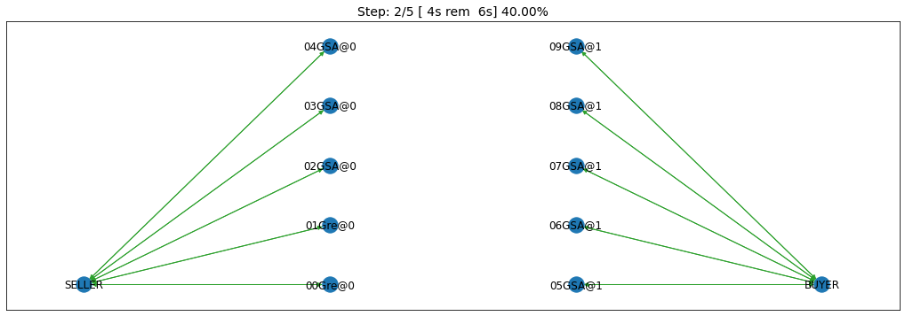

as you can see, the first two agents (“01Gre@0” and “00Gre@0”) are of
type ``GreedyOneshotAgent`` and the rest are of type
``GreedySingleAgreementAgent``. That is clear from the naming convention
of putting the first :math:`3` letters of the type before the ``@`` sign
in the agent name. You can confirm it explicity by checking types:

.. code:: ipython3

    [a._obj.__class__.__name__
     for a in world.agents.values()
     if not is_system_agent(a.id)
    ]

.. parsed-literal::

    ['GreedyOneShotAgent',
     'GreedyOneShotAgent',
     'GreedySingleAgreementAgent',
     'GreedySingleAgreementAgent',
     'GreedySingleAgreementAgent',
     'GreedySingleAgreementAgent',
     'GreedySingleAgreementAgent',
     'GreedySingleAgreementAgent',
     'GreedySingleAgreementAgent',
     'GreedySingleAgreementAgent']

What happens if we want to create a world in which the number of agents
at every level are different. Let’s first try just extending the
approach we used before:

.. code:: ipython3

    types = [GreedyOneShotAgent] * 2 + [GreedySingleAgreementAgent] * 8

    fig, axs = plt.subplots(1, 4)
    for ax in axs:
        world = SCML2020OneShotWorld(
            **SCML2020OneShotWorld.generate(
                agent_types = types,
                n_agents_per_process=(3, 7),
                n_processes=2,
                n_steps=10,
                construct_graphs=True,
            )
        )
        world.draw(axs=ax, steps=(0, world.n_steps),
                   what=["contracts-concluded"])

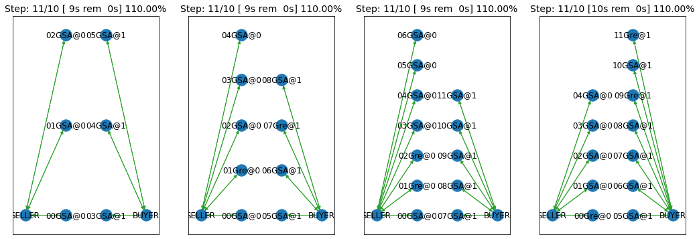

We can run the last of these worlds just to be sure something happens!!

.. code:: ipython3

    world.run()
    world.draw(what=["contracts-concluded"], steps=(0, world.n_steps))

.. parsed-literal::

    (<AxesSubplot:title={'center':'Step: 11/10 [ 7s rem  0s] 110.00%'}>,
     <networkx.classes.multidigraph.MultiDiGraph at 0x128d9edf0>)

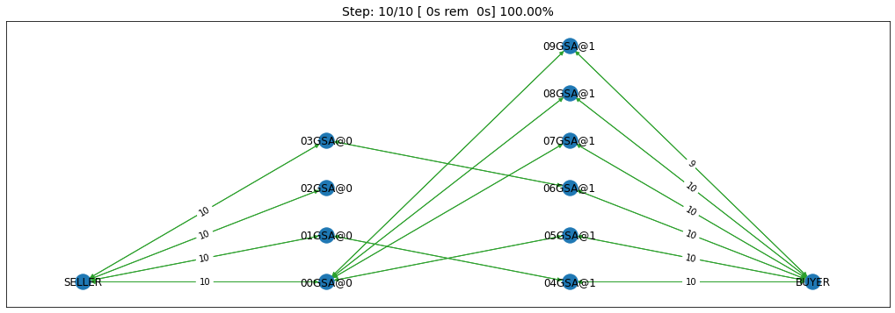

As you can see, passing a tuple as ``n_agents_per_process`` did not
help. We generated two world. They were different and neither had the
distribution we wanted. That is because in this case, the generator will
be guaranteed to make a world in which the number of agents in every
level is **between 3 and 7** not exactly either of them.

.. code:: ipython3

    types = [GreedyOneShotAgent] * 2 + [GreedySingleAgreementAgent] * 8

    fig, axs = plt.subplots(1, 4)
    for ax in axs:
        world = SCML2020OneShotWorld(
            **SCML2020OneShotWorld.generate(
                agent_types = types,
                n_agents_per_process=[3, 7],
                n_processes=2,
                n_steps=5,
                construct_graphs=True,
            )
        )
        world.draw(axs=ax, what=["contracts-concluded"])

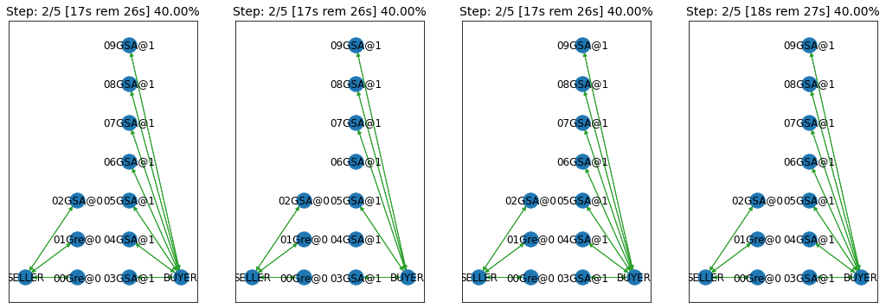

That works. We can also use it to generate deeper graphs of our
choosing:

.. code:: ipython3

    types = [GreedyOneShotAgent] * 2 + [GreedySingleAgreementAgent] * 8
    agents_per_process = [2, 3, 2, 3]
    world = SCML2020OneShotWorld(
        **SCML2020OneShotWorld.generate(
            agent_types = types,
            n_agents_per_process=agents_per_process,
            n_processes=len(agents_per_process),
            n_steps=5,
            construct_graphs=True,
        )
    )

    world.draw(what=["contracts-concluded"])
    plt.show()

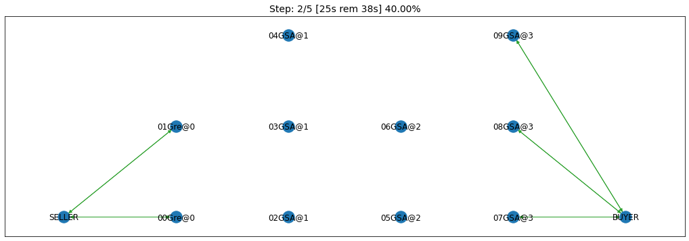

Exactly what the doctors ordered!

Controlling construction paramteres
~~~~~~~~~~~~~~~~~~~~~~~~~~~~~~~~~~~

We have seen now that you can control the agent types. What about having
agents of the same type but with different prarameters? You will need to
do that for example if you want to compare different options for the
initialization parameters of your agent. Because of a technical
difference between the implementations of SCMLOneshot and standard SCML
game, it is much easier to see what is going on in the ``SCML2021World``
case.

In this case, we can use the ``agent_params`` input to ``generate()`` as
follows:

.. code:: ipython3

    from scml.scml2020.world import SCML2021World
    from scml.scml2020.agents import DecentralizingAgent, BuyCheapSellExpensiveAgent
    from negmas import NaiveTitForTatNegotiator

    types = [DecentralizingAgent] * 2 + [BuyCheapSellExpensiveAgent] * 4
    params = (
        [dict(negotiator_type=NaiveTitForTatNegotiator), dict()]
        + [dict()] * 4
    )
    agents_per_process = [2, 3, 1]
    world = SCML2021World(
        **SCML2021World.generate(
            agent_types = types,
            agent_params = params,
            n_agents_per_process=agents_per_process,
            n_processes=len(agents_per_process),
            n_steps=5,
            construct_graphs=True,
        )
    )

    world.draw(what=["contracts-concluded"])
    plt.show()

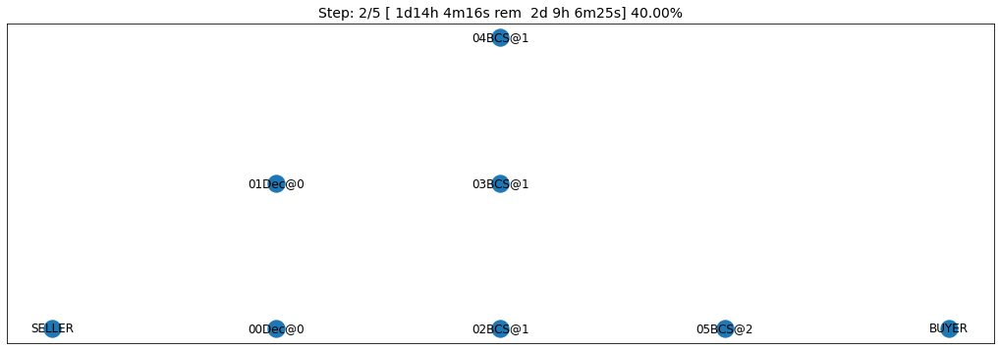

By just looking at the graph, we cannot be sure about what happened.
Nevertheless, we can still check the construction parameters from the
world itself:

.. code:: ipython3

    print(world.agent_params[:-2])

.. parsed-literal::

    [{'negotiator_type': <class 'negmas.sao.negotiators.titfortat.NaiveTitForTatNegotiator'>}, {}, {}, {}, {}, {}]

We can see that the first agent had the negotiator-type we asked for and
the rest are just getting their default initialization paramters.

For SCMLOneshot agents, the approach is slightly different due to the
fact that the ``OneShotAgent`` is actually a ``Controller`` not an
``Agent`` in NegMAS’s parallance. The exact meaning of this is not
relevant for our current discussion though. What we care about is
creating agents with controlled construction paramters. Let’s try the
same method:

.. code:: ipython3

    types = [GreedyOneShotAgent] * 2 + [GreedySingleAgreementAgent] * 4
    params = (
        [dict(controller_params=dict(concession_exponent=0.4)),
         dict(controller_params=dict(concession_exponent=3.0))]
        + [dict()] * 4
    )
    agents_per_process = [2, 3, 1]
    world = SCML2020OneShotWorld(
        **SCML2020OneShotWorld.generate(
            agent_types = types,
            agent_params = params,
            n_agents_per_process=agents_per_process,
            n_processes=len(agents_per_process),
            n_steps=5,
            construct_graphs=True,
        )
    )

    world.draw(what=["contracts-concluded"])
    plt.show()

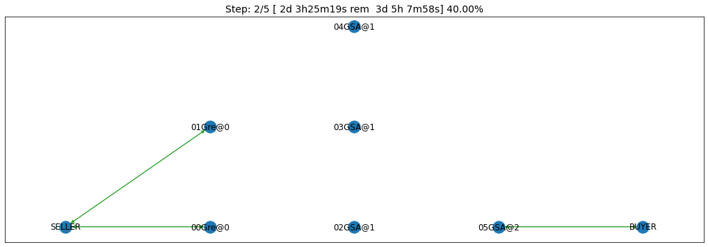

Firstly, note that, in this case, we needed to encolose our paramters
dict within another dict and pass it to the key ``controller_params``.
That is necessary as these paramters are not to be passed to the
adapther used to run the agent within SCMLOneshot but to our agent which
is the controller.

How can we check that it worked? Let’s first try doing the same thing we
did before and examing ``agent_params`` of the ``world``:

.. code:: ipython3

    print(world.agent_params[:-2])

.. parsed-literal::

    [{}, {}, {}, {}, {}, {}]

No … definitely not. The reason is that these are the paramters of the
adapter not our controller. To confirm that the concession rate was
passed correctly to our agents, we need to check them directly as
follows:

.. code:: ipython3

    for a in list(world.agents.values())[:2]:
        print(a._obj._e)

.. parsed-literal::

    0.4
    3.0

Yes. That is what we expected. The first two agents have the concession
exponents we passed to them.

Controlling other aspects of the simulation
~~~~~~~~~~~~~~~~~~~~~~~~~~~~~~~~~~~~~~~~~~~

You can control other aspects of the simulation by passing specific
paramters to the
`generate() <http://www.yasserm.com/scml/scml2020docs/api/scml.oneshot.SCML2020OneShotWorld.html?scml.oneshot.SCML2020OneShotWorld.generate#scml.oneshot.SCML2020OneShotWorld.generate>`__
method or the `World
constructor <http://www.yasserm.com/scml/scml2020docs/api/scml.oneshot.SCML2020OneShotWorld.html?>`__
directly.

Here is an example in which we use ``generate()`` and fix the inital
balance of all agents to :math:`1000` while fixing the production cost
of everyone to :math:`20`, increasing the number of production lines to
:math:`20`, and setting the number of simulation steps (days) to
:math:`40` while making all negotiations go for :math:`100` steps
instead of :math:`20` keeping the number of negotiation steps per day at
:math:`101` which means that negotiations are still guaranteed to finish
within the same day in which they are started. This configuration is
very different than the one used by default in the official competition
but you can decide to test it:

.. code:: ipython3

    types = [GreedyOneShotAgent] * 7
    agents_per_process = [2, 3, 2]
    world = SCML2020OneShotWorld(
        **SCML2020OneShotWorld.generate(
            agent_types = types,
            n_agents_per_process=agents_per_process,
            n_processes=len(agents_per_process),
            n_steps=20,
            neg_n_steps=100,
            production_costs=50,
            cost_increases_with_level=False,
            initial_balance=1000,
            construct_graphs=True,
        )
    )

    world.draw(what=["contracts-concluded"])
    plt.show()

.. image:: 04.experiments_files/04.experiments_26_0.png

It is easy enough to check that some of these paramters are correct. For
example:

.. code:: ipython3

    world.neg_n_steps

.. parsed-literal::

    100

As expected. Checking the initial balances and production costs is
harder. Let’s look at the initial balances:

.. code:: ipython3

    for a in world.agents.values():
        if is_system_agent(a.id):
            continue
        print(f"{a.id} -> {a.awi.current_balance}")

.. parsed-literal::

    00Gre@0 -> 1000
    01Gre@0 -> 1000
    02Gre@1 -> 1000
    03Gre@1 -> 1000
    04Gre@1 -> 1000
    05Gre@2 -> 1000
    06Gre@2 -> 1000

As expected again. What about production cost?

.. code:: ipython3

    for a in world.agents.values():
        if is_system_agent(a.id):
            continue
        print(f"{a.id} -> {a.awi.profile.cost}")

.. parsed-literal::

    00Gre@0 -> 50
    01Gre@0 -> 50
    02Gre@1 -> 50
    03Gre@1 -> 50
    04Gre@1 -> 50
    05Gre@2 -> 50
    06Gre@2 -> 50

This time, we will run this world to just see that it still works after
all of this mingling:

.. code:: ipython3

    world.run()

    world.draw(what=["contracts-concluded"], steps=(0, world.n_steps))
    plt.show()

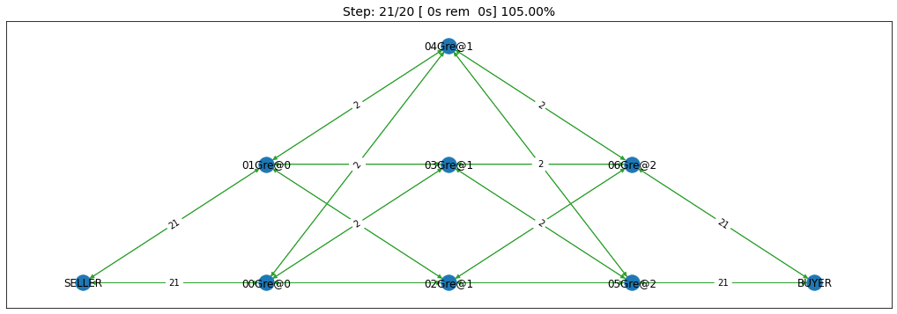

Seems fine.

Controlling Profiles
~~~~~~~~~~~~~~~~~~~~

In the previous example, we used ``generae()`` to do our bidding instead
of directly calling the world constructore. Why? The main reason is that
``generate()`` creates profiles and exogenous contracts compatible with
our settings so that it is possible — in principly — to make money in
the generated world. Moreover, this is controllable by its parameters
(see ``profit_*`` parameters
`here <http://www.yasserm.com/scml/scml2020docs/api/scml.oneshot.SCML2020OneShotWorld.html?scml.oneshot.SCML2020OneShotWorld.generate#scml.oneshot.SCML2020OneShotWorld.generate>`__).
We can push things a little further by controlling the profile of each
agent independently (which in this case is just its production cost). We
will generate a world in which agents have costs from :math:`1` to
:math:`7`.

.. code:: ipython3

    types = [GreedyOneShotAgent] * 7
    agents_per_process = [2, 3, 2]
    world = SCML2020OneShotWorld(
        **SCML2020OneShotWorld.generate(
            agent_types = types,
            n_agents_per_process=agents_per_process,
            n_processes=len(agents_per_process),
            production_costs=list(range(1, 8)),
            cost_increases_with_level=False,
            construct_graphs=True,
        )
    )

    world.draw(what=["contracts-concluded"])
    plt.show()

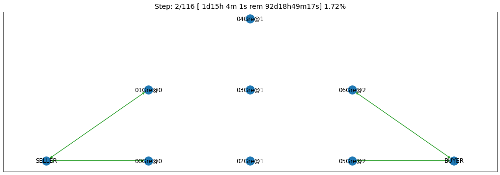

Let’s now check the production costs:

.. code:: ipython3

    for a in world.agents.values():
        if is_system_agent(a.id):
            continue
        print(f"{a.id} -> {a.awi.profile.cost}")

.. parsed-literal::

    00Gre@0 -> 1
    01Gre@0 -> 2
    02Gre@1 -> 3
    03Gre@1 -> 4
    04Gre@1 -> 5
    05Gre@2 -> 6
    06Gre@2 -> 7

It is crucial here that we passed ``cost_increases_with_level=False``,
otherwise, the system will just increase the costs of agents in the
second and third production levels.

The disadvantage of this approach is that you cannot control **exactly**
the exogenous contracts. These are generated by the ``generate()``
method for us. To control this final piece of the world, we need to
directly call the world constructor. We will see now how to do that for
both types of SCML worlds.

Controlling exogenous contracts
~~~~~~~~~~~~~~~~~~~~~~~~~~~~~~~

Here we cannot use the ``generate()`` method and must call the world
constructor directly. This is the most complex approach as we need to
set everything up exactly right.

Standard SCML2020World
^^^^^^^^^^^^^^^^^^^^^^

Let’s try to do it for the ``SCML2021World`` first:

.. code:: ipython3

    import numpy as np
    from scml.scml2020 import FactoryProfile
    from scml.scml2020.common import INFINITE_COST, ExogenousContract

    types = [DecentralizingAgent] * 3
    agents_per_process = [2, 1]
    n_processes=len(agents_per_process)
    n_lines=10

    # setup the factory profiles. For each factory we
    # set production cost to INFINITE_COST for all processes
    # except the one it can actually run
    profiles = [
        FactoryProfile(np.asarray([[3, INFINITE_COST]]*n_lines)),
        FactoryProfile(np.asarray([[20, INFINITE_COST]]*n_lines)),
        FactoryProfile(np.asarray([[INFINITE_COST, 5]]*n_lines)),
    ]

    # create exogenous contracts
    exogenous=[
        ## exogenous supply
        ExogenousContract(
            product=0,
            quantity=10,
            unit_price=5,
            time=1,
            revelation_time=1,
            seller=-1,
            buyer=0,
        ),
        ExogenousContract(
            product=0,
            quantity=10,
            unit_price=7,
            time=2,
            revelation_time=0,
            seller=-1,
            buyer=0,
        ),
        ## exogenous sales
        ExogenousContract(
            product=0,
            quantity=10,
            unit_price=5,
            time=1,
            revelation_time=0,
            seller=2,
            buyer=-1,
        ),
    ]

    world = SCML2021World(
        process_inputs=np.ones(n_processes),
        process_outputs=np.ones(n_processes),
        catalog_prices=[10, 20, 30],
        profiles=profiles,
        agent_types=types,
        agent_params=[dict()] * 3,
        exogenous_contracts=exogenous,
        n_steps=5,
        construct_graphs=True,
        agent_name_reveals_position=True,
        agent_name_reveals_type=True,
    )

    world.draw(what=["contracts-concluded"])
    plt.show()

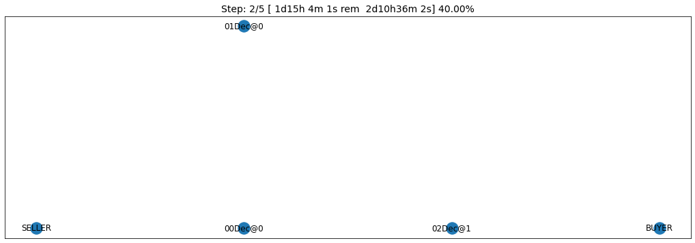

Let’s check the exogenous contracts in the system then explain what just
happened:

.. code:: ipython3

    from pprint import pprint
    pprint(list((list(str(_)
          for _ in  contracts)
          for s, contracts in world.exogenous_contracts.items()
         )))

.. parsed-literal::

    [["00Dec@0, SELLER agreed on {'time': 1, 'quantity': 10, 'unit_price': 5} [id "
      '202d2f56-76c1-457f-8b83-788ab8b391dd]'],
     ["00Dec@0, SELLER agreed on {'time': 2, 'quantity': 10, 'unit_price': 7} [id "
      '4edd90dc-46de-4cff-96f3-7253b7f7c21b]',
      "BUYER, 02Dec@1 agreed on {'time': 1, 'quantity': 10, 'unit_price': 5} [id "
      '48ec79d7-446d-4b39-a582-2945b529adab]'],
     [],
     [],
     []]

You can confirm for yourself that this is exactly what we expected.

Let’s first discuss the profile. In ``SCML2021World``, an agent’s
profile consists of the production cost **per line per product**. You
can see the full definition
`here <http://www.yasserm.com/scml/scml2020docs/api/scml.scml2020.FactoryProfile.html>`__.
That is why we needed to create a 2D array of costs.

Exogenous contract structure is self explanatory. You have to specify
the product, delivery time, quantity, and unit price. Moreover, you have
to specify the time at which this contract is revealed to its agent
(which must be before or at the delivery time step). The one thing you
should be careful about is setting the *buyer* to :math:`-1` for
exogenous sales and the *seller* to :math:`-1` for exogenous supplies.
You can in principle have exogenous contracts in the middle of the chain
but we do not do that usually.

Let’s try to run this world

.. code:: ipython3

    world.run()

    _, axs = plt.subplots(2)
    world.draw(
        what=["negotiations-started", "contracts-concluded"],
        steps=(0, world.n_steps), together=False, axs=axs
    )
    plt.show()

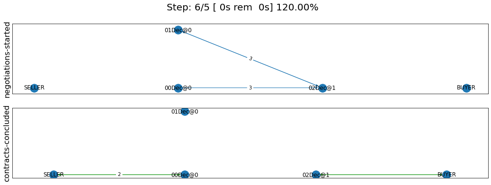

We can see that there were :math:`2` concluded exogenous supply
contracts and :math:`1` concluded exogenous sale contracts. We can also
see that there were :math:`7` negotiations in total in this world none
of them leading to contracts.

SCMLOneshot World
^^^^^^^^^^^^^^^^^

The situation is slightly different for the SCMLOneshot world just
because the format of the profile and exogenous contract data structures
is slightly different. Here is an example case:

.. code:: ipython3

    import numpy as np
    from scml.oneshot import OneShotProfile
    from scml.oneshot import OneShotExogenousContract
    from scml.oneshot import DefaultOneShotAdapter

    types = [DefaultOneShotAdapter] * 3
    params = [
        dict(controller_type=GreedyOneShotAgent)
    ] * 3
    agents_per_process = [2, 1]
    n_processes=len(agents_per_process)
    n_lines=10
    common=dict(
        n_lines=10,
        shortfall_penalty_mean=0.2,
        disposal_cost_mean=0.1,
        shortfall_penalty_dev=0.01,
        disposal_cost_dev=0.01,
    )
    # setup the factory profiles. For each factory we
    profiles = [
        OneShotProfile(cost=3, input_product=0, **common),
        OneShotProfile(cost=10, input_product=0, **common),
        OneShotProfile(cost=7, input_product=1, **common),
    ]

    # create exogenous contracts
    exogenous=[
        ## exogenous supply
        OneShotExogenousContract(
            product=0,
            quantity=10,
            unit_price=5,
            time=1,
            revelation_time=1,
            seller=-1,
            buyer=0,
        ),
        OneShotExogenousContract(
            product=0,
            quantity=10,
            unit_price=7,
            time=2,
            revelation_time=0,
            seller=-1,
            buyer=0,
        ),
        ## exogenous sales
        OneShotExogenousContract(
            product=0,
            quantity=10,
            unit_price=5,
            time=1,
            revelation_time=0,
            seller=2,
            buyer=-1,
        ),
    ]

    world = SCML2020OneShotWorld(
        catalog_prices=[10, 20, 30],
        profiles=profiles,
        agent_types=types,
        agent_params=params,
        exogenous_contracts=exogenous,
        n_steps=5,
        construct_graphs=True,
        agent_name_reveals_position=True,
        agent_name_reveals_type=True,
    )

    world.draw(what=["contracts-concluded"])
    plt.show()

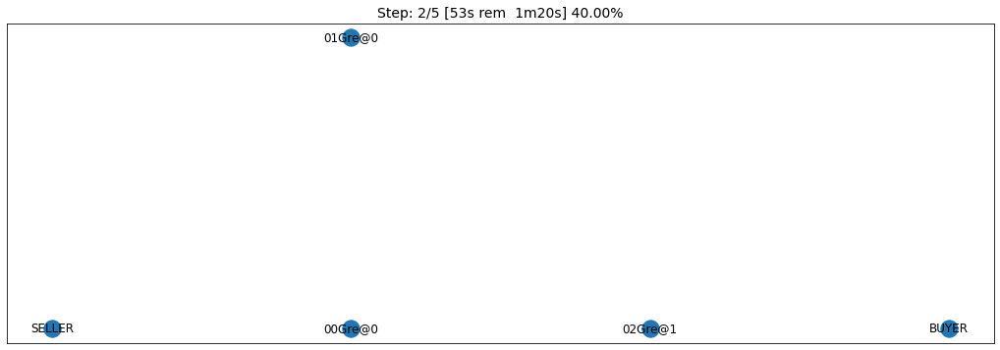

The world is constructed. Lets run it and see what happens:

.. code:: ipython3

    world.run()

    _, axs = plt.subplots(2)
    world.draw(
        what=["negotiations-started", "contracts-concluded"],
        steps=(0, world.n_steps), together=False, axs=axs
    )
    plt.show()

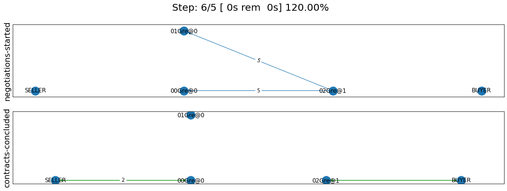

You can confirm for yourself that this is what we expected. Let’s dive
into the details.

Firstly, in this case, we need to pass ``agent_params`` to the
constructor (because ``OneshotAgent`` is a controller and not an
``Agent`` which means it needs an adapter to run. Here we use the
default ``DefaultOneshotAdapter``:

.. code:: python

   types = [DefaultOneShotAdapter] * 3
   params = [dict(controller_type=GreedyOneShotAgent)] * 3

The real agent type we want is to be passed in ``controller_type``.

The profile in this case has a different structure than the previous
case to match the `game
description <http://www.yasserm.com/scml/scml2021oneshot.pdf>`__. Other
than the production cost, we also need to pass the parameters of
Gaussians describing shortfall penalties and disposal costs.

Other than these two differences, the rest is almost the same as in the
previous case.

Download :download:`Notebook<notebooks/04.experiments.ipynb>`.
