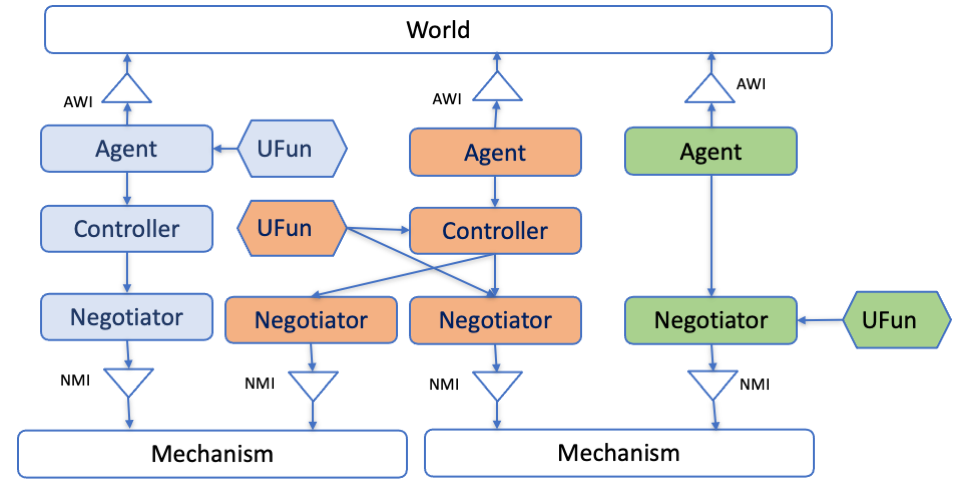

## What is SCM and SCML?

The Supply Chain Management (SCM) world simulates a supply chain consisting of multiple factories that buy
and sell products from one another. The factories are represented by autonomous
agents that act as factory managers. Agents are given some target quantity to
either buy or sell and they negotiate with other agents to secure the needed
supplies or sales. Their goal is to turn a profit,
and the agent with the highest profit (averaged over multiple simulations) wins.

The Supply Chain Management League ([SCML](https://scml.cs.brown.edu)) is a
part of the International Automated Negotiating Agents Competition
([ANAC](http://web.tuat.ac.jp/~katfuji/ANAC2021/)) since 2019. SCML runs in the
SCM world.

The league is built using [NegMAS](http://www.yasserm.com/negmas) which provides
tools for building multiagent systems in which negotiations are embedded within
world simulations.

There are two different yet related games in SCML each represented by a
[NegMAS](http://www.yasserm.com/negmas)
[*World*](http://www.yasserm.com/negmas/api/negmas.situated.World.html) class:

- **[SCML2021World](http://www.yasserm.com/scml/scml2020docs/api/scml.scml2020.SCML2021World.html)**
  A world representing the *complete* SCML game described
  [here](http://www.yasserm.com/scml/scml2021.pdf) in which the agent is
  responsible of defining its own utility function, with who to negotiate,
  negotiation agendas to propose, production schedule, etc. This form of the
  SCM world is more representative of real-world trading with a combination of
  long-term planning, negotiation, and production scheduling.

- **[SCML2020OneShotWorld](http://www.yasserm.com/scml/scml2020docs/api/scml.oneshot.SCML2020OneShotWorld.html)**
  A simpler form of the SCM world in which agents do not need to consider
  long-term planning or production scheduling described
  [here](http://www.yasserm.com/scml/scml2021oneshot.pdf). This form was
  introduced in *2021*.

You can use the SCM world simulation in your own development and research as you
see fit but it is primarily intended for the SCM league (SCML) of the ANAC competition.
SCML has three tracks:

1. **Standard track** based on the **SCML2021World** full game simulation. In
   the standard track, a single instance of each agent type exists in the
   world. This precludes any possibility of *collusion* between agent
   instances of the same type and focuses on business operation of a single
   factory.
2. **Collusion track** based on the **SCML2021World** full game simulation. In
   the collusion track,  *multiple* instances of each agent type exist in the
   world. This opens the possibility for these agents instances to **collude**
   in order to corner the market and get higher profits that what each of them
   can get on its own. In this track, collusion is not considered a form of
   *cheating* but is encouraged.
3. **OneShot track** based on the simpler **SCML2020OneShotWorld** game simulation.
   In the OneShot track, a single instance of each agent type exists in the world
   precluding any possibility of collusion. The focus here is on negotiation with
   less focus on long-term planning as discussed earlier. This track was introduced
   for the first time in *2021*.

The SCML competition has two versions:

- **Online Competition** Participants to this competition can submit their
  agents as long as the competition is running (March 15th 2021 to July 1st
  2021). The system runs tournaments between the latest version of all
  submitted agents for each track periodically and maintains a leader-board
  showing the top agents updated at least weekly. Participants in this competition
  will get the chance to observe how their agents behave against agents submitted
  by other competitors and receive feedback about any exceptions or error caused
  by their agents.

- **Official Competition** The final version of each agent submitted to the
  online competition (and registered before July 1st, 2021) is entered into the
  official SCM league which will run as part of the ANAC 2021 competition in
  conjunction with [IJCAI 2021](https://ijcai-21.org/). The winners will be
  announced during the as part of the official program of IJCAI 2021.

## A (not very) brief introduction to NegMAS

The SCM world is built using [NegMAS](http://www.yasserm.com/negmas/). This
section provides a very short introduction of it to help you understand the
terms used in this document. Please refer to [NegMAS
documetnation](http://www.yasserm.com/negmas/) for full description and
details as well as tutorials and other goodies.

This image shows the main components of a simulation in a NegMAS world:

The simulation is run using a **World** object which defines what happens in
every simulation **step**, provides a **BulletinBoard** object containing all
public information about the game, calls various callbacks defined in the
**Agent** object representing each agent in the environment, takes care of
running negotiations and keeps track of agreement signing and the resulting
**Contract**s.  The **World** object also controls logging, event management,
serialization, visualization, etc. Refer to the
[World](http://www.yasserm.com/negmas/api/negmas.situated.World.html)
documentation for more details (you need to do that only if you are
implementing new world simulations).

The designer of the game implements a **World** class by overriding few
abstract methods in the base **World** class. This is how the
**SCML2019World**, **SCML2020World**, **SCML2021World** and
**SCML2020OneShotWorld** were created. As a participant in SCML, you *never*
need to interact directly with the **World** object.

The logic of an agent is NegMAS is implemented in an **Agent** object. The
designer of the simulation, should provide a base class for its specific world
inherited from NegMAS's **Agent** class. For SCML, this base class is called
**OneShotAgent** for the OneShot game (to go with the SCML2020OneShotWorld),
and **SCML2020Agent** for the full game (to go with the SCML2020World and
SCML20201World). Refer to the
[Agent](http://www.yasserm.com/negmas/api/negmas.situated.Agent.html)
documentation for more details about general NegMAS agents. Full information
about the **OneShotAgent** and **SCML2020Agent** classes can be found
[here](http://www.yasserm.com/scml/scml2020docs/api/scml.scml2020.SCML2020Agent.html) and
[here](http://www.yasserm.com/scml/scml2020docs/api/scml.oneshot.OneShotAgent.html) respectively.

 As a participant in SCML, you
only need to develop an <strong>Agent</strong> class inherited from the
appropriate base class depending on the track.

So now we have the **World** and the **Agent** objects, and we already said
that the agent does not directly interact with the world. How does these two
agents interact then?

- When the **World** wants to interact with the **Agent**, it calls some method
  in it. For example, to instruct the agent to *initialize* itself, the world
  calls the **init()** method defined by the **Agent**. To inform the agent
  that a negotiation it is involved in is concluded with success, the **World**
  calls the method **on_negotiation_success()** defined by the agent.
- When the **Agent** wants to interact with the **World**, it accesses an
  interface object called an **AgentWorldInterface** or **AWI** for short which
  provides all the services available to the **Agent**. For example, to request
  a negotiation with another agent, the **Agent** object needs to call
  **request_negotiation()** defined in the **AWI**.

The world designer usually defines an AWI for its world that inherits NegMAS's
**AgentWorldInterface** class and provides any special services for agents
interacting in this world. You can find all the  services available to your agent
through the AgentWorldInterface
[here](http://www.yasserm.com/negmas/api/negmas.situated.AgentWorldInterface.html).
These methods and properties are still available for your agent in SCML. Nevertheless,
in many cases, more convenient ways to access some of the information (e.g. the
bulletin board) is provided in the specific AWIs implemented in the SCML package
to be described now.

For SCML, there are -- as you may already expect -- two AWIs.  The first is
called **OneShotAWI** and is defined in *scml.scml2020* to go with
*SCML2021World* and *SCML2020Agent* and the second is defined in *scml.oneshot*
to go with *SCML2020OneShotWorld* and *OneShotAgent*.  An earlier version is
also defined in *scml.scml2019* which is a *discontinued* form of the game used
in ANAC 2019 competition. You can find all the services provided by these AWIs
[here](http://www.yasserm.com/scml/scml2020docs/api/scml.oneshot.OneShotAWI.html)
for the OneShot game (OneShot track) and
[here](http://www.yasserm.com/scml/scml2020docs/api/scml.scml2020.AWI.html) for
the full game (Standard and Collusion tracks).

Now that we know how worlds and agents work and interact, we can look at how
negotiation is managed in NegMAS.

A negotiation is controlled by a **Mechanism** object which implements the
negotiation protocol (e.g. the alternating offers protocol). NegMAS provides
several mediated and unmediated negotiation protocols (as well as auction
mechanisms). The specific **Mechanism** that is used in SCML is the
**SAOMechanism** which implements the bargaining protocol.

Negotiation strategies are implemented in a **Negotiator** object which usually
inherits some base negotiator-class corresponding to the mechanism(s) it supports.
The specific base class of all negotiators in SCML is **SAONegotiator**.

The interaction between **Mechanism** and **Negotiator** objects mirrors the
interaction between **World** and **Agent** objects. **Mechanism** objects call
methods in **Negotiator** objects directly but **Negotiator** objects can only
access services provided by the **Mechanism** object through a
**NegotiatorMechanismInterface** (AMI).  Note that it is an AMI not a NMI (for
historical reasons). You can find more details about the general NegMAS AMI
[here](http://www.yasserm.com/negmas/api/negmas.common.NegotiatorMechanismInterface.html).

Each specific **Mechanism** defines a corresponding specific
**NegotiatorMechanismInterface** class (in the same way that **World** classes
define their own AWI). The **SAOMechanism** used in SCML defines **SAONMI** for
this purpose (Details are
[here](http://www.yasserm.com/negmas/api/negmas.sao.SAONMI.html?highlight=saoami#negmas.sao.SAONMI)).

To negotiate effectively, negotiators employ a **UtilityFunction** to represent
their preferences over different possible **Outcome**s of the negotiation
(where an outcome is a full assignment of values to all negotiated **Issue**s).
NegMAS provides an extensive set of utility function, and issue types. Please
refer to NegMAS [overview](http://www.yasserm.com/negmas/overview.html) and
[tutorials](http://www.yasserm.com/negmas/tutorials.html) for more details.
NegMAS also provides some basic **SAONegotiator**s for the **SAOMechanism**
(Check the class diagram
[here](http://www.yasserm.com/negmas/modules/sao.html)).  Moreover, you can
access almost all [Genius](http://ii.tudelft.nl/genius/) using NegMAS's
[GeniusNegotiator](http://www.yasserm.com/negmas/api/negmas.genius.GeniusNegotiator.html)
including all finalists and winners of all past ANAC competitions.

Now we understand how agents interact with worlds through AWIs and negotiators
interact with mechanisms through AMIs. We know that the general simulation is
controlled by the world while each negotiation is controlled by a mechanism
within that world. **We need now to connect these two triplets of objects**

As the figure above shows: **Negotiator** objects can be created and controlled
by **Agent** objects for the purpose of negotiating with other **Agent**
objects. The standard flow of operations is something like this:

1. **Agent** A uses its AWI to *request_negotiation()* with Agent B passing a
   **Negotiator** to be used in this negotiation. Usually Agent A will also
   create a **UtilityFunction** and attach it to the **Negotiator** it just
   created (by setting its *ufun* attribute).
2. The **World** calls Agent B's *respond_to_negotiation_request()* asking it
   to provide its own **Negotiator** to negotiate with Agent A's Negotiator. It
   can also just reject the negotiation request by returning no negotiators.
3. The **World** will then create a **Mechanism** and ask both **Negotiator**s
   to *join* it.  If all goes well, the negotiation starts (at a time defined
   by the simulation rules) and runs until either an agreement or disagreement
   is reached.
4. The **World** class will then inform **Agent**s A and B about the results of
   the negotiation using their *on_negotiation_success* and
   *on_negotiation_failure* callbacks.
5. Successful negotiations lead to **Agreement**s but are still not binding in
   general until signed by all agents involved (A and B in this case).
   **Agent**'s '*sign_all_contracts* is used for this.
6. Signed agreements become *Contract*s and are executed (as specified in the
   simulation rules) by the **World**.

The full SCML game uses this complete flow. The OneShot game simplifies things
by automatically requesting all negotiations, accepting all requests and
signing all contracts.

When negotiations are independent, these are all the objects needed.
Nevertheless, in many cases, including the SCM case, negotiations are
inter-dependent. This means that what is *good* in one negotiation depends on
other concurrently running negotiations (or on expectations of future
negotiations). NegMAS provides two ways to support this case shown in the
following figure:

1. Let **Negotiator**s use **UtilityFunction**s that depend on some common
   state. That is what is happening in the left two negotiations. Because you
   define your own utility functions in the full SCML game (standard and
   collusion tracks), this is one possible way to orchestrate the behavior of
   your negotiators.
2. Have multiple **Negotiator**s be controlled by a single **Controller**
   object with its own utility function that depends on what is happening on
   all the negotiations controlled. This is what is happening in the two
   negotiations on the right. This is also possible in the full SCML game
   (standard and collusion tracks) and is the only method available in the
   OneShot game (OneShot track).

The **Negotiator**s connected to a controller lost their autonomy and just pass
control to their *owning* **Controller**.

This concludes our introduction to NegMAS and different objects you need to know
about to develop your agent.

In summary, you will need to develop an **SCML2020Agent** or **OneShotAgent**
depending on the track. This agent uses an **AWI** or **OneShotAWI** to access
sense and act in the world. All negotiations are controlled by **SAONegotiator**s
that may optionally be grouped and controlled centrally by **Controller** objects.
The preferences of these negotiators and controllers are defined using **UtilityFunction**
objects.
